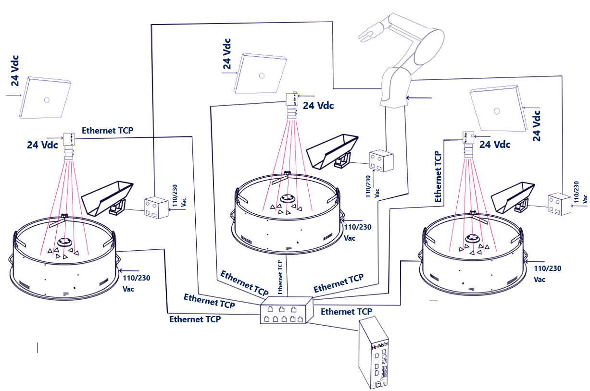
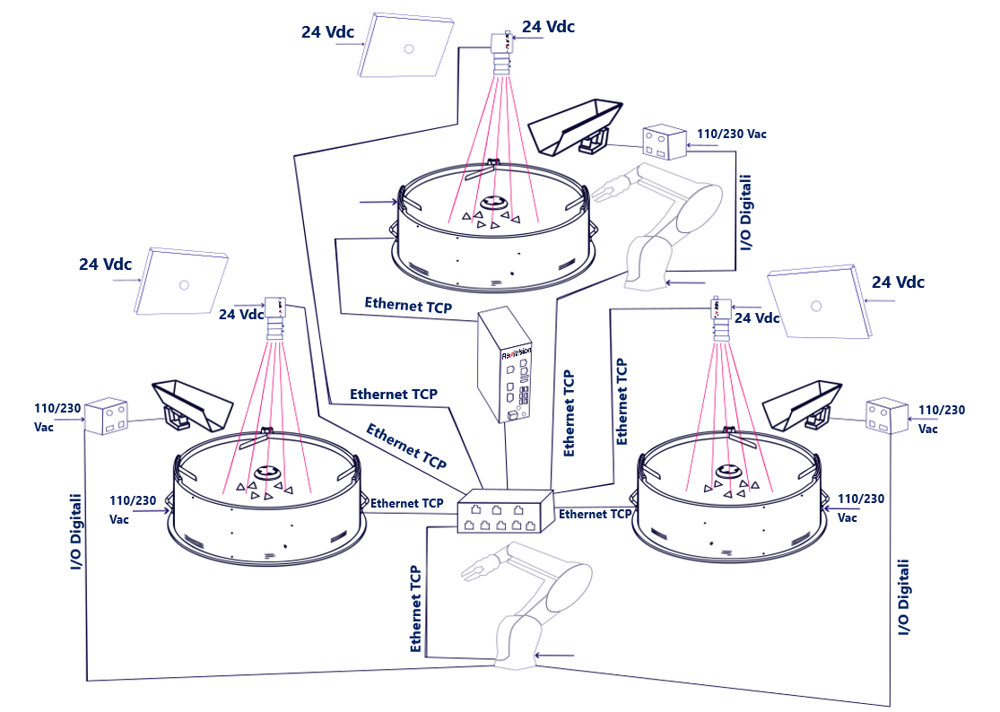
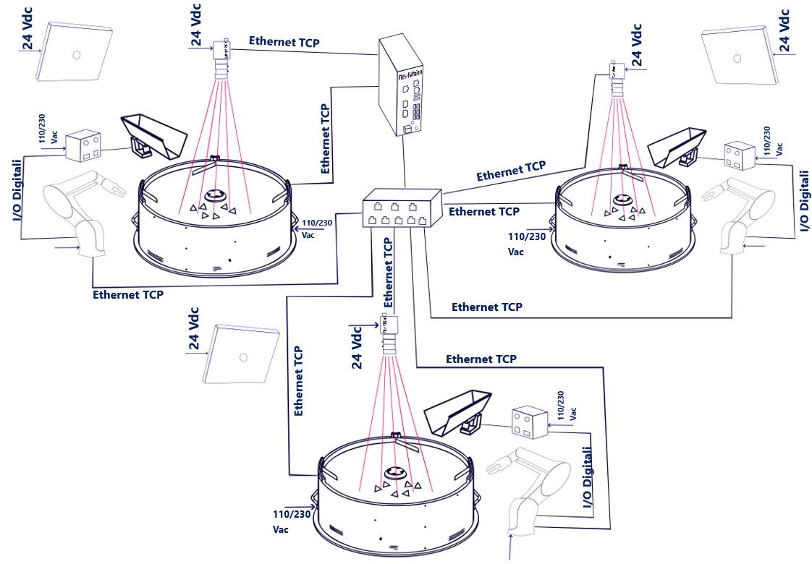

# **3 FlexiBowl® e 3 Camere**

Questa sezione descrive le configurazioni disponibili quando si desidera operare con **tre FlexiBowl®** e **tre camere** all'interno della stessa isola di picking, gestiti da un unico VisionController FlexiVision One.

---

## Panoramica della configurazione

In una configurazione **3 FlexiBowl® + 3 Camere**, il sistema comprende tre stazioni di alimentazione e visione indipendenti, tutte gestite dallo stesso VisionController. Ciascuna stazione è composta da:

* 1 FlexiBowl®
* 1 Camera con ottica dedicata
* 1 Tramoggia (opzionale, se presente)

Le tre stazioni comunicano con il VisionController attraverso uno **Switch di rete**.
```{important}
Lo **Switch** è un componente **obbligatorio** in tutte le configurazioni multi-dispositivo. Senza di esso non è possibile collegare contemporaneamente più FlexiBowl® e più camere al VisionController. Per le specifiche tecniche e i codici d'ordine, consultare la sezione [Switch](../rif_tecnico_specifiche/08_Opzioni.md#switch).
```

Questa configurazione supporta tre varianti operative, in base al numero di robot disponibili nell'impianto:

| | **Variante A** | **Variante B** | **Variante C** |
|---|---|---|---|
| **Robot** | 1 | 2 | 3 |
| **FlexiBowl®** | 3 | 3 | 3 |
| **Camere** | 3 | 3 | 3 |
| **Logica operativa** | Il robot raggiunge tutte e tre le stazioni | Primo robot su un FlexiBowl, secondo robot su due FlexiBowl | Ogni robot è dedicato a una stazione |
| **Switch richiesto** | Sì | Sì | Sì |
---

## Variante A — 1 Robot, 3 FlexiBowl®



Un **singolo robot** opera su tutte e tre le stazioni. Il robot deve essere posizionato in modo da poter raggiungere l'area di picking di ciascun FlexiBowl®. Il VisionController gestisce le tre stazioni in modo indipendente, ciascuna con la propria ricetta e il proprio canale di comunicazione TCP/IP.

Ogni stazione supporta applicazioni di tipo **Standard** o **Mix**.

| Parametro | Valore |
|---|---|
| FlexiBowl® | 3 |
| Camere | 3 |
| Robot | 1 |
| Switch richiesto | **Sì** |


```{important}
**Ricetta base e gestione delle ricette**

Come per la configurazione singola, anche in una configurazione 3FB + 3CAM il processo parte dalla creazione di un'**unica ricetta base**, che contiene i setup hardware e la calibrazione della camera per l'intero sistema. Questa ricetta base viene poi **duplicata** per ciascuna stazione: ogni duplicato costituisce la ricetta operativa di quella stazione, all'interno della quale vengono creati i modelli dei pezzi (fino a 8 per stazione).

Per questo è fondamentale che l'associazione tra i dispositivi venga configurata correttamente fin dall'inizio:

* **Camera 1** → FlexiBowl® 1 (+ Tramoggia 1, se presente)
* **Camera 2** → FlexiBowl® 2 (+ Tramoggia 2, se presente)
* **Camera 3** → FlexiBowl® 3 (+ Tramoggia 3, se presente)

Un'associazione errata in fase di setup si ripercuoterebbe su tutte le ricette derivate, compromettendo il riconoscimento dei pezzi e il corretto funzionamento dell'intero sistema.
```
---

## Variante B — 2 Robot, 3 FlexiBowl®



In questa variante **due robot** si suddividono le tre stazioni. Il primo robot farà il picking su un solo FlexiBowl, il secondo sugli altri due FlexiBowl. La distribuzione del carico tra i robot è definita dalla logica del programma robot e dalla disposizione fisica dell'impianto. 

Ogni stazione supporta applicazioni di tipo **Standard** o **Mix**.

| Parametro | Valore |
|---|---|
| FlexiBowl® | 3 |
| Camere | 3 |
| Robot | 2 |
| Switch richiesto | **Sì** |

```{important}
**Ricetta base e gestione delle ricette**

Come per la configurazione singola, anche in una configurazione 3FB + 3CAM il processo parte dalla creazione di un'**unica ricetta base**, che contiene i setup hardware e la calibrazione della camera per l'intero sistema. Questa ricetta base viene poi **duplicata** per ciascuna stazione: ogni duplicato costituisce la ricetta operativa di quella stazione, all'interno della quale vengono creati i modelli dei pezzi (fino a 8 per stazione).

Per questo è fondamentale che l'associazione tra i dispositivi venga configurata correttamente fin dall'inizio:

* **Camera 1** → FlexiBowl® 1 (+ Tramoggia 1, se presente)
* **Camera 2** → FlexiBowl® 2 (+ Tramoggia 2, se presente)
* **Camera 3** → FlexiBowl® 3 (+ Tramoggia 3, se presente)

Un'associazione errata in fase di setup si ripercuoterebbe su tutte le ricette derivate, compromettendo il riconoscimento dei pezzi e il corretto funzionamento dell'intero sistema.
```
---

## Variante C — 3 Robot, 3 FlexiBowl®



Ogni robot è dedicato a una singola stazione: massima produttività con le tre celle che operano in parallelo e in modo completamente indipendente.

Ogni stazione supporta applicazioni di tipo **Standard** o **Mix**.

| Parametro | Valore |
|---|---|
| FlexiBowl® | 3 |
| Camere | 3 |
| Robot | 3 |
| Switch richiesto | **Sì** |

```{tip}
La variante C garantisce le migliori prestazioni complessive. Ciascuna cella è completamente autonoma e non dipende dalla disponibilità delle altre.
```
```{important}
**Ricetta base e gestione delle ricette**

Come per la configurazione singola, anche in una configurazione 3FB + 3CAM il processo parte dalla creazione di un'**unica ricetta base**, che contiene i setup hardware e la calibrazione della camera per l'intero sistema. Questa ricetta base viene poi **duplicata** per ciascuna stazione: ogni duplicato costituisce la ricetta operativa di quella stazione, all'interno della quale vengono creati i modelli dei pezzi (fino a 8 per stazione).

Per questo è fondamentale che l'associazione tra i dispositivi venga configurata correttamente fin dall'inizio:

* **Camera 1** → FlexiBowl® 1 (+ Tramoggia 1, se presente)
* **Camera 2** → FlexiBowl® 2 (+ Tramoggia 2, se presente)
* **Camera 3** → FlexiBowl® 3 (+ Tramoggia 3, se presente)

Un'associazione errata in fase di setup si ripercuoterebbe su tutte le ricette derivate, compromettendo il riconoscimento dei pezzi e il corretto funzionamento dell'intero sistema.
```
---

## Componenti necessari

### Kit base FlexiVision One

Il **kit base FlexiVision One** (fornito con il sistema) include già tutto il necessario per la **prima stazione** (camera, ottica, cavi, griglia di calibrazione), incluso il VisionController. Non è necessario acquistare un secondo kit completo per le stazioni aggiuntive.

### Kit Camera Aggiuntiva (× 2)

Per le stazioni 2 e 3 è necessario acquistare **due Kit Camera Aggiuntiva**, uno per ciascuna stazione, selezionando il codice corrispondente alla taglia del FlexiBowl® di ogni stazione. Il kit include:

* 1 Camera
* 1 Ottica dedicata alla taglia FlexiBowl®
* 1 Griglia di calibrazione
* 1 Cavo alimentazione camera
* 2 Cavi Ethernet

Selezionare il kit in base alla taglia del FlexiBowl® di ciascuna stazione aggiuntiva:

| Taglia FlexiBowl® | Codice Kit Camera Aggiuntiva | Ottica inclusa |
|---|---|---|
| FB 200 | GM002002 | CE000881 — FlexiVision One 35mm Optic |
| FB 350 | GM002003 | CE000881 — FlexiVision One 35mm Optic |
| FB 500 | GM002004 | CE000880 — FlexiVision One 25mm Optic |
| FB 650 | GM002005 | CE000879 — FlexiVision One 16mm Optic |
| FB 800 | GM002006 | CE000879 — FlexiVision One 16mm Optic |
| FB 1200 | GM002007 | CE000878 — FlexiVision One 12mm Optic |

```{note}
Se le stazioni aggiuntive utilizzano FlexiBowl® di taglie diverse, acquistare un kit per ciascuna taglia.  
 Ad esempio, per una configurazione con FB500 + FB650 + FB800, il kit base copre la prima stazione, mentre per la seconda e la terza stazione è necessario ordinare rispettivamente GM002004 e GM002006.
```

### Switch

Lo Switch è sempre necessario nelle configurazioni multi-dispositivo. Per codice, specifiche elettriche e fisiche consultare la sezione dedicata:

**→ [Switch](../rif_tecnico_specifiche/08_Opzioni.md#switch)**

---

## Cablaggio

Nella **Variante A** (1 robot), tutti i dispositivi di campo (FlexiBowl®, camere, robot) si collegano allo **Switch**, e lo Switch si collega al **VisionController** tramite una singola porta Ethernet. Il numero totale di connessioni rientra nelle 8 porte disponibili sullo Switch.

Dalla **Variante B** in poi, il numero totale di dispositivi supera le porte disponibili sullo Switch.   
In questi casi, una porta del VisionController viene utilizzata per collegarlo allo Switch, mentre le restanti porte libere del VisionController accolgono i dispositivi che non trovano posto sullo Switch:

- Nella **Variante B** (2 robot), il **FlexiBowl® 3** si collega direttamente a una porta libera del VisionController.
- Nella **Variante C** (3 robot), il **FlexiBowl® 3** e la **Camera 3** si collegano direttamente alle porte libere del VisionController.

```{important}
Lo Switch dispone di **8 porte Ethernet**. A partire dalla Variante B, non è possibile connettere tutti i dispositivi esclusivamente attraverso lo Switch: i dispositivi in eccesso vanno collegati direttamente alle porte Ethernet libere del VisionController, come indicato nelle tabelle di seguito.
```
:::{note}
Si può arbitrariamente decidere quali dispositivi connettere al VisionController. L'mportante è lasciare sempre una porta libera per connettere il VisionController allo Switch
:::

### Schema di connessione

| Dispositivo | Variante A (1 Robot) | Variante B (2 Robot) | Variante C (3 Robot) |
|---|---|---|---|
| FlexiBowl® 1 | → Switch | → Switch | → Switch |
| FlexiBowl® 2 | → Switch | → Switch | → Switch |
| FlexiBowl® 3 | → Switch | **→ VisionController (porta libera)** | **→ VisionController (porta libera)**  |
| Camera 1 | → Switch | → Switch | → Switch |
| Camera 2 | → Switch | → Switch | → Switch |
| Camera 3 | → Switch | → Switch | **→ VisionController (porta libera)**  |
| Robot 1 | → Switch | → Switch | → Switch |
| Robot 2 | — | → Switch | → Switch |
| Robot 3 | — | — | → Switch |
| **Switch** | **→ VisionController** | **→ VisionController** | **→ VisionController** |

:::{note}
Si può arbitrariamente decidere quali dispositivi connettere al VisionController. L'mportante è lasciare sempre una porta libera per connettere il VisionController allo Switch
:::

```{tip}
Verificare che a ciascun dispositivo sia assegnato un indirizzo IP univoco nella stessa subnet.  
 Le porte TCP/IP utilizzate dal VisionController per le tre stazioni sono configurabili: per default **FB1 → 4001**, **FB2 → 4002**, **FB3 → 4003**.  
 lo  Consultare la sezione [Protocollo Comunicazione Robot-Visione](../rif_tecnico_specifiche/04b_Protocolli_Comunicazione.md) per i dettagli.
```
### Porte Switch occupate per variante

| Porta Switch | Variante A (1 Robot) | Variante B (2 Robot) | Variante C (3 Robot) |
|---|---|---|---|
| 1 | FlexiBowl® 1 | FlexiBowl® 1 | FlexiBowl® 1 |
| 2 | FlexiBowl® 2 | FlexiBowl® 2 | FlexiBowl® 2 |
| 3 | FlexiBowl® 3 | Camera 1 | Camera 1 |
| 4 | Camera 1 | Camera 2 | Camera 2 |
| 5 | Camera 2 | Camera 3 | Robot 1 |
| 6 | Camera 3 | Robot 1 | Robot 2 |
| 7 | Robot 1 | Robot 2 | Robot 3 |
| 8 | VisionController | VisionController | VisionController |

### Porte VisionController occupate per variante

| Porta VisionController | Variante A (1 Robot) | Variante B (2 Robot) | Variante C (3 Robot) |
|---|---|---|---|
| 1 | Switch | Switch | Switch |
| 2 | — | FlexiBowl® 3 | FlexiBowl® 3 |
| 3 | — | — | Camera 3 |

:::{note}
Si può arbitrariamente decidere quali dispositivi connettere al VisionController. L'mportante è lasciare sempre una porta libera per connettere il VisionController allo Switch
:::

```{note}
Nella **Variante B** le porte dello Switch sono tutte occupate (7 dispositivi + VisionController): il FlexiBowl® 2 si collega direttamente al VisionController. Nella **Variante C** anche Camera 3 si collega direttamente al VisionController, occupando la terza porta disponibile.
```
```{note}
**Cablaggio dei singoli componenti**

Le procedure di collegamento fisico di ciascun componente (FlexiBowl®, camera, tramoggia, robot) sono descritte integralmente nella sezione [Cablaggio e Connessioni](../INSTALLAZIONE_SISTEMA/10_Cablaggio_Connessioni.md).  
 In una configurazione 3FB + 3CAM le stesse operazioni vanno semplicemente eseguite **tre volte** — una per ciascuna stazione — con l'unica differenza che ogni dispositivo si collega allo **Switch** anziché direttamente al VisionController, ad eccezione del **FlexiBowl® 2** (Varianti B e C) e della **Camera 3** (Variante C), che si collegano direttamente alle porte Ethernet libere del VisionController.
```
```{important}
**Associazione dispositivi nel software**

FlexiVision One è in grado di gestire contemporaneamente tutte le stazioni, ma è fondamentale che l'associazione tra i dispositivi venga configurata correttamente nel software. Assicurarsi di associare:

* **Camera 1** → FlexiBowl® 1 (+ Tramoggia 1, se presente)
* **Camera 2** → FlexiBowl® 2 (+ Tramoggia 2, se presente)
* **Camera 3** → FlexiBowl® 3 (+ Tramoggia 3, se presente)

Un'associazione errata comprometterebbe la localizzazione dei pezzi e il corretto funzionamento dell'intero sistema.
```

**→ [Configurazione Iniziale del Sistema](../QUICKSTART/SETUP/13_setup.md)**

