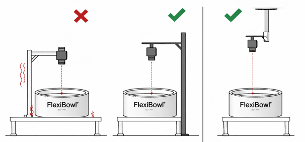
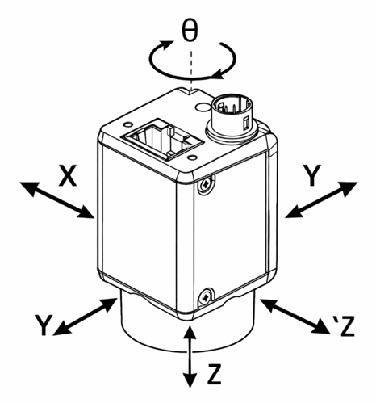
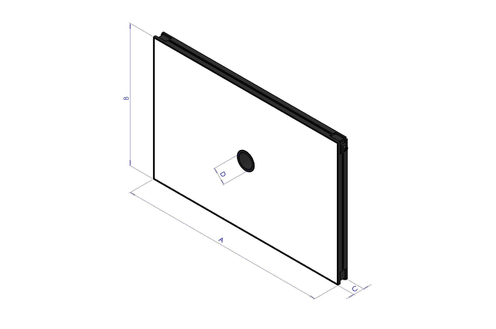
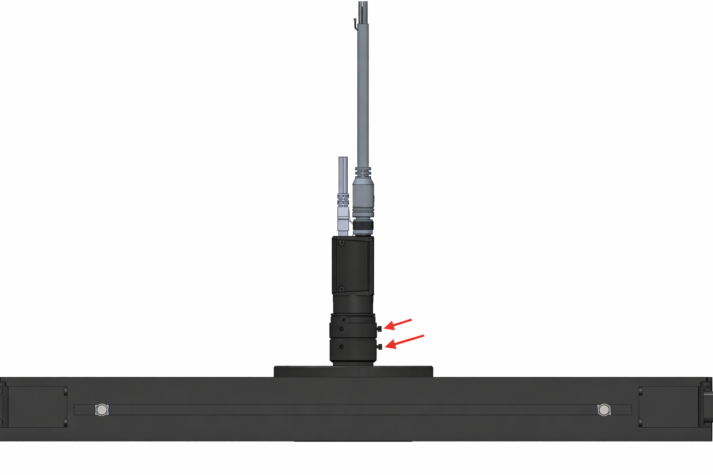
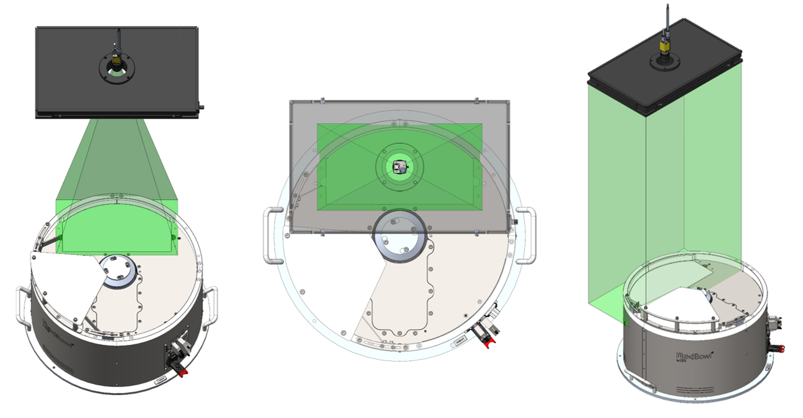
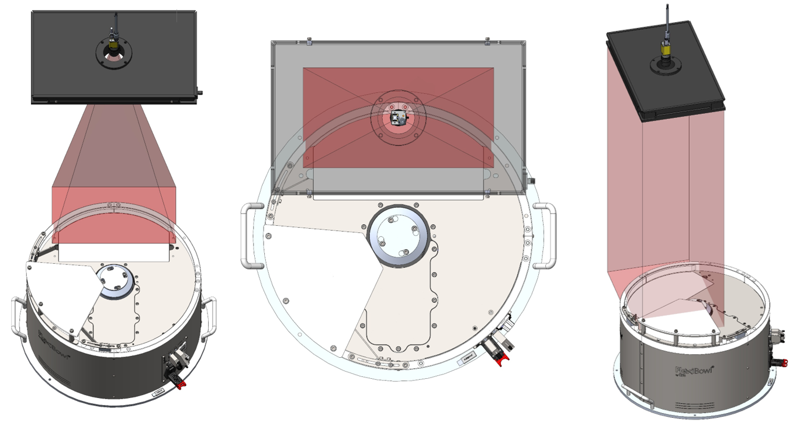
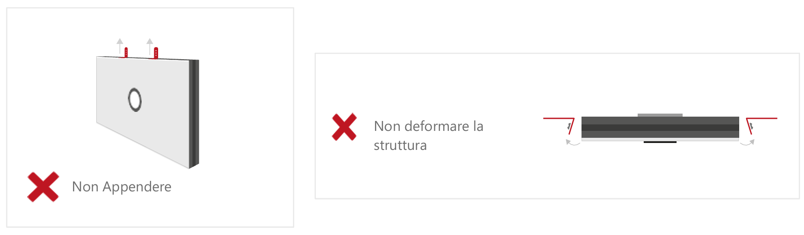
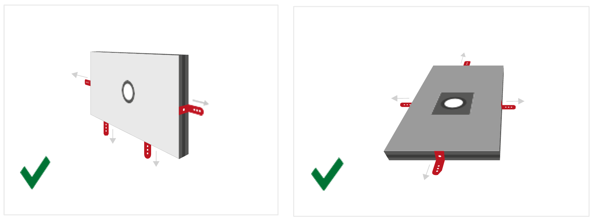
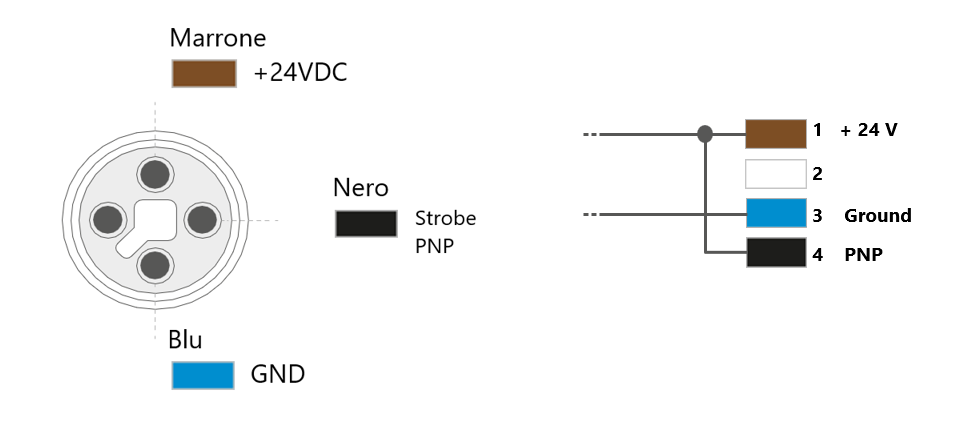

(Installazione_Meccanica)=
# **Installazione Meccanica del Sistema**

Questa sezione descrive i requisiti di montaggio e posizionamento dei componenti chiave del sistema di visione FlexiVision One.     L'installazione deve essere eseguita solo dopo aver completato l'installazione meccanica di base del FlexiBowl e dell'eventuale tramoggia.

```{warning}
**Prerequisiti obbligatori**

Prima di procedere con l'installazione dei componenti di visione, assicurarsi che:

- Il FlexiBowl sia stato montato e fissato alla struttura portante (cellula robotica)
- La tramoggia (Hopper) sia stata installata correttamente
- La struttura di supporto per camera e illuminatore sia stata preparata

Per l'installazione del FlexiBowl, consultare il Manuale Dedicato fornito.
```

```{note}
**Competenze richieste**

L'installazione meccanica richiede:
- Competenze di base in assemblaggio meccanico
- Utilizzo di strumenti di misura (calibro, livella, metro)
- Capacità di lettura di disegni tecnici 
```

---

## Montaggio VisionController

Il VisionController (PC Industriale) gestisce l'elaborazione delle immagini e la comunicazione con il robot.   
Essendo un componente elettronico sensibile, richiede un posizionamento attento per garantire ventilazione adeguata e protezione da contaminanti.

### Specifiche tecniche 
```{figure} ../../../../_shared/media/images/Dim_PC.png
:alt: Dimensioni VisionController
:align: center
:width: 80%
```

```{list-table}
:header-rows: 1
:widths: 40 60
* - **Fori Viti**
  - M5
* - **Caratteristica**
  - **Valore**
* - Larghezza (totale con staffe)
  - 245.00 mm
* - Larghezza (corpo)
  - 227.00 mm
* - Larghezza pannello connettori
  - 200.00 mm
* - Altezza (totale con staffe)
  - 123.00 mm
* - Altezza (corpo)
  - 120.00 mm
* - Profondità
  - 61.10 mm
```

### Requisiti di montaggio

```{list-table}
:header-rows: 1
:widths: 35 65

* - Requisito
  - Specifiche
* - **Posizione consigliata**
  - Interno quadro elettrico o su pannello dedicato vicino alla cella robotica
* - **Spazio di ventilazione**
  - Minimo 50 mm su tutti i lati per circolazione aria
* - **Fissaggio**
  - Guida DIN 35 mm o viti M5 su pannello
* - **Temperatura ambiente**
  - 1°C ~ +50°C (verificare specifiche complete nella sezione [Specifiche VisionController](specifiche_VC))
* - **Protezione**
  - IP40 minimo (consigliato montaggio in quadro elettrico IP54)
```

### Procedura di installazione

#### Montaggio con Fori 

```{list-table} 
   :header-rows: 1
   :widths: 35 65

   * - Fase
     - Descrizione Operativa
   * - **1. Preparazione supporto**
     - Praticare i fori secondo le indicazioni riportate nella scheda tecnica 
   * - **2. Disimballaggio**
     - Estrarre il VisionController dalla confezione prestando attenzione a non danneggiare i connettori. Verificare l'integrità del prodotto.
   * - **3. Fissaggio**
     - Fissare il VisionController con viti M5  
```

#### Montaggio con guida DIN

```{list-table} 
   :header-rows: 1
   :widths: 35 65

   * - Fase
     - Descrizione Operativa
   * - **1. Preparazione supporto**
     - verificare che la guida sia pulita e fissata saldamente.
   * - **2. Disimballaggio**
     - Estrarre il VisionController dalla confezione prestando attenzione a non danneggiare i connettori. Verificare l'integrità del prodotto.
   * - **3. Fissaggio**
     - Agganciare il dispositivo facendolo scorrere sulla guida fino allo scatto.  
```

```{warning}
**Ventilazione**

Il VisionController genera calore durante il funzionamento. Garantire sempre almeno 50 mm di spazio libero attorno al dispositivo.
Altrimenti si può avere:
- Surriscaldamento e spegnimenti automatici
- Riduzione delle prestazioni
- Danneggiamento dei componenti interni
```

---

## Montaggio Camera

Il posizionamento preciso e l'allineamento della telecamera sono passaggi critici che influenzano direttamente l'accuratezza della calibrazione e le prestazioni del sistema di picking.


### Distanza di lavoro ottimale

La telecamera deve essere montata in modo che la faccia frontale della lente sia posizionata a una distanza specifica (Working Distance) dalla superficie del piatto FlexiBowl.  
Per il calcolo dettagliato della distanza ottimale per la vostra applicazione, consultare la sezione dedicata: [Calcolo Distanza Ottimale](distanza_lavoro)

```{image} ../../../../_shared/media/images/working_distance.JPG
:alt: Distanza Di Lavoro
:width: 40%
:align: center
```

```{list-table}
:header-rows: 1
:widths: 25 40 35

* - Modello FlexiBowl
  - Distanza di Lavoro Raccomandata (Working Distance)
  - Lente Inclusa nel Kit (Lunghezza Focale)
* - **FB 200**
  - 800 mm 
  - 35 mm
* - **FB 350**
  - 1000 mm
  - 35 mm
* - **FB 500**
  - 1000 mm
  - 25 mm
* - **FB 650**
  - 1000 mm
  - 16 mm
* - **FB 800**
  - 1000 mm
  - 16 mm
* - **FB 1200**
  - 1300 mm
  - 12 mm
```

### Posizionamento e allineamento

Il corretto allineamento della camera è fondamentale per ottenere immagini di qualità e garantire precisione nel picking.

**Configurazioni errate.** Le immagini mostrano esempi di posizionamento non corretto della camera: il campo visivo (indicato in rosso) risulta decentrato rispetto all'area di visone, coprendo solo parzialmente l'area di lavoro o includendo zone esterne ad essa. Queste configurazioni compromettono il riconoscimento dei pezzi e il funzionamento del sistema di visione.    

```{image} ../../../../_shared/media/images/config_sbagliata.png
:alt: Distanza Di Lavoro
:width: 60%
:align: center
```
```{image} ../../../../_shared/media/images/config_sbagliata2.png
:alt: Distanza Di Lavoro
:width: 60%
:align: center
```
**Configurazione corretta.** La camera deve essere posizionata centralmente rispetto all'area di visione del FlexiBowl (zona backlight). In questo modo il campo visivo (indicato in verde) copre simmetricamente l'intera area di lavoro, garantendo il corretto funzionamento del sistema di visione.  

```{image} ../../../../_shared/media/images/config_giusta.JPG
:alt: Distanza Di Lavoro
:width: 70%
:align: center
```

```{list-table}
* - **Centratura:**
  - 
    - La camera deve essere posizionata esattamente al di sopra dell'area di visione del FlexiBowl
    - Tolleranza massima di centratura: ±5 mm
* - **Ortogonalità:**
  - 
    - La camera deve essere montata perfettamente parallela alla superficie del piatto
    - Non sono ammesse inclinazioni laterali (tilt) o rotazioni rispetto alla verticale
    - Tolleranza massima di inclinazione: ±1°
```

```{tip}
Per facilitare la messa a punto e permettere aggiustamenti futuri, si raccomanda fortemente di progettare il supporto meccanico della camera con possibilità di microregolazioni:
- **Asse Z (altezza)**: -10 mm / +30 mm (per adattamento distanza di lavoro)
- **Asse X (sinistra-destra)**: ±10 mm (per centratura fine)
- **Asse Y (avanti-indietro)**: ±10 mm (per centratura fine)
Questa flessibilità è particolarmente utile durante la calibrazione iniziale e per eventuali ricalibrazione future.
```

### Dimensioni Camera 
```{figure} ../../../../_shared/media/images/Dimensioni_Cam.png
:alt: Dimensioni camera CAM-CIC-5000-20G-1
:align: center
:width: 100%

Dimensioni camera CAM-CIC-5000-20G-1 (mm)
```
```{list-table}
:header-rows: 1
:widths: 40 60

* - **Caratteristica**
  - **Valore**
* - Larghezza × Altezza (corpo)
  - 29 × 29 mm
* - Profondità (corpo)
  - 42.0 mm
* - Profondità totale (incluso connettore posteriore)
  - 48.9 mm
* - Sporgenza frontale (attacco obiettivo)
  - 12.60 mm
* - Interasse fori di fissaggio laterali (M2)
  - 20.0 × 23.7 mm
* - Fori di fissaggio frontali
  - 2× M2 profondità 3 mm
* - Fori di fissaggio laterali
  - 4× M2 profondità 3.5 mm + 3× M3 profondità 3.5 mm
* - Peso
  - 88 g
```
```{warning}
**Fissaggio:**
- Utilizzare i 4 fori di montaggio M3 presenti sul corpo camera
- Viti consigliate: Viti consigliate: M3 A2 / M3 8.8
- Coppia di serraggio: 0.5 Nm (non serrare eccessivamente per evitare deformazioni)
```
```{tip}
**Regolazione della posizione della camera**

Per permettere aggiustamenti futuri ed evitare problemi di allineamento, progettare il supporto meccanico con possibilità di microregolazione su tutti gli assi:

- **Asse Z (altezza)**: -10 mm / +30 mm
- **Asse X (sinistra-destra)**: ±10 mm
- **Asse Y (avanti-indietro)**: ±10 mm

Un supporto con viti serrate definitivamente senza possibilità di regolazione rende impossibile correggere la posizione della camera dopo il montaggio iniziale.
```
### Verifica montaggio lente

```{warning}
Prima di procedere con il fissaggio definitivo:
1. Verificare visivamente che la lente sia installata
2. Controllare che la lunghezza focale sia corretta per il vostro modello di FlexiBowl (etichetta sulla lente o documentazione dell'ordine)
3. Assicurarsi che la lente sia avvitata completamente (contatto metal-metal tra lente e corpo camera)
4. NON rimuovere o allentare la lente se già montata correttamente
```
### Installazione Camera
Per garantire il corretto funzionamento del sistema di visione è necessario che la telecamera sia installata su un supporto rigido e stabile.
Il sistema Flexibowl non genera vibrazioni; tuttavia, nelle linee automatizzate sono presenti altre sorgenti di vibrazione,(robot industriali,sistemi di movimentazione,altre macchine della linea)

Se tali vibrazioni vengono trasmesse alla telecamera, l'immagine acquisita può risultare instabile e le coordinate calcolate dal sistema di visione potrebbero non essere affidabili, compromettendo la precisione del prelievo robotizzato.



:::{tip}
Per questo motivo si raccomanda di:

- installare la telecamera su una struttura rigida e stabile

- evitare supporti soggetti a vibrazioni provenienti da robot o altre macchine

- utilizzare preferibilmente una struttura indipendente dalla macchina
:::

```{warning}
**Viti di fissaggio camera: prevenzione allentamento**

Le viti di fissaggio della camera possono allentarsi nel tempo per le seguenti cause:

- **Coppia di serraggio eccessiva (> 0.5 Nm)**: può causare deformazioni del corpo camera e successivo allentamento. Serrare sempre con coppia massima di **0.5 Nm**.
- **Vibrazioni trasmesse dalla linea**: utilizzare **frenafiletti medio** su tutte le viti di fissaggio.
- **Viti non idonee**: verificare l'utilizzo di viti **M3 × 8 mm inox** come consigliato.
```

### Regolazione della posizione della telecamera:

Il supporto della telecamera deve consentire la regolazione della posizione per permettere il corretto allineamento con l’area di prelievo del Flexibowl.



:::{note}
Partendo da un posizionamento nominale con inclinazione, altezza e posizionamento corretto al centro dell'area retroilluminata, si raccomanda di prevedere le seguenti regolazioni:

Regolazione X/Y → ± 50mm
Regolazione Z → ± 50mm
Rotazione θ → ± 10°
:::

```{caution}
**Camera danneggiata durante il montaggio**

Per evitare danni alla telecamera durante le operazioni di installazione e regolazione:

- **Coppia di serraggio eccessiva**: non superare **0.5 Nm** di coppia sulle viti M3. Il superamento di questo valore può deformare il corpo ottico in modo irreversibile.
- **Manipolazione scorretta**: maneggiare sempre la camera con cura, evitando pressioni dirette sul corpo ottico e sul sensore.
- **Urti durante l'installazione**: proteggere la camera durante eventuali lavori meccanici circostanti (foratura, fresatura, serraggio strutture).
```
---

## Montaggio Toplight

Se l'ordine include un Toplight (illuminatore dall'alto), questo deve essere montato sulla stessa struttura di supporto della telecamera per garantire un'illuminazione uniforme della superficie di lavoro.

:::{attention}
Durante il montaggio, l'apparecchio deve essere spento e staccato dalla corrente.
:::
### Dimensioni Toplight 


| Lunghezza x Larghezza (mm) | Altezza (mm) | Altezza con piastra di fissaggio (mm) | Diametro foro centrale | Superficie utile massima [A x B] | Perimetro utile massimo |
|:---:|:---:|:---:|:---:|:---:|:---:|
| **A x B** | **C** | **C + 10 mm** | **D** | **–** | **–** |
| 500x300 | 45 | 55 | 65 | 0,15 m² | 1,6 m |
| 700x300 | 45 | 55 | 65 | 0,21 m² | 2 m |
| 700x500 | 45 | 55 | 65 | 0,35 m² | 2,4 m |
| 900x600 | 45 | 55 | 65 | 0,54 m² | 3 m |

### Posizionamento Toplight 
Il toplight deve essere posizionato centralmente rispetto alla superficie utile del pannello luminoso,
con l'ottica della telecamera montata all'interno del foro centrale, a filo con la superficie superiore del toplight.   
Le frecce rosse indicano le viti di fissaggio delle ghiere dell'obiettivo, una per la regolazione del fuoco e una per la regolazione del diaframma. Come mostrato nella figura, il toplight deve essere montato in modo che le due viti restino accessibili dall'alto. 



Il campo visivo della telecamera e il fascio luminoso del toplight (in verde) devono essere allineati concentricamente e perpendicolarmente rispetto all'area di visione sul FlexiBowl.    
Come mostrato nelle tre viste (frontale, dall'alto e assonometrica), il toplight deve illuminare esattamente l'area inquadrata dalla telecamera, con entrambi i componenti centrati sull'asse ottico verticale del sistema.  



Un posizionamento errato si verifica quando il toplight e la telecamera non sono centrati sull'area di visione del FlexiBowl.   
Come illustrato (in rosso), due errori tipici sono:  
- spostarsi in avanti o indietro rispetto all'area di visione.  
- ruotare il toplight rispetto ad essa.   
  
In entrambi i casi, l'illuminazione risulta disassata e non perpendicolare, compromettendo la qualità dell'acquisizione.



### Procedura di installazione
```{list-table}
:header-rows: 1
:widths: 35 65

* - **Fase**
  - **Istruzioni operative**
* - **1. Posizionamento**
  - Fissare il Toplight sulla struttura di supporto in posizione concentrica rispetto alla camera.
* - **2. Distanza dalla superficie**
  - Posizionare l'illuminatore a una distanza dalla superficie del FlexiBowl simile a quella della camera per:
    
    * Minimizzare le ombre proiettate dai pezzi
    * Massimizzare l'uniformità luminosa
    * Evitare riflessioni dirette verso la camera
* - **3. Orientamento**
  - Assicurarsi che la superficie emittente del Toplight sia parallela al piatto del FlexiBowl.
* - **4. Angolo di illuminazione**
  - Perpendicolare alla superficie (0° tilt).
* - **5. Fissaggio**
  - Secondo specifiche della modalità scelta (vedi sezione seguente).
```

### Modalità di fissaggio

Il Toplight può essere fissato in due modalità: sull'[angolo](angolo) o sul [lato](lato).

:::{note}
I componenti di fissaggio **non sono inclusi** nella fornitura del Toplight. Il montaggio può quindi essere personalizzato in base alle esigenze dell'installazione.

- Fissaggio sul lato (scanalatura): dadi M4 **forniti**
- Fissaggio sull'angolo: viti CHC M4x20 **non fornite**

In entrambi i casi si raccomanda l'uso di un **frenafiletti** (non fornito) per evitare allentamenti nel tempo. La coppia di serraggio consigliata è compresa tra **0,5 e 1,5 Nm**.
:::

(angolo)=
#### 1. Fissaggio sull'angolo

Il fissaggio sull'angolo utilizza viti CHC M4x20 (non fornite) applicate nei fori posizionati ai quattro angoli del Toplight.
```{figure} ../../../../_shared/media/images/fissaggio_angolo.png
:alt: Fissaggio del Toplight sull'angolo con vite CHC M4x20
:align: center
:width: 60%

Fissaggio sull'angolo tramite vite CHC M4x20 (non fornita).
```

(lato)=
#### 2. Fissaggio sul lato (scanalatura)

Il fissaggio sul lato utilizza 4 dadi M4 (forniti) da inserire nella scanalatura laterale del profilo del Toplight. La profondità massima di inserimento del dado nella scanalatura è di **5 mm**.

```{figure} ../../../../_shared/media/images/fissaggio_lato.JPG
:alt: Fissaggio del Toplight sul lato tramite dadi M4 nella scanalatura
:align: center
:width: 100%

Fissaggio sul lato tramite 4 dadi M4 (forniti) inseriti nella scanalatura del profilo. Profondità massima: 5 mm.
```

##### Fissaggio laterale con staffe 
Nel caso in cui il Toplight venisse fissato con delle staffe: 

:::{error}

:::

:::{tip}

:::


### Cablaggio illuminatore




```{list-table} 
:header-rows: 1
:widths: 30 70

* - Parametro
  - Requisito / Azione
* - **Tensione**
  - 24V DC (±10%). Tensione minima di funzionamento: 20V DC sull'ingresso luce.
* - **Connettore**
  - M12 5 poli (T-coding).
* - **Pinout connettore**
  - Pin 1: +24V (marrone) — Pin 3: GND (blu) — Pin 4: STROBE PNP (nero)
* - **Modalità STROBE (PNP)**
  - Da 5V a 24V per accensione al 100%. Da 0V a 1V per spegnimento al 100%.
* - **Modalità CONTINUA**
  - Pin 1 (+24V) e Pin 3 (GND) collegati; Pin 4 (PNP) collegato a Pin 1.
* - **Caduta di tensione (cavo M12, 10m)**
  - 1.15V @ 5A — 2.3V @ 10A — 3.5V @ 15A — 4.6V @ 20A (max 20A)
* - **Schermatura**
  - Utilizzare cavi schermati per ridurre le interferenze elettromagnetiche (EMI).
```
```{warning}
**Sicurezza elettrica**

- Rispettare le tensioni di alimentazione e i morsetti di connessione indicati.
- Non modificare né smontare il prodotto.
- Non collegare o pulire l'apparecchio quando è sotto tensione.
- Non guardare direttamente la sorgente luminosa.
```
```{note}
Per dettagli sui collegamenti elettrici, consultare la sezione [Cablaggio e Connessioni](10_Cablaggio_Connessioni.md).
```

---

## Schermatura da luce ambientale

La stabilità del sistema di visione dipende fortemente dalla consistenza delle condizioni di illuminazione. La luce ambientale variabile può causare rilevazioni incoerenti.

```{warning}
**Protezione da fonti luminose esterne**

Si raccomanda fortemente di schermare la cella robotica da:
- Luce solare diretta o indiretta
- Illuminazione artificiale variabile (es. lampade con dimmer)
- Riflessi da superfici lucide circostanti
- Flash o luci intermittenti nell'area

```
---

## Riferimenti correlati

Per informazioni complementari all'installazione meccanica:

- **Calcolo della distanza ottimale camera**: [Calcolo Distanza Ottimale](distanza_lavoro)
- **Specifiche tecniche complete**: [Specifiche FlexiVision One](specifiche_tecniche)
- **Passo successivo - Collegamenti elettrici**: [Cablaggio e Connessioni](cablaggio)
- **Calibrazione camera**: [Calibrazione della Camera](calibrazione)

