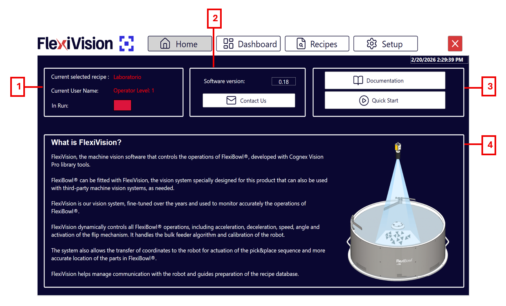
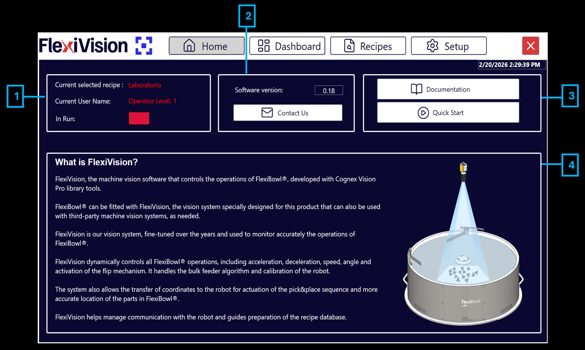
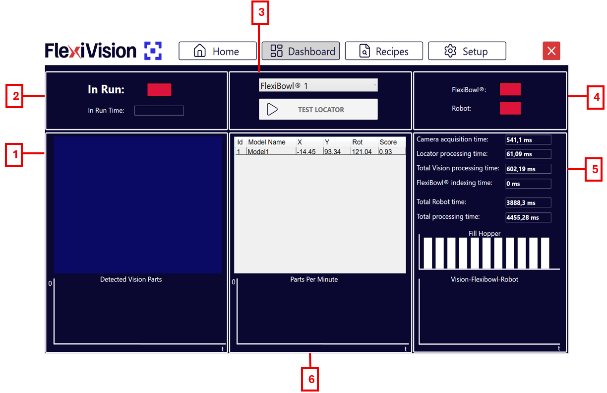
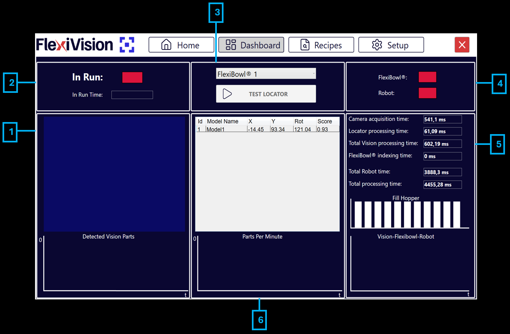
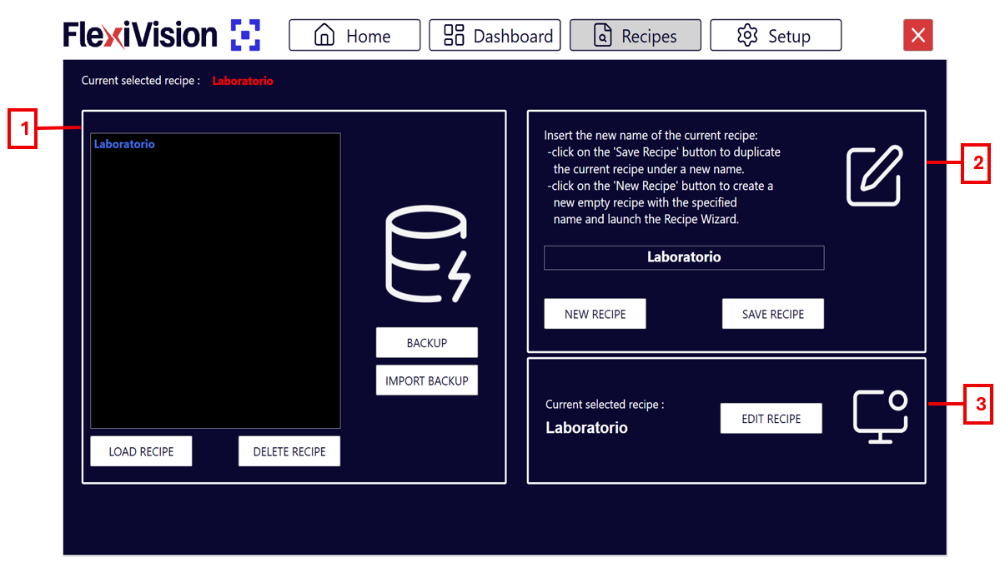
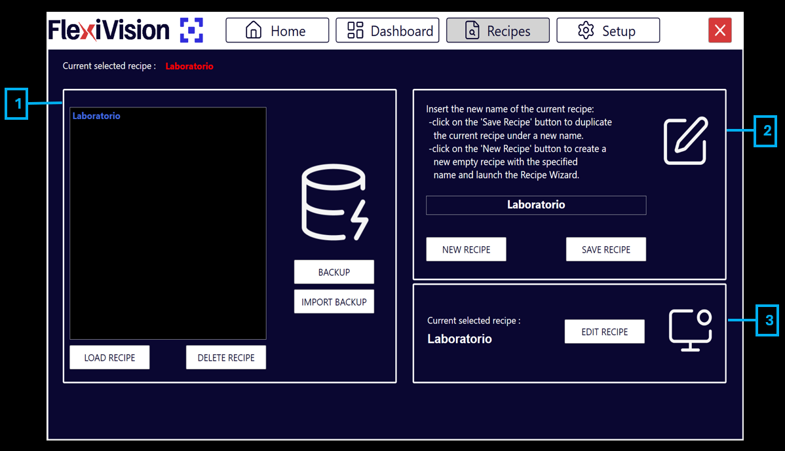
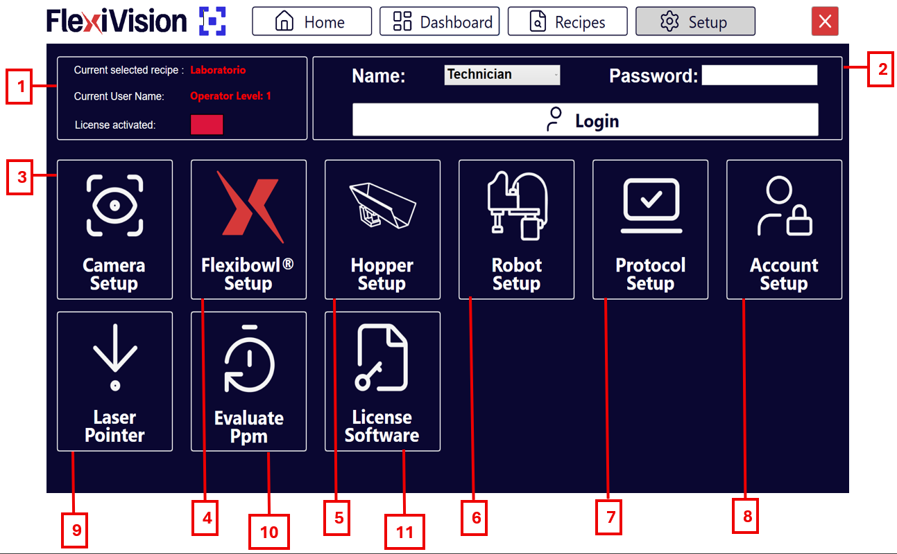
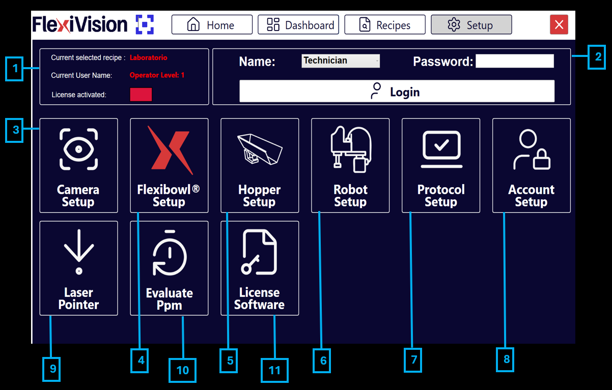

(quickstart)=
# **Panoramica dell'interfaccia**
L’interfaccia di FlexiVision One è strutturata in sezioni funzionali che guidano l’utente dalla configurazione iniziale alla gestione operativa del sistema.
Ogni pagina fornisce informazioni in tempo reale su stato macchina, connessioni, prestazioni e parametri di processo, con accesso diretto alle funzioni principali.
La navigazione è progettata per garantire semplicità d’uso, controllo immediato delle operazioni e monitoraggio continuo delle performance di visione, alimentazione e robot.
## Pagina Home  



```{list-table} Descrizione Pagina Home
:header-rows: 1
:widths: 10 90

* - **#**
  - **Descrizione**

* - 1
  - **Informazioni di Stato e Utente**:
    * **Current selected recipe**: visualizza il nome della ricetta attualmente caricata e pronta all'uso.
    * **Current user name**: mostra il nome dell'utente loggato e il suo livello di accesso al sistema.
    * **In run**: indica lo stato operativo; segnala se il sistema è attualmente in funzione o in stato di stop.

* - 2
  - **Informazioni Software e Assistenza**:
    * **Version software**: indica la versione del software FlexiVision One attualmente installata.
    * **Contact us**: pulsante che permette di accedere rapidamente alle informazioni di contatto per il supporto tecnico e l'assistenza.

* - 3
  - **Risorse e Guide Rapide**:
    * **Documentation**: pulsante che rimanda alla libreria completa della documentazione tecnica e dei manuali.
    * **QuickStart**: sezione dedicata alla procedura guidata per una configurazione veloce e intuitiva del sistema.

* - 4
  - **Sezione Informativa Generale**:
    * **What is FlexiVision One?**: area descrittiva che fornisce una panoramica sulle funzionalità principali del sistema e sulla sua integrazione con il dispositivo FlexiBowl®.
```

## Pagina DashBoard 



```{list-table} Descrizione Pagina Dashboard
:header-rows: 1
:widths: 10 90

* - **#**
  - **Descrizione**

* - 1
  - **Area Visione e Rilevamento**
    * **Detected vision parts con grafico**: quanti componenti sono stati rilevati nell'immagine corrente e l'andamento nel tempo (30s).
    

* - 2
  - **Stato Operativo**
    * **In run**: indicatore luminoso che segnala se il sistema è in funzione o fermo.
    * **In run time**: cronometro che indica il tempo totale di attività del sistema.

* - 3
  - **Controlli e Selezione**
    * **Menù tendina FlexiBowl**: permette di selezionare il dispositivo FlexiBowl® su cui si intende operare.
    * **Test Locator**: avvia movimentazioni cicliche di FlexiBowl e tramoggia finché ci sono componenti nell'area di visione.

* - 4
  - **Stato Connessioni**
    * **FlexiBowl**: indica lo stato della connessione in tempo reale con il FlexiBowl.
    * **Robot**: indica lo stato della connessione in tempo reale con il robot.

* - 5
  - **Analisi Tempi di Ciclo (Timings)**
    * **Camera/Locator processing time**: tempi singoli di scatto immagine e riconoscimento componenti.
    * **Total vision processing Time**: somma dei tempi di camera e locator.
    * **Total FlexiBowl / Robot time**: tempo per una sequenza di movimento FB e per un singolo pick & place del robot.
    * **Total processing time**: tempo totale del processo (Visione + FB + Robot).
    * **Fill hopper**: storico degli scarichi effettuati dalla tramoggia sul disco del FlexiBowl.
    * **Vision - FlexiBowl - Robot**: grafico comparativo delle tre funzioni per capire l'impatto di ogni singolo processo sul tempo totale.
* - 6
  - **Grafici di Performance e Storico**
    * **Elenco modelli rilevati**: tabella con coordinate (**X**, **Y**), rotazione (**Rot**) del componente e lo **Score** (grado di similarità dell'oggetto riconosciuto rispetto al modello di riferimento).
    * **Parts per minute**: grafico della media dei componenti prelevati al minuto.
```
(recipes)=
## Pagina Recipes 



```{list-table} Descrizione Pagina Recipes
:header-rows: 1
:widths: 10 90

* - **#**
  - **Descrizione**

* - 1
  - **Gestione Database Ricette**
    * **Backup**: effettua un backup di tutte le ricette in un unico file .xml, salvabile nella posizione desiderata.
    * **Import backup**: permette l'importazione di qualsiasi backup precedentemente effettuato con FlexiVision One.
    * **Load recipe**: carica la ricetta selezionata nell'elenco sopra per renderla operativa.
    * **Delete recipe**: elimina definitivamente la ricetta selezionata dall'elenco.

* - 2
  - **Creazione e Salvataggio**
    * **New recipe**: avvia la creazione di una nuova ricetta. Dopo aver scelto il nome e il FlexiBowl con cui stiamo lavorando, si apre direttamente il menù di creazione modello. 
      :::{note}
        La ricetta deve poi essere salvata cliccando su Save. 
      :::
    * **Save recipe**: salva la ricetta corrente sovrascrivendo i parametri modificati o crea un nuovo file se non ancora esistente.

* - 3
  - **Modifica Ricetta**
    * **Edit recipe**: pulsante diretto che porta al menù di configurazione e creazione del modello per la ricetta attualmente selezionata.
```

## Pagina Setup 




```{list-table} Descrizione Pagina Setup
:header-rows: 1
:widths: 10 90

* - **#**
  - **Descrizione**

* - 1
  - **Informazioni di Stato**
     - **Current selected recipe**: indica il nome della ricetta attualmente in uso.
     - **Current user name**: mostra l'utente loggato e il relativo livello di accesso.
     - **In Run**: indica se l'applicazione è attiva.

* - 2
  - **Pannello di Accesso**
     - **Name**: campo per l'inserimento del nome utente.
     - **Login**: pulsante per confermare le credenziali ed effettuare l'accesso al sistema.

* - 3
  - **Camera setup**: sezione dedicata alla configurazione dei parametri delle telecamere.
* - 4
  - **Flexibowl setup**: area per impostare i parametri di movimento e controllo del FlexiBowl.
     
* - 5
  - **Hopper setup**: configurazione dei parametri della tramoggia (vibrazione e scarico).
     
* - 6
  - **Robot setup**: sezione per la configurazione della comunicazione del robot.

* - 7
  - **Protocol setup**: pagina di configurazione dei parametri che definiscono quanti oggetti la visione deve o può restituire in ogni ciclo, con quale ordine vengono prioritizzati e quali valori statistici usare in base al numero di prese robot e al tempo massimo di gestione per ogni componente.
     
* - 8
  - **Account setup**: permette di configurare i vari account utente in base ai livelli di accesso.

* - 9
  - **Laser pointer**: permette di usare uno strumento laser per simulare un prelievo (pick) in assenza del robot.
* - 10
  - **Evaluate PPM**: permette di effettuare una stima dei pezzi al minuto (PPM) quando si utilizza il laser pointer.

* - 11
  - **Licence software**: pagina per l'attivazione della licenza software.
```
## i tasti INFO
In ognuna delle sezioni operative, è disponibile un tasto INFO in alto a destra.
All'interno di questo pulsante è disponibile la spiegazione della procedura Step By Step, la stessa procedura è visibile nel video tutorial.
```{dropdown} Tasto Info della pagina [Camera FLB](cameraFLB)

   :::{video} ../../../../_shared/media/videos/TastoInfo_CameraFLB_1280x720.mp4
   :width: 100%
   :align: center
   :::

```

```{dropdown} Tasto Info della pagina [Calibration](calibrazione)

   :::{video} ../../../../_shared/media/videos/TastoInfo_Calibration_1280x720.mp4
   :width: 100%
   :align: center
   :::

```
```{dropdown} Tasto Info della pagina [Train Model](modello)

   :::{video} ../../../../_shared/media/videos/TastoInfo_TrainModel_1280x720.mp4
   :width: 100%
   :align: center
   :::

```
```{dropdown} Tasto Info della pagina [Define Robot Picking Area](robotarea)

   :::{video} ../../../../_shared/media/videos/TastoInfo_DefineRobotArea_1280x720.mp4
   :width: 100%
   :align: center
   :::

```
```{dropdown} Tasto Info della pagina [Locator Model](locator)

   :::{video} ../../../../_shared/media/videos/TastiInfo_LocatorModel_1280x720.mp4
   :width: 100%
   :align: center
   :::

```
```{dropdown} Tasto Info della pagina [Clearances](clearances)

   :::{video} ../../../../_shared/media/videos/TastoInfo_Clearances_1280x720.mp4
   :width: 100%
   :align: center
   :::

```
```{dropdown} Tasto Info della pagina [Clearance 1](clearance1)

   :::{video} ../../../../_shared/media/videos/TastoInfo_Clearance1_1280x720.mp4
   :width: 100%
   :align: center
   :::

```
```{dropdown} Tasto Info della pagina [Picking Offset](pickingoffset)

   :::{video} ../../../../_shared/media/videos/TastoInfo_PickingOffset_1280x720.mp4
   :width: 100%
   :align: center
   :::

```
```{dropdown} Tasto Info della pagina [Define Hopper Area](definehopperarea)

   :::{video} ../../../../_shared/media/videos/TastoInfo_AreaHopper_1280x720.mp4
   :width: 100%
   :align: center
   :::

```
```{dropdown} Tasto Info della pagina [Define Value Hopper](definevaluehopper)

   :::{video} ../../../../_shared/media/videos/TastoInfo_Hopper_1280x720.mp4
   :width: 100%
   :align: center
   :::

```
