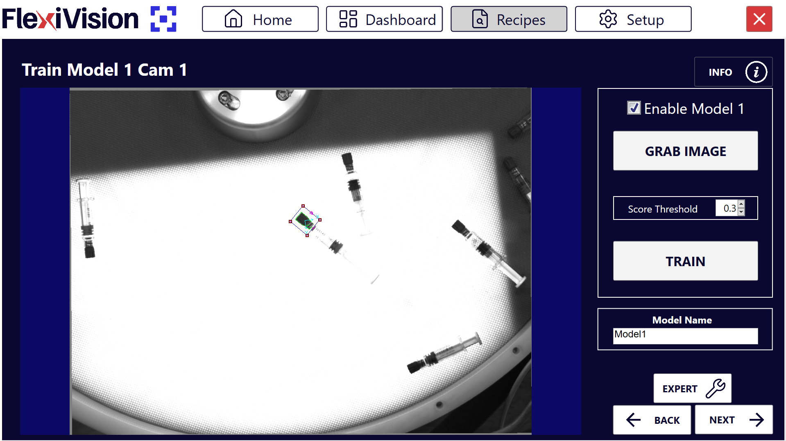
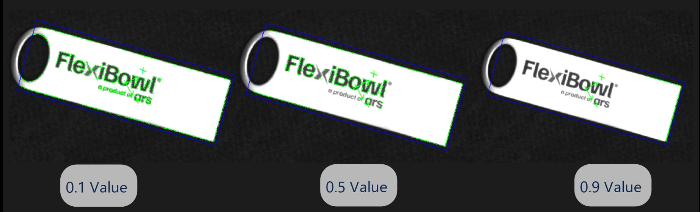
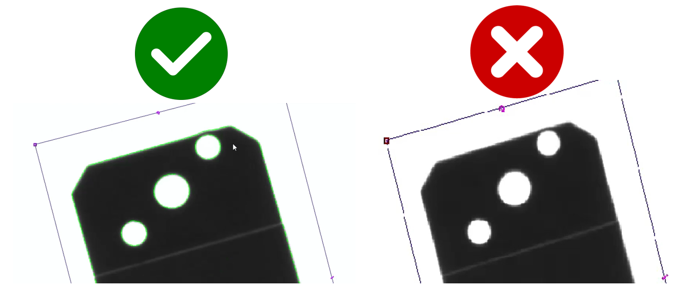

(nuovomodello)=
# **Creare un Nuovo Modello**

In questa pagina vedremo come creare un modello di riferimento per il riconoscimento dei componenti.


## **Step 1: Preparazione del Setup Fisico**
````{list-table}
* - **1**
  - Smontare la griglia di calibrazione e ripristinare il layout iniziale:
    - Riposizionare la superficie
    - riposizionare la flangia centrale 
    - fissare la flangia centrale con le sue quattro viti
* - **2**
  - Posizionare un oggetto al centro dell'area di visione
````
---

## **Step 2: Accesso al Modello** 

Completata la preparazione fisica, si procede con l'acquisizione dell'immagine e la creazione del modello
````{list-table}
* - **3**
  - Dalla pagina "Recipes", con la giusta ricetta selezionata, cliccare su "Edit Recipe"
* - **4**
  - Selezionare il FlexiBowl con cui si sta lavorando
    :::{dropdown}

    :::
* - **5**
  - Verranno mostrati gli slot disponibili per i modelli (fino a 8 modelli per ricetta)
* - **6**
  - Cliccare sul **Modello 1** per accedere alla pagina "Train Model 1 Cam 1"
````

#### Panoramica interfaccia Train Model


````{list-table}
:header-rows: 1
:widths: 30 70

* - Parametro
  - Funzione
* - **Enable Model**
  - Attiva questo slot di modello rendendolo utilizzabile
* - **Grab Train Image**
  - Scatta una foto del componente di riferimento per il training
* - **Score Threshold**
  - Regola il livello di dettaglio del modello (da 0 = massimo dettaglio a 1 = minimo dettaglio)
* - **Train**
  - Genera effettivamente il modello elaborando l'immagine acquisita
* - **Model Name**
  - Campo di testo per assegnare un nome descrittivo al modello
````
````{tip}
**Gestione modelli multipli**

In questa fase si attiva solo il primo modello. Dopo averlo completato, sarà possibile:
- Abilitare slot aggiuntivi (Modello 2, Modello 3, ecc.) per pezzi diversi nella stessa ricetta
- Modificare modelli esistenti
- Disabilitare modelli non più necessari

Per ora, concentrarsi sul completamento del primo modello.
````
---

## **Step 3: Procedura di Training**
````{video} ../../../../../_shared/media/videos/TastoInfo_TrainModel_1280x720.mp4
:width: 100%
:align: center 
````
````{list-table}
:widths: 5 95

* - **7**
  - Cliccare su **Enable Model** per abilitare questo modello. Il modello è ora attivo e pronto per essere configurato.

* - **8**
  - Cliccare su **Grab Train Image** per scattare una foto del componente di riferimento che abbiamo posizionato sul FlexiBowl
    
    :::{warning}
    Il componente di riferimento dovrà rimanere fermo in quel punto per tutto il processo di creazione dell'applicazione
    :::

* - **9**
  - Spostare il **riquadro ROI** per inquadrare completamente il componente

* - **10**
  - Spostare l'**origine** (punto di riferimento) al centro dell'area del riquadro
    
    :::{tip}
    **Dove posizionare l'origine?**
    
    L'origine viene automaticamente posizionato al centro del componente.  
    Se il punto di presa non coincide con il centro geometrico, spostare l'origine nel:
    - **Punto di presa**: Per pezzi asimmetrici, posizionare dove la pinza afferra
    
    *L'origine definisce il punto (0,0) del sistema di coordinate del modello.*
    :::

* - **11**
  - Usare lo **Score Threshold** per regolare il livello di dettaglio desiderato
    
    ::::{note}
    **Score Threshold**
     
      
    
    **Valore vicino a 0** → Rileva PIÙ dettagli (modello più preciso)
    
    **Valore vicino a 1** → Rileva MENO dettagli (modello più semplice)
    ::::
    
    :::{tip}
    **Come scegliere lo Score Threshold ottimale?**
    
    **Usare valore BASSO (0.1-0.3) quando:**
    - Il pezzo ha molti dettagli distintivi (incisioni, loghi, texture)
    - I pezzi sono sempre molto simili tra loro (tolleranze strette)
    - Si vuole massima precisione anche con orientamenti difficili
    
    **Usare valore ALTO (0.4-0.6) quando:**
    - Il pezzo ha forma distintiva ma semplice
    - Si desidera equilibrio tra precisione e tolleranza
    - Prima configurazione di un modello (punto di partenza)
    
    **Usare valore MOLTO ALTO (0.7-0.9) quando:**
    - Ci sono variazioni significative tra i pezzi (tolleranze larghe)
    - La superficie del pezzo è molto riflettente o variabile
    :::

* - **12**
  - Cliccare su **Train**
````
---

## **Step 4: Controllo Visivo**

Dopo aver generato il modello, è fondamentale verificarne la qualità prima di procedere.
````{list-table}

* - **13**
  - Fare **Zoom** sull'immagine per ispezionare i dettagli del modello creato e verificare che il modello sia corretto
    
    :::{tip}
      **Caratteristiche Modello Valido**  
      ✓ Avere abbastanza linee per riconoscere il componente  
      ✓ Non includere la trama della superficie retrostante  
      ✓ Evitare riflessi di luce  
    :::

    
````
````{attention}
Se il modello non è soddisfacente:
- Modificare lo **Score Threshold**
- Cliccare nuovamente su **Train**
- Ripetere fino a ottenere un modello ottimale
````
````{tip}
**Strategia di ottimizzazione**

**Problema: Modello include trama superficie**  
→ Soluzione: Aumentare Score Threshold o il valore Cam Exposure (SETUP > Camera Setup > Cam Exposure)

**Problema: Modello ha troppo poche linee, non distintivo**  
→ Soluzione: Diminuire Score Threshold 

**Problema: Modello include riflessi**  
→ Soluzione: Aumentare Score Threshold oppure regolare esposizione camera

Effettuare modifiche graduali (step di 0.1-0.2) e testare ogni volta.
````
---

## **Step 5: Salvataggio**
````{list-table}
* - **14**
  - Nominare il modello con un nome descrittivo  
    :::{tip}
    **Evitare nomi generici**

    ❌ Nomi da evitare:
    - `Test`, `Prova`, `Modello1`, `Nuovo_Modello`

    ✓ Nomi consigliati:
    - `Prod_Viti_M8_Acciaio`
    - `Assembly_Connettori_2024`
    - `QC_Ingranaggi_Serie_X`

    Un nome chiaro facilita la gestione quando si hanno molti modelli diverse.
    :::
* - **15**
  - Cliccare su **Next** → si aprirà la pagina **Define Robot Pick Area**  
````
````{seealso}
Procedi alla [Definizione ROI](roitest) per continuare la configurazione.
````

