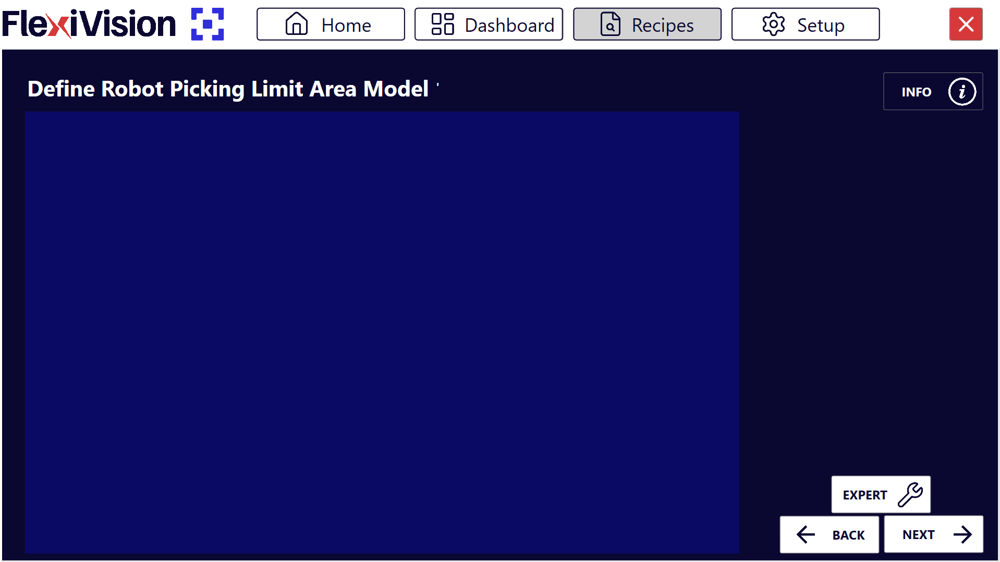
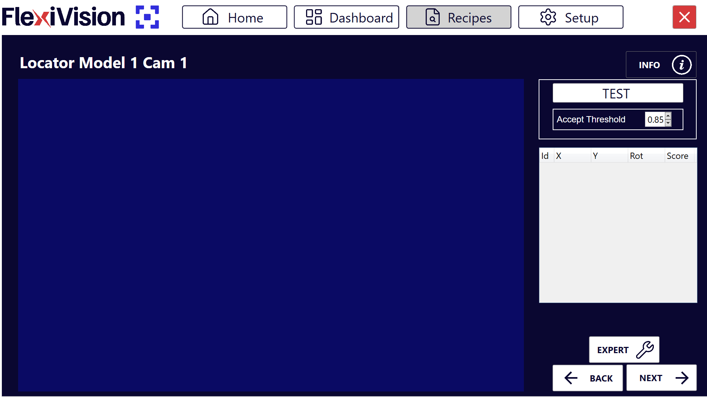

(roitest)=
# **Definizione ROI e Tolleranze**

In questa sezione si procede alla definizione della Region Search (area di ricerca) e delle tolleranze di riconoscimento per il modello creato. Questi parametri determinano dove e con quale precisione FlexiVision One cercherà i componenti durante il funzionamento.

**Cos'è la Region Search?**  
La **Region Search** è l'area all'interno della quale FlexiVision One cercherà e rileverà i componenti da prelevare.

# Procedura

Dopo aver cliccato "Next" nella pagina di training, si apre automaticamente la pagina **Define Robot Picking Limit Area Model**.




## **Step 1: Definizione Area**

:::{video} ../../../../../_shared/media/videos/TastoInfo_DefineRobotArea_1280x720.mp4
    :width: 100%
    :align: center
:::
```{list-table}
* - **1**
  - Nella pagina **Define Robot Picking Limit Area Model**, modificare il riquadro per delimitare l'area di ricerca
* - **2**
  - Una volta dimensionata correttamente la Region Search, Cliccare su 
* - **3**
  - Si aprirà la pagina **Locator Model 1 Cam 1**
```
```{tip}
Dimensiona l'area in base allo spazio effettivo di lavoro del robot, evitando zone non raggiungibili.
```

### Panoramica interfaccia Locator Model


```{list-table}
:header-rows: 1
:widths: 30 70

* - Parametro
  - Descrizione
* - **Test**
  - Esegue un test di riconoscimento in tempo reale con i parametri correnti
* - **Accept Threshold**
  - Soglia minima di fedeltà (score) che un componente deve avere per essere accettato
* - **Results Panel**
  - Pannello che mostra tutti i componenti rilevati con dettagli (Id, coordinate, score)
```
### **Video Tutorial**
Video tutorial esplicativo dei successivi Step 2 e Step 3: 
:::{video} ../../../../../_shared/media/videos/TastiInfo_LocatorModel_1280x720.mp4
    :width: 100%
    :align: center
:::


## **Step 2: Preparazione Scena**
```{list-table}
:widths: 5 95

* - **4**
  - Posizionare **altri componenti** nell'area di visione in modo casuale intorno al componente di riferimento in modo da non confonderli con esso.
    
    :::{warning}
    Non toccare il componente di riferimento usato per il training! E non perderlo di vista!
    :::
```

## **Step 3: Esecuzione Test e Accept Threshold**
```{list-table}
:widths: 5 95

* - **5**
  - Cliccare su  per effettuare il riconoscimento

* - **6**
  - Osservare quanti componenti vengono rilevati e con quali score

* - **7**
  - Modificare l'**Accept Threshold** in base alle esigenze dell'applicazione
    
    :::{note}
    **Cos'è l'Accept Threshold?**
    
    È il **grado minimo di fedeltà** (score) che un componente rilevato deve avere rispetto al modello di riferimento per essere accettato.
    
    - **Valore 0.95** → Accetta solo componenti con fedeltà ≥ 95%
    - **Valore 0.80** → Accetta componenti con fedeltà ≥ 80%
    - **Valore più alto** → Più restrittivo (meno falsi positivi)
    - **Valore più basso** → Più permissivo (rileva anche componenti meno simili a quello di riferimento)
    :::
```
```{tip}

**Approccio iterativo consigliato:**

1. Iniziare con Accept Threshold = 0.85
2. Fare Test e osservare risultati
3. Se **troppi pezzi accettati** (inclusi falsi positivi) → Aumentare threshold (es: 0.90)
4. Se **troppo pochi pezzi rilevati** (pezzi buoni scartati) → Diminuire threshold (es: 0.80)
5. Ripetere fino a trovare il valore ottimale per l'applicazione

**Obiettivo**: Trovare il valore più alto possibile che rileva tutti i pezzi buoni ma scarta i peggiori.
```

---

## Interpretazione Risultati

### Visualizzazione componenti rilevati

Nel pannello Results vengono mostrati tutti i componenti rilevati che rispettano l'Accept Threshold:
```{list-table}
:header-rows: 1
:widths: 15 25 60

* - Campo
  - Tipo
  - Descrizione
* - **Id**
  - Intero
  - Identificativo univoco progressivo (0, 1, 2, ...)
* - **X**
  - Millimetri
  - Coordinata X del componente (riferimento origine della griglia di calibrazione)
* - **Y**
  - Millimetri
  - Coordinata Y del componente (riferimento origine della griglia di calibrazione)
* - **Rotation**
  - Gradi
  - Angolo di rotazione del componente (0-360°)
* - **Score**
  - Percentuale
  - Grado di fedeltà rispetto al modello di riferimento (0.00-1.00)
```
```{admonition} Sistema di Priorità
:class: info
FlexiVision One di dafault ordina automaticamente tutti i componenti riconosciuti per **score decrescente**:
- **Id 0** → Componente con score più alto (più simile al modello di riferimento)
- **Id 1** → Secondo miglior componente
- **Id 2** → Terzo miglior componente
- E così via...
```
### Esempio interpretazione

Supponiamo che dopo il Test appaiano questi risultati:

| Id | X | Y | Rotation | Score |
|----|-------|-------|----------|-------|
| 0 | 125.4 | -45.2 | 15.3° | 0.92 |
| 1 | -80.1 | 32.5 | 178.5° | 0.89 |
| 2 | 45.7 | 110.3 | 92.1° | 0.86 |
| 3 | -150.2 | -95.7 | 45.8° | 0.83 |

**Interpretazione:**
- **Id 0**: Migliore corrispondenza (92%), sarà prelevato per primo
- **Id 1**: Buona corrispondenza (89%), seconda opzione
- **Id 2**: Corrispondenza discreta (86%), terza opzione
- **Id 3**: Corrispondenza accettabile (83%), quarta opzione

Se Accept Threshold fosse 0.85:
- Id 0, 1, 2 sarebbero accettati
- Id 3 sarebbe scartato (score 0.83 < 0.85)

---

# Finalizzazione

## **Step 4: Pulizia e Proseguimento**
```{list-table}
* - **8**
  - Rimuovere **tutti i componenti** dall'area, **tranne il componente di riferimento** e i due oggetti ai suoi lati
    :::{danger}
      **Non spostare il componente di riferimento!**
      Anche durante la pulizia della scena, fare attenzione a non urtare o spostare il componente di riferimento. Le sue coordinate sono ancora necessarie per la calibrazione robot nella fase finale.
    :::
* - **9**
  - Cliccare su  → si aprirà la pagina delle **Clearances**
```
```{seealso}
Procedi alla [Configurazione Clearances](istogrammi) per definire le aree libere.
```

