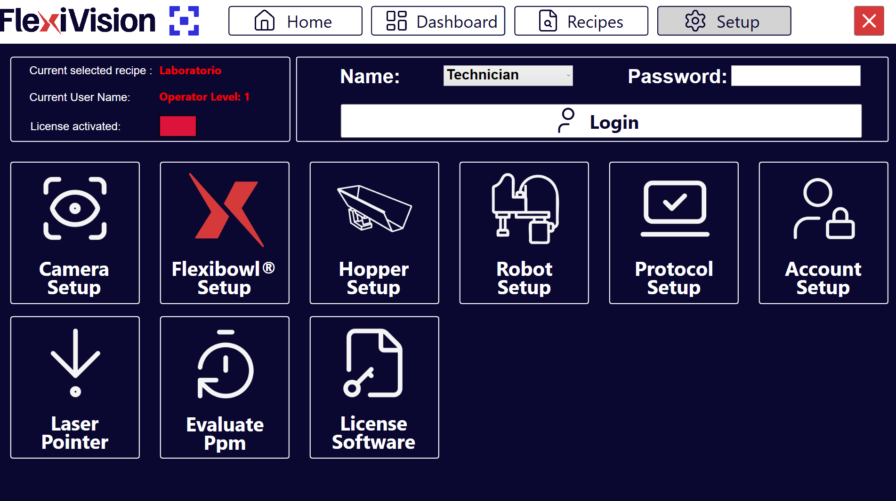
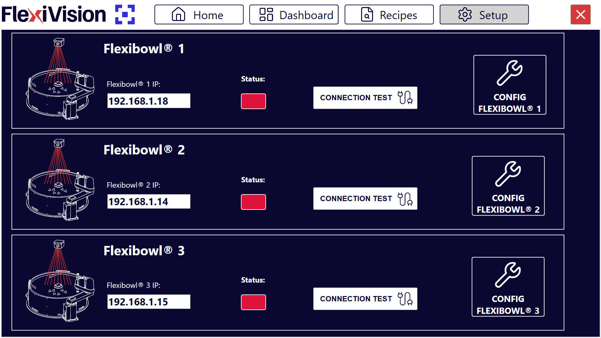
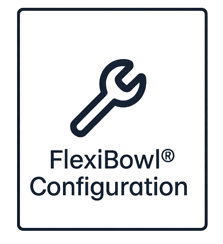

(fbsetup)=
# **Passo 4: FlexiBowl Setup**

Questa sezione descrive la procedura per connettere e configurare il FlexiBowl con il sistema FlexiVision One. 

```{note}
**Prerequisiti**

Assicurarsi che:
- L'installazione meccanica di tutti i componenti sia completata ([Installazione Meccanica](Installazione_Meccanica))
- Tutti i cavi siano collegati correttamente ([Cablaggio e Connessioni](cablaggio)) 
```

---

## Accesso alla configurazione FlexiBowl
```{list-table}
* - **1** 
  - Dalla pagina principale del software, cliccare su 
* - **2**
  - Nella pagina SETUP, identificare e cliccare sull'icona **FlexiBowl Setup**
    ```{dropdown} Pagina Setup 
       
    ```
* - **3**
  - Si apre la schermata di configurazione dei FlexiBowl
```

---

## Procedura di connessione

### **Step 1: Configurazione indirizzo di rete**

```{list-table}
* - **4**
  - Verificare che l'indirizzo sia sulla stessa subnet del VisionController
  
* - **5**
  - Nel campo **FlexiBowl IP**, inserire l'indirizzo IP del FlexiBowl
      - Formato: `192.168.1.XXX` (o secondo la configurazione della vostra rete)
```
:::{tip}
Per comodità e coerenza, partire dal primo FlexiBowl disponibile 
:::
:::{note}
Il FlexiBowl viene spedito con indirizzo IP di default `192.168.1.10`
:::

### **Step 2: Test di connessione**

```{list-table}
:widths: 5 95

* - **6**
  - Dopo aver inserito l'IP, cliccare sul pulsante **Connection Test**

* - **7**
  - Il sistema esegue un test di comunicazione (ping) verso il FlexiBowl

* - **8**
  - Osservare l'indicatore di **Status**:
    - 🟢 **Verde**: Connessione stabilita correttamente
    - 🔴 **Rosso**: Connessione fallita (verificare indirizzo IP e cablaggio)
```

```{warning}
**Connessione fallita**

Se l'indicatore rimane rosso o appare un messaggio di errore:

0. Verificare di aver acceso il FlexiBowl
1. Verificare che l'indirizzo IP inserito sia corretto
2. Controllare fisicamente il cavo Ethernet (deve essere inserito completamente)
3. Se presente,verificare che lo switch/router di rete sia acceso
4. Assicurarsi che FlexiBowl e VisionController siano sulla stessa subnet
5. Provare a pingare il FlexiBowl da terminale Windows:
   - Aprire Prompt dei comandi
   - Digitare: `ping 192.168.1.XXX` (sostituire con IP effettivo)
   - Se il ping fallisce, si tratta di un problema di rete

Se il problema persiste, consultare [Troubleshooting](troubleshooting).
```

---

## Configurazione parametri FlexiBowl

Una volta stabilita la connessione, procedere con la configurazione dei parametri operativi.

### **Step 3: Accesso configurazione**

```{list-table}
* - **9** 
  - Cliccare sul pulsante 
* - **10**
  - Si apre una finestra con i parametri configurabili del FlexiBowl
```


### **Step 5: Sincronizzazione parametri**

```{list-table}

* - **12**
  - Cliccare su **Synchronize Parameters**
* - **13**
  - Tornare alla pagina SETUP principale per procedere con il setup successivo 
```

```{warning}
**Non saltare la sincronizzazione**

È fondamentale cliccare su **Synchronize Parameters** dopo ogni modifica. Senza questo passaggio:
- Le modifiche non vengono applicate al FlexiBowl 
- Il sistema potrebbe comportarsi in modo incoerente
- Le impostazioni non vengono salvate 
```
---
(configfb)=
# **Configurazione guidata: FlexiBowl® Wizard**


L'interfaccia **FlexiBowl® Wizard** è uno strumento interattivo progettato per guidare l'utente nella configurazione dei parametri di alimentazione in base alla specifica famiglia di prodotti da gestire.

## **Step 1: Accesso al Wizard**

Per avviare la procedura:
```{list-table}
:widths: 5 95

* - **1**
  - Recarsi nella sezione  del software FlexiVision One

* - **2**
  - Cliccare sul pulsante **FlexiBowl Setup**, si aprirà una pagina con tutti i FlexiBowl gestibili con FlexiVision One

    :::{dropdown} Pagina FlexiBowl Setup  
    
    :::

* - **3**
  - Cliccare sul pulsante , si aprirà una pagina con tutte le movimentazioni disponibili per il FlexiBowl selezionato

    :::{dropdown} Pagina Configurazione FlexiBowl  
    
    :::

* - **4**
  - Cliccare sul pulsante **FlexiBowl X Wizard**, si aprirà una pagina di benvenuto al Wizard

* - **5**
  - Cliccare su 
    
    :::{note}
    Cliccare  in ogni pagina del wizard per andare avanti nella configurazione guidata
    :::
```

## **Step 2: Selezione Modello e Rotazione**

In questa fase si definiscono le caratteristiche hardware del sistema:
```{list-table}
* - **6**
  - Selezionare la taglia del dispositivo (es. 200, 350, 500, ecc.).
* - **7**
  - Definire il senso di rotazione del disco (**Clockwise** o **CounterClockwise**).
```
## **Step 3: Caratterizzazione del Componente**

Il sistema richiede informazioni sulla morfologia dei pezzi per ottimizzare la separazione.
```{list-table}
* - **8**
  - Selezionare la geometria che meglio descrive il componente:
      * **FLAT**: Componenti piatti.
      * **CYLINDRICAL**: Componenti cilindrici.
      * **COMPLEX**: Geometrie articolate o irregolari.
* - **9**
  - Definire come i componenti interagiscono tra loro sulla superficie:
      * **Overlapping**: I pezzi tendono a sovrapporsi.
      * **Not Overlapping**: I pezzi non si sovrappongono.
      * **Tangling / Stacking**: I pezzi tendono ad agganciarsi o impilarsi.
      * **Not Tangling / Not Stacking** : I pezzi rimangono separati e non si incastrano
```
## **Step 4: Test degli Accessori**
```{list-table}
* - **10**
  - Selezionare dal menu a tendina se il FlexiBowl® è equipaggiato con il modulo **Air-blow**.
* - **11**
  - Cliccare su **TEST Air-blow** per verificare il funzionamento.
* - **12**
  - Selezionare **USE** per abilitarlo nell'applicazione corrente, altrimenti cliccare su **DON'T USE**.
* - **13**
  - Cliccare su **TEST FLIP** per verificare l'effettiva attivazione del percussore.
      Il "Flip" è l'unità che genera l'impulso meccanico per ribaltare i pezzi, è fondamentale per separare, districare o capovolgere i componenti durante il ciclo di alimentazione.
 
      :::{important}
      Se l'impulso non è avvertibile, verificare che l'aria compressa sia collegata e agire sul regolatore di pressione meccanico posto sul pannello di controllo.
      :::
* - **14**
  - Al termine del Wizard, cliccando su **FINISH**, il sistema calcolerà automaticamente i parametri: 
    - Parametri di movimento (velocità, accelerazione, angolo)
    - Parametri di scuotimento (shake)
    - Temporizzazioni accessori (flip, blow)
* - **15**
  - Sarà quindi possibile affinarli nella dashboard riassuntiva.
```
```{list-table} Panoramica Parametri
   :widths: 20 30 50
   :header-rows: 1

   * - Gruppo
     - Parametro
     - Descrizione
   * - **Move**
     - Accel, Decel, Speed, Angle
     - Parametri del movimento principale del disco.
   * - **Option**
     - Flip Count, Flip Delay, Blow Time
     - Gestione dei tempi di attivazione degli accessori.
   * - **Shake**
     - Accel, Speed, Angle CW/CCW
     - Parametri della vibrazione di scuotimento (separazione).
```

## **Step 5: Validazione della Sequenza**

Utilizzare la funzione **Test Sequence** per verificare che il ciclo rispetti i seguenti criteri di efficienza:
```{list-table}
:widths: 5 95
:header-rows: 0

* - **Sincronizzazione**
  - L'impulso di Flip deve terminare esattamente nello stesso istante in cui termina il movimento (*Move*). Regolare i valori di *Flip Count* e *Delay* per allinearli.

* - **Stabilità Immagine**
  - I componenti devono essere immobili al momento dello scatto della camera.
    - Se i pezzi si muovono, diminuire velocità/accelerazione o inserire una pausa (es. `pause 200ms`).
```

:::{warning}
Cliccare sempre su **Synchronize Parameters** dopo ogni modifica manuale per rendere attive le variazioni nel controller.
:::

## Panoramica Parametri Flexibowl
```{list-table}
:header-rows: 1
:widths: 5 25 70

* - ID
  - Elemento
  - Descrizione
* - 1
  - MOVE – Accelerazione
  - Valore di accelerazione utilizzato ad ogni comando MOVE
* - 2
  - MOVE – Decelerazione
  - Valore di decelerazione utilizzato ad ogni comando MOVE
* - 3
  - MOVE – Velocità
  - Valore di velocità (rpm) utilizzato ad ogni comando MOVE
* - 4
  - MOVE – Angolo
  - Angolo con cui FlexiBowl® si muove ad ogni comando MOVE
* - 5
  - SHAKE – Accelerazione
  - Valore di accelerazione utilizzato ad ogni comando SHAKE
* - 6
  - SHAKE – Decelerazione
  - Valore di decelerazione utilizzato ad ogni comando SHAKE
* - 7
  - MOVE – Velocità
  - Valore di velocità (rpm) utilizzato ad ogni comando SHAKE
* - 8
  - MOVE – Angolo CW
  - Angolo orario con cui FlexiBowl® si muove ad ogni comando SHAKE
* - 9
  - MOVE – Angolo CCW
  - Angolo antiorario con cui FlexiBowl® si muove ad ogni comando SHAKE
* - 10
  - OPTION – Conteggio Flip
  - Numero di attivazioni Flip che verranno eseguite
* - 11
  - OPTION – Ritardo Flip
  - Tempo (in millisecondi) tra un'attivazione e una disattivazione del flip
* - 12
  - OPTION – Tempo Blow
  - Tempo (in millisecondi) di attivazione del blow
* - 13
  - OPTION – Luce accesa
  - Premere per abilitare/disabilitare la retroilluminazione
```
## Prossimi Passi

Una volta completata la configurazione del FlexiBowl, procedere con:

**→ [Configurazione Hopper](../23_Config_Hopper.md)** - Se presente tramoggia esterna

**→ [Verifica Risultati](../24_Verifica_Risultati.md)** - Monitoraggio applicazione completa
```{tip}
**Test produzione**

Prima di utilizzare in produzione:
1. Eseguire 50-100 cicli di test per verificare consistenza
2. Monitorare tasso di riempimento disco (deve essere costante)
3. Verificare che non ci siano accumuli anomali o zone vuote persistenti
4. Incrementare gradualmente verso velocità produttiva

La configurazione ottimale può richiedere 2-3 sessioni di fine-tuning con il pezzo reale in quantità significativa.
```

## Passi successivi

Una volta completato il FlexiBowl Setup, procedere con:

- [Passo 5: Hopper Setup](13b_Hopper_Setup.md)
- [Passo 6: Robot Setup](13c_Robot_Setup.md)


