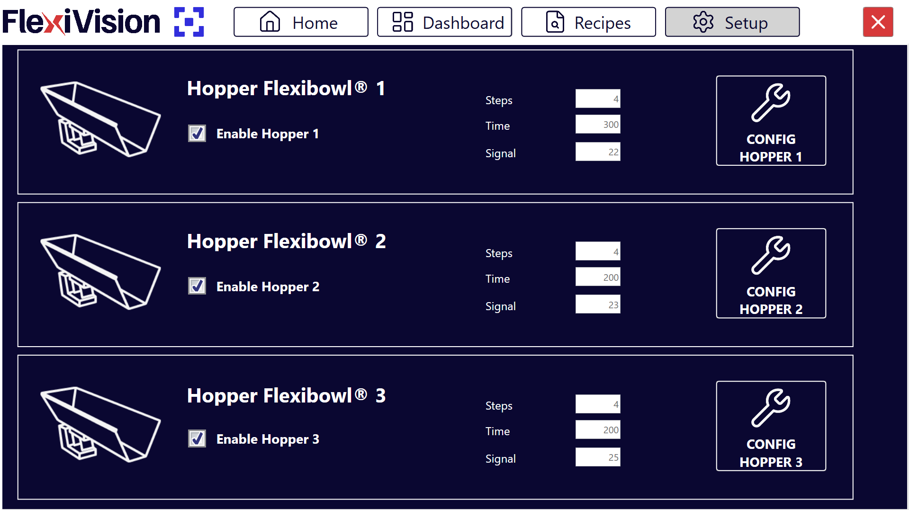
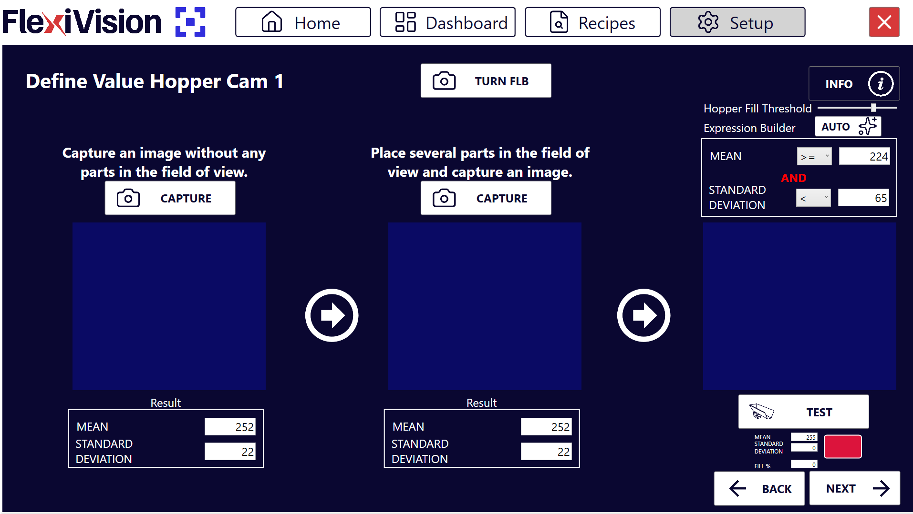

(hoppersetup)=
# **Passo 5: Hopper Setup**

Questa sezione descrive la procedura per configurare la tramoggia (Hopper). L'Hopper è il componente che alimenta automaticamente pezzi sul FlexiBowl quando il livello scende sotto una soglia minima.

```{note}
**Prerequisiti**

Prima di procedere, assicurarsi che:
- L'Hopper sia stata installata meccanicamente 
- I collegamenti elettrici siano stati completati (segnali di controllo e alimentazione)
- Il FlexiBowl sia già connesso
```
---

## Accesso alla configurazione Hopper

```{list-table}
* - **1** 
  - Dalla pagina principale del software, cliccare su 
* - **2**
  - Nella pagina SETUP, identificare e cliccare sull'icona **Hopper Setup**
    ```{dropdown} Pagina Setup 
       
    ```
* - **3** 
  - Si apre la pagina di configurazione dell'Hopper
```

---

## Panoramica interfaccia Hopper Setup

La pagina Hopper Setup presenta diverse sezioni per la configurazione dei parametri operativi delle varie tramogge:



```{list-table}
:header-rows: 1
:widths: 30 70

* - Sezione
  - Descrizione
* - **Enable Hopper**
  - Interruttore per abilitare/disabilitare l'utilizzo dell'Hopper nel sistema
* - **Steps**
  - Numero di sequenze necessarie con cui la sezione del disco che attualmente si trova nell'area di visione, arriva sotto l'area di scarico della tramoggia
* - **Time**
  - Durata dell'attivazione della tramoggia in millisecondi
* - **Signal**
  - Numero del segnale digitale utilizzato per controllare l'Hopper
* - **Config Hopper**
  - Pulsante per configurare la tramoggia (da utilizzare in seguito)
```
---

## Procedura di configurazione

```{list-table}
:widths: 10 30 70 
* - Step 1
  - Abilitazione Hopper 
  - Spuntare la checkbox **Enable Hopper**
* - Step 2
  - Configurazione Signal 
  - Nel campo **Signal**, inserire il numero del segnale digitale (DO - Digital Output) utilizzato per controllare l'Hopper
* - Step 3
  - Salvataggio e Completamento 
  - Tornare alla pagina  principale per procedere con il setup successivo
```

```{important}

Abilitare l'Hopper solo se il dispositivo è correttamente installato

```

```{warning}

È fondamentale inserire il numero di segnale corretto:
- Un numero errato attiverà il segnale sbagliato (potenzialmente pericoloso)
- Consultare lo schema elettrico realizzato durante l'installazione
- In caso di dubbio, contattare chi ha effettuato il cablaggio
```

```{tip}

I parametri impostati in questa fase sono sufficienti per la configurazione iniziale del sistema.
Durante la procedura andremo poi a definire gli altri aspetti della configurazione della tramoggia.
```

---
(confighopper)=
# **Configurazione della Tramoggia (Hopper)**

La configurazione della tramoggia permette di gestire il rifornimento automatico dei componenti sul disco del FlexiBowl®. Il sistema utilizza la visione per determinare quando il livello di riempimento è insufficiente e attivare la tramoggia.

## **Step 1: Accesso alla Configurazione**
```{list-table}
* - **1**
  - Cliccare sulla sezione 
* - **2**
  - Dalla sezione **Hopper Setup**, è possibile visualizzare e gestire le unità di carico collegate.
    
    :::{dropdown} Pagina Hopper Setup 
    
    :::
* - **3**
  - Selezionare la casella **Enable Hopper X** per attivare la tramoggia corrispondente.
* - **4**
  - Cliccare sul pulsante **Config Hopper X** per accedere alla configurazione specifica 
```
## **Step 2: Definizione dell'Area di Controllo**

:::{video} ../../../../../_shared/media/videos/TastoInfo_AreaHopper_1280x720.mp4
    :width: 100%
    :align: center
:::

In questa fase si definisce la porzione di disco che la telecamera deve monitorare per lo scarico.
```{list-table}
* - **5**
  - Modificare il riquadro blu a schermo per inquadrare l'area in cui verranno rilevati i componenti.
   **Strumenti di supporto**:
      * **Info**: Cliccare per visualizzare dettagli sulle funzionalità della pagina.
```

## **Step 3: Definizione dei Valori di Soglia**

:::{video} ../../../../../_shared/media/videos/TastoInfo_Hopper_1280x720.mp4
:width: 100%
:align: center
:::
```{list-table}
* - **6**
  - Cliccare  per accedere alla pagina **Define Value Hopper Cam**, dove si istruisce il sistema a distinguere tra disco vuoto e disco pieno.
    :::{dropdown} Pagina Define Value Hopper Cam 
    
    :::
* - **7**
  - Rimuovere tutti i componenti dall'area di visione e cliccare sul primo pulsante **CAPTURE**.
* - **8**
  - Posizionare il numero minimo di componenti che si desidera mantenere in area di visione. Se il numero scende sotto questa soglia, la tramoggia si attiverà.
* - **9**
  - Cliccare sul secondo pulsante **CAPTURE**.
* - **10**
  - Cliccando su  nell'Expression Builder, il sistema calcola automaticamente i valori di **Mean** (Media) e **Standard Deviation**.
* - **11**
  - Rimuovere alcuni pezzi e cliccare su . 
* - **12**
  - Osservare l'indicatore risultato:
    - **Verde** 🟢: Livello insufficiente, Hopper si attiva (scarico necessario)
    - **Rosso** 🔴: Livello sufficiente, Hopper NON si ATTIVA (OK)

      :::{warning}
      **Calibrazione insufficiente**

      Se il sistema non rileva correttamente il livello:

      **Problema: Sempre verde (attiva sempre Hopper)**  
      → Soglia troppo bassa o interferenze nell'area  
      → Soluzione: Aumentare numero pezzi nella seconda acquisizione, verificare pulizia area  

      **Problema: Sempre rosso (non attiva mai Hopper)**  
      → Soglia troppo alta o area monitoraggio non rappresentativa  
      → Soluzione: Ridurre numero pezzi nella seconda acquisizione CAPTURE, ripetere AUTO  

      **Problema: Comportamento errato (alterna verde/rosso casualmente)**  
      → Illuminazione instabile o area troppo piccola  
      → Soluzione: Verificare backlight stabile, ingrandire area monitoraggio, ripetere calibrazione  
      :::
```
```{note}  
**Fill Hopper Threshold** = ... 
```
## **Step 4: Parametri Operativi**

Tornare alla schermata principale di Hopper Setup per definire il comportamento meccanico.

```{list-table} Parametri di Funzionamento
:widths: 20 80
:header-rows: 1

* - **Parametro**
  - **Descrizione e Procedura**
* - **Steps**
  - Numero di avanzamenti del FlexiBowl (sequenze) necessari per portare i pezzi dall'area di visione all'area di scarico della tramoggia.

    :::{note}
    **Come calcolarlo:**

    :::::{list-table}

    * - 1.
      - Svuotare completamente il disco FlexiBowl
    * - 2.
      - Lasciare un componente al centro dell'area di visione
    * - 3.
      - Eseguire sequenze FlexiBowl fino a che il componente non arriva all'area di scarico della tramoggia e contare quanti avanzamenti sono stati necessari 
    * - 4.
      - Il risultato del conteggio è il valore da inserire in **Steps**
    :::::
    :::

* - **Time**
  - Millisecondi di attivazione della tramoggia.   Valore consigliato: **100 – 1000 ms** (Media: **500 ms**). Regolare di ±50 ms in base al flusso desiderato.
```
```{tip}
   Il tempo di attivazione dipende non solo dal valore impostato, ma anche dal volume di componenti attualmente presenti nella vasca della tramoggia. È essenziale mantenere un carico costante per un flusso uniforme.
```
```{tip}
Il valore Time è strettamente connesso al volume di carico della tramoggia: 
- Con tramoggia piena si avrà un maggior numero di pezzi nell'area di scarico 
- Con tramoggia semipiena si avrà un minor numero di pezzi nell'area di scarico 

Un tempo di attivazione efficace dipende da:
  :::{list-table}
  :header-rows: 1

  * - **Peso del pezzo** (*)
    - **Comportamento del pezzo**
    - **Volume di carico della Tramoggia**
    - **Time consigliato**

  * - **Pezzi pesanti**
    - 
      - Si incastrano 
      - Non si incastrano
    - 
      - Meno del 30% (<30%)
      - Compreso tra 50% e 80% (>50% e <80%)
    - 
      - Time maggiore di 600 ms
      - Time maggiore di 600 ms

  * - **Pezzi leggeri**
    - 
      - Si incastrano 
      - Non si incastrano
    - 
      - Meno del 30% (<30%)
      - Compreso tra 50% e 80% (>50% e <80%)
    - 
      - Time compreso tra 100-500 ms
      - Time compreso tra 100-500 ms
  :::

 **Best practice generale**: Mantenere la tramoggia costantemente piena per >50% e <80% per ottenere un flusso uniforme

 (*) Per **peso del pezzo** si intende relativo alla dimensione della tramoggia utilizzata.
```
:::{important}
In generale, è importante non superare mai il carico massimo della tramoggia utilizzata. 
:::

## Salvataggio Configurazione
```{warning}
**Salvataggio ricetta obbligatorio**

Al termine della configurazione Hopper:

  :::{list-table}
    * - 1. 
      - Verificare che tutti i parametri siano configurati correttamente:
        - Area monitoraggio posizionata
        - Soglie calibrate (TEST funzionante)
        - Steps e Time impostati
    * - 2. 
      - Tornare alla pagina principale 
    * - 3. 
      - Cliccare su 
    * - 4. 
      - Confermare il salvataggio
  :::
**IMPORTANTE**: Ogni variazione apportata viene memorizzata **SOLO** se la ricetta viene salvata correttamente prima di uscire o cambiare pagina.

Senza salvataggio, tutte le configurazioni Hopper verranno perse alla chiusura di FlexiVision One!
```

---

## Troubleshooting Hopper

### Problemi comuni e soluzioni
```{warning}
**Hopper non si attiva mai**

**Sintomi**: Disco si svuota ma Hopper non scarica

**Cause possibili:**
- Soglia configurata troppo bassa (sistema pensa sia sempre pieno)
- Area monitoraggio mal posizionata (non rappresentativa)
- Enable Hopper disabilitato

**Soluzioni:**
1. Verificare Enable Hopper attivo
2. Ripetere calibrazione soglie con più pezzi nella seconda acquisizione
3. Spostare area monitoraggio in zona più rappresentativa
4. Eseguire TEST manualmente per verificare trigger
```
```{warning}
**Hopper si attiva troppo frequentemente**

**Sintomi**: Hopper scarica continuamente, disco si riempie eccessivamente

**Cause possibili:**
- Soglia configurata troppo alta
- Time di scarico troppo lungo
- Area monitoraggio in zona sempre vuota

**Soluzioni:**
1. Ridurre soglia (meno pezzi nella seconda acquisizione CAPTURE)
2. Ridurre Time (durata vibrazione) di 100-200 ms
3. Verificare posizionamento area monitoraggio
```
```{warning}
**Pezzi scaricati non arrivano in tempo**

**Sintomi**: Robot trova disco vuoto subito dopo attivazione Hopper

**Cause possibili:**
- Steps troppo pochi (pezzi non hanno tempo di arrivare)
- Sequenze FlexiBowl non efficaci
- Ostruzione percorso scarico

**Soluzioni:**
1. Aumentare Steps di 1-2 unità
2. Verificare parametri Config FlexiBowl (velocità, angolo)
3. Ispezionare fisicamente percorso scarico Hopper → Disco
```

---
## Passi successivi

Una volta completato l'Hopper Setup (o saltato se non presente), procedere con:

**[Passo 6: Robot Setup](13c_Robot_Setup.md)** - Configurazione comunicazione con il robot


