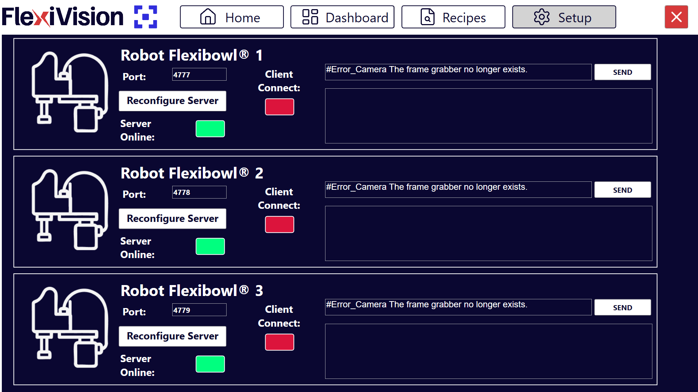

(robotsetup)=
# **Passo 6 : Robot Setup** 

Questa sezione descrive la procedura per configurare la comunicazione TCP/IP tra il sistema FlexiVision One e il robot industriale. Una comunicazione corretta è essenziale per permettere lo scambio di coordinate e comandi tra i due sistemi.

```{note}
**Prerequisiti**

Prima di procedere, assicurarsi che:
- Il robot sia acceso e operativo
- Il cavo Ethernet tra VisionController e robot sia collegato
- Il robot sia configurato per accettare connessioni TCP/IP (consultare manuale robot)
- Si conosca la porta di comunicazione configurata nel codice del robot
```

---

## Accesso alla configurazione Robot

```{list-table}

* - **1** 
  - Dalla pagina principale del software, cliccare su 
* - **2**
  - Nella pagina SETUP, identificare e cliccare sull'icona **Robot Setup**
    ```{dropdown} Pagina Setup 
       
    ```
* - **3**
  - Si apre la pagina di configurazione della comunicazione robot
```

---

## Panoramica interfaccia Robot Setup

La pagina Robot Setup presenta diverse sezioni per configurare e testare la comunicazione:


```{list-table}
:header-rows: 1
:widths: 30 70

* - Sezione
  - Descrizione
* - **Port**
  - Porta TCP/IP con cui il robot comunica (configurata sul controller robot)
* - **Reconfigure Server**
  - Pulsante per riconfigurare il server di comunicazione con nuovi parametri
* - **Server Online**
  - Indicatore di stato del server FlexiVision One (verde = server attivo e accessibile)
* - **Client Connect**
  -  Indicatore di stato del client robot (verde = robot connesso)
* - **Messaggi robot-flexivision**
  - Finestre di log che mostrano i messaggi scambiati tra robot e FlexiVision One (utilizzata per debugging):
      - la prima finestra (la più piccola )indica i messaggi che FlexiVision One o l'operatore inviano
      - la seconda finestra indica i messaggi che Flexiision riceve
```

---
## Procedura di configurazione

### Step 1: Inserimento porta di comunicazione

La porta TCP/IP è il parametro critico che deve corrispondere tra robot e FlexiVision One:

```{list-table}
* - **4** 
  - Nel campo **Port**, inserire il numero della porta TCP/IP con cui il robot comunicherà
```
```{note}
Valore predefinito:      (porta standard FlexiVision One)  
Il numero di porta deve essere:
   - Lo stesso configurato nel programma robot
   - Compreso tra 1024 e 65535 (porte utente)
   - Non in conflitto con altri servizi sulla rete
```

```{warning}

È **fondamentale** che il numero di porta sia identico su entrambi i lati:
- **FlexiVision One**: Porta configurata in questa pagina
- **Robot**: Porta configurata nel programma robot 

Se i numeri non corrispondono, la connessione fallirà sempre.

Esempio:
- ❌ ERRATO: FlexiVision One porta 2000, Robot porta 2001 → Nessuna comunicazione
- ✅ CORRETTO: FlexiVision One porta 2000, Robot porta 2000 → Comunicazione funzionante
```

### Step 2: Riconfigurazione server

Dopo aver impostato la porta corretta, è necessario riavviare il server di comunicazione:

```{list-table}
* - **5** 
  - Cliccare sul pulsante **Reconfigure Server**
* - **6**
  - Attendere alcuni secondi per il completamento della riconfigurazione
```

```{note}

È necessario cliccare su **Reconfigure Server** ogni volta che:
- Si modifica il numero di porta
- Si desidera riavviare il server dopo un errore
- Si è modificata la configurazione di rete del VisionController
- Si vuole forzare la chiusura di connessioni esistenti

Il server si avvia automaticamente all'apertura del software FlexiVision One, ma richiede riconfigurazione manuale dopo modifiche.
```

### Step 3: Verifica stato server

Dopo la riconfigurazione, verificare che il server sia attivo:

```{list-table}

* - **7**
  - Osservare l'indicatore **Server Online**:
   - **Verde**: Server attivo   
     **Rosso**: Server non attivo  
* - **8**
  - dopo aver avviato il programma dal robot, osservare l'indicatore **Client Online**:
   - **Verde**: robot connesso  
     **Rosso**: robot non connesso 

```
```{note}
Se gli indicatori sono verdi, il sistema è correttamentre connesso. 

Se uno degli indicatori è rosso, verificare:
   - Controllare che il programma sul robot sia stato avviato 
   - Controllare che gli indirizzi IP siano sulla stessa subnet
   - Che la porta non sia già in uso da un altro programma
   - I log di sistema per messaggi di errore
```
### Step 4: Salvataggio e completamento

```{list-table}
:header-rows: 0
:widths: 10 90

* - **9**
  - Verificare che la connessione robot → FlexiVision One sia stabile

* - **10**
  - I parametri di comunicazione sono automaticamente salvati

* - **11**
  - Tornare alla pagina **SETUP** principale
```

---

## Passi successivi

Una volta completato il Robot Setup, procedere con:

**[Passo 7: Camera Setup](13d_Camera_Setup.md)** - Configurazione e test acquisizione camera


