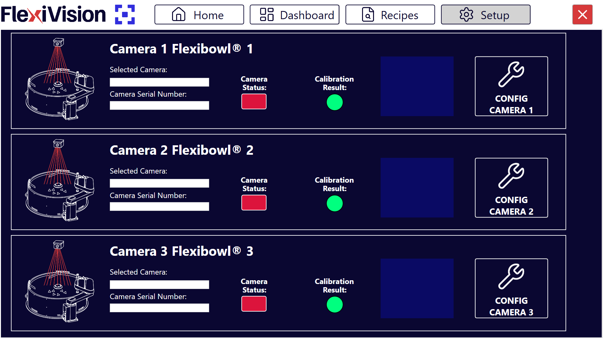

(camerasetup)=
# **Passo 3: Camera Setup**

Questa sezione descrive la procedura per configurare e testare la telecamera industriale del sistema FlexiVision One. La corretta configurazione della camera è fondamentale per garantire l'acquisizione di immagini di qualità.

```{note}
**Prerequisiti**

Prima di procedere, assicurarsi che:
- La camera sia stata installata meccanicamente alla distanza corretta
- Il cavo Ethernet della camera sia connesso al VisionController
- La camera sia alimentata (tramite PoE o alimentazione esterna)
- FlexiBowl sia configurato e il backlight funzionante (per test acquisizione)
```

---

## Accesso alla configurazione Camera

```{list-table}

* - **1** 
  - Dalla pagina principale del software, cliccare su 
* - **2**
  - Nella pagina SETUP, identificare e cliccare sull'icona **Camera Setup**
    ```{dropdown} Pagina Setup 
       
    ```
* - **3**
  - Si apre la pagina di configurazione delle camere
```

---

## Panoramica interfaccia Camera Setup

La pagina Camera Setup presenta tre riquadri informativi principali e un'area di configurazione:


```{list-table}
:header-rows: 1
:widths: 30 70

* - Sezione
  - Descrizione
* - **Selected Camera**
  - Mostra l'identificazione della camera attualmente selezionata
* - **Camera Serial Number**
  - Visualizza il numero seriale univoco della camera connessa
* - **Status**
  - Indica lo stato della connessione
* - **Calibration Result**
  - Mostra il risultato della calibrazione della camera
* - **Config Camera**
  - Pulsante per aprire la pagina di configurazione dettagliata
```

---

## Procedura di configurazione

inserire immagini delle schermate per ogni passaggio per renderli più chiari e visibili 

:::{note}
Per comodità e coerenza, si consiglia di far coincidere il numero della camera con il corrispondente FlexiBowl: 
 - ✅ Camera installata sopra FlexiBowl 1: CAM-CIC-5000-20G-12345 > Seleziono Camera 1 FlexiBowl 1 e in "Image Acquisition Device" seleziono CAM-CIC-5000-20G-12345
:::

```{list-table}
* - **Accesso configurazione**
  - 1. Cliccare sul pulsante **Config Camera X** (dove X è il numero della camera)
    2. Si apre la prima pagina della procedura guidata per la calibrazione, in cui è possibile modificare il parametro **Cam Exposure**

* - **Attivazione modalità avanzata**
  - 3. Cliccare sul pulsante **Expert** (in basso a destra)
    4. Questa modalità fornisce accesso a tutte le impostazioni avanzate della camera necessarie per la configurazione iniziale
* - **Configurazione image acquisition device**
  - 5. Nel pannello **Expert**, cliccare sulla sezione **Image Acquisition** da **Settings**
    6. Cliccare su **Image Acquisition Device**
    7. Si apre un menu di selezione dei dispositivi di acquisizione disponibili
* -  **Identificazione camera specifica**
  - 8. Dal menu dei dispositivi, selezionare la camera desiderata
        - Cercare nell'elenco il numero seriale o il modello della camera
        - Esempio: "CAM-CIC-5000-20G-XXXXX" (dove XXXXX è il seriale)
    9. Cliccare sulla camera per selezionarla 
```

```{tip}
**Identificazione del seriale corretto**

Se sono elencate multiple camere o dispositivi:
- Il numero seriale è riportato su un'etichetta sulla camera fisica
- Confrontare l'ultimo gruppo di caratteri del seriale per identificare la camera corretta
- In caso di dubbio, disconnettere fisicamente altre camere per identificare quella in uso
```


```{list-table} 
* - **Selezione video format**
  - 11. Cliccare su **Video Formats** 
    12. Dalla lista dei formati disponibili, selezionare **Generic GigEVision**
    13. Selezionare **Mono** (monocromatico) come tipo di sensore
```


```{warning}
**Formato corretto obbligatorio**

È fondamentale selezionare **Generic GigEVision Mono**:
- Altri formati potrebbero non funzionare o causare errori
- Formati a colori non sono compatibili con questa camera
- Se il formato non è disponibile, potrebbero mancare driver o configurazioni di sistema
```

```{list-table}
* - **Attivazione sistema di acquisizione**
  - 14. Dopo aver selezionato il formato corretto, cliccare su **Initialize Acquisition**  
    15.Attendere il completamento dell'inizializzazione (pochi secondi)
* - **Verifica funzionamento acquisizione**
  - 16. Localizzare il pulsante **Run** in alto a sinistra dell'interfaccia (icona "play")
    17. Cliccare su **Run** ripetutamente 05-10 volte) per acquisire immagini di test
    18. Osservare l'area di visualizzazione immagine:
        - Dovrebbe mostrare la vista della camera sul FlexiBowl
        - L'immagine dovrebbe aggiornarsi ad ogni click su Run
```

```{warning}
**Diagnosi schermo completamente blu**

Se durante i test l'immagine acquisita appare **completamente blu**  almeno una volta:

**Causa**: Problema di comunicazione GigE (latenza di rete o dimensione pacchetti non ottimale)

**Soluzione**:

1. Dal menu in alto, selezionare **GigE** (o **GigE Vision Settings**)

2. Modificare i seguenti parametri:
   - **Latency Level** (Livello di Latenza)
   - **Packet Size** (Dimensione Pacchetto)

Procedere con gli step successivi per la configurazione ottimale di questi parametri.
```

---

### Latency Level (Livello di Latenza)

```{note}
**Regolazione latency**

Il parametro **Latency Level** controlla il buffer di comunicazione tra camera e VisionController.

**Valori tipici**:
- Valore predefinito: 0
- Range disponibile: 0-3

**Come regolare**:

1. Aumentare gradualmente il valore 
2. Dopo ogni modifica, testare l'acquisizione (pulsante Run) 5-10 volte
3. Se non si verificano più schermate blu, il valore è corretto
4. Se le schermate blu persistono, aumentare ulteriormente o provare con modifiche al parametro Packet Size
```

### Packet Size (Dimensione Pacchetto)

```{note}
**Regolazione packet size**

Il parametro **Packet Size** definisce la dimensione dei pacchetti dati trasmessi sulla rete Ethernet.

**Valori tipici**:
- Valore predefinito: 8164 bytes

**Come regolare**:

1. Ridurre gradualmente 08000, 7000, ecc.)
2. Dopo ogni modifica, testare l'acquisizione (pulsante Run) 5-10 volte
3. Se non si verificano più schermate blu, il valore è corretto
4. Se le schermate blu persistono, diminuire ulteriormente o provare con modifiche al parametro Latency Level
```


---

```{list-table}
* - **Verifica finale e salvataggio**
  - 19. Cliccare su **Run** almeno 2-3 volte consecutivamente  
    20. Verificare che:  
      - Nessuna immagine appaia completamente blu o nera
      - Le immagini si aggiornino regolarmente
      - La superficie del FlexiBowl sia chiaramente visibile
      - L'illuminazione sia uniforme
    21. Se tutti i test sono positivi, la configurazione è corretta
```
---


(calibrazione_camera_setup)=
# **Calibrazione della Camera**

La calibrazione è il passaggio cruciale che stabilisce la relazione geometrica esatta tra il mondo reale (coordinate in millimetri) e l'immagine acquisita dalla telecamera (pixel). Senza una calibrazione accurata, la precisione del sistema di picking risulta compromessa, rendendo inaffidabile l'intera applicazione.

```{warning}
La calibrazione deve essere ripetuta ogni volta che viene alterata la posizione della camera e/o del robot.
```
:::{tip}
Non è necessario eseguire nuovamente la calibrazione nel caso in cui viene alterata la posizione del FlexiBowl.
:::
---

## **Perché la calibrazione è necessaria?**

La calibrazione è necessaria perché ogni combinazione di sensore e lente introduce alterazioni specifiche nell'immagine. Il suo obiettivo principale è correggere queste distorsioni.

### Tipi di distorsioni ottiche

```{figure} ../../../../../_shared/media/images/distorsioni_new.png
:alt: Tipi di distorsioni ottiche
:width: 80%
:align: center

Esempi di distorsioni ottiche: nessuna distorsione (sinistra), distorsione a barile (centro), distorsione a cuscinetto (destra)
```

---


## **Step 1: La griglia di calibrazione**

:::{error}
Assicurarsi di avere: 
- Backlight acceso (SETUP > FlexiBowl Setup > Config FlexiBowl > Light ON attivo)
- Toplight spento
:::

:::{video} ../../../../../_shared/media/videos/Step1_calib.mp4
    :width: 100%
    :align: center
:::

La griglia di calibrazione dedicata ARS deve essere posizionata sul FlexiBowl:

```{list-table}
* - **0** 
  - Se presenti, rimuovere i deviatori montati sul FlexiBowl.
* - **1** 
  - **Allentare le quattro viti** della flangia centrale del FlexiBowl
* - **2** 
  - **Ruotare leggermente la flangia** centrale in senso antiorario e **Rimuoverla**
* - **3**
  - **Sollevare** con cura e **Rimuovere la superficie**  
* - **4**
  - **Posizionare la griglia ARS** sul FlexiBowl allineando i perni di posizionamento con i fori predefiniti 
```

```{figure} ../../../../../_shared/media/images/griglia_su_flexibowl.png
:alt: Posizionamento griglia calibrazione
:width: 60%
:align: center

Corretto posizionamento della griglia di calibrazione ARS sul FlexiBowl
```
:::{attention} 
 La griglia di calibrazione deve essere posizionata **alla stessa altezza dell'oggetto** utilizzato nell'applicazione.
 
   Per questo motivo, viene fornita con dei **distanziali** da inserire nei pioli della griglia prima di installarla sul FlexiBowl.
   I distanziali hanno la funzione di **sollevare la griglia** fino al livello dell'altezza del pezzo, garantendo una calibrazione accurata.
  
  
  ```{figure} ../../../../../_shared/media/images/altezzacalibrazione.png
    :width: 100%
    :align: center
  ```
:::

## **Step 2: Regolazioni fondamentali**

:::{video} ../../../../../_shared/media/videos/Step2_calib.mp4
    :width: 100%
    :align: center
:::

```{list-table}

* - **5**
  - Accedere alla sezione Camera SETUP dalla sezione SETUP 
* - **6**
  - Cliccare il pulsante Config Camera della camera corrispondente 
* - **7**
  - Cliccare EXPERT dalla pagina Camera FLB 
* - **8**
  - **Mettere la camera in modalità "live display"**
      Prima di regolare l'apertura, attivare la modalità di visualizzazione continua:
      - immagine
* - **9**
  - **Impostare l'apertura del diaframma**
    - Svitare leggermente la vite dell'anello superiore della camera 
    - Ruotare l'anello osservando l'immagine live, fino a che la giusta quantità di luce non entra nella camera 
    - Stringere la vite dell'anello superiore della camera 

    :::{figure} ../../../../../_shared/media/images/Esp_Corretta.png
    :width: 100%
    :align: center
    :::
* - **10**
  - **Regolare manualmente il fuoco della camera**
    - Svitare leggermente la vite dell'anello inferiore della camera
    - Ruotare l'anello lentamente osservando l'immagine live
    - Quando il pattern appare nitido, il fuoco è corretto
    - Stringere la vite dell'anello inferiore della camera 
    - Chiudere la schermata
    :::{figure} ../../../../../_shared/media/images/Fuoco_Corretto.png
    :width: 100%
    :align: center
    :::
* - **11**
  - Cliccare Back 
```

```{warning}
**Attenzione alla profondità di campo**

La messa a fuoco deve garantire nitidezza su **tutta la superficie** del FlexiBowl, non solo al centro.

Se il centro è nitido ma i bordi sono sfocati:
- Verificare che l'ottica sia pulita
- Verificare che la distanza di lavoro sia corretta
- Verificare che la camera sia perfettamente parallela al piatto
- Chiudere leggermente il diaframma per aumentare la profondità di campo

Se il problema persiste, potrebbe essere necessario rivedere il montaggio meccanico della camera.
```
:::{video} ../../../../../_shared/media/videos/Step2b_calib.mp4
    :width: 100%
    :align: center
:::

:::{error}
Se cliccando più volte il tasto RUN appare anche solo una volta una schermata completamente blu, fare riferimento alla sezione di troubleshooting della calibrazione camera
:::

```{list-table}
* - **12** 
  - **Regolare l'esposizione della camera**
    - Dalla pagina **Camera FLB x**, individuare il parametro **Cam Exposure** (Esposizione della Camera):
    - Regolare il parametro "Cam Exposure" e cliccare su "TEST", ripetere questo passaggio fino a che non viene trovata la giusta esposizione per l'immagine: 
   		- Pattern della griglia chiaramente visibile (nero su bianco o viceversa)
   		- Contrasto elevato tra quadrati bianchi e neri
   		- Nessuna sovraesposizione (aree completamente bianche "bruciate")
   		- Nessuna sottoesposizione (immagine troppo scura)
* - **13** 
  - Cliccare NEXT
```

```{figure} ../../../../../_shared/media/images/Esposizioni.png
:alt: Esempio esposizione corretta
:width: 60%
:align: center

Esempio di esposizione corretta: contrasto elevato, pattern ben definito, nessuna area bruciata
```

```{tip}
**Ottimizzazione esposizione**

**Più alto sarà il tempo, più luce entrerà nell'ottica**

- **Tempo troppo breve**: Immagine scura, pattern poco visibile
- **Tempo troppo lungo**: Immagine sovraesposta, perdita di dettagli
- **Tempo ottimale**: Massimo contrasto senza saturazione
```


## **Step 3: Calibrazione Camera**

:::{video} ../../../../../_shared/media/videos/Step3_calib.mp4
    :width: 100%
    :align: center
:::

```{list-table}
:widths: 5 95

* - **14**
  - Verificare che la griglia sia centrata, nitida e completamente visibile prima di acquisire l'immagine di calibrazione.
* - **15**
  - Cliccare su "Grab Image Calib" per scattare una foto della griglia di calibrazione.
    
    Verificare visivamente che:
    - L'intera griglia sia visibile
    - Il pattern sia nitido
    - Non ci siano ombre o riflessi

* - **16**
  - Impostare i valori "Tile Size X" e "Tile Size Y" entrambi a 10

* - **17**
  - Cliccare su "Calibrate" per effettuare la calibrazione

* - **18**
  - **Valutare la qualità della calibrazione**
    
    Il parametro "Result Calibration" restituirà un valore:
    
    🟢 **Excellent (Verde)**: Calibrazione eccellente, precisione ottimale. 
    
    🟠 **Acceptable (Arancione)**: Calibrazione accettabile, precisione buona ma non ottimale.
    
    🔴 **Bad (Rosso)**: Calibrazione scadente, precisione insufficiente. Da ripetere obbligatoriamente.
    
    :::{important}
    Accettare solo calibrazioni Eccellenti 🟢, altri risultati comprometteranno il funzionamento dell'intera applicazione.
    :::

```

```{note}
**Criterio di accettabilità**

Un risultato soddisfacente comprende il settaggio dell'apertura, la messa a fuoco, e il settaggio dell'esposizione migliore per l'applicazione.

```

```{warning}
**Errori durante il calcolo**

Se il calcolo della calibrazione fallisce:

**Possibili cause**:
- Pattern non rilevato (immagine troppo scura o sovraesposta)
- Quadrati della griglia parzialmente oscurati
- Distorsione eccessiva (camera troppo vicina o lontana)
- Tile Size inserito errato

**Soluzione**:
- Verificare e migliorare la qualità dell'immagine acquisita
- Assicurarsi che l'intera griglia sia visibile e ben illuminata
- Verificare il valore Tile Size
- Ripetere l'acquisizione immagine (Grab Image) e tentare nuovamente
```


**Nota: spiegare che per i dubbi si può aprire info**

In quali casi si apre Expert? Expert si apre per la configurazione della luminosità o per altri parametri.


---

### Quando è necessario ripetere la calibrazione
```{list-table}
:widths: 50 50
:header-rows: 0

* - **Ricalibrare quando:**
  - Primo setup del sistema (obbligatorio). Dopo aver modificato la posizione della camera. Dopo aver spostato il robot. Se si riscontrano errori sistematici di picking.

* - **Non è necessario ricalibrare quando:**
  - Se si cambia tipo di pezzo a parita di FlexiBowl e camera. Se si modificano fuoco o apertura dell'obiettivo. Se si modifica la ricetta software. Se si regolano parametri di riconoscimento. Se si aggiornano i programmi robot.
```

---
# **Calibrazione Robot**

## **Step 4: Montaggio Laser**

:::{video} ../../../../../_shared/media/videos/Step4_calib.mp4
    :width: 100%
    :align: center
:::

```{list-table}
* - **19** 
  - Una volta ottenuta una calibrazione di ottima qualità, Cliccare "NEXT". 
    Apparirà una finestra che richiede la calibrazione del robot prima di proseguire, **NON** cliccare su "Sì" e seguire i prossimi passaggi
* - **20** 
  - Montare il Laser Tool con il suo supporto personalizzato 
* - **21**
  - Posizionare lo Spacer Bracket (**A**) sotto il laser 
* - **22**
  - Abbassare il laser fino al livello dello spacer (**A**), cosi il laser avra un'altezza di esattamente 3 cm dalla griglia di calibrazione
    :::{image} ../../../../../_shared/media/images/spacerbracket.png
    :align: center 
    :width: 75%
    :::
* - **23**
  - Rimuovere lo Spacer Bracket 
* - **24**
  - Accendere il laser 
```

## **Step 5: Disegnare un piano a 3 punti**

:::{video} ../../../../../_shared/media/videos/Step5_calib.mp4
    :width: 100%
    :align: center
:::

```{list-table}
* - **25**
  - Portare il laser sul punto di origine 
* - **26**
  - Portare il laser nel punto finale dell'asse X
* - **27**
  - Portare il laser nel punto finale dell'asse Y 
```

## **Step 6: Verifica della traiettoria del robot**

:::{video} ../../../../../_shared/media/videos/Step6_calib.mp4
    :width: 100%
    :align: center
:::

```{list-table}
* - **28** 
  - Riportare il laser sul punto di origine
* - **29**
  - Muovere il robot dalla sua teach pendant lungo gli assi X e Y. 
* - **30**
  - Verificare che la corretta traiettoria sia seguita: il robot, muovendosi esclusivamente lungo gli assi X e Y, deve seguire correttamente le linee della griglia 
* - **31**
  - Cliccare "YES"
  ```
## **Step 7: Salvataggio Ricetta Base** 
```{list-table}
:header-rows: 0
:widths: 10 90

* - **32**
  - Cliccare su **Recipes**

* - **33**
  - Controllare di avere la ricetta contenente tutti i setup e la calibrazione selezionata nel menu a sinistra e cliccare su **Save Recipe**

* - **34**
  - Questa ci permetterà di avere salvati a parte tutti i passaggi fatti fin'ora, in modo da avere una base per tutte le future ricette che conterranno i vari modelli per il sistema calibrato

* - **35**
  - Per continuare con la creazione dei modelli, duplicare la ricetta base, rinominarla come si preferisce e cliccare su **Edit Recipe**: si aprirà una pagina con l'elenco di tutti i modelli disponibili
```
---

# **Problemi comuni durante la calibrazione**

## **Pattern non rilevato**

```{warning}
**Errore: "Unable to detect calibration pattern"**

Causa: Il software non riesce a identificare il pattern della griglia.

**Soluzioni**:
- Aumentare il contrasto (regolare esposizione o illuminazione)
- Verificare che l'intera griglia sia visibile nell'immagine
- Migliorare la messa a fuoco
- Pulire la superficie della griglia (polvere o impronte possono interferire)
```

## **Calibrazione sempre "Bad" o "Acceptable"**

```{warning}
**Qualità calibrazione insufficiente**

Se nonostante le regolazioni la calibrazione rimane sotto "Excellent":

1. Verificare la distanza di lavoro camera-FlexiBowl (deve essere quella calcolata)
2. Controllare cje la camera sia parallela rispetto al piano del FlexiBowl (deve essere perfettamente orizzontale)
3. Assicurarsi che la camera sia stabile (no vibrazioni durante acquisizione)
4. Verificare che l'obiettivo sia avvitato completamente 

Se il problema persiste, potrebbe esserci un problema meccanico nel montaggio. Consultare [Installazione Meccanica]009_Installazione_Meccanica.md) per revisione.
```


