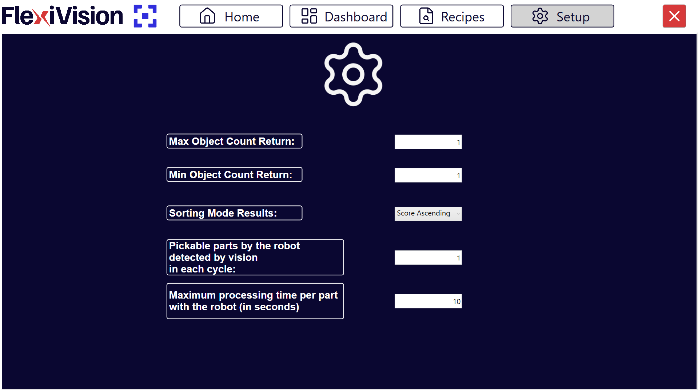

(protocol_setup)=
# **Passo 7: Protocol Setup**

La pagina **Protocol Setup** permette di configurare i parametri che regolano il flusso di comunicazione e lo scambio dati tra il sistema di visione FlexiVision One e il robot. Questi parametri determinano quanti oggetti vengono inviati, come vengono ordinati, e come il sistema gestisce le statistiche e gli stati operativi.

```{note}
**Posizionamento Protocol Setup nel workflow**

Protocol Setup si configura tipicamente:
- **Dopo**: Calibrazione robot, creazione modelli
- **Prima**: Monitoraggio produzione continua

Questo perché:
- Richiede comprensione del comportamento robot (velocità, tipo gripper)
- Influenza le statistiche mostrate in Dashboard
- È l'ultimo step di configurazione prima della produzione vera

Una volta configurato correttamente, raramente richiede modifiche (solo se cambia robot o modalità operativa).
```
---

## Accesso Protocol Setup

1. Dal menu principale, accedere alla sezione dedicata al protocollo di comunicazione
2. Selezionare **Protocol Setup**
3. Si apre l'interfaccia con i parametri configurabili


---

## Parametri Configurabili



```{list-table}
:header-rows: 1
:widths: 35 65

* - **Parametro**
  - **Descrizione e Funzione**
* - [**Max Object Count Return**](maxobject)
  - Indica il numero **massimo** di oggetti (cioè la loro terna di coordinate) che il sistema di visione può restituire al robot in una singola run. Se la visione rileva più oggetti di questo limite, ne vengono inviati al massimo questo numero, selezionati in base al criterio di ordinamento configurato (Sorting Mode).
* - [**Min Object Count Return**](minobject)
  - Indica il numero **minimo** di oggetti che devono essere restituiti in una run affinché il risultato venga considerato valido. Se il numero è inferiore a questa soglia, la run viene considerata non valida.
* - [**Sorting Mode Results**](sortingmode)
  - Definisce il **criterio di ordinamento** con cui viene ordinata la lista degli oggetti restituiti dalla visione.  Questo parametro  determina la priorità di prelievo e determina quali oggetti vengono inclusi nel Max Object Count Return.
    
    *Opzione tipica:* per score decrescente.
* - [**Pickable parts by the robot detected by vision in each cycle**](pickableparts)
  - Indica il numero di prese che il robot effettua per ogni run della visione. Ad esempio, una presa doppia corrisponde a valore (. Non rappresenta il numero di oggetti rilevati dalla visione, ma il numero di prese robot per ciclo. Parametro utilizzato per il calcolo delle statistiche.

* - [**Maximum processing time per part with the robot (in seconds)**](maxprocessingtime)
  - Definisce il tempo massimo dopo il quale il sistema considera conclusa la gestione/invio delle coordinate relative a una run e passa tipicamente dallo stato RUN allo stato IDLE. Parametro utilizzato per **statistiche e gestione del flusso di lavoro**.

    :::{attention}
    **Non è un timeout di errore del robot**, ma un riferimento temporale per il calcolo del ciclo e per le metriche di produttività.
    :::
```

---

## Configurazione Dettagliata Parametri

(maxobject)=
### Max Object Count Return

```{list-table}
 :class: align-top

* - **Funzione**: 
  - Limita il numero massimo di coordinate che vengono inviate al robot per ogni ciclo di visione.

* - **Valori tipici:**
  - 
    - **1-3 oggetti**: Configurazione più comune per robot con picking singolo, doppio o triplo
    - **4-8 oggetti**: Per sistemi con buffer o robot veloci che possono gestire code
    - **>8 oggetti**: Raramente necessario, può saturare la comunicazione

    :::{tip}
    **Come scegliere il valore:**
    1. Considerare la velocità del robot (tempo pick&place per pezzo)
    (. Considerare il tempo ciclo visione + FlexiBowl
    3. Formula approssimativa: `Max Count = (Tempo ciclo visione+FB) / (Tempo pick robot)`

    **Esempio pratico:**
    - Ciclo visione+FlexiBowl: 3 secondi
    - Tempo pick robot: 2 secondi/pezzo
    - Max Count ottimale: 3/2 = 1.5 → Arrotondare a 2 oggetti
    :::
```

(minobject)=
### Min Object Count Return

```{list-table}
* - **Funzione**: 
  - Limita il numero minimo di coordinate che vengono inviate al robot per ogni ciclo di visione.

* - **Valori tipici:**
  - 
    - **1**: Configurazione più comune - anche un solo pezzo riconnosciuto è accettabile
    - **>2**: Solo per applicazioni speciali con multi-pick obbligatorio

* - **Comportamento sistema:**
  - 
    - **Oggetti rilevati ≥ Min Count**: coordinata/e inviate a robot
    - **Oggetti rilevati < Min Count**: coordinate non inviate e esecuzione della sequenza del FlexiBowl


* - **Impatto sulla produttività**
  - 
    **Min Count = 1** (più permissivo):
    - ✓ Massima flessibilità, robot lavora anche se c'è un solo pezzo
    - ✗ Possibili cicli con efficienza bassa 21 pezzo ogni N secondi)

    **Min Count = 3** (più restrittivo):
    - ✓ Garantisce efficienza minima per ciclo
    - ✗ Può causare attese se riempimento è variabile
```

(sortingmode)=
### Sorting Mode Results


```{list-table}
:header-rows: 1
:widths: 30 70

* - Modalità Sorting
  - Descrizione e Quando Usare
* - **By Score (Descending)**
  - Ordina per score dal più alto al più basso. Oggetti con migliore corrispondenza al modello vengono inviati per primi.   
    **Più comune e consigliato**: Garantisce sempre prelievo dei pezzi con riconoscimento più affidabile.
* - **By Score (Ascending)**
  - Ordina per score dal più basso al più alto. Oggetti con peggiore corrispondenza al modello vengono inviati per primi.     
    **SCONSIGLIATO**: NON garantisce sempre prelievo dei pezzi con riconoscimento più affidabile.
* - **By X Coordinate (Ascending)**
  - Ordina per coordinata X crescente. Utile se robot ha preferenza di picking sequenziale lungo un asse.
* - **By X Coordinate (Descending)**
  - Ordina per coordinata X decrescente.
* - **By Y Coordinate (Ascending)**
  - Ordina per coordinata Y crescente.
* - **By Y Coordinate (Descending)**
  - Ordina per coordinata Y decrescente.
* - **X Alternating**
  - 
* - **Y Alternating**
  - 
```

```{tip}
**Scelta Sorting Mode ottimale**

**Consigliato nella maggior parte dei casi: By Score (Descending)**

**Vantaggi**:
- Massima affidabilità: robot preleva sempre i pezzi riconosciuti meglio
- Riduce rischio di picking errati
- Indipendente dalla posizione fisica
```

```{note}
La modalità di sorting interagisce con Max Object Count. I primi 15 oggetti (secondo il criterio) vengono inviati.
```
(pickableparts)=
### Pickable parts by the robot - **Prese robot per ciclo visione**

**Funzione**

Parametro statistico che indica quanti pezzi vengono **effettivamente prelevati** dal robot per ogni ciclo di visione.

**Valori tipici**

- **1**: robot con gripper singolo, preleva 1 pezzo alla volta
- **2**: robot con gripper doppio o ventosa doppia
- **>2**: robot con gripper o ventosa multi-pick

```{important}
Questo valore rappresenta le **prese fisiche**, non gli oggetti rilevati dalla visione.
```

**Esempio chiarificatore**

Scenario: gripper doppio, la visione rileva 5 oggetti.

- Se voglio inviare al robot al massimo 2 oggetti, imposto `Max Object Count = 2`.
- Se voglio che il robot effettui il pick di almeno 2 oggetti alla volta, imposto `Min Object Count = 2`.
- In questo caso imposto `Pickable Parts by the robot = 2`.
- Se invece voglio consentire anche il pick di un solo oggetto, imposto `Max Object Count = 2`, `Min Object Count = 1` e `Pickable Parts by the robot = 2`.

**Impatto su statistiche Dashboard**

Questo parametro e cruciale per il calcolo accurato dei **Parts Per Minute (PPM)**.

- Formula: `PPM = (Pickable parts x 60) / Tempo ciclo totale in secondi`
- Se impostato in modo errato, il PPM visualizzato non corrisponde alla realta

(maxprocessingtime)=
### Maximum processing time per part

```{list-table}
* - **Funzione**: 
  - Tempo di riferimento (in secondi) che il sistema usa per determinare quando un ciclo è considerato "completato" e passare da stato RUN a IDLE.

* - **Valori tipici:**
  - 


* - **Come calcolarlo**:
  - 

* - **Impatto tempo processing su Dashboard**
  -  
```

---

## Salvataggio Configurazione

```{warning}
**Salvataggio obbligatorio**

Dopo aver configurato i parametri di Protocol Setup:

1. Verificare che tutti i valori siano impostati correttamente
(. Cliccare su Recipes > Save Recipe
3. I parametri vengono salvati nella configurazione sistema
```

---

## Prossimi Passi

Una volta completato Protocol Setup, il sistema è configurato completamente per l'operatività:

**→ [Verifica Risultati (Dashboard)](../24_Verifica_Risultati.md)** - Monitoraggio produzione e validazione configurazione


