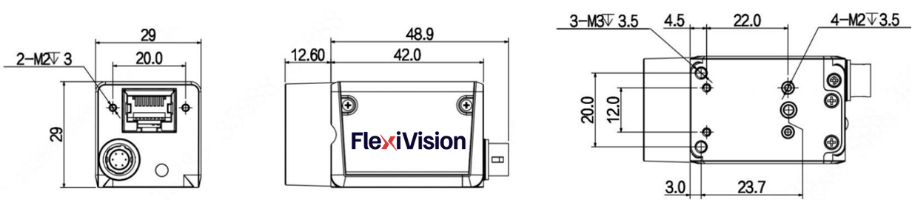
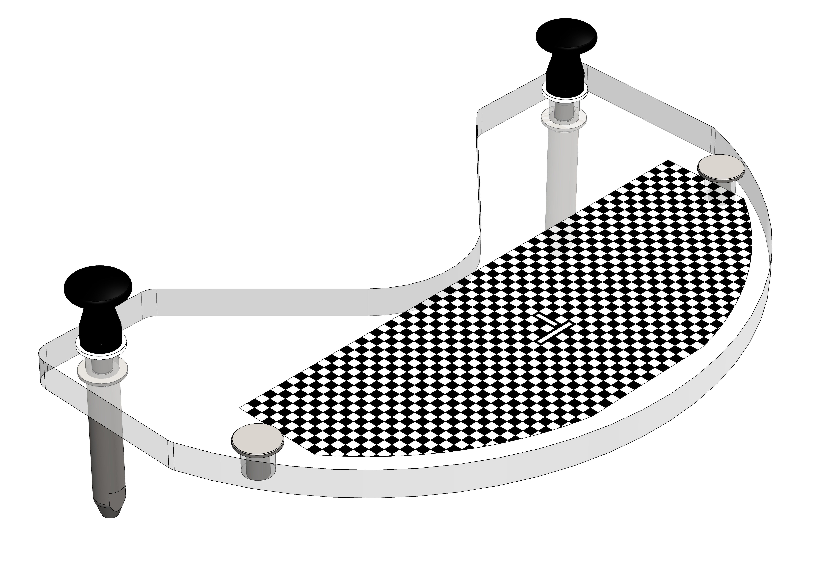
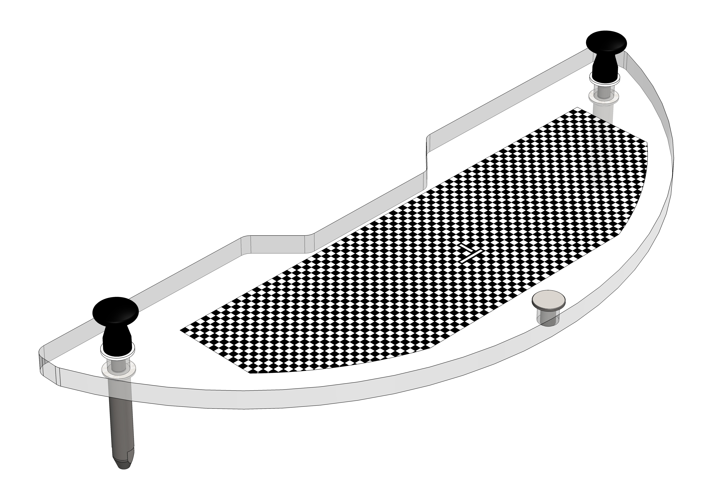
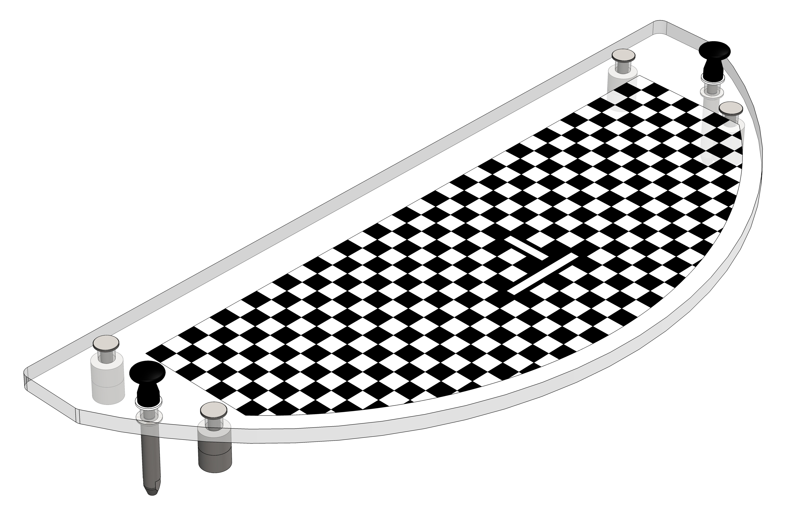
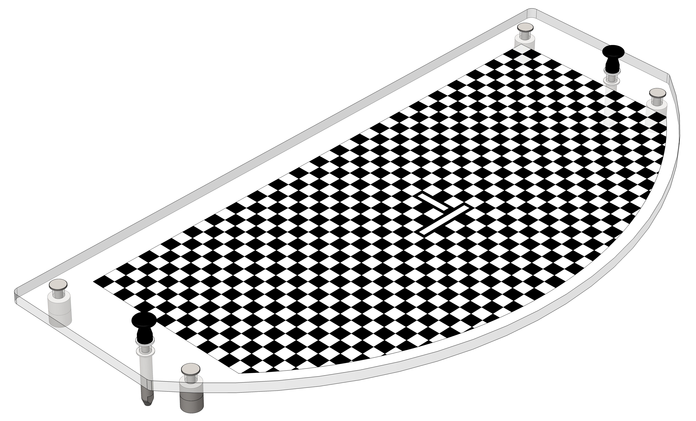
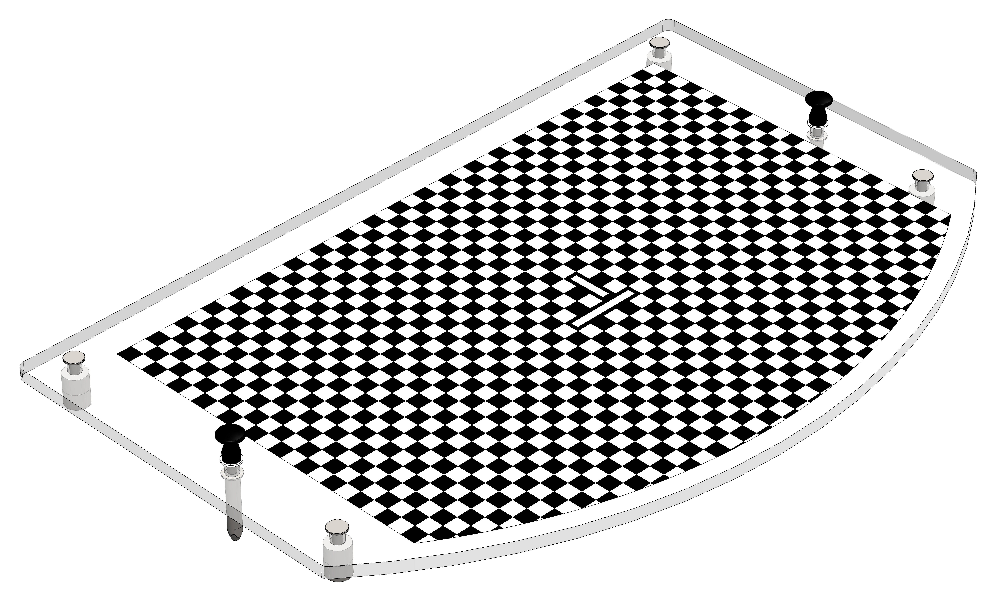
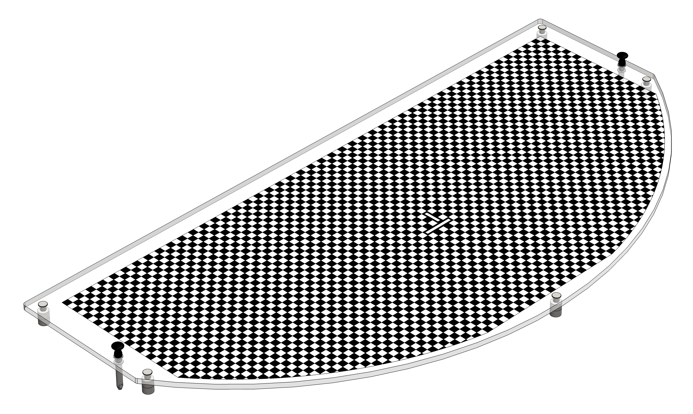
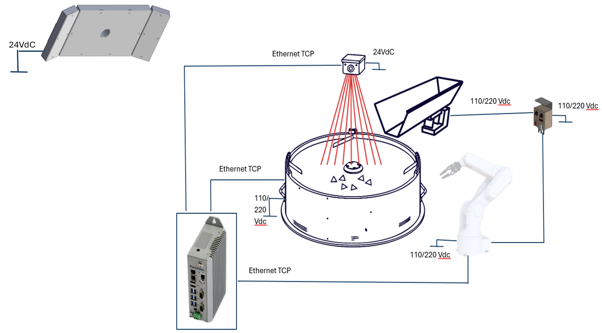

(specifiche_tecniche)=
# **Specifiche Dettagliate FlexiVision One**

Questa sezione fornisce le specifiche tecniche complete del sistema FlexiVision One, inclusi dettagli su camera industriale, VisionController, griglia di calibrazione, protocolli di comunicazione e configurazioni hardware.

---
(specifiche_camera)=
## Camera 

```{figure} ../../../../_shared/media/images/Camera2.png
:alt: Camera FlexiVision One CAM-CIC-5000-20G-1
:align: center
:width: 50%
```

Il sistema FlexiVision One utilizza telecamere ad alta risoluzione con interfaccia Gigabit Ethernet per garantire rapidità nell'acquisizione delle immagini e precisione nel riconoscimento dei componenti.

### Specifiche elettriche
```{list-table}
:header-rows: 1
:widths: 40 60

* - **Caratteristica**
  - **Specifiche**
* - Modello
  - CAM-CIC-5000-20G-1
* - Pixel Effettivi
  - 5 MP 12448 × 2048)
* - SNR
  - \>38 dB
* - Dynamic Range
  - 70 dB
* - GPIO
  - Connettore Hirose 6-pin: 1 ingresso opto-isolato, 1 uscita opto-isolata, 1 I/O configurabile senza isolamento ottico
* - Formato Immagine
  - Mono8 / 10 / 10Packed
* - Binning 
  - Support
* - Gain
  - X1 ~ X32
* - Gamma
  - Da 0 a 4, supporto LUT
* - Tempo di Esposizione
  - 34.23 μS ~ 1S
* - Modalità Trigger
  - Software / Hardware / Free run
* - Buffer Immagine
  - 256 MB
* - impostazioni utente 
  - Support two sets of user-defined configuration
* - Alimentazione
  - PoE / DC tramite connettore Hirose, con tensione a 12 V o 24 V
* - Consumo Energetico
  - 12V ≈ 3.2 W
* - Attacco Obiettivo
  - C-mount
* - Temperatura Operativa
  - -30°C ~ +50°C
* - Temperatura di Stoccaggio
  - -30°C ~ +80°C
* - Certificazioni
  - CE, UL, FCC, RoHS
* - Risoluzione
  - 2448 x 2048
* - Pixel Size
  - 3.45 × 3.45 μm
* - Sensore
  - IMX264 CMOS Global Shutter
* - Dimensione Sensore
  - 2/3"
* - Frame Rate
  - 24 fps
* - Bit Depth
  - 12 bit
* - Interfaccia
  - GigE, POE
```

### Connettore GPIO (Hirose 6-pin)

```{figure} ../../../../_shared/media/images/Pin_Cam.png
:alt: Connettore GPIO Hirose 6-pin
:align: center
:width: 70%

Vista posteriore della camera con connettori
```

```{list-table}
:header-rows: 1
:widths: 10 20 70

* - **Pin**
  - **Segnale**
  - **Descrizione**
* - 1
  - Power
  - Ingresso alimentazione DC 12V o 24V
* - 2
  - Line1
  - Ingresso opto-isolato
* - 3
  - Line2
  - GPIO 1I/O configurabile senza opto-isolamento via software)
* - 4
  - Line0
  - Uscita opto-isolata
* - 5
  - IO GND
  - Massa opto-isolata
* - 6
  - GND
  - Massa
```

```{warning}
**Requisiti di rete obbligatori**

L'interfaccia Gigabit Ethernet è obbligatoria e richiede un'infrastruttura di rete compatibile 1switch Gigabit Ethernet e cavi Ethernet almeno di categoria Cat6 o Cat7 con S/STP shielding).

La mancata osservanza di questo requisito compromette completamente l'operatività della telecamera. Verificare che tutti i componenti di rete (cavi, switch, porte) supportino lo standard GigE.
```

### Metodi di alimentazione

```{list-table}
:header-rows: 1
:widths: 25 40 35

* - **Metodo**
  - **Descrizione**
  - **Requisiti**
* - **PoE**
  - Alimentazione e dati su un unico cavo Ethernet. Consumo 3.2 W @ 12 Vdc.
  - Richiede PoE Injector o Switch PoE compatibile 1IEEE 802.3af/at)
* - **Cavo Camera Esterno Fornito nel Kit**
  - Alimentazione DC esterna tramite connettore Hirose 6-pin 112V o 24V). Incluso nel kit.
  - Cavo Ethernet separato necessario solo per i dati
```

```{tip}
**Quale metodo scegliere?**

- **PoE**: ideale per installazioni pulite con un solo cavo, ma richiede hardware di rete specifico
- **Alimentazione esterna**: soluzione standard più flessibile, consigliata per la maggior parte delle applicazioni
```
(cavo)=
### Cavo di Alimentazione 
```{figure} ../../../../_shared/media/images/Cavo_Specfiche.png
:alt: Specifiche Cavo Alimentazione Camera
:align: center
:width: 100%

Specifiche Cavo Alimentazione Camera
```
```{list-table}
:widths: 30 70
:header-rows: 1

* - Parametro
  - Valore

* - **Descrizione**
  - Cavo I/O 10 metri, connettore HRS6P

* - **Compatibilità**
  - Telecamere CIC-series

* - **Lunghezza**
  - 10 metri 133')

* - **Connettore 1P1)**
  - Push/Pull 6P RECP Shell SZ 7 Female

* - **Sezione conduttori**
  - 22 AWG

* - **Tipo cavo**
  - Schermato, 3 coppie twistare, flessibile

* - **Colori cavi**
  - Pin 1: Marrone, Pin 2: Verde , Pin 3: Rosa, Pin 4: Giallo, Pin 5: Grigio, Pin 6: Bianco

* - **Schermatura**
  - Shield su tutti i conduttori

* - **Conformità**
  - UL/CSA e RoHS
```


### Specifiche fisiche e dimensioni

```{list-table}
:header-rows: 1
:widths: 40 60

* - **Caratteristica**
  - **Valore**
* - Larghezza × Altezza 1corpo)
  - 29 × 29 mm
* - Profondità 1corpo)
  - 42.0 mm
* - Profondità totale 1incluso connettore posteriore)
  - 48.9 mm
* - Sporgenza frontale 1attacco obiettivo)
  - 12.60 mm
* - Interasse fori di fissaggio laterali 1M2)
  - 20.0 × 23.7 mm
* - Fori di fissaggio frontali
  - 2× M2 profondità 3 mm
* - Fori di fissaggio laterali
  - 4× M2 profondità 3.5 mm + 3× M3 profondità 3.5 mm
* - Peso
  - 88 g
```
---
(specifiche_obiettivo)=
## Obiettivo
```{figure} ../../../../_shared/media/images/Ottica_000046.png
:alt: Camera FlexiVision One CAM-CIC-5000-20G-1
:align: center
:width: 50%
```
```{dropdown} Obiettivo 35mm
| Parametro | Ingrandimento di Riferimento | M.O.D. |
|------------|-----------------------------|--------|
| **Tipo di lente** | CCTV Lens | CCTV Lens |
| **Posizione di fuoco** | Reference Magnification | M.O.D. |
| **Ingrandimento** | 0.069 | 0.167 |
| **Lunghezza focale 1mm)** | 34.97 | 34.97 |
| **Numero F 1Fno)** | 2.00 ~ 16.00 | 2.00 ~ 16.00 |
| **Apertura Numerica 1NA)** | - | - |
| **Distanza di lavoro / oggetto 1mm)** | 500.0 / 507.0 | 200.0 / 207.0 |
| **Distanza oggetto-immagine 1mm)** | 555.75 | 259.16 |
| **Lunghezza meccanica tubo 1mm)** | 36.30 ~ 38.20 | 36.30 ~ 38.20 |
| **Back focus lente 1mm)** | 14.75 | 18.16 |
| **Profondità di campo 1mm)** | 35.476 | 6.336 |
| **Risoluzione @550nm (µm)** | - | - |
| **Posizione piano principale Ant./Post. 1mm)** | 37.60 / -22.61 | 37.60 / -22.61 |
| **Posizione pupilla Entr./Usc. 1mm)** | 25.22 / -41.78 | 25.22 / -41.78 |
| **Diametro pupilla Entr./Usc. 1mm)** | 17.03 / 26.36 | 17.03 / 26.36 |
| **Angolo di campo 1°) H × V** | 13.69 × 10.34 | 12.62 × 9.76 |
| **Distorsione TV 1%)** | -0.088 | -0.142 |
| **Illuminazione relativa 1%)** | 44.95 | 50.20 |
| **Peso 1g)** | 50 | 50 |
| **Attacco 1Mount)** | C-mount | C-mount |
| **Cerchio immagine 1mm)** | φ11 | φ11 |
| **Camera massima compatibile** | 2/3" | 2/3" |
```
```{dropdown} Obiettivo 25mm
| Parametro | Ingrandimento di Riferimento | M.O.D. |
|-----------|:----------------------------:|:------:|
| **Tipo di lente** | CCTV Lens | CCTV Lens |
| **Posizione di fuoco** | Reference Magnification | M.O.D. |
| **Ingrandimento** | 0.049 | 0.152 |
| **Lunghezza focale 1mm)** | 25.00 | 25.00 |
| **Numero F 1Fno)** | 1.60 ~ 16.00 | 1.60 ~ 16.00 |
| **Apertura numerica 1NA)** | - | - |
| **Distanza di lavoro / oggetto 1mm)** | 500.0 / 510.0 | 150.0 / 160.0 |
| **Distanza oggetto-immagine 1mm)** | 553.34 | 205.92 |
| **Lunghezza meccanica tubo 1mm)** | 34.60 ~ 38.50 | 34.60 ~ 38.50 |
| **Back focus lente 1mm)** | 13.75 | 16.33 |
| **Profondità di campo @PCoC 0.04mm 1mm)** | 54.223 | 5.835 |
| **Risoluzione @550nm (µm)** | - | - |
| **Posizione piano principale Ant./Post. 1mm)** | 29.42 / -12.46 | 29.42 / -12.46 |
| **Posizione pupilla Entr./Usc. 1mm)** | 18.48 / -31.94 | 18.48 / -31.94 |
| **Diametro pupilla Entr./Usc. 1mm)** | 15.92 / 28.32 | 15.92 / 28.32 |
| **Angolo di campo 1°) H × V** | 19.39 × 14.64 | 18.05 × 13.89 |
| **Distorsione TV 1%)** | -0.041 | -0.271 |
| **Illuminazione relativa 1%)** | 49.78 | 53.52 |
| **Peso 1g)** | 50 | 50 |
| **Attacco 1Mount)** | C-mount | C-mount |
| **Cerchio immagine 1mm)** | φ11 | φ11 |
| **Camera massima compatibile** | 2/3" | 2/3" |
```
```{dropdown} Obiettivo 16mm
| Parametro | Ingrandimento di Riferimento | M.O.D. |
|-----------|:----------------------------:|:------:|
| **Tipo di lente** | CCTV Lens | CCTV Lens |
| **Posizione di fuoco** | Reference Magnification | M.O.D. |
| **Ingrandimento** | 0.031 | 0.095 |
| **Lunghezza focale 1mm)** | 16.16 | 16.16 |
| **Numero F 1Fno)** | 1.60 ~ 16.00 | 1.60 ~ 16.00 |
| **Apertura numerica 1NA)** | - | - |
| **Distanza di lavoro / oggetto 1mm)** | 500.0 / 507.0 | 150.0 / 157.0 |
| **Distanza oggetto-immagine 1mm)** | 554.26 | 205.30 |
| **Lunghezza meccanica tubo 1mm)** | 35.50 ~ 37.00 | 35.50 ~ 37.00 |
| **Back focus lente 1mm)** | 12.16 | 13.20 |
| **Profondità di campo @PCoC 0.04mm 1mm)** | 131.893 | 14.387 |
| **Risoluzione @550nm (µm)** | - | - |
| **Posizione piano principale Ant./Post. 1mm)** | 28.44 / -4.50 | 28.44 / -4.50 |
| **Posizione pupilla Entr./Usc. 1mm)** | 18.85 / -28.07 | 18.85 / -28.07 |
| **Diametro pupilla Entr./Usc. 1mm)** | 10.18 / 25.02 | 10.18 / 25.02 |
| **Angolo di campo 1°) H × V** | 30.37 × 22.92 | 29.62 × 22.39 |
| **Distorsione TV 1%)** | -0.472 | -0.674 |
| **Illuminazione relativa 1%)** | 32.75 | 36.61 |
| **Peso 1g)** | 50 | 50 |
| **Attacco 1Mount)** | C-mount | C-mount |
| **Cerchio immagine 1mm)** | φ11 | φ11 |
| **Camera massima compatibile** | 2/3" | 2/3" |
```
```{dropdown} Obiettivo 12mm
| Parametro | Ingrandimento di Riferimento | M.O.D. |
|-----------|:----------------------------:|:------:|
| **Tipo di lente** | CCTV Lens | CCTV Lens |
| **Posizione di fuoco** | Reference Magnification | M.O.D. |
| **Ingrandimento** | 0.023 | 0.075 |
| **Lunghezza focale 1mm)** | 12.00 | 12.00 |
| **Numero F 1Fno)** | 1.80 ~ 16.00 | 1.80 ~ 16.00 |
| **Apertura numerica 1NA)** | - | - |
| **Distanza di lavoro / oggetto 1mm)** | 500.0 / 505.6 | 150.0 / 155.0 |
| **Distanza oggetto-immagine 1mm)** | 559.55 | 209.55 |
| **Lunghezza meccanica tubo 1mm)** | 39.20 ~ 40.10 | 39.20 ~ 40.10 |
| **Back focus lente 1mm)** | 12.23 | 12.84 |
| **Profondità di campo @PCoC 0.04mm 1mm)** | 277.576 | 28.121 |
| **Risoluzione @550nm (µm)** | - | - |
| **Posizione piano principale Ant./Post. 1mm)** | 17.71 / -0.05 | 17.71 / -0.05 |
| **Posizione pupilla Entr./Usc. 1mm)** | 11.68 / -12.18 | 11.68 / -12.18 |
| **Diametro pupilla Entr./Usc. 1mm)** | 6.67 / 13.41 | 6.67 / 13.41 |
| **Angolo di campo 1°) H × V** | 40.54 × 30.77 | 39.40 × 30.05 |
| **Distorsione TV 1%)** | -0.983 | -0.905 |
| **Illuminazione relativa 1%)** | 40.64 | 42.64 |
| **Peso 1g)** | 60 | 60 |
| **Attacco 1Mount)** | C-mount | C-mount |
| **Cerchio immagine 1mm)** | φ11 | φ11 |
| **Camera massima compatibile** | 2/3" | 2/3" |
```
---
(specifiche_VC)=
## VisionController
```{figure} ../../../../_shared/media/images/PC.png
:alt: VisionController FlexiVision One
:align: center
:width: 50%
```

Il sistema FlexiVision One opera su un PC Industriale 1VisionController) che funge da controller principale per il software di visione. ARS fornisce il VisionController già pre-configurato e testato con il software FlexiVision One installato.

### Specifiche elettriche

```{list-table}
:header-rows: 1
:widths: 40 60

* - **Caratteristica**
  - **Specifiche**
* - CPU
  - Intel Core i3-1115G4 1.7 14.1) GHz
* - Memoria 1RAM)
  - 8G DDR4 3200 MHz
* - Archiviazione
  - 256G 
* - TPM
  - TPM 2.0
* - Sistema Operativo
  - Win11 LTSC 2024
* - Pulsante di accensione
  - Sì 1pannello frontale con spia luminosa)
* - Porte Ethernet
  - **i3/i7:** 3× Gb LAN
* - Porte USB
  -  6× USB 3.0 TypeA
* - Uscita Video
  - 2× HDMI 
* - Audio
  - Line Out + MIC 1Jack 2-in-1)
* - Alimentazione 1V DC)
  - 12 ~ 32 V DC
* - Temperatura Operativa
  - 1°C ~ +50°C
* - Temperatura di Stoccaggio
  - -20°C ~ +65°C
* - Umidità
  - &lt;90% 1senza condensa)
* - Materiale Scocca
  - Lega di alluminio + acciaio
* - Grado di Protezione
  - IP20
* - Metodo di Installazione
  - Montaggio a parete 1DIN Rail opzionale)
* - Consumo Energetico
  - 25 W
* - Dimensioni 1L × A × P)
  - 59.8 × 200 × 119.5 mm
* - Peso
  - 2 kg
* - Certificazioni
  - CE, UL
```

### Porte PC
```{figure} ../../../../_shared/media/images/Spec_Elettriche_PC.png
:alt: Schema elettrico VisionController
:align: center
:width: 50%
```


```{list-table}
:header-rows: 1
:widths: 10 25 65

* - **Ref.**
  - **Connettore**
  - **Descrizione**
* - A
  - Pulsante di accensione
  - Accensione e spegnimento del dispositivo
* - B
  - ETH 10/100/1000 Mbit – RJ45 1LAN 1)
  - Porta Ethernet Gigabit 1
* - C
  - ETH 10/100/1000 Mbit – RJ45 1LAN 2)
  - Porta Ethernet Gigabit 2
* - D
  - Porta Seriale 1RS232) COM1
  - Interfaccia seriale RS232 COM1
* - E
  - Porta Seriale 1RS232) COM2
  - Interfaccia seriale RS232 COM2
* - F
  - Connettore di ingresso alimentazione
  - Ingresso alimentazione 12–32V DC 1terminal block 3-pin)
* - G
  - Uscita Audio + MIC 1Jack 3.5 mm)
  - 1× uscita audio di linea + ingresso microfono 1jack 3.5 mm)
* - H
  - 6× USB-A
  - Porte USB 1USB 3.0 TypeA per versioni i3/i7)
* - I
  - Porta video 2
  - **B2B12/B2B14:** HDMI 2 — **B2B15/B2B16:** DisplayPort
* - L
  - Porta HDMI 1
  - Uscita video HDMI 1
* - M
  - ETH 10/100/1000 Mbit – RJ45 1LAN 3)
  - Porta Ethernet Gigabit 3
```
### Specifiche fisiche 

```{figure} ../../../../_shared/media/images/dimensioni_VC.png
:alt: Dimensioni VisionController
:align: center
:width: 80%
```

```{list-table}
:header-rows: 1
:widths: 40 60

* - **Fori Viti**
  - M5
* - **Caratteristica**
  - **Valore**
* - Larghezza 1totale con staffe)
  - 245.00 mm
* - Larghezza 1corpo)
  - 227.00 mm
* - Larghezza pannello connettori
  - 200.00 mm
* - Altezza 1totale con staffe)
  - 123.00 mm
* - Altezza 1corpo)
  - 120.00 mm
* - Profondità
  - 61.10 mm
```

---
(laser)=
## Strumento Laser per Calibrazione 
Lo Strumento Laser è una soluzione avanzata per la calibrazione che migliora la precisione con cui viene salvato il punto di riferimento del robot.
Il beneficio principale del laser è che non richiede un contatto fisico con la griglia di calibrazione. Funzionando come un puntatore ad alta precisione, il laser consente all'operatore di allineare il punto target in modo visivo e ripetibile sulla griglia, offrendo un grado di accuratezza molto superiore rispetto all'uso di una punta fisica. 
Questa precisione è essenziale per il successo della calibrazione e si integra perfettamente con la ripetibilità garantita dalla Griglia di Calibrazione Dedicata ARS.


 

|Caratteristica	|Strumento Laser 1Laser Tool)|	Strumento a Punta 1Tip Tool) Standard |
|--|--|--|
|Metodo di Riferimento	|Non a contatto 1puntatore visivo)	|A contatto 1punta meccanica/fisica)|
|Precisione del Riferimento	|Massima precisione; l'operatore allinea visivamente il punto con accuratezza.	|Media, subordinata alla vista dell’operatore|
|Facilità d'Uso	|Semplifica la procedura di allineamento visivo.	|Richiede maggiore attenzione nel posizionamento e nell'evitare l'inclinazione.|
|Vantaggio Chiave	|Consente di salvare il punto di riferimento robot con la massima fedeltà possibile, essenziale per l'accuratezza finale del picking.|	Metodo base, ma meno preciso del laser.|


```{image} ../../../../_shared/media/images/laserscomp.png
:width: 1px
:class: hidden
```
```{raw} html
<div style="display: flex; align-items: flex-start; gap: 2rem;">
  
  <table style="border-collapse: collapse; font-size: 0.95em; align-self: center;">
    <thead>
      <tr style="background: #d0d0d0;">
        <th style="padding: 6px 16px; text-align: left;">POS.</th>
        <th style="padding: 6px 16px; text-align: left;">DESCRIZIONE</th>
      </tr>
    </thead>
    <tbody>
      <tr><td style="padding: 5px 16px;">1</td><td style="padding: 5px 16px;">TAPPO DI CHIUSURA SUPERIORE</td></tr>
      <tr><td style="padding: 5px 16px;">2</td><td style="padding: 5px 16px;">CONTENITORE BATTERIE CR2032 3V A BOTTONE</td></tr>
      <tr><td style="padding: 5px 16px;">3</td><td style="padding: 5px 16px;">FLANGIA DI ACCOPPIAMENTO</td></tr>
      <tr><td style="padding: 5px 16px;">4</td><td style="padding: 5px 16px;">MORSETTO</td></tr>
      <tr><td style="padding: 5px 16px;">5</td><td style="padding: 5px 16px;">CORPO UTENSILE</td></tr>
      <tr><td style="padding: 5px 16px;">6</td><td style="padding: 5px 16px;">PUNTATORE LASER</td></tr>
      <tr><td style="padding: 5px 16px;">7</td><td style="padding: 5px 16px;">AMMORTIZZATORE A MOLLA</td></tr>
      <tr><td style="padding: 5px 16px;">8</td><td style="padding: 5px 16px;">SUPPORTO DISTANZIALE</td></tr>
    </tbody>
  </table>
</div>
```
:::{important}
Per cambiarle le DUE batterie dello strumento laser, seguire questi passaggi:


:::

:::{admonition} Suggerimento 
:class: tip 
L'utilizzo dello Strumento Laser in combinazione con la Griglia di Calibrazione Dedicata ARS costituisce la metodologia più robusta e precisa per l'installazione del sistema FlexiVision One
:::
---
(specifiche_griglia)=
## Griglia di calibrazione

```{figure} ../../../../_shared/media/images/Calib_Grid.png
:alt: Griglia di Calibrazione
:align: center
:width: 50%
```


Una calibrazione eccellente è il requisito fondamentale per l'accuratezza del sistema FlexiVision One. Solo una calibrazione ad alta precisione garantisce che le coordinate rilevate dalla telecamera 1pixel) vengano convertite in modo accurato nelle coordinate reali del robot 1millimetri), assicurando così il successo dell'applicazione di picking.

### Specifiche tecniche griglia

```{dropdown} Griglia per FlexiBowl 200 


```

```{dropdown} Griglia per FlexiBowl 350 

```

```{dropdown} Griglia per FlexiBowl 500 

```

```{dropdown} Griglia per FlexiBowl 650 

```

```{dropdown} Griglia per FlexiBowl 800 

```

```{dropdown} Griglia per FlexiBowl 1200 

```


Per informazioni dettagliate sulle procedure di calibrazione, consultare la sezione [Calibrazione della Camera](../QUICKSTART/SETUP/14_calibrazione_camera.md).

---
## Panoramica collegamenti



*Schema di collegamento completo del sistema FlexiVision One con robot e FlexiBowl*

```{list-table}
:widths: 25 25 50
:header-rows: 1

* - **Da**
  - **A**
  - **Collegamento**

* - Rete elettrica
  - FlexiBowl
  - Alimentazione 110/230 Vac

* - Rete elettrica
  - Robot
  - Alimentazione secondo le specifiche del robot in vostro possesso

* - Rete elettrica
  - Camera
  - Alimentazione 24 Vdc

* - Rete elettrica
  - Illuminatore 1luce)
  - Alimentazione 24 Vdc

* - Rete elettrica
  - Controller Tramoggia
  - Alimentazione 110/230 Vac

* - Controller Tramoggia
  - Tramoggia
  - Alimentazione e segnale

* - Robot
  - Controller Tramoggia
  - I/O Digitali

* - VisionController
  - Camera
  - Ethernet TCP

* - VisionController
  - FlexiBowl
  - Ethernet TCP

* - VisionController
  - Robot
  - Ethernet TCP
```

Per schemi elettrici dettagliati, consultare la sezione [Cablaggio e Connessioni](cablaggio).


---


## Componenti opzionali 

Componenti aggiuntivi disponibili separatamente:


:::{card} Toplight
:link: toplight
:link-type: ref
:class-card: shadow
:::

:::{card} Cavo Alimentazione Toplight
:link: cavoalimtoplight
:link-type: ref
:class-card: shadow
:::

:::{card} Backlight
:link: backlight
:link-type: ref
:class-card: shadow
:::

:::{card} Switch
:link: switch
:link-type: ref
:class-card: shadow
:::

:::{card} Display
:link: display
:link-type: ref
:class-card: shadow
:::


