# **Opzioni**                                                                
(toplight)=
## Toplight
Il Toplight è un sistema di illuminazione dall'alto che illumina la superficie del pezzo direttamente dall'alto, esaltando texture e dettagli superficiali. È la scelta ideale quando l'applicazione richiede il riconoscimento di caratteristiche visibili sulla faccia superiore del pezzo.

I Toplight disponibli sono: 

```{dropdown} TopLight 500x300 - White 
Questa dimensione di Toplight è indicata per i modelli: FlexiBowl 200, FlexiBowl 350, FlexiBowl 500
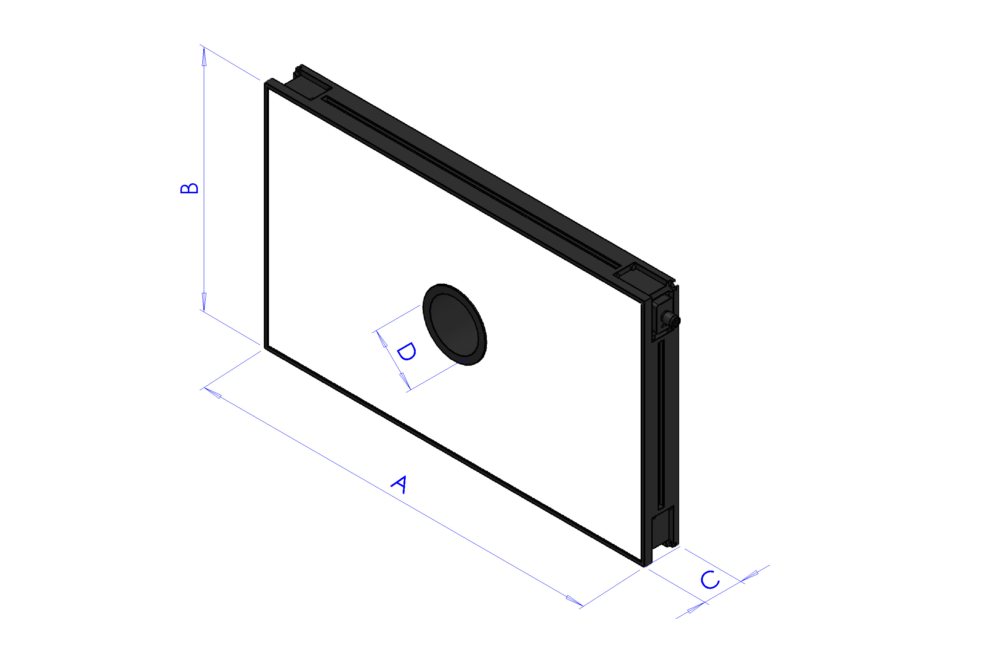

| Lunghezza | Larghezza | Altezza | Altezza con piastra di fissaggio | Diametro foro centrale | Superficie utile max [AxB] | Perimetro utile max |
|--|--|--|--|--|--|--|
| **A** | **B** | **C** | **C + 10mm** | **D** | - | - |
| 500 | 300 | 45 | 55 | 65 | 0.15 m^2 | 1.6 m |

:::{list-table}
:widths: 35 65
:header-rows: 0

* - **Codice**
  - CM002316

* - **Elettronica**
  -

* - Alimentazione
  - 24 VDC ±10%

* - Modalità di controllo
  - Continua 

* - Tempo massimo di salita
  - 15 µs

* - Tempo massimo di discesa
  - 10 µs

* - Controllo
  - [Connettore M12](cablaggio_illuminatore)

* - Configurazione pin connettore
  - 1: 24VDC / 3: GND / 4: PNP

* - Consumo
  - 96.6W

* - Tensione minima di funzionamento
  - 20V sull’ingresso luce

* - Tensione nominale di funzionamento
  - 24V sull’ingresso luce (±10%)

* - Tensione massima di funzionamento
  - 30V sull’ingresso luce

* - Lunghezza d'onda
  - 

* - Classe di Rischio 
  - 0 (nesusn rischio)

* - **Meccanica**
  -

* - Spessore
  - 45mm + 10mm con piastra di fissaggio

* - Diametro interno
  - 65mm

* - Peso
  - 23.8 Kg/m² ±15%

* - Materiali
  - Alluminio e ABS caricato

* - Diffusore
  - PMMA bianco

* - Fissaggio
  - 4 dadi M4 (forniti) da inserire nella scanalatura
    oppure 4 viti M4x20 (non fornite) applicate agli angoli

* - **Ambiente**
  -

* - Temperatura di esercizio
  - -10°C a +40°C / 80% di umidità senza condensa
    Nessuno shock termico (variazione massima: 10°C in 24h)

* - Temperatura di stoccaggio
  - -20°C a +60°C / 80% di umidità senza condensa
    Nessuno shock termico (variazione massima: 10°C in 24h)

* - Grado di protezione IP
  - IP 50

* - Marcature
  - RoHS-CE-DEEE, UL
:::

```
```{dropdown} TopLight 500x300 - Red  
Questa dimensione di Toplight è indicata per i modelli: FlexiBowl 200, FlexiBowl 350, FlexiBowl 500


| Lunghezza | Larghezza | Altezza | Altezza con piastra di fissaggio | Diametro foro centrale | Superficie utile max [AxB] | Perimetro utile max |
|--|--|--|--|--|--|--|
| **A** | **B** | **C** | **C + 10mm** | **D** | - | - |
| 500 | 300 | 45 | 55 | 65 | 0.15 m^2 | 1.6 m |

:::{list-table}
:widths: 35 65
:header-rows: 0

* - **Codice**
  - CM002401

* - **Elettronica**
  -

* - Alimentazione
  - 24 VDC ±10%

* - Modalità di controllo
  - Continua 

* - Tempo massimo di salita
  - 15 µs

* - Tempo massimo di discesa
  - 10 µs

* - Controllo
  - [Connettore M12](cablaggio_illuminatore)

* - Configurazione pin connettore
  - 1: 24VDC / 3: GND / 4: PNP

* - Consumo
  - 96.6W @24 Vdc

* - Tensione minima di funzionamento
  - 20V sull’ingresso luce

* - Tensione nominale di funzionamento
  - 24V sull’ingresso luce (±10%)

* - Tensione massima di funzionamento
  - 30V sull’ingresso luce

* - Lunghezza d'onda
  - 630 nm 

* - Classe di Rischio 
  - 0 (nesusn rischio)


* - **Meccanica**
  -

* - Spessore
  - 45mm + 10mm con piastra di fissaggio

* - Diametro interno
  - 65mm

* - Peso
  - 23.8 Kg/m² ±15%

* - Materiali
  - Alluminio e ABS caricato

* - Diffusore
  - PMMA bianco

* - Fissaggio
  - 4 dadi M4 (forniti) da inserire nella scanalatura
    oppure 4 viti M4x20 (non fornite) applicate agli angoli

* - **Ambiente**
  -

* - Temperatura di esercizio
  - -10°C a +40°C / 80% di umidità senza condensa
    Nessuno shock termico (variazione massima: 10°C in 24h)

* - Temperatura di stoccaggio
  - -20°C a +60°C / 80% di umidità senza condensa
    Nessuno shock termico (variazione massima: 10°C in 24h)

* - Grado di protezione IP
  - IP 50

* - Marcature
  - RoHS-CE-DEEE, UL
:::

```

```{dropdown} TopLight 500x300 - Infrared
Questa dimensione di Toplight è indicata per i modelli: FlexiBowl 200, FlexiBowl 350, FlexiBowl 500


| Lunghezza | Larghezza | Altezza | Altezza con piastra di fissaggio | Diametro foro centrale | Superficie utile max [AxB] | Perimetro utile max |
|--|--|--|--|--|--|--|
| **A** | **B** | **C** | **C + 10mm** | **D** | - | - |
| 500 | 300 | 45 | 55 | 65 | 0.15 m^2 | 1.6 m |

:::{list-table}
:widths: 35 65
:header-rows: 0

* - **Codice**
  - CM002405

* - **Elettronica**
  -

* - Alimentazione
  - 24 VDC ±10%

* - Modalità di controllo
  - Continua 

* - Tempo massimo di salita
  - 15 µs

* - Tempo massimo di discesa
  - 10 µs

* - Controllo
  - [Connettore M12](cablaggio_illuminatore)

* - Configurazione pin connettore
  - 1: 24VDC / 3: GND / 4: PNP

* - Consumo
  - 96.6W @24 Vdc

* - Tensione minima di funzionamento
  - 20V sull’ingresso luce

* - Tensione nominale di funzionamento
  - 24V sull’ingresso luce (±10%)

* - Tensione massima di funzionamento
  - 30V sull’ingresso luce

* - Lunghezza d'onda
  - 850 nm 

* - Classe di Rischio 
  - 1 (basso rischio)

* - **Meccanica**
  -

* - Spessore
  - 45mm + 10mm con piastra di fissaggio

* - Diametro interno
  - 65mm

* - Peso
  - 23.8 Kg/m² ±15%

* - Materiali
  - Alluminio e ABS caricato

* - Diffusore
  - PMMA bianco

* - Fissaggio
  - 4 dadi M4 (forniti) da inserire nella scanalatura
    oppure 4 viti M4x20 (non fornite) applicate agli angoli

* - **Ambiente**
  -

* - Temperatura di esercizio
  - -10°C a +40°C / 80% di umidità senza condensa
    Nessuno shock termico (variazione massima: 10°C in 24h)

* - Temperatura di stoccaggio
  - -20°C a +60°C / 80% di umidità senza condensa
    Nessuno shock termico (variazione massima: 10°C in 24h)

* - Grado di protezione IP
  - IP 50

* - Marcature
  - RoHS-CE-DEEE, UL
:::

```

```{dropdown} TopLight 700x300 - White
Questa dimensione di Toplight è indicata per i modelli: FlexiBowl 650, FlexiBowl 800
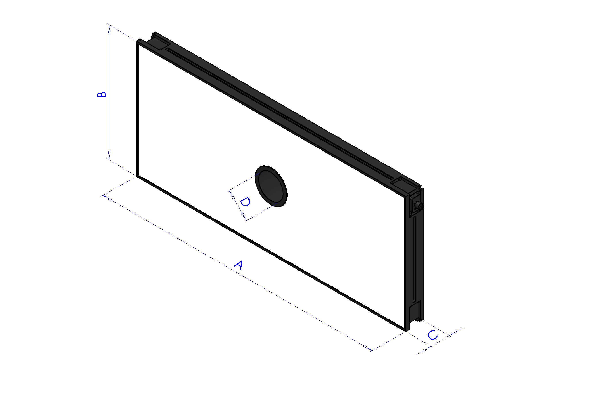

| Lunghezza | Larghezza | Altezza | Altezza con piastra di fissaggio | Diametro foro centrale | Superficie utile max [AxB] | Perimetro utile max |
|--|--|--|--|--|--|--|
| **A** | **B** | **C** | **C + 10mm** | **D** | - | - |
| 700 | 300 | 45 | 55 | 65 | 0.21 m^2 | 2 m |

:::{list-table}
:widths: 35 65
:header-rows: 0

* - **Codice**
  - CM002317

* - **Elettronica**
  -

* - Alimentazione
  - 24 VDC ±10%

* - Modalità di controllo
  - Continua 

* - Tempo massimo di salita
  - 15 µs

* - Tempo massimo di discesa
  - 10 µs

* - Controllo
  - [Connettore M12](cablaggio_illuminatore)

* - Configurazione pin connettore
  - 1: 24VDC / 3: GND / 4: PNP

* - Consumo
  - 135.6W @24 Vdc

* - Tensione minima di funzionamento
  - 20V sull’ingresso luce

* - Tensione nominale di funzionamento
  - 24V sull’ingresso luce (±10%)

* - Tensione massima di funzionamento
  - 30V sull’ingresso luce

* - Lunghezza d'onda
  - 

* - Classe di Rischio 
  - 0 (nesusn rischio)

* - **Meccanica**
  -

* - Spessore
  - 45mm + 10mm con piastra di fissaggio

* - Diametro interno
  - 65mm

* - Peso
  - 23.8 Kg/m² ±15%

* - Materiali
  - Alluminio e ABS caricato

* - Diffusore
  - PMMA bianco

* - Fissaggio
  - 4 dadi M4 (forniti) da inserire nella scanalatura
    oppure 4 viti M4x20 (non fornite) applicate agli angoli

* - **Ambiente**
  -

* - Temperatura di esercizio
  - -10°C a +40°C / 80% di umidità senza condensa
    Nessuno shock termico (variazione massima: 10°C in 24h)

* - Temperatura di stoccaggio
  - -20°C a +60°C / 80% di umidità senza condensa
    Nessuno shock termico (variazione massima: 10°C in 24h)

* - Grado di protezione IP
  - IP 50

* - Marcature
  - RoHS-CE-DEEE, UL
:::
```

```{dropdown} TopLight 700x300 - Red
Questa dimensione di Toplight è indicata per i modelli: FlexiBowl 650, FlexiBowl 800


| Lunghezza | Larghezza | Altezza | Altezza con piastra di fissaggio | Diametro foro centrale | Superficie utile max [AxB] | Perimetro utile max |
|--|--|--|--|--|--|--|
| **A** | **B** | **C** | **C + 10mm** | **D** | - | - |
| 700 | 300 | 45 | 55 | 65 | 0.21 m^2 | 2 m |

:::{list-table}
:widths: 35 65
:header-rows: 0
 
 * - **Codice**
   - CM002402

* - **Elettronica**
  -

* - Alimentazione
  - 24 VDC ±10%

* - Modalità di controllo
  - Continua 

* - Tempo massimo di salita
  - 15 µs

* - Tempo massimo di discesa
  - 10 µs

* - Controllo
  - [Connettore M12](cablaggio_illuminatore)

* - Configurazione pin connettore
  - 1: 24VDC / 3: GND / 4: PNP

* - Consumo
  - 135.6W @24 Vdc

* - Tensione minima di funzionamento
  - 20V sull’ingresso luce

* - Tensione nominale di funzionamento
  - 24V sull’ingresso luce (±10%)

* - Tensione massima di funzionamento
  - 30V sull’ingresso luce

* - Lunghezza d'onda
  - 630 nm 

* - Classe di Rischio 
  - 0 (nesusn rischio)

* - **Meccanica**
  -

* - Spessore
  - 45mm + 10mm con piastra di fissaggio

* - Diametro interno
  - 65mm

* - Peso
  - 23.8 Kg/m² ±15%

* - Materiali
  - Alluminio e ABS caricato

* - Diffusore
  - PMMA bianco

* - Fissaggio
  - 4 dadi M4 (forniti) da inserire nella scanalatura
    oppure 4 viti M4x20 (non fornite) applicate agli angoli

* - **Ambiente**
  -

* - Temperatura di esercizio
  - -10°C a +40°C / 80% di umidità senza condensa
    Nessuno shock termico (variazione massima: 10°C in 24h)

* - Temperatura di stoccaggio
  - -20°C a +60°C / 80% di umidità senza condensa
    Nessuno shock termico (variazione massima: 10°C in 24h)

* - Grado di protezione IP
  - IP 50

* - Marcature
  - RoHS-CE-DEEE, UL
:::
```

```{dropdown} TopLight 700x300 - Infrared
Questa dimensione di Toplight è indicata per i modelli: FlexiBowl 650, FlexiBowl 800


| Lunghezza | Larghezza | Altezza | Altezza con piastra di fissaggio | Diametro foro centrale | Superficie utile max [AxB] | Perimetro utile max |
|--|--|--|--|--|--|--|
| **A** | **B** | **C** | **C + 10mm** | **D** | - | - |
| 700 | 300 | 45 | 55 | 65 | 0.21 m^2 | 2 m |

:::{list-table}
:widths: 35 65
:header-rows: 0

* - **Codice** 
  - CM002406

* - **Elettronica**
  -

* - Alimentazione
  - 24 VDC ±10%

* - Modalità di controllo
  - Continua 

* - Tempo massimo di salita
  - 15 µs

* - Tempo massimo di discesa
  - 10 µs

* - Controllo
  - [Connettore M12](cablaggio_illuminatore)

* - Configurazione pin connettore
  - 1: 24VDC / 3: GND / 4: PNP

* - Consumo
  - 135.6W @24 Vdc

* - Tensione minima di funzionamento
  - 20V sull’ingresso luce

* - Tensione nominale di funzionamento
  - 24V sull’ingresso luce (±10%)

* - Tensione massima di funzionamento
  - 30V sull’ingresso luce

* - Lunghezza d'onda
  - 850 nm 

* - Classe di Rischio 
  - 1 (basso rischio)

* - **Meccanica**
  -

* - Spessore
  - 45mm + 10mm con piastra di fissaggio

* - Diametro interno
  - 65mm

* - Peso
  - 23.8 Kg/m² ±15%

* - Materiali
  - Alluminio e ABS caricato

* - Diffusore
  - PMMA bianco

* - Fissaggio
  - 4 dadi M4 (forniti) da inserire nella scanalatura
    oppure 4 viti M4x20 (non fornite) applicate agli angoli

* - **Ambiente**
  -

* - Temperatura di esercizio
  - -10°C a +40°C / 80% di umidità senza condensa
    Nessuno shock termico (variazione massima: 10°C in 24h)

* - Temperatura di stoccaggio
  - -20°C a +60°C / 80% di umidità senza condensa
    Nessuno shock termico (variazione massima: 10°C in 24h)

* - Grado di protezione IP
  - IP 50

* - Marcature
  - RoHS-CE-DEEE, UL
:::
```

```{dropdown} TopLight 700x500 - White
Questa dimensione di Toplight è indicata per i modelli: FlexiBowl 650, FlexiBowl 800
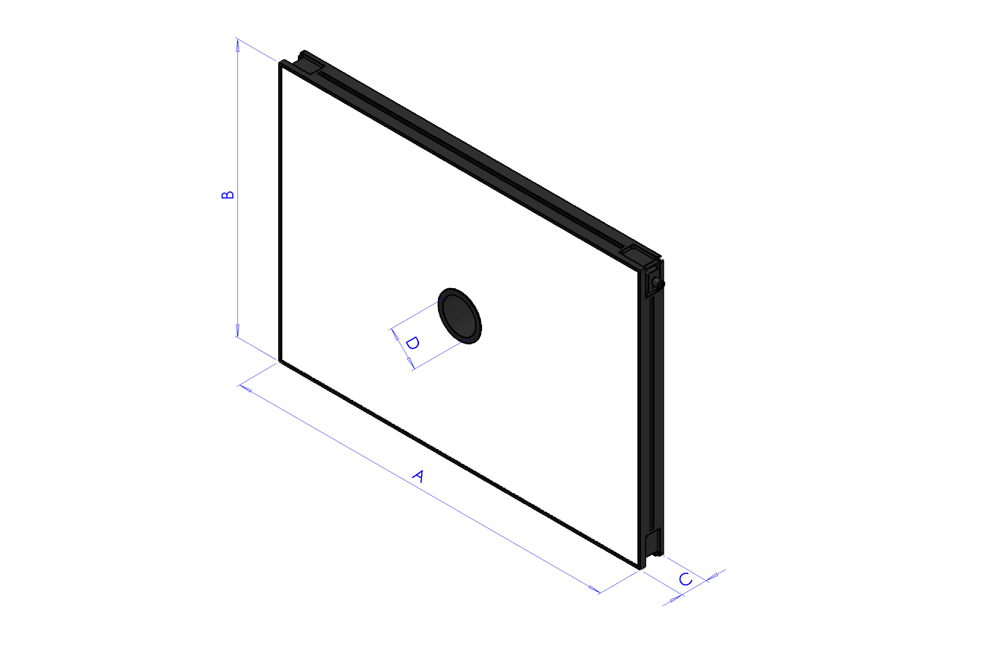

| Lunghezza | Larghezza | Altezza | Altezza con piastra di fissaggio | Diametro foro centrale | Superficie utile max [AxB] | Perimetro utile max |
|--|--|--|--|--|--|--|
| **A** | **B** | **C** | **C + 10mm** | **D** | - | - |
| 700 | 500 | 45 | 55 | 65 | 0.35 m^2 | 2.4 m |

:::{list-table}
:widths: 35 65
:header-rows: 0

* - **Codice**
  - CM002318

* - **Elettronica**
  -

* - Alimentazione
  - 24 VDC ±10%

* - Modalità di controllo
  - Continua 

* - Tempo massimo di salita
  - 15 µs

* - Tempo massimo di discesa
  - 10 µs

* - Controllo
  - [Connettore M12](cablaggio_illuminatore)

* - Configurazione pin connettore
  - 1: 24VDC / 3: GND / 4: PNP

* - Consumo
  - 252.6W @24 Vdc

* - Tensione minima di funzionamento
  - 20V sull’ingresso luce

* - Tensione nominale di funzionamento
  - 24V sull’ingresso luce (±10%)

* - Tensione massima di funzionamento
  - 30V sull’ingresso luce

* - Lunghezza d'onda
  - 

* - Classe di Rischio 
  - 0 (nesusn rischio)

* - **Meccanica**
  -

* - Spessore
  - 45mm + 10mm con piastra di fissaggio

* - Diametro interno
  - 65mm

* - Peso
  - 23.8 Kg/m² ±15%

* - Materiali
  - Alluminio e ABS caricato

* - Diffusore
  - PMMA bianco

* - Fissaggio
  - 4 dadi M4 (forniti) da inserire nella scanalatura
    oppure 4 viti M4x20 (non fornite) applicate agli angoli

* - **Ambiente**
  -

* - Temperatura di esercizio
  - -10°C a +40°C / 80% di umidità senza condensa
    Nessuno shock termico (variazione massima: 10°C in 24h)

* - Temperatura di stoccaggio
  - -20°C a +60°C / 80% di umidità senza condensa
    Nessuno shock termico (variazione massima: 10°C in 24h)

* - Grado di protezione IP
  - IP 50

* - Marcature
  - RoHS-CE-DEEE, UL
:::
```

```{dropdown} TopLight 700x500 - Red
Questa dimensione di Toplight è indicata per i modelli: FlexiBowl 650, FlexiBowl 800


| Lunghezza | Larghezza | Altezza | Altezza con piastra di fissaggio | Diametro foro centrale | Superficie utile max [AxB] | Perimetro utile max |
|--|--|--|--|--|--|--|
| **A** | **B** | **C** | **C + 10mm** | **D** | - | - |
| 700 | 500 | 45 | 55 | 65 | 0.35 m^2 | 2.4 m |

:::{list-table}
:widths: 35 65
:header-rows: 0

* - **Codice**
  - CM002403

* - **Elettronica**
  -

* - Alimentazione
  - 24 VDC ±10%

* - Modalità di controllo
  - Continua 

* - Tempo massimo di salita
  - 15 µs

* - Tempo massimo di discesa
  - 10 µs

* - Controllo
  - [Connettore M12](cablaggio_illuminatore)

* - Configurazione pin connettore
  - 1: 24VDC / 3: GND / 4: PNP

* - Consumo
  - 252.6W @24 Vdc

* - Tensione minima di funzionamento
  - 20V sull’ingresso luce

* - Tensione nominale di funzionamento
  - 24V sull’ingresso luce (±10%)

* - Tensione massima di funzionamento
  - 30V sull’ingresso luce

* - Lunghezza d'onda
  - 630 nm 

* - Classe di Rischio 
  - 0 (nesusn rischio)

* - **Meccanica**
  -

* - Spessore
  - 45mm + 10mm con piastra di fissaggio

* - Diametro interno
  - 65mm

* - Peso
  - 23.8 Kg/m² ±15%

* - Materiali
  - Alluminio e ABS caricato

* - Diffusore
  - PMMA bianco

* - Fissaggio
  - 4 dadi M4 (forniti) da inserire nella scanalatura
    oppure 4 viti M4x20 (non fornite) applicate agli angoli

* - **Ambiente**
  -

* - Temperatura di esercizio
  - -10°C a +40°C / 80% di umidità senza condensa
    Nessuno shock termico (variazione massima: 10°C in 24h)

* - Temperatura di stoccaggio
  - -20°C a +60°C / 80% di umidità senza condensa
    Nessuno shock termico (variazione massima: 10°C in 24h)

* - Grado di protezione IP
  - IP 50

* - Marcature
  - RoHS-CE-DEEE, UL
:::
```

```{dropdown} TopLight 700x500 - Infrared
Questa dimensione di Toplight è indicata per i modelli: FlexiBowl 650, FlexiBowl 800


| Lunghezza | Larghezza | Altezza | Altezza con piastra di fissaggio | Diametro foro centrale | Superficie utile max [AxB] | Perimetro utile max |
|--|--|--|--|--|--|--|
| **A** | **B** | **C** | **C + 10mm** | **D** | - | - |
| 700 | 500 | 45 | 55 | 65 | 0.35 m^2 | 2.4 m |

:::{list-table}
:widths: 35 65
:header-rows: 0

* - **Codice**
  - CM002407

* - **Elettronica**
  -

* - Alimentazione
  - 24 VDC ±10%

* - Modalità di controllo
  - Continua 

* - Tempo massimo di salita
  - 15 µs

* - Tempo massimo di discesa
  - 10 µs

* - Controllo
  - [Connettore M12](cablaggio_illuminatore)

* - Configurazione pin connettore
  - 1: 24VDC / 3: GND / 4: PNP

* - Consumo
  - 252.6W @24 Vdc

* - Tensione minima di funzionamento
  - 20V sull’ingresso luce

* - Tensione nominale di funzionamento
  - 24V sull’ingresso luce (±10%)

* - Tensione massima di funzionamento
  - 30V sull’ingresso luce

* - Lunghezza d'onda
  - 850 nm 

* - Classe di Rischio 
  - 1 (basso rischio)

* - **Meccanica**
  -

* - Spessore
  - 45mm + 10mm con piastra di fissaggio

* - Diametro interno
  - 65mm

* - Peso
  - 23.8 Kg/m² ±15%

* - Materiali
  - Alluminio e ABS caricato

* - Diffusore
  - PMMA bianco

* - Fissaggio
  - 4 dadi M4 (forniti) da inserire nella scanalatura
    oppure 4 viti M4x20 (non fornite) applicate agli angoli

* - **Ambiente**
  -

* - Temperatura di esercizio
  - -10°C a +40°C / 80% di umidità senza condensa
    Nessuno shock termico (variazione massima: 10°C in 24h)

* - Temperatura di stoccaggio
  - -20°C a +60°C / 80% di umidità senza condensa
    Nessuno shock termico (variazione massima: 10°C in 24h)

* - Grado di protezione IP
  - IP 50

* - Marcature
  - RoHS-CE-DEEE, UL
:::
```

```{dropdown} TopLight 900x600 - White
Questa dimensione di Toplight è indicata per il modelli FlexiBowl 1200


| Lunghezza | Larghezza | Altezza | Altezza con piastra di fissaggio | Diametro foro centrale | Superficie utile max [AxB] | Perimetro utile max |
|--|--|--|--|--|--|--|
| **A** | **B** | **C** | **C + 10mm** | **D** | - | - |
| 900 | 600 | 45 | 55 | 65 | 0.54 m^2 | 3 m |

:::{list-table}
:widths: 35 65
:header-rows: 0

* - **Codice**
  - CM002319

* - **Elettronica**
  -

* - Alimentazione
  - 24 VDC ±10%

* - Modalità di controllo
  - Continua 

* - Tempo massimo di salita
  - 15 µs

* - Tempo massimo di discesa
  - 10 µs

* - Controllo
  - [Connettore M12](cablaggio_illuminatore)

* - Configurazione pin connettore
  - 1: 24VDC / 3: GND / 4: PNP

* - Consumo
  - 345.6W @24 Vdc

* - Tensione minima di funzionamento
  - 20V sull’ingresso luce

* - Tensione nominale di funzionamento
  - 24V sull’ingresso luce (±10%)

* - Tensione massima di funzionamento
  - 30V sull’ingresso luce

* - Lunghezza d'onda
  - 

* - Classe di Rischio 
  - 0 (nesusn rischio)

* - **Meccanica**
  -

* - Spessore
  - 45mm + 10mm con piastra di fissaggio

* - Diametro interno
  - 65mm

* - Peso
  - 23.8 Kg/m² ±15%

* - Materiali
  - Alluminio e ABS caricato

* - Diffusore
  - PMMA bianco

* - Fissaggio
  - 4 dadi M4 (forniti) da inserire nella scanalatura
    oppure 4 viti M4x20 (non fornite) applicate agli angoli

* - **Ambiente**
  -

* - Temperatura di esercizio
  - -10°C a +40°C / 80% di umidità senza condensa
    Nessuno shock termico (variazione massima: 10°C in 24h)

* - Temperatura di stoccaggio
  - -20°C a +60°C / 80% di umidità senza condensa
    Nessuno shock termico (variazione massima: 10°C in 24h)

* - Grado di protezione IP
  - IP 50

* - Marcature
  - RoHS-CE-DEEE, UL
:::
```
```{dropdown} TopLight 900x600 - Red
Questa dimensione di Toplight è indicata per il modelli FlexiBowl 1200


| Lunghezza | Larghezza | Altezza | Altezza con piastra di fissaggio | Diametro foro centrale | Superficie utile max [AxB] | Perimetro utile max |
|--|--|--|--|--|--|--|
| **A** | **B** | **C** | **C + 10mm** | **D** | - | - |
| 900 | 600 | 45 | 55 | 65 | 0.54 m^2 | 3 m |

:::{list-table}
:widths: 35 65
:header-rows: 0

* - **Codice**
  - CM002404

* - **Elettronica**
  -

* - Alimentazione
  - 24 VDC ±10%

* - Modalità di controllo
  - Continua 

* - Tempo massimo di salita
  - 15 µs

* - Tempo massimo di discesa
  - 10 µs

* - Controllo
  - [Connettore M12](cablaggio_illuminatore)

* - Configurazione pin connettore
  - 1: 24VDC / 3: GND / 4: PNP

* - Consumo
  - 345.6W @24 Vdc

* - Tensione minima di funzionamento
  - 20V sull’ingresso luce

* - Tensione nominale di funzionamento
  - 24V sull’ingresso luce (±10%)

* - Tensione massima di funzionamento
  - 30V sull’ingresso luce

* - Lunghezza d'onda
  - 630 nm 

* - Classe di Rischio 
  - 0 (nesusn rischio)

* - **Meccanica**
  -

* - Spessore
  - 45mm + 10mm con piastra di fissaggio

* - Diametro interno
  - 65mm

* - Peso
  - 23.8 Kg/m² ±15%

* - Materiali
  - Alluminio e ABS caricato

* - Diffusore
  - PMMA bianco

* - Fissaggio
  - 4 dadi M4 (forniti) da inserire nella scanalatura
    oppure 4 viti M4x20 (non fornite) applicate agli angoli

* - **Ambiente**
  -

* - Temperatura di esercizio
  - -10°C a +40°C / 80% di umidità senza condensa
    Nessuno shock termico (variazione massima: 10°C in 24h)

* - Temperatura di stoccaggio
  - -20°C a +60°C / 80% di umidità senza condensa
    Nessuno shock termico (variazione massima: 10°C in 24h)

* - Grado di protezione IP
  - IP 50

* - Marcature
  - RoHS-CE-DEEE, UL
:::
```

```{dropdown} TopLight 900x600 - Infrared
Questa dimensione di Toplight è indicata per il modelli FlexiBowl 1200


| Lunghezza | Larghezza | Altezza | Altezza con piastra di fissaggio | Diametro foro centrale | Superficie utile max [AxB] | Perimetro utile max |
|--|--|--|--|--|--|--|
| **A** | **B** | **C** | **C + 10mm** | **D** | - | - |
| 900 | 600 | 45 | 55 | 65 | 0.54 m^2 | 3 m |

:::{list-table}
:widths: 35 65
:header-rows: 0

* - **Codice**
  - CM002408

* - **Elettronica**
  -

* - Alimentazione
  - 24 VDC ±10%

* - Modalità di controllo
  - Continua 

* - Tempo massimo di salita
  - 15 µs

* - Tempo massimo di discesa
  - 10 µs

* - Controllo
  - [Connettore M12](cablaggio_illuminatore)

* - Configurazione pin connettore
  - 1: 24VDC / 3: GND / 4: PNP

* - Consumo
  - 345.6W @24 Vdc

* - Tensione minima di funzionamento
  - 20V sull’ingresso luce

* - Tensione nominale di funzionamento
  - 24V sull’ingresso luce (±10%)

* - Tensione massima di funzionamento
  - 30V sull’ingresso luce

* - Lunghezza d'onda
  - 850 nm 

* - Classe di Rischio 
  - 1 (basso rischio)

* - **Meccanica**
  -

* - Spessore
  - 45mm + 10mm con piastra di fissaggio

* - Diametro interno
  - 65mm

* - Peso
  - 23.8 Kg/m² ±15%

* - Materiali
  - Alluminio e ABS caricato

* - Diffusore
  - PMMA bianco

* - Fissaggio
  - 4 dadi M4 (forniti) da inserire nella scanalatura
    oppure 4 viti M4x20 (non fornite) applicate agli angoli

* - **Ambiente**
  -

* - Temperatura di esercizio
  - -10°C a +40°C / 80% di umidità senza condensa
    Nessuno shock termico (variazione massima: 10°C in 24h)

* - Temperatura di stoccaggio
  - -20°C a +60°C / 80% di umidità senza condensa
    Nessuno shock termico (variazione massima: 10°C in 24h)

* - Grado di protezione IP
  - IP 50

* - Marcature
  - RoHS-CE-DEEE, UL
:::
```
(cavoalimtoplight)=
### Cavo Alimentazione Toplight 

```{image} ../../../../_shared/media/images/cavoalimtoplight1.png
:align: center
:width: 60%
```

| Codice   | Descrizione              | Connettore |
|----------|--------------------------|------------|
| CE001337 | Cavo Alimentazione Toplight 2M  | M12 4 Pin Female |
| CE001338 | Cavo Alimentazione Toplight power 5M | M12 4 Pin Female |
| CE001339 | Cavo Alimentazione Toplight power 10M | M12 4 Pin Female |

### Staffa per Montaggio Toplight 


(backlight)=
## Backlight
Il Backlight è un sistema di retroilluminazione posizionato all'interno del piano del FlexiBowl che illumina il pezzo dal basso, creando un contrasto netto tra il profilo del pezzo e lo sfondo luminoso. È particolarmente efficace per il riconoscimento di sagome, contorni e fori, indipendentemente dal colore o dalla finitura superficiale del pezzo.

```{dropdown} Backlight per FB200

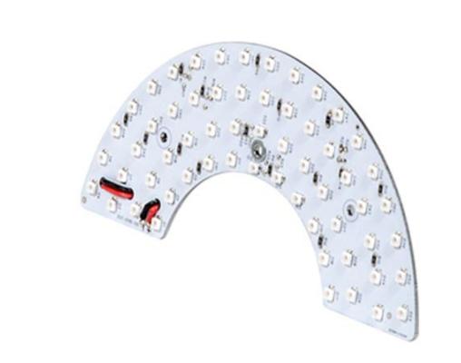

| Articoli | CE000351 | CE000353 | CE000331 |
|--|--|--|--|
| Colore LED | rosso | infrarosso | bianco |
| Lunghezza d’onda | 630 nm | 850 nm | N/D |
| Tensione | 24VDC | 24VDC | 24VDC |
| Corrente | 0.17A | 0.12A | 0.17A |
| Area di illuminazione | 155x75 mm^2 |  |  |
| Materiale struttura | Lega di alluminio |  |  |
| Temperatura di esercizio | -40 / +85 °C |  |  |
| Lunghezza cavo | 0.2 m |  |  |
| Metodo di raffreddamento | Aria naturale |  |  |
| Materiale opalino | Metacrilato bianco opalino |  |  |
```
```{dropdown} Backlight per FB350

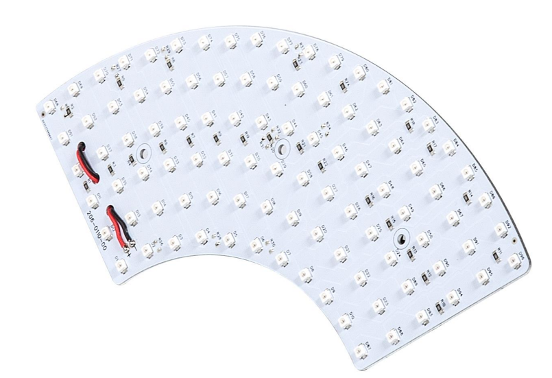

| Articoli | CE000342 | CE000275 | CE000341 |
|--|--|--|--|
| Colore LED | rosso | infrarosso | bianco |
| Lunghezza d’onda | 630 nm | 850 nm | N/D |
| Tensione | 24VDC | 24VDC | 24VDC |
| Corrente | 0.18A | 0.13A | 0.18A |
| Area di illuminazione | 220x100 mm^2 |  |  |
| Materiale struttura | Lega di alluminio |  |  |
| Temperatura di esercizio | -40 / +85 °C |  |  |
| Lunghezza cavo | 0.2 m |  |  |
| Metodo di raffreddamento | Aria naturale |  |  |
| Materiale opalino | Metacrilato bianco opalino |  |  |
```
```{dropdown} Backlight per FB500

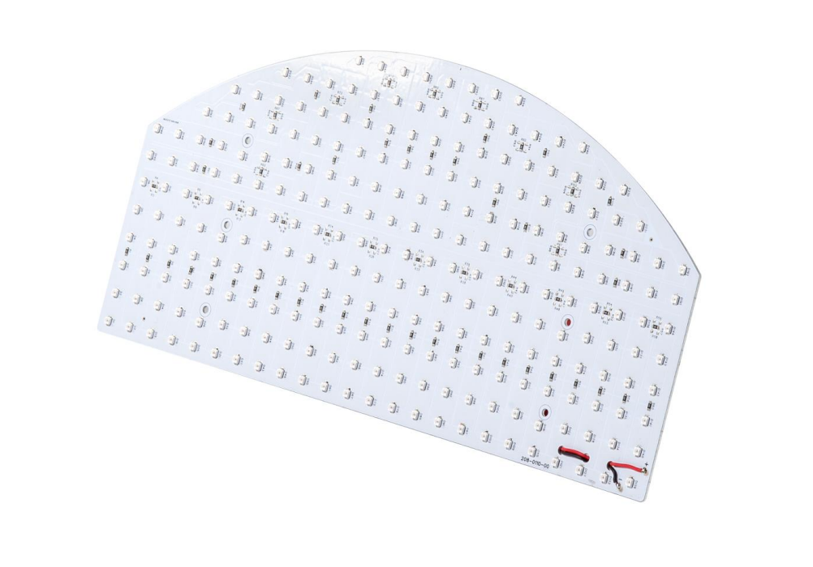

| Articoli | CE000344 | CE000272 | CE000343 |
|--|--|--|--|
| Colore LED | rosso | infrarosso | bianco |
| Lunghezza d’onda | 630 nm | 850 nm | N/D |
| Tensione | 24VDC | 24VDC | 24VDC |
| Corrente | 0.46A | 0.31A | 0.46A |
| Area di illuminazione | 330x170 mm^2 |  |  |
| Materiale struttura | Lega di alluminio |  |  |
| Temperatura di esercizio | -40 / +85 °C |  |  |
| Lunghezza cavo | 0.2 m |  |  |
| Metodo di raffreddamento | Aria naturale |  |  |
| Materiale opalino | Metacrilato bianco opalino |  |  |
```
```{dropdown} Backlight per FB650

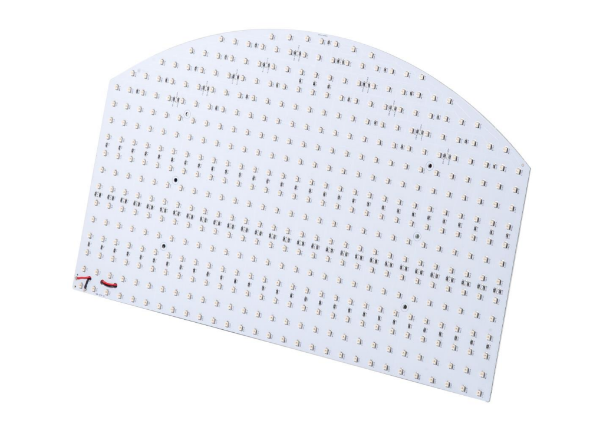

| Articoli | CE000306 | CE000273 | CE000305 |
|--|--|--|--|
| Articoli alternativi | GM000591 | GM000592 | GM000590 |
| Colore LED | rosso | infrarosso | bianco |
| Lunghezza d’onda | 630 nm | 850 nm | N/D |
| Tensione | 24VDC | 24VDC | 24VDC |
| Corrente | 0.86A | 0.56A | 0.94A |
| Area di illuminazione | 400x240 mm^2 |  |  |
| Materiale struttura | Lega di alluminio |  |  |
| Temperatura di esercizio | -40 / +85 °C |  |  |
| Lunghezza cavo | 0.2 m |  |  |
| Metodo di raffreddamento | Aria naturale |  |  |
| Materiale opalino | Metacrilato bianco opalino |  |  |
```
```{dropdown} Backlight per FB800

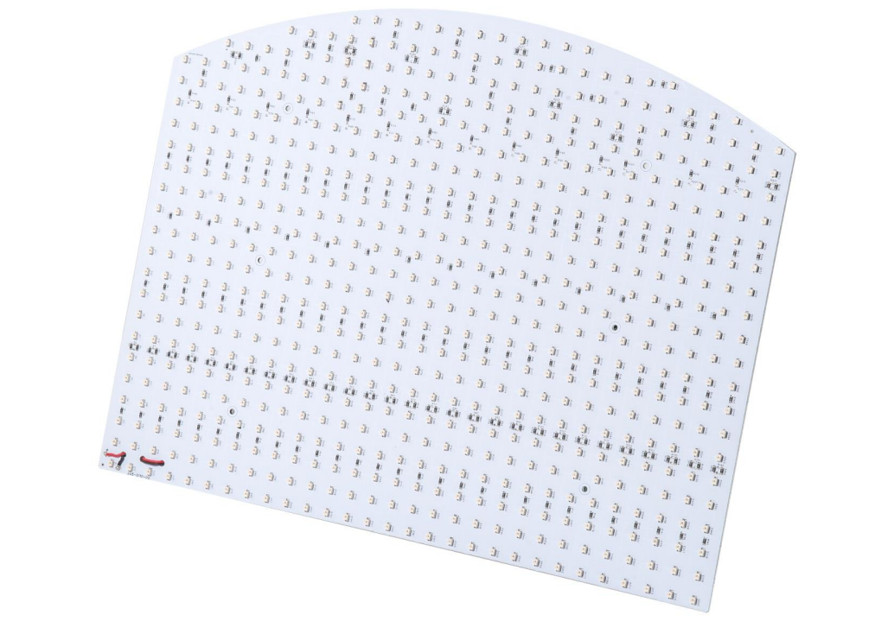

| Articoli | CE000345 | CE000274 | CE000346 |
|--|--|--|--|
| Colore LED | rosso | infrarosso | bianco |
| Lunghezza d’onda | 630 nm | 850 nm | N/D |
| Tensione | 24VDC | 24VDC | 24VDC |
| Corrente | 1.15A | 0.76A | 1.2A |
| Area di illuminazione | 400x315 mm^2 |  |  |
| Materiale struttura | Lega di alluminio |  |  |
| Temperatura di esercizio | -40 / +85 °C |  |  |
| Lunghezza cavo | 0.2 m |  |  |
| Metodo di raffreddamento | Aria naturale |  |  |
| Materiale opalino | Metacrilato bianco opalino |  |  |
```
```{dropdown} Backlight per FB1200

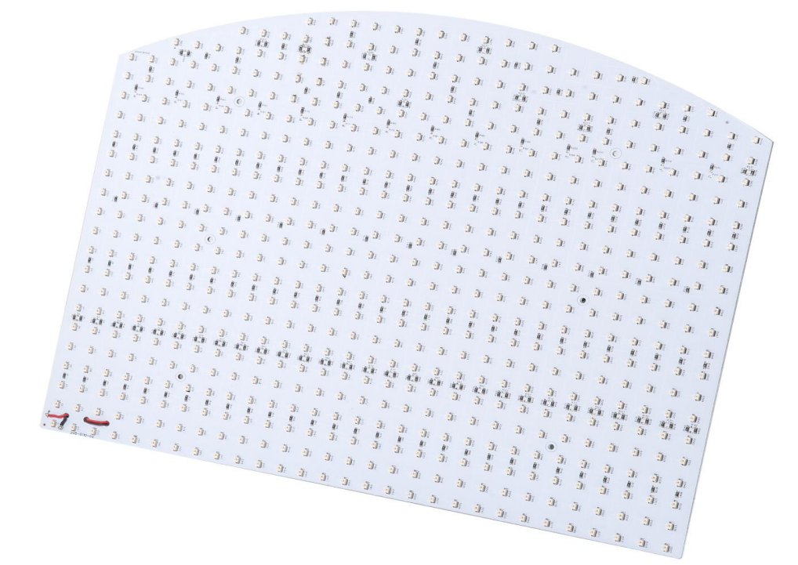

| Articoli | GE000051 | GE000052 | GE000050 |
|--|--|--|--|
| Colore LED | rosso | infrarosso | bianco |
| Lunghezza d’onda | 630 nm | 850 nm | N/D |
| Tensione | 24VDC | 24VDC | 24VDC |
| Corrente | 4A | 2.6A | 4.2A |
| Area di illuminazione | 917x525 mm^2 |  |  |
| Materiale struttura | Lega di alluminio |  |  |
| Temperatura di esercizio | -40 / +85 °C |  |  |
| Lunghezza cavo | 0.2 m |  |  |
| Metodo di raffreddamento | Aria naturale |  |  |
| Materiale opalino | Metacrilato bianco opalino |  |  |
```

## Backlight o Toplight?

```{warning}
**Impatto sul riconoscimento pezzi**

La scelta tra backlight e toplight influenza significativamente il riconoscimento:

- **Backlight**: Ottimo per profili/sagome, pezzi appaiono come silhouette scure su sfondo chiaro
- **Toplight**: Necessario per riconoscere dettagli superficiali, texture, feature interne

La calibrazione, quando si utilizza una griglia di calibrazione ARS, dev'essere eseguita utilizzando l'illuminatore backlight e spegnere il toplight se presente.
```
---

(filtroIR)=
## Filtro IR

```{image} ../../../../_shared/media/images/FiltroIR_000047.png
:align: center
:width: 60%
```

Il filtro IR è un accessorio ottico da applicare all’obiettivo della camera che blocca la luce visibile lasciando passare esclusivamente la radiazione infrarossa. È necessario solo nel caso in cui si utilizzi un illuminatore IR (850 nm): senza filtro, la camera riceverebbe sia luce visibile che infrarossa, compromettendo il contrasto e la qualità del riconoscimento.


---


(switch)=
## Switch

:::{image} ../../../../_shared/media/images/switch.jpg
:align: center
:width: 30%
:::

### Specifiche Elettriche

| Parametro | Valore |
|-----------|--------|
| Tensione di ingresso | 12/24/48 VDC |
| Tensione operativa | 9.6 a 60 VDC |
| Corrente di ingresso | 0.33 A (max.) |
| Connessione alimentazione | 1 morsettiera rimovibile a 2 contatti |
| Protezione da sovracorrente | Supportata |
| Protezione da polarità inversa | Supportata |
| Porte 10/100/1000BaseT(X) (RJ45) | 8 |
| Modalità duplex | Full/Half duplex |
| Connessione | Auto MDI/MDI-X |
| Negoziazione velocità | Automatica |
| Standard supportati | IEEE 802.3, IEEE 802.3u, IEEE 802.3ab, IEEE 802.1p, IEEE 802.3x |
| Tipo di elaborazione | Store and Forward |
| Dimensione tabella MAC | 4 K |
| Dimensione buffer pacchetti | 1.5 Mbit |
| Configurazione DIP switch | QoS, Protezione broadcast storm (BSP) |
| Certificazioni | UL 61010-2-201, EN 62368-1, EN 55032/35, EN 61000-6-2/-6-4, CISPR 32, FCC Part 15B Class A, CE, FCC |


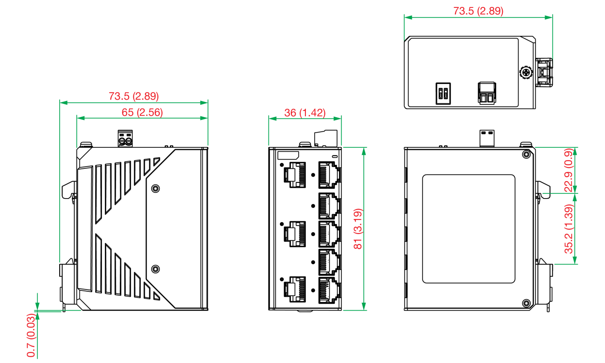

### Specifiche Fisiche

| Parametro | Valore |
|-----------|--------|
| Dimensioni | 36 x 81 x 65 mm (1.42 x 3.19 x 2.56 in) |
| Peso | 180 g (0.4 lb) |
| Alloggiamento | Metallo |
| Grado di protezione | IP40 |
| Installazione | Guida DIN, staffa a parete (kit opzionale) |
| Temperatura operativa (standard) | -10 a 60°C (14 a 140°F) |
| Temperatura operativa (modello -T) | -40 a 75°C (-40 a 167°F) |
| Umidità relativa | 5 a 95% (senza condensa) |
| Temperatura di stoccaggio | -40 a 85°C (-40 a 185°F) |
| MTBF | 3.404.784 ore |
| Garanzia | 5 anni |

(display)=
## Display Touch Screen

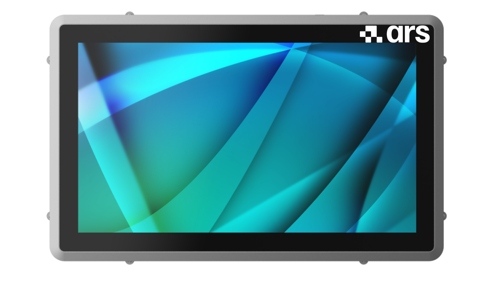

| Voce                  | Specifiche                                      |
|-----------------------|-------------------------------------------------|
| Schermo Touch         | Capacitivo                                     |
| Ingresso Video        | 1x VGA<br>1x DP<br>1x DVI-D                     |
| Alimentazione         | 12~32 Vdc (Assorbimento 30W)                    |
| Montaggio             | Montaggio a pannello                           |
| Dimensioni Esterne    | (L) 560 mm x (P) 350 mm x (A) 60 mm            |
| Peso                  | 7 kg                                           |
| Protezione            | IP66 (parte frontale)                          |
| Temperatura Operativa | 0 ~ 50°C                                       |
| Temperatura Stoccaggio| -20 ~ +65°C                                    |
| Umidità               | < 90% senza condensa                           |
| Certificazioni        | CE                                             |

## Ring Light

| Parametro | Valore |
|------------|---------|
| **Colore LED** | Bianco |
| **Tensione** | 24 VDC |
| **Consumo di potenza** | 16 W max |
| **Materiale del corpo** | Lega di alluminio, Resina |
| **Temperatura di esercizio** | da 0 a +40 °C |
| **Lunghezza cavo** | 0,3 m |
| **Metodo di raffreddamento** | Aria naturale |
