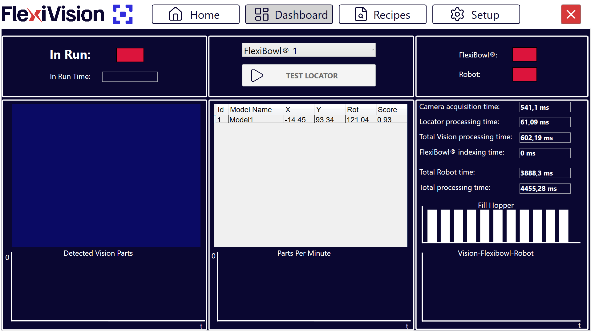

(dashboard)=
# **Application Monitoring: Dashboard**

The **Dashboard** is the main interface for real-time monitoring of the FlexiVision One system. On this page it is possible to verify process efficiency, analyze cycle times, validate component recognition, and identify any bottlenecks in the system.

---

## Interface overview

The Dashboard interface is divided into four main sections:



1. [**Operational Control**](controllooperativo): commands and execution status
2. [**Vision Analysis**](analisivisione): display of detected parts and details
3. [**Performance Indicators**](indicatoriperformance): connectivity and cycle times
4. [**Graph Analysis**](analisigrafica): historical productivity and timing graphs

---

(controllooperativo)=
## Operational Control - commands and execution status

```{list-table}
:header-rows: 1
:widths: 25 75

* - Element
  - Description and function
* - **In Run**
  - Status indicator showing whether the system is currently operating.  
    **Green** 🟢: system active and running.  
    **Red** 🔴: system stopped or paused.
* - **In Run Time**
  - Displays the total system operating time since application startup.
* - **FlexiBowl selection**
  - Dropdown menu used to select the specific FlexiBowl to monitor.
* - **Test Locator**
  - Captures an image of the viewing area and starts recognition of the parts currently present.
```

```{tip}
**Test Locator**

Useful for:
- verifying that parts are actually recognized by the vision system
- checking Clearance reliability if a collision occurred between the robot and a component
```

---

(analisivisione)=
## Vision Analysis

The center of the Dashboard displays the data related to the components identified by the vision system.

### Detected Vision Parts

**Detected Vision Parts** shows:
- the real-time image acquired by the camera
- a **historical chart** of detections over the last 30 seconds, showing the trend of recognized parts per acquisition

### Detected models table

**Recognized component details**

The table below the image lists all components present in the pick area with the following parameters:

```{list-table}
:header-rows: 1
:widths: 15 20 65

* - Field
  - Data Type
  - Description
* - **Id**
  - Integer
  - Progressive unique identifier of the component, `0`, `1`, `2`, and so on.  
    `Id 0` = component with the highest score, best match to the model when sorted by descending Score as recommended.
* - **X**
  - Millimeters
  - X coordinate of the component.
* - **Y**
  - Millimeters
  - Y coordinate of the component.
* - **Rot (Rotation)**
  - Degrees
  - Rotation angle of the component.
* - **Score**
  - Percentage
  - Percentage value, `0.00-1.00` or `0%-100%`, expressing recognition reliability. It represents similarity to the reference model. Higher score means better correspondence.
```

```{list-table} **Score interpretation**

* - **Score > 0.90, 90%**
  -
    - Excellent match to the model
    - High-confidence picking

* - **Score 0.80-0.90, 80-90%**
  -
    - Good match
    - Safe picking if Accept Threshold is configured correctly

* - **Score 0.70-0.80, 70-80%**
  -
    - Acceptable match
    - Verify consistency over time

* - **Score < 0.70, below 70%**
  -
    - Poor match
    - If recurrent, review the model or the Accept Threshold
```

---

(indicatoriperformance)=
## Status and Performance Indicators

### Connectivity

Status indicators for communication with external devices:

```{list-table}
:header-rows: 1
:widths: 25 75

* - Indicator
  - Description
* - **FlexiBowl**
  - Status of the hardware connection between the VisionController and the FlexiBowl.  
    **Green**: connected and communicating.  
    **Red**: disconnected or communication error.
* - **Robot**
  - Status of communication with the robot.  
    **Green**: TCP/IP connection established.  
    **Red**: disconnected or communication timeout.
```

```{warning}
**Actions in case of disconnection**

**FlexiBowl red**:
- Verify the Ethernet cable from FlexiBowl to VisionController
- Check FlexiBowl power supply
- Verify FlexiBowl IP in FlexiBowl Setup
- Try reconnecting or restarting the software

**Robot red**:
- Verify the Ethernet cable from robot to VisionController
- Check that the robot has opened the TCP/IP connection
- Verify the TCP/IP port in Robot Setup
- Check the robot program, VisionController IP address and port entered correctly in Robot Setup

In production, both indicators must always be green.
```

### Timing analysis

The system provides a detailed breakdown of cycle times in order to identify bottlenecks and optimize the process.

```{list-table}
:header-rows: 1
:widths: 35 65

* - Time Item
  - Description
* - **Camera Processing Time**
  - Time required for image acquisition from the camera sensor. Includes exposure time and data transfer.
* - **Locator Processing Time**
  - Time required by the vision algorithm to locate and recognize the components in the acquired image. It depends on the number of active models, model complexity, and number of Clearances.
* - **Total Vision Processing**
  - Sum of Camera and Locator times. It represents the total time required by the vision system to process one image and send the coordinates.
* - **Total FlexiBowl Time**
  - Time required by the FlexiBowl to execute a complete movement sequence.
* - **Total Robot Time**
  - Estimated or measured time for the complete robot Pick and Place operation. Includes approach, grasp, lift, deposit, and return.
* - **Total Processing Time**
  - Total time of the complete cycle, Vision plus FlexiBowl plus Robot. It represents the time from the start of one cycle to the start of the next. It determines the maximum theoretical productivity, PPM.
```

```{tip}
**How to interpret timings for optimization**

The timing graph makes it possible to identify the **system bottleneck**:

**If Total Vision Processing is the largest**
- Too many active models -> disable models that are not required
- Models too complex -> simplify them using a higher Score Threshold
- Too many Clearances -> reduce the number or size of the Clearances
- Camera Processing too high -> reduce exposure time

**If Total FlexiBowl Time is the largest**
- Too many pauses -> optimize Flip and Move synchronization and reduce stabilization pause, Pause X ms
- Movement sequence too slow -> increase speed in Config FlexiBowl
- Rotation angle too large -> reduce Move Angle
- Shake too long -> increase SHAKE speed and reduce SHAKE cycles

**If Total Robot Time is the largest**
- Robot trajectory not optimized -> optimize robot path planning
- Robot speed too low -> increase movement speed if safe
- Deposit distance too large -> reposition the deposit point closer
- Gripper opening and closing too slow -> optimize gripper timing

**Optimization goal**: balance the three times to reduce overall Total Processing Time.
```

---

(analisigrafica)=
## Graph Analysis

The graphs in the lower part of the Dashboard enable predictive and diagnostic analysis of system performance over time.

### 1. Parts Per Minute, PPM

```{list-table}
* - **Productivity graph**
  - Shows average system productivity expressed as **parts picked per minute**, Parts Per Minute.

* - **Characteristics**
  -
    - X axis: time
    - Y axis: PPM
    - Trend line: moving average used to identify trends

* - **Usage**
  -
    - Monitor productivity stability over time
    - Identify performance degradation
    - Compare actual throughput with theoretical throughput
```

```{tip}
  :::{list-table} **PPM interpretation**

    * - **PPM constant and stable**
      -
        - ✓ System well configured
        - ✓ Parameters optimized
        - ✓ No critical bottleneck

    * - **PPM gradually decreasing**
      -
        - ⚠️ Possible component wear, for example FlexiBowl grip surface
        - ⚠️ Hopper running low, if present, lower pressure means slower discharge
        - ⚠️ Dirt accumulation on camera or lighting

    * - **PPM with wide fluctuations**
      -
        - ⚠️ Process instability
        - ⚠️ Intermittent recognition issues
        - ⚠️ External interference, vibration or variable light

    * - **Corrective actions**
      -
        - Analyze correlation with timing graphs
        - Identify which subsystem, Vision, FlexiBowl, or Robot, causes the variation
        - Intervene on the specific parameters
  :::
```

### 2. Fill Hopper

```{list-table}
* - **Hopper activation graph**
  - Represents the history of discharge pulses sent to the hopper, useful for monitoring component stock autonomy.

* - **Characteristics**
  -
    - X axis: time
    - Y axis: Hopper activations, events
    - Peaks: each peak represents one discharge activation

* - **Usage**
  -
    - Predict when to physically refill the hopper
    - Verify hopper configuration effectiveness
    - Identify anomalies in discharge behavior
```

```{tip}
  :::{list-table} **Fill Hopper pattern analysis**

    * - **Regular and constant activations**
      -
        - ✓ Hopper configuration optimal
        - ✓ Stable and predictable part flow
        - ✓ Autonomy can be estimated, for example one activation every 10 minutes

    * - **Increasingly frequent activations**
      -
        - ⚠️ Hopper is running low, fewer parts mean more activations needed to maintain level
        - ⚠️ Discharge Time insufficient for reduced volume
        - **Action**: schedule hopper refill soon

    * - **No activation for a long period**
      -
        - ⚠️ Robot stopped or slowed down, parts are not being consumed
        - ⚠️ Possible system issue, no request for parts
        - **Action**: verify production status

    * - **Very close activations, burst**
      -
        - ⚠️ Hopper threshold configured incorrectly, too high
        - ⚠️ Steps insufficient, parts do not arrive in time
        - **Action**: review Hopper configuration
  :::
```

### 3. Vision - FlexiBowl - Robot, comparative graph

```{list-table}
* - **Overlapped timing graph**
  - A comparative three-line graph that overlays process times over time.

* - **Usage**
  - Instantly identify which process affects total cycle time the most and how it changes over time.
```

---

## Quality monitoring - critical indicators to monitor

```{list-table}
* - **Component score**
  - Make sure that the **Score** of detected components remains consistently above the tolerance threshold, Accept Threshold, configured during model setup.

* - **Score monitoring**
  -
    - Periodically check the Detected Models table
    - Verify that typical scores are in the `0.85-0.95` range
    - Investigate if scores regularly drop below `0.80`

* - **Progressive score decrease**
  -
    - ⚠️ Real parts differ from the training part, production variation
    - ⚠️ Lighting changed, weaker backlight or dirt
    - ⚠️ Camera no longer in focus, vibration or impacts
    - ⚠️ FlexiBowl surface dirty, interfering pattern

* - **Corrective actions**
  -
    - Clean the camera, lighting, and FlexiBowl surface
    - Verify camera focus
    - Consider retraining the model if the parts have changed
    - Reduce Accept Threshold if scores are still reliable but lower
```

---

## Best practices for production monitoring

### Daily checks

```{list-table}
* - **At production start, 5 minutes**
  -
    - Verify FlexiBowl and Robot connectivity indicators, green
    - Check that the first cycles show normal scores, above `0.85`
    - Observe that PPM stabilizes around the expected value

* - **During production, every 1-2 hours**
  -
    - Check PPM to verify stability
    - Check Fill Hopper to predict required refill
    - Verify absence of errors or warnings in the log

* - **At end of shift, 2 minutes**
  -
    - Record average shift PPM
    - Check the number of hopper activations
    - Verify anomalies or events
    - Compare with the previous day
```

This minimal routine guarantees fast identification of problems and preserves performance traceability.

### Performance reporting

```{tip} **Key metrics to track**
For performance evaluation over time, track:

  :::{list-table}

    * - **Daily**
      -
        - Average shift PPM
        - Total number of picked parts
        - Number of hopper activations
        - Total downtime and causes

    * - **Weekly**
      -
        - PPM trend, increasing or decreasing
        - Comparison between theoretical and actual PPM
        - Average score of detected components
        - Configuration changes and their impact

    * - **Monthly**
      -
        - Overall Equipment Effectiveness, OEE
        - Analysis of the main bottlenecks
        - Need for predictive maintenance
        - System ROI
  :::

This data supports continuous optimization and justifies investment in improvements.
```

---

```{tip}
**System fully operational**

The FlexiVision One system is now fully configured, optimized, and validated for production.

**Completed path summary**
- ✓ hardware setup, FlexiBowl, Robot, Camera
- ✓ complete calibration, Camera and Robot
- ✓ part models created and optimized
- ✓ FlexiBowl configured for optimal movement
- ✓ Hopper configured for automatic feeding, if present
- ✓ system validated through Dashboard monitoring
- ✓ performance verified and stable

The system is ready to operate in production with minimal supervision. Use the Dashboard for continuous monitoring and long-term optimization.

**Total time invested**: 4-8 hours, first complete system

**Result**: fully autonomous and optimized robotic picking system
```

---

Once the system has been validated through the Dashboard:

**-> [Troubleshooting](../TROUBLESHOOTING/26_trb_shooting_guide.md)** - guide to solving common issues

**-> [Support](../27_Support.md)** - technical support contacts
