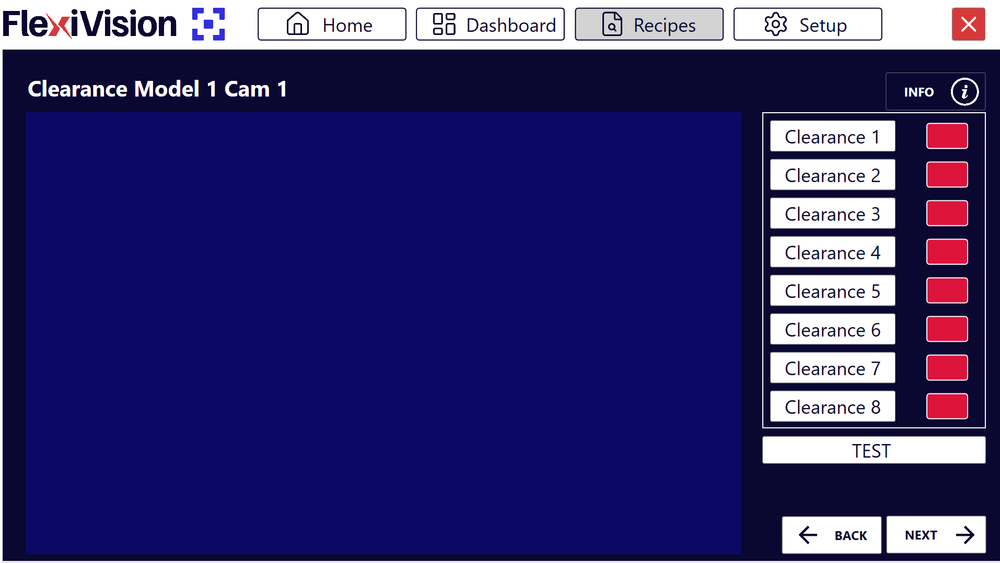
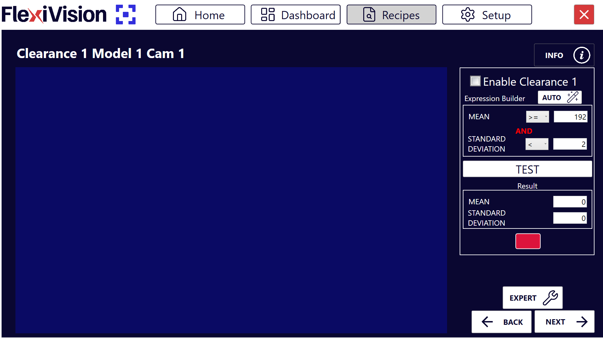
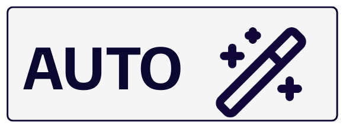
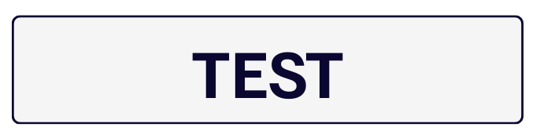

(istogrammi)=
# **Clearances**

This page explains how to configure Clearances in order to verify that critical areas are free from obstacles.

**What is a Clearance?**  
A **Clearance** in FlexiVision One is a tool that monitors a specific image area to verify that it is free. It is used, for example, to check that the space required by the gripper to pick the component is not occupied by other objects.

````{note} Operating principle

The Clearance analyzes grayscale level variations inside a defined area:
- 🟢 **Green** -> area free, OK for picking
- 🔴 **Red** -> area occupied, obstacle present
````

:::{attention}
The use of Clearances varies depending on the part for which the model is created. This evaluation is the responsibility of the person creating the application.
:::

---

(setupclearances)=
## **Step 1: Physical setup**

:::{danger} **Warning**
  The following procedure is shown using a gripper tool, because it requires mandatory Clearance configuration for the models. Other robot tools may not need Clearances to simulate their occupied area.
:::

:::{video} ../../../../../_shared/media/videos/Step1.mp4
    :width: 100%
    :align: center
:::

````{list-table}
:widths: 5 95

* - **1**
  - From the **robot pendant**:
    - select the **frame** and **tool** calibrated on FlexiVision One
    - move the **last axis** of the tool to **zero rotation**, `Rz = 0°`
* - **2**
  - Simulate a pick:
    - open the gripper
    - bring the robot tool over the component at surface level, as if grasping it
* - **3**
  - Position **two objects** on the sides of the gripper so that, once the robot is removed, the free areas between the reference component and the two objects remain visible.  
  These areas will represent the occupied space of the robot gripper.

    :::{important}
    Leave the objects slightly farther away than strictly necessary to avoid errors during model creation, typically by 2 to 3 mm.
    :::

* - **4**
  - Note the coordinates:
    - save the coordinates of the robot last axis:
      - **X**, the X coordinate
      - **Y**, the Y coordinate
      - **Rz**, rotation around Z

    :::{important}
    Write these coordinates down. They will be essential during robot calibration.
    :::
* - **5**
  - Move the robot away using the pendant **without moving anything** on the surface
````

---

## **Step 2: Access the Clearance page**

````{list-table}
:widths: 5 95

* - **6**
  - From the **Locator Model** page, after clicking **Next**, the list of available Clearances opens, up to 8 per model.

    :::{dropdown} **Clearances page**

      

      | Element | Description |
      |----------|-------------|
      | **Clearance 1...8** | Available slots to create up to 8 different Clearances for the same model |
      | **Test (global)** | Button used to test all enabled Clearances simultaneously |
      | **Next** | Moves to the following phase, Robot Pick, after Clearance configuration |
    :::
* - **7**
  - Click **Clearance 1**, opening the configuration page for the first Clearance

    :::{dropdown} **Clearance 1 page**

      

      | Parameter | Function |
      |-----------|----------|
      | **Enable Histogram** | Activates this Clearance and makes it operational |
      | **Expression Builder** | Tool used to configure detection thresholds automatically |
      | **Mean and Standard Deviation** | Statistical values calculated on the selected area |
      | **Test** | Immediate verification of Clearance operation |
      | **Result** | Visual status indicator, Green = OK, Red = Triggered |
    :::
````

---

## **Step 3: Activate and position the area**

:::{video} ../../../../../_shared/media/videos/Step3.mp4
    :width: 100%
    :align: center
:::

````{list-table}
* - **8**
  - Click **Enable Clearance** to activate the Clearance
* - **9**
  - Move the **Clearance box** to the area that must remain free
      - Typical cases: gripper picking area, one Clearance for each gripper side
      - Margins around the component
      - Robot transit zones
    :::{important}
    Always consider these two important points:
    - When configured, the Clearance ROI must be completely free, with no objects, shadows, or artifacts
    - Always create a Clearance slightly larger than the strictly necessary space to avoid false errors

    Failure to respect these two points may cause robot collisions, with possible damage to the FlexiBowl, components, or the robot itself.
    :::
````

---

## **Step 4: Automatic configuration**

:::{video} ../../../../../_shared/media/videos/Step4.mp4
    :width: 100%
    :align: center
:::

````{list-table}
* - **10**
  - Click  in **Expression Builder**
* - **11**
  - Click 
* - **12**
  - Verify that the box turns **green**
* - **13**
  - Click 
````

````{warning}
**What to do if the test fails, red box**

If the box turns red after AUTO:

**Possible causes:**
- Something is actually present in the area, such as a part, shadow, or dirt
- Lighting changed between AUTO configuration and TEST
- The selected area includes FlexiBowl edges or artifacts

**Solutions:**
1. Visually verify that the area is completely free
2. Repeat AUTO with stable lighting conditions
3. Run TEST again to confirm the result
````

---

## Multiple Clearances - when to use them

Create multiple Clearances when:
- The robot tool is a gripper, because one Clearance is needed for each of the two areas occupied by the gripper beside the reference component
- There are multiple critical points to monitor
- The pick area has particular geometries

### **Step 2-3: Repeat**

Select a new Clearance from the Clearances list page, such as **Clearance 2**, and repeat Steps 2 and 3.
Repeat the procedure for every required Clearance, up to 8 per model.

### **Step 4: Complete test**

On the page listing all Clearances, click **TEST** to display and verify all enabled Clearances at the same time.

---

## Status interpretation

### Clearance states

````{list-table}
:header-rows: 1
:widths: 15 35 50

* - Color
  - State
  - Meaning
* - 🟢 Green
  - OK
  - Area free, picking possible
* - 🔴 Red
  - Triggered
  - Area occupied, picking not possible
````

### What does "Triggered" mean?

A Clearance becomes red, triggered, when it detects inside the monitored area:
- Presence of other components
- Significant shadows or reflections
- Any element that makes the area not free

---

## **Step 5: Finalization**

````{list-table}
* - **14**
  - After configuring all required Clearances, click **Next**
* - **15**
  - The **Robot Model Pick Cam** page opens
````

````{seealso}
Proceed to [Robot Calibration](robotpick) to complete the configuration.
````
