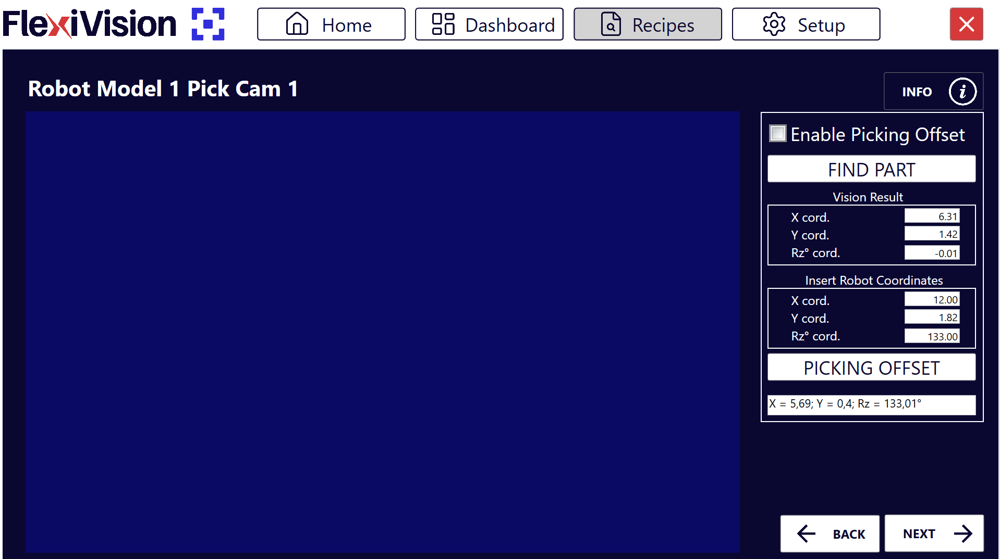
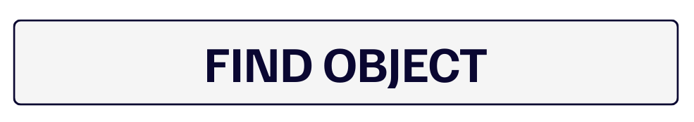
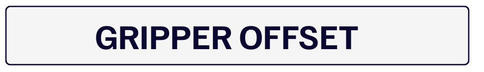
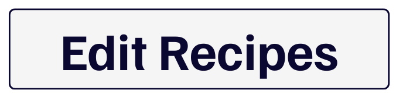

(robotpick)=
# **Robot Pick Calibration**

This page explains how to connect vision coordinates with robot coordinates to allow accurate component picking.

**What is Robot Pick?**  
The **Robot Pick** function calculates the offset between the coordinates detected by FlexiVision One and the real robot coordinates, allowing the robot to pick components in the correct position.

```{danger}
**Robot coordinates are mandatory**

This phase **REQUIRES** the X, Y, and Rz coordinates saved during the physical setup preparation, Step 1 of the [Clearances](setupclearances) section.

Without these coordinates, calibration cannot be completed. If they were lost or forgotten, the entire physical robot preparation must be repeated.
```

---

## Robot Pick interface overview

After clicking **Next** on the Clearances page, the **Robot Model Pick** page opens.



| Section | Parameter | Function |
|-----------|-----------|----------|
| Enable | **Enable Robot Pick** | Activates robot calibration |
| Vision Result | **X cord** | X coordinate detected by vision |
| Vision Result | **Y cord** | Y coordinate detected by vision |
| Vision Result | **RZ cord** | Z rotation detected by vision |
| Insert Robot Coordinate | **X cord** | Robot X coordinate to be entered manually |
| Insert Robot Coordinate | **Y cord** | Robot Y coordinate to be entered manually |
| Insert Robot Coordinate | **RZ cord** | Robot Z rotation to be entered manually |

| Function | Description |
|----------|-------------|
| **Find Object** | Detects the component and displays vision coordinates |
| **Picking Offset** | Calculates the offset required for correct picking |

---

## **Step 1: Activate and detect the component**

:::{video} ../../../../../_shared/media/videos/Step1_robot.mp4
    :width: 100%
    :align: center
:::

```{list-table}
* - **1**
  - Click **Enable Robot Pick**
* - **2**
  - Click :
      - The system detects the reference component
      - The coordinates appear in the **Vision Result** section

      :::{note} Vision Result
      These are the coordinates FlexiVision One "sees" in the image. They are not yet linked to the robot coordinate system.
      :::
```

## **Step 2: Enter robot coordinates and calculate the offset**

:::{video} ../../../../../_shared/media/videos/Step2_robot.mp4
    :width: 100%
    :align: center
:::

```{list-table}
* - **3**
  - In the **Insert Robot Coordinates** box, enter the coordinates saved during model creation:
      - **X cord** -> X coordinate noted in Step 1 of [Clearance Creation](setupclearances)
      - **Y cord** -> Y coordinate noted in Step 1 of [Clearance Creation](setupclearances)
      - **RZ cord** -> Z rotation noted in Step 1 of [Clearance Creation](setupclearances)

      :::{danger}
      Use the coordinates saved during model setup. Without these coordinates, calibration will be wrong.  
      Coordinates must be entered with **maximum precision**:
      - Copy the values exactly as written, including decimals
      - **DO NOT round** them, for example `450.23` is not the same as `450.2` or `450`
      - Verify that X and Y have not been swapped
      - Check the sign of each coordinate, positive or negative

      Errors at this stage cause completely incorrect robot offsets, resulting in pick attempts in the wrong positions, even with errors of several centimeters. Failing to respect these points may also cause robot collisions and damage to the FlexiBowl, components, or the robot itself.
      :::
* - **4**
  - Click 
      - The system automatically calculates the transformation between vision coordinates and robot coordinates
      - This offset will be applied to all future detections
```

---

```{admonition} **How the Gripper Offset works**
:class: info
The system compares:
- **Vision Coordinates**: where FlexiVision One sees the component origin
- **Robot Coordinates**: where the robot actually grasped the component

It calculates the difference and stores it as an **offset**. This offset is then applied to all components detected in the future, ensuring that the robot always picks in the correct position.
```

---

## **Step 3: Finalization and saving**

```{list-table}
* - **5**
  - By clicking , the workflow returns to the recipes page 
* - **6**
  - Click  to save the full configuration

      :::{admonition} Complete save
      :class: success
      The save includes:
      - ✓ created model
      - ✓ working area, ROI
      - ✓ tolerances, Accept Threshold
      - ✓ configured Clearances
      - ✓ robot calibration, Gripper Offset
      :::
```

---

## Multiple models - add additional models

### **Step 4: Additional models, optional**

```{list-table}
* - **7**
  - To create additional models in the same recipe:
      - Return to 
      - Select a new model slot that has not yet been configured
      - Repeat the entire procedure starting from [Model Creation](nuovomodello)

      :::{tip}
      Each model inside the recipe can have different settings, such as ROI, Clearance, and offset, allowing management of components with different characteristics within the same application.
      :::
```

---

## Final verification

Before considering the recipe complete, continue with:

- [FlexiBowl Configuration](configfb)
- [Hopper Configuration](confighopper)
- [Application Monitoring](dashboard)

```{seealso}
- [Troubleshooting](troubleshooting)
```

---

[Back To Top]()
