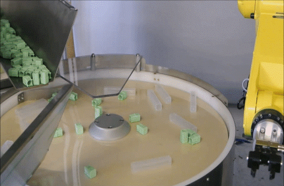

# **Überblick über die Mix-Anwendung**
Dieser Abschnitt stellt das Konzept der Mix-Anwendung in FlexiVision One vor und erläutert, worin sich diese von einer Standardanwendung unterscheidet und wie sie auf Rezept- und Vorlagenebene korrekt konfiguriert wird.

---

## Was ist eine Mix-Anwendung?

Eine **Mix-Anwendung** ist eine Anwendungskonfiguration, bei der innerhalb desselben Rezepts Vorlagen für **völlig unterschiedliche Komponenten** nebeneinander existieren.

In einer Mix-Anwendung ist der Roboter in der Lage, **mehrere verschiedene Arten von Teilen**, die gleichzeitig im Arbeitsbereich vorhanden sind, zu erkennen und zu entnehmen, ohne das Rezept wechseln oder den Zyklus unterbrechen zu müssen. Das Bildverarbeitungssystem identifiziert jedes auf dem FlexiBowl® vorhandene Teil und gibt dem Roboter die Koordinaten des am besten geeigneten entnehmbaren Teils zurück, unabhängig von dessen Art.

  
*Beispiel für eine Mix-Anwendung*

```{tip}
**Typisches Beispiel:** Auf dem FlexiBowl® können gleichzeitig Schrauben, Muttern und Unterlegscheiben liegen. Der Roboter entnimmt jedes erkannte Teil und optimiert so den Throughput ohne Unterbrechungen.
```

---

## Standardanwendung vs. Mix-Anwendung

| Merkmal | Standard-Anwendung | Mix-Anwendung |
|---|---|---|
| **Werkstücktypen** | Nur ein Werkstücktyp | Mehrere, völlig unterschiedliche Werkstücktypen |
| **Modelle im Rezept** | Alle Modelle beziehen sich auf dasselbe Bauteil | Die Modelle können sich auch auf unterschiedliche Bauteile beziehen |
| **Verhalten des Roboters** | Entnimmt immer dasselbe Werkstück, auch an unterschiedlichen Positionen (wodurch mehrere Modelle entstehen) | Entnimmt jedes erkannte Werkstück, unabhängig vom Typ |
| **Softwarekonfiguration** | Kein Unterschied zum Mix-Modus | Kein Unterschied zum Standardmodus |
| **Auswahl des Modus** | Nicht erforderlich: hängt von den im Rezept enthaltenen Modellen ab | Nicht erforderlich: hängt von den im Rezept enthaltenen Modellen ab |
| **Roboter-Steuerung** | Familie `start_..` | Familie `mix_..` |

```{note}
Auf Softwareebene gibt es keine explizite Auswahl zwischen dem Standard- und dem Mix-Modus: Die Unterscheidung ergibt sich ausschließlich aus dem **Inhalt des Rezepts.** Wenn sich alle vorhandenen Modelle auf dasselbe Teil (oder dessen verschiedene Seiten) beziehen, handelt es sich um eine Standardanwendung. Wenn sich die Modelle auf verschiedene Teile beziehen, handelt es sich automatisch um eine Mix-Anwendung.
```

---

## Wie wird ein Mix-Rezept erstellt?

Der Prozess der Erstellung eines Mix-Rezepts ist **identisch** mit dem eines Standardrezepts. Es ist nicht erforderlich, zuvor eine Option auszuwählen. Befolgen Sie daher das Verfahren unter [Erstellen von Rezepten und Modellen - Überblick](../QUICKSTART/Nuovo_Modello/16_Nuovo_modello.md)

Der Unterschied zeigt sich in der **Phase der Modellerstellung**:

- In einer **Standard**-Anwendung stellen alle im Rezept eingegebenen Modelle dasselbe Bauteil dar (z. B.: Seite A, Seite B, Seite C desselben Teils).
- In einer **Mix**-Anwendung stellen die eingegebenen Modelle **völlig unterschiedliche Bauteile** dar (z. B.: Teil A, Teil B, Teil C — drei unterschiedliche Komponenten mit unterschiedlichen Geometrien).
```{important}
Jedes Modell innerhalb eines Mix-Rezepts muss separat mit seinem eigenen physischen Referenzteil trainiert werden, wobei das in [Ein Neues Modell erstellen](../QUICKSTART/Nuovo_Modello/18_NuovoModello.md) beschriebene Standardverfahren zu befolgen ist. Die Freiräume und die Koordinaten des Roboter-Pickers müssen für jede Komponente einzeln kalibriert werden.
```

---

## Nächste Schritte

Sobald das Konzept der Mix-Anwendung verstanden und das Rezept mit den Vorlagen der verschiedenen Komponenten konfiguriert ist, besteht der nächste Schritt darin, die für den Mix-Modus erforderliche **Roboter-Steuerung** anzupassen:

**→ [Steuerungen Mix-Anwendung](29_Comandi_Mix.md)**

