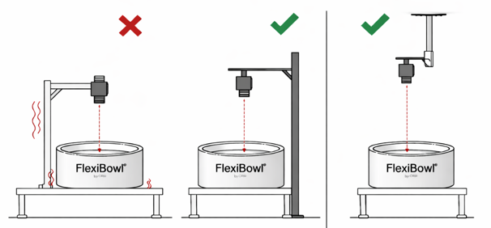
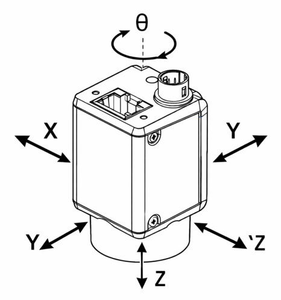
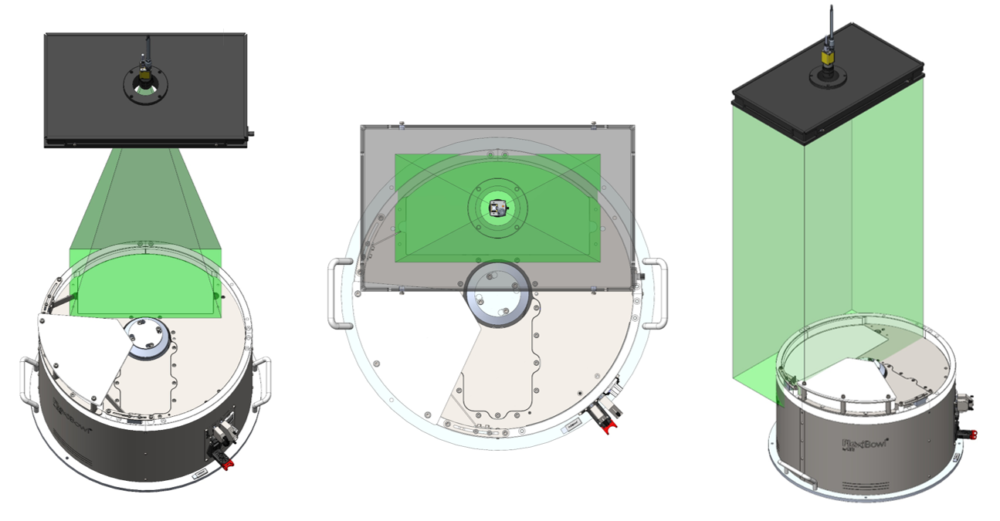
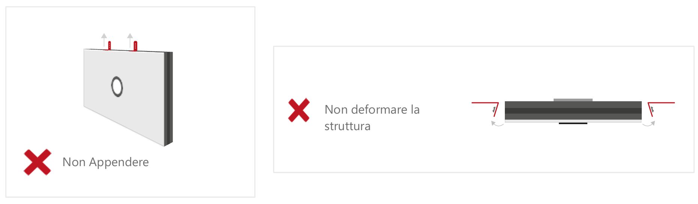
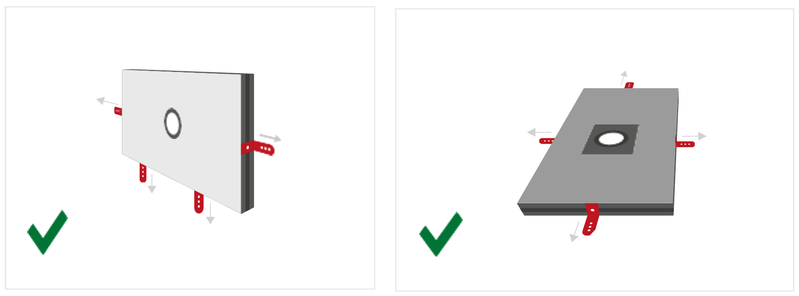
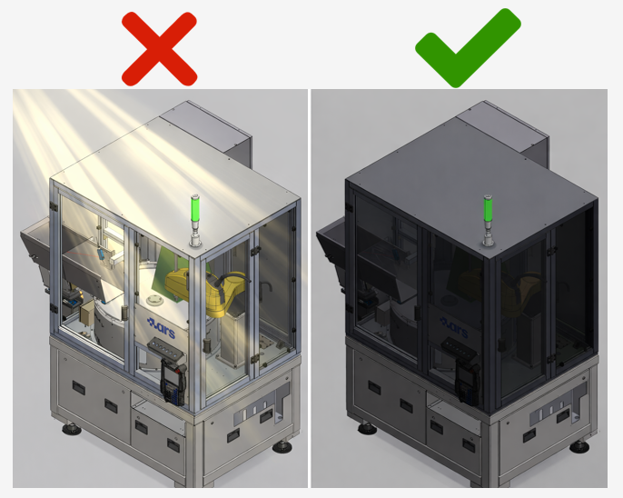

(Installazione_Meccanica)=
# **Mechanische Installation des Systems**

In diesem Abschnitt werden die Montage- und Positionierungsanforderungen für die Hauptkomponenten des FlexiVision One Bildverarbeitungssystems beschrieben. Die Installation sollte erst erfolgen, nachdem die mechanische Grundinstallation der FlexiBowl® und des Trichters, sofern vorhanden, abgeschlossen ist.

```{warning}
**Erforderliche Voraussetzungen**

Bevor Sie mit der Installation der Bildverarbeitungskomponenten fortfahren, stellen Sie sicher, dass:

- der FlexiBowl® montiert und an der Tragkonstruktion (Roboterzelle) befestigt wurde
- Der Trichter korrekt installiert wurde
- die Halterung für Kamera und Beleuchtung vorbereitet wurde

Für die Installation der FlexiBowl® lesen Sie bitte das mitgelieferte Handbuch.
```

```{note}
**Erforderliche Fachkenntnisse**

Die mechanische Installation erfordert:
- Grundkenntnisse in der mechanischen Montage
- Verwendung von Messwerkzeugen (Messschieber, Wasserwaage, Maßband)
- Fähigkeit zum Lesen technischer Zeichnungen
```

---

## Montage des VisionControllers

Der VisionController (Industrie-PC) steuert die Bildverarbeitung und die Kommunikation mit dem Roboter.
Da es sich um eine empfindliche elektronische Komponente handelt, erfordert sie eine sorgfältige Positionierung, um eine ausreichende Belüftung und den Schutz vor Verunreinigungen zu gewährleisten.

### *Technische Daten*
```{figure} ../../../../_shared/media/images/Dim_PC.png
:alt: Dimensioni VisionController
:align: center
:width: 80%
```

```{list-table}
:header-rows: 1
:widths: 40 60
* - **Schraubenlöcher**
  - M5
* - **Merkmal**
  - **Wert**
* - Breite (gesamt mit Halterungen)
  - 245,00 mm
* - Breite (Gehäuse)
  - 227,00 mm
* - Breite der Anschlussleiste
  - 200,00 mm
* - Höhe (gesamt mit Halterungen)
  - 123,00 mm
* - Höhe (Gehäuse)
  - 120,00 mm
* - Tiefe
  - 61,10 mm
```

### *Montageanforderungen*

```{list-table}
:header-rows: 1
:widths: 35 65

* - Anforderungen
  - Spezifikationen
* - **Empfohlener Standort**
  - Im Schaltschrank oder auf einer dafür vorgesehenen Platte in der Nähe der Roboterzelle
* - **Lüftungsraum**
  - Mindestens 50 mm auf allen Seiten für die Luftzirkulation
* - **Befestigung**
  - 35-mm-DIN-Schiene oder M5-Schrauben auf der Platte
* - **Umgebungstemperatur**
  - 1°C ~ +50°C (siehe vollständige Spezifikationen im Abschnitt [Spezifikationen VisionController](specifiche_VC))
* - **Schutzart**
  - mindestens IP40 (Montage in Schaltschrank mit Schutzart IP54 empfohlen)
```

### *Installationsverfahren*

#### *Montage mit Bohrungen*

```{list-table} 
   :header-rows: 1
   :widths: 35 65

   * - Schritt
     - Beschreibung der Vorgehensweise
   * - **1. Vorbereitung der Halterung**
     - Bohren Sie die Löcher gemäß den Anweisungen im Datenblatt
   * - **2. Auspacken**
     - Nehmen Sie den VisionController aus der Verpackung und achten Sie dabei darauf, die Anschlüsse nicht zu beschädigen. Überprüfen Sie die Unversehrtheit des Produkts.
   * - **3. Befestigung**
     - Befestigen Sie den VisionController mit M5-Schrauben
```

#### *Montage mit DIN-Schiene*

```{list-table} 
   :header-rows: 1
   :widths: 35 65

   * - Schritt
     - Beschreibung der Vorgehensweise
   * - **1. Vorbereitung der** **Halterung**
     - Überprüfen Sie, ob die Schiene sauber und fest befestigt ist.
   * - **2. Auspacken**
     - Nehmen Sie den VisionController aus der Verpackung und achten Sie dabei darauf, die Anschlüsse nicht zu beschädigen. Überprüfen Sie die Unversehrtheit des Produkts.
   * - **3. Befestigung**
     - Befestigen Sie das Gerät, indem Sie es auf die Schiene schieben, bis es einrastet.
```

```{warning}
**Belüftung**

Der VisionController erzeugt während des Betriebs Wärme. Sorgen Sie stets für mindestens 50 mm Freiraum um das Gerät herum.
Andernfalls kann es zu folgenden Problemen kommen:
- Überhitzung und automatische Abschaltung
- Verminderte Leistung
- Beschädigung interner Komponenten
```

---

## Befestigung der Kamera

Die genaue Positionierung und Ausrichtung der Kamera sind entscheidende Schritte, die sich direkt auf die Genauigkeit der Kalibrierung und die Leistung des Kommissioniersystems auswirken.


### *Optimaler Arbeitsabstand*

Die Kamera muss so montiert werden, dass die Vorderseite des Objektivs in einem bestimmten Abstand (Working Distance) zur Arbeitsfläche des FlexiBowl® positioniert ist.
Eine detaillierte Berechnung des optimalen Abstands für Ihre Anwendung finden Sie im entsprechenden Abschnitt: [Berechnung des optimalen Arbeitsabstands](distanza_lavoro)

```{image} ../../../../_shared/media/images/working_distance.JPG
:alt: Arbeitsabstand
:width: 40%
:align: center
```

```{list-table}
:header-rows: 1
:widths: 25 40 35

* - Modell FlexiBowl®
  - Empfohlener Arbeitsabstand (Working Distance)
  - Im Kit enthaltenes Objektiv (Brennweite)
* - **FB 200**
  - 800 mm 
  - 35 mm
* - **FB 350**
  - 1000 mm
  - 35 mm
* - **FB 500**
  - 1000 mm
  - 25 mm
* - **FB 650**
  - 1000 mm
  - 16 mm
* - **FB 800**
  - 1000 mm
  - 16 mm
* - **FB 1200**
  - 1300 mm
  - 12 mm
```

### *Positionierung und Ausrichtung*

Die korrekte Ausrichtung der Kamera ist entscheidend für die Aufnahme hochwertiger Bilder und die Gewährleistung der Präzision beim Picking.

**Falsche Konfigurationen.** Die Bilder zeigen Beispiele für eine falsche Positionierung der Kamera: Das Sichtfeld (rot markiert) ist gegenüber dem Sichtbereich dezentriert, sodass es den Arbeitsbereich nur teilweise abdeckt oder Bereiche außerhalb davon einbezieht. Diese Konfigurationen beeinträchtigen die Teileerkennung und die Funktion des Bildverarbeitungssystems.

```{image} ../../../../_shared/media/images/config_sbagliata.png
:alt: Arbeitsabstand
:width: 60%
:align: center
```
```{image} ../../../../_shared/media/images/config_sbagliata2.png
:alt: Arbeitsabstand
:width: 60%
:align: center
```
**Korrekte Konfiguration.** Die Kamera muss mittig zum Sichtbereich des FlexiBowl® (Hintergrundbeleuchtung-Bereich) positioniert werden. Auf diese Weise deckt das Sichtfeld (grün markiert) den gesamten Arbeitsbereich symmetrisch ab und gewährleistet so den korrekten Betrieb des Bildverarbeitungssystems.

```{image} ../../../../_shared/media/images/config_giusta.JPG
:alt: Arbeitsabstand
:width: 70%
:align: center
```

```{list-table}
* - **Zentrierung:**
  - 
    - Die Kamera muss genau über dem Sichtbereich des FlexiBowl® positioniert werden.
    - Maximale Zentriertoleranz: ±5 mm
* - **Rechtwinkligkeit:**
  - 
    - Die Kamera muss exakt parallel zur Arbeitsfläche des FlexiBowl® montiert werden.
    - Seitliche Neigungen (Tilt) oder Drehungen gegenüber der Vertikalen sind nicht zulässig
    - Maximale Neigungstoleranz: ±1°
```

```{tip}
Um die Feinabstimmung zu erleichtern und spätere Anpassungen zu ermöglichen, wird dringend empfohlen, die mechanische Halterung der Kamera so zu konstruieren, dass Mikroeinstellungen möglich sind:
- **Z-Achse (Höhe)**: -10 mm / +30 mm (zur Anpassung des Arbeitsabstands)
- **X-Achse (links-rechts)**: ±10 mm (zur Feinzentrierung)
- **Y-Achse (vorwärts-rückwärts)**: ±10 mm zur Feinzentrierung)
Diese Flexibilität ist besonders bei der Erstkalibrierung und bei eventuellen zukünftigen Neukalibrierungen von Nutzen.
```

### *Abmessungen der Kamera*
```{figure} ../../../../_shared/media/images/Dimensioni_Cam.png
:alt: Dimensioni camera CAM-CIC-5000-20G-1
:align: center
:width: 100%

Abmessungen der Kamera CAM-CIC-5000-20G-1 (mm)
```
```{list-table}
:header-rows: 1
:widths: 40 60

* - **Merkmal**
  - **Wert**
* - Breite × Höhe (Gehäuse)
  - 29 × 29 mm
* - Tiefe (Gehäuse)
  - 42,0 mm
* - Gesamttiefe (einschließlich rückseitigem Anschluss)
  - 48,9 mm
* - Frontüberstand (Objektivfassung)
  - 12,60 mm
* - Achsabstand der seitlichen Befestigungslöcher (M2)
  - 20,0 × 23,7 mm
* - Vordere Befestigungslöcher
  - 2× M2 Tiefe 3 mm
* - Seitliche Befestigungslöcher
  - 4× M2 Tiefe 3,5 mm + 3× M3 Tiefe 3,5 mm
* - Gewicht
  - 88 g
```
```{warning}
**Befestigung:**
- Verwenden Sie die 4 M3-Befestigungslöcher am Kameragehäuse
- Empfohlene Schrauben: M3 A2 / M3 8.8
- Anzugsdrehmoment: 0.5 Nm (nicht zu fest anziehen, um Verformungen zu vermeiden)
```
```{tip}
**Einstellung der Kameraposition**

Um spätere Anpassungen zu ermöglichen und Ausrichtungsprobleme zu vermeiden, sollte die mechanische Halterung so konstruiert sein, dass eine Feineinstellung in allen Achsen möglich ist:

- **Z-Achse (Höhe)**: -10 mm / +30 mm
- **X-Achse (links-rechts)**: ±10 mm
- **Y-Achse (vorwärts-rückwärts)**: ±10 mm

Eine Halterung mit fest angezogenen Schrauben ohne Einstellmöglichkeit macht es unmöglich, die Position der Kamera nach der Erstmontage zu korrigieren.
```
### *Überprüfung der Objektivbefestigung*

```{warning}
Bevor Sie mit der endgültigen Befestigung fortfahren:
1. Überprüfen Sie visuell, ob die Linse eingesetzt ist
2. Vergewissern Sie sich, dass die Brennweite für Ihr FlexiBowl®-Modell korrekt ist (Etikett auf der Linse oder Bestellunterlagen)
3. Stellen Sie sicher, dass das Objektiv vollständig aufgeschraubt ist (Metall-auf-Metall-Kontakt zwischen Objektiv und Kameragehäuse)
4. Entfernen oder lösen Sie die Linse NICHT, wenn sie bereits korrekt montiert ist.
```
### *Kamera-Installation*
Um den ordnungsgemäßen Betrieb des Bildverarbeitungssystems zu gewährleisten, muss die Kamera auf einer festen und stabilen Halterung montiert sein.
Das FlexiBowl®-System erzeugt keine Vibrationen; in automatisierten Fertigungslinien gibt es jedoch andere Vibrationsquellen (Industrieroboter, Fördersysteme, andere Maschinen der Fertigungslinie)

Wenn solche Vibrationen auf die Kamera übertragen werden, kann das aufgenommene Bild unruhig sein und die vom Bildverarbeitungssystem berechneten Koordinaten könnten unzuverlässig sein, was die Genauigkeit der robotergestützten Entnahme beeinträchtigt.



:::{tip}
Aus diesem Grund wird Folgendes empfohlen:

- Die Kamera auf einer starren und stabilen Struktur montieren

- Halterungen vermeiden, die Vibrationen von Robotern oder anderen Maschinen ausgesetzt sind

- Vorzugsweise eine maschinenunabhängige Struktur verwenden
:::

```{warning}
**Befestigungsschrauben der Kamera: Vorbeugung gegen das Lösen**

Die Befestigungsschrauben der Kamera können sich im Laufe der Zeit aus folgenden Gründen lösen:

- **Zu hohes Anzugsmoment (> 0,5 Nm):** Dies kann zu Verformungen des Kameragehäuses und anschließendem Lösen führen. Ziehen Sie die Schrauben immer mit einem maximalen Drehmoment von **0,5 Nm** an.
- **Von der Anlage übertragene Vibrationen**: Verwenden Sie auf allen Befestigungsschrauben ein **mittelstarkes Schraubensicherungsmittel**.
- **Ungeeignete Schrauben**: Vergewissern Sie sich, dass die empfohlenen **M3 × 8 mm Edelstahlschrauben** verwendet werden.
```

### *Einstellung der Kameraposition:*

Die Kamerahalterung muss eine Positionsverstellung ermöglichen, um die korrekte Ausrichtung auf den Entnahmebereich des FlexiBowl® zu gewährleisten



:::{note}
Ausgehend von einer nominellen Positionierung mit korrekter Neigung, Höhe und Ausrichtung in der Mitte des hintergrundbeleuchteten Bereichs wird empfohlen, folgende Einstellungen vorzunehmen:

X/Y-Einstellung → ± 50mm
Z-Einstellung → ± 50mm
Drehung θ → ± 10°
:::

```{caution}
**Die Kamera wurde bei der Montage beschädigt.**

Um Schäden an der Kamera während der Installation und Einstellung zu vermeiden:

- **Zu hohes Anzugsmoment**: Das Drehmoment von **0,5 Nm** an den M3-Schrauben darf nicht überschritten werden. Das Überschreiten dieses Wertes kann das Optikgehäuse irreversibel verformen.
- **Unsachgemäße Handhabung**: Behandeln Sie die Kamera stets mit Sorgfalt und vermeiden Sie direkten Druck auf das Optikgehäuse und den Sensor.
- **Stöße während der Installation**: Schützen Sie die Kamera bei eventuellen mechanischen Arbeiten in der Umgebung (Bohren, Fräsen, Befestigen von Konstruktionen).
```
---

## Toplight-Montage

Wenn die Bestellung ein Toplight (Beleuchtung von oben) enthält, muss dieses an derselben Halterung wie die Kamera montiert werden, um eine gleichmäßige Ausleuchtung der Arbeitsfläche zu gewährleisten.

:::{attention}
Während der Montage muss das Gerät ausgeschaltet und vom Stromnetz getrennt sein.
:::
### *Abmessungen des Toplights*


| Länge x Breite (mm) | Höhe (mm) | Höhe mit Befestigungsplatte (mm) | Durchmesser der zentralen Bohrung | Maximale Nutzfläche [A x B] | Maximaler Nutzumfang |
|:---:|:---:|:---:|:---:|:---:|:---:|
| **A x B** | **C** | **C + 10 mm** | **D** | **–** | **–** |
| 500x300 | 45 | 55 | 65 | 0,15 m² | 1,6 m |
| 700x300 | 45 | 55 | 65 | 0,21 m² | 2 m |
| 700x500 | 45 | 55 | 65 | 0,35 m² | 2,4 m |
| 900x600 | 45 | 55 | 65 | 0,54 m² | 3 m |

### *Positionierung des Toplights*
Das Toplight muss mittig zur Nutzfläche der Leuchtplatte
positioniert werden, wobei die Kameraoptik in der zentralen Öffnung montiert sein muss, bündig mit der Oberseite des Toplights.
Die roten Pfeile zeigen auf die Befestigungsschrauben der Objektivringe, eine für die Fokuseinstellung und eine für die Blendeneinstellung. Wie in der Abbildung gezeigt, muss das Toplight so montiert werden, dass die beiden Schrauben von oben zugänglich bleiben.


Das Sichtfeld der Kamera und der Lichtstrahl des Toplights (grün) müssen konzentrisch und senkrecht zum Sichtbereich auf dem FlexiBowl® ausgerichtet sein.
Wie in den drei Ansichten (Vorderansicht, Draufsicht und axonometrische Ansicht) dargestellt, muss das Toplight genau den von der Kamera erfassten Bereich ausleuchten, wobei beide Komponenten auf der vertikalen optischen Achse des Systems zentriert sein müssen.



Eine falsche Positionierung liegt vor, wenn das Toplight und die Kamera nicht auf den Sichtbereich des FlexiBowl® zentriert sind.
Wie dargestellt (in rot), sind zwei typische Fehler:
- eine Verschiebung nach vorne oder hinten im Verhältnis zum Sichtfeld.
- eine Drehung des Toplights im Verhältnis dazu.
  
In beiden Fällen ist die Beleuchtung versetzt und nicht senkrecht, was die Qualität der Aufnahme beeinträchtigt.


### *Installationsverfahren*
```{list-table}
:header-rows: 1
:widths: 35 65

* - **Schritt**
  - **Betriebsanleitung**
* - **1. Positionierung**
  - Befestigen Sie das Toplight auf der Halterung in einer konzentrischen Position im Verhältnis zur Kamera.
* - **2. Abstand zur Oberfläche**
  - Positionieren Sie die Beleuchtung in einem ähnlichen Abstand zur Oberfläche des FlexiBowl® wie die Kamera, um:
    
    * Schatten der Werkstücke zu minimieren
    * Die Gleichmäßigkeit des Lichts zu maximieren
    * Direkte Reflexionen in die Kamera zu vermeiden
* - **3. Ausrichtung**
  - Achten Sie darauf, dass die Lichtaustrittsfläche des Toplights parallel zur Arbeitsfläche der FlexiBowl® steht.
* - **4. Beleuchtungswinkel**
  - Senkrecht zur Oberfläche (0° Neigung).
* - **5. Befestigung**
  - Gemäß den Spezifikationen des gewählten Befestigungsmodus (siehe folgenden Abschnitt).
```

### *Befestigungsmodi*

Das Toplight kann auf zwei Arten befestigt werden: an der [Ecke](angolo) oder an der [Seite](lato).

:::{note}
Die Befestigungselemente **sind nicht** im Lieferumfang des Toplight **enthalten**. Die Montage kann somit an die Anforderungen der jeweiligen Installation angepasst werden.

- Befestigung an der Seite (Nut): M4-Muttern **im Lieferumfang enthalten**
- Befestigung an der Ecke: CHC-Schrauben M4x20 **nicht im Lieferumfang enthalten**

In beiden Fällen wird die Verwendung eines **Schraubensicherungsmittels** (nicht im Lieferumfang enthalten) empfohlen, um ein Lösen im Laufe der Zeit zu vermeiden. Das empfohlene Anzugsdrehmoment liegt zwischen **0,5 und 1,5 Nm.**
:::

(angolo)=
#### *1. Befestigung an der Ecke*

Die Befestigung an der Ecke erfolgt mit CHC-Schrauben M4x20 (nicht im Lieferumfang enthalten), die in die Bohrungen an den vier Ecken des Toplight eingesetzt werden.
```{figure} ../../../../_shared/media/images/fissaggio_angolo.png
:alt: Befestigung des Toplights an der Ecke mit CHC-Schraube M4x20
:align: center
:width: 60%

Befestigung an den Ecken mit einer CHC-Schraube M4x20 (nicht im Lieferumfang enthalten).
```

(lato)=
#### *2. Befestigung an der Seite (Nut)*

Für die Befestigung an der Seite werden 4 M4-Muttern (im Lieferumfang enthalten) verwendet, die in die seitliche Nut des Toplight-Profils eingesetzt werden.
   Die maximale Einstecktiefe der Mutter in die Nut beträgt **5 mm.**
     Empfohlene Schrauben sind M4x8.

```{figure} ../../../../_shared/media/images/fissaggio_lato.JPG
:alt: Befestigung des Toplights an der Seite
:align: center
:width: 100%

Befestigung an der Seite
```
(montaggio_staffa)=
##### Seitliche Befestigung mit Halterungen
Falls das Toplight mit Halterungen befestigt wird:

:::{error}

:::

:::{tip}

:::

:::{card}
  Für die seitliche Montage kann die entsprechende [Halterung](staffa) **separat** erworben werden.
:::


### *Verkabelung der Beleuchtungsanlage*


```{list-table} 
:header-rows: 1
:widths: 30 70

* - Parameter
  - Anforderung / Aktion
* - **Spannung**
  - 24V DC (±10%). Minimale Betriebsspannung: 20V DC am Lichteingang.
* - **Stecker**
  - M12 5-polig (T-Codierung).
* - **Steckerbelegung**
  - Pin 1: +24V (braun) — Pin 3: GND (blau) — Pin 4: STROBE PNP (schwarz)
* - **STROBE-Modus (PNP)**
  - 5 V bis 24 V für 100 % Einschalten. 0V bis 1V für 100% Abschaltung.
* - **DAUER-Betrieb**
  - Pin 1 (+24 V) und Pin 3 (GND) verbunden; Pin 4 (PNP) mit Pin 1 verbunden.
* - **Spannungsabfall (M12-Kabel, 10m)**
  - 1,15V @ 5A - 2,3V @ 10A - 3,5V @ 15A - 4,6V @ 20A (max 20A)
* - **Abschirmung**
  - Verwenden Sie abgeschirmte Kabel, um elektromagnetische Störungen (EMI) zu reduzieren.
```
```{warning}
**Elektrische Sicherheit**

- Beachten Sie die angegebenen Versorgungsspannungen und Anschlussklemmen.
- Verändern Sie das Produkt nicht und nehmen Sie es nicht auseinander.
- Schließen Sie das Gerät nicht an und reinigen Sie es nicht, wenn es unter Spannung steht.
- Schauen Sie nicht direkt in die Lichtquelle.
```
```{note}
Einzelheiten zu den elektrischen Anschlüssen finden Sie im Abschnitt [Verdrahtung und Anschlüsse](10_Cablaggio_Connessioni.md).
```
---

## Vollständiges Layout

```{raw} html
<div style="
    border: 2px solid #0d6efd;
    border-radius: 8px;
    padding: 1.5rem 2rem;
    margin: 1rem 0;
    background-color: #f0f6ff;
    display: flex;
    align-items: center;
    justify-content: space-between;
    gap: 2rem;
">
    <div>
        <div style="font-size: 1.1rem; font-weight: 700; margin-bottom: 0.4rem;">📐 Flexibowl General Layout.STEP</div>
        <div style="font-size: 0.95rem; color: #444;">CAD-Datei mit dem vollständigen Layout der Anordnung von FlexiBowl®, Toplight und Kamera. Zur mechanischen Integration des Systems.</div>
    </div>
    <a href="https://arsautomationsrl-my.sharepoint.com/:f:/g/personal/documentation_arsautomation_com/IgBMPLcyTzL8TbeSdjCwp6miAZlpuvrhEkqWnkK4AxLJEHU?e=gXEc2x" target="_blank" style="
        display: inline-block;
        padding: 0.7rem 1.4rem;
        background-color: #0d6efd;
        color: white !important;
        font-weight: 600;
        font-size: 1rem;
        border-radius: 6px;
        text-decoration: none !important;
        white-space: nowrap;
        flex-shrink: 0;
    ">⬇ Herunterladen</a>
</div>
```
---
(luce_ambientale)=
## Abschirmung gegen Umgebungslicht

Die Stabilität des Bildverarbeitungssystems hängt stark von gleichbleibenden Lichtverhältnissen ab. Schwankendes Umgebungslicht kann zu widersprüchlichen Ergebnissen führen.

Das Bildverarbeitungssystem vergleicht jedes aufgenommene Bild mit einem Referenzmuster. Wenn sich die Lichtverhältnisse von einem Scan zum nächsten ändern, kann es für das System schwierig sein, die Teile korrekt zu erkennen. Umgebungslicht – Sonnenlicht, Kunstlicht oder reflektiertes Licht –, das in die Zelle eindringt, ist die Hauptursache für Leistungsschwankungen in realen Anwendungen.



### *Typische Anzeichen für unkontrolliertes Umgebungslicht*

- **Instabile Erkennung**: Das System funktioniert zu bestimmten Zeiten gut und wird zu anderen Zeiten schlechter, z. B. wenn Sonnenlicht in die Zelle fällt.
- **Schwankende Erkennungswerte**: Teile werden von einem Zyklus zum nächsten mit sehr unterschiedlichen Werten erfasst, obwohl sie physisch identisch sind.
- **Falsch-positive Ergebnisse**: Teile mit geringer Zuverlässigkeit werden mit hohen Werten erkannt und umgekehrt.

### *Best Practices für die Installation*

- Schirmen Sie die Seiten der Zelle, die unregelmäßiger Beleuchtung ausgesetzt sind, mit lichtundurchlässigen Platten ab.
- Vermeiden Sie variable künstliche Beleuchtung (Lampen mit Dimmer, flackernde Leuchtstoffröhren) über oder in der Nähe der Zelle.
- Bevorzugen Sie eine konstante Beleuchtung in der Umgebung der Zelle.
- Überprüfen Sie vor der Kalibrierung und der Erstellung des Modells die Abschirmung.

```{warning}
**Schutz vor externen Lichtquellen**

Die Bedingungen während der Kalibrierung müssen denen des normalen Betriebs entsprechen. Es wird dringend empfohlen, die Roboterzelle abzuschirmen vor:
- Direktem oder indirektem Sonnenlicht
- Wechselnder künstlicher Beleuchtung (z. B. dimmbare Lampen)
- Reflexionen von glänzenden Oberflächen in der Umgebung
- Blitzlicht oder blinkenden Lichtern in der Umgebung
```
---

## Weiterführende Literatur

Für zusätzliche Informationen zur mechanischen Installation:

- **Berechnung des optimalen Kameraabstands**: [Berechnung des optimalen Arbeitsabstands](distanza_lavoro)
- **Vollständige technische Daten**: [Spezifikationen FlexiVision One](specifiche_tecniche)
- **Nächster Schritt - Elektrische Anschlüsse**: [Verdrahtung und Anschlüsse](cablaggio)
- **Kamerakalibrierung**: [Kamerakalibrierung](calibrazione)

