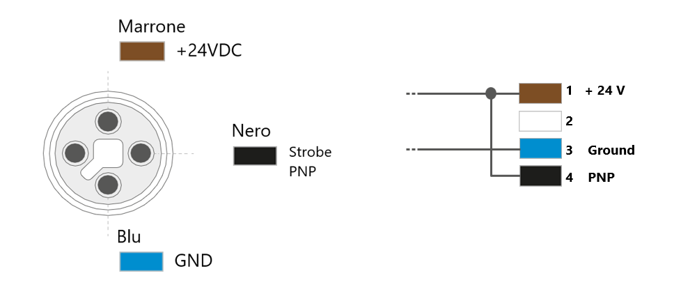

(cablaggio)=
# **Verdrahtung und Anschlüsse**
  

```{list-table}
:widths: 25 25 50
:header-rows: 1

* - **Von**
  - **Nach**
  - **Anschluss**

* - Stromnetz
  - FlexiBowl®
  - Stromversorgung 110/220 VDC

* - Stromnetz
  - Roboter
  - Stromversorgung gemäß den Spezifikationen des Roboters in Ihrem Besitz

* - Stromnetz
  - Kamera
  - 24 Vdc-Stromversorgung

* - Stromnetz
  - Beleuchtungseinrichtung (Licht)
  - 24 Vdc-Stromversorgung

* - Stromnetz
  - Trichtersteuerung
  - Stromversorgung 110/220 Vdc

* - Trichtersteuerung
  - Trichter
  - Stromversorgung und Signal

* - Roboter
  - Trichtersteuerung
  - Digitale I/O

* - VisionController
  - Kamera
  - Ethernet TCP

* - VisionController
  - FlexiBowl®
  - Ethernet TCP

* - VisionController
  - Roboter
  - Ethernet TCP
```

## Verdrahtungsassistent

```{list-table} 
:header-rows: 1

* - **Schritt**
  - **Aktion**
* - 1
  - Schließen Sie den FlexiBowl® an die Stromversorgung an.  
    [🔗 Siehe Handbuch für Spezifikationen zur Stromversorgung](https://www.flexibowl.com/wp-content/uploads/2026/04/Manuale-Utente-Flexibowl_IT_Rev2.9.pdf)
* - 2
  - Schließen Sie das [Hirose-24V-Stromkabel](cavo) an die Kamera an.
* - 3
  - Verbinden Sie den FlexiBowl® über ein Ethernet-Kabel mit dem VisionController.
* - 4
  - Verbinden Sie die Kamera über ein Ethernet-Kabel mit dem VisionController (PC).
* - 5
  - Verbinden Sie den Roboter über ein Ethernet-Kabel mit dem VisionController.
* - 6
  - Schließen Sie Druckluft an die FlexiBowl® an.  
    [🔗 Siehe Handbuch für pneumatische Spezifikationen](https://www.flexibowl.com/wp-content/uploads/2026/04/Manuale-Utente-Flexibowl_IT_Rev2.9.pdf)
* - 7
  - Falls vorhanden, schließen Sie den Trichter an die Steuerung an
* - 8
  - Falls vorhanden, schließen Sie den Roboter an die Trichtersteuerung an (Digital I/O)
* - 9 
  - Falls vorhanden, versorgen Sie die Trichtersteuerung mit Strom (110/220 V, je nach der beim Kauf der Trichter-Rüttelbasis gewählten Option)
* - 10
  - Schalten Sie den Netzschalter des FlexiBowl® ein (Stellung „I“). Die READY-LED ist eingeschaltet.
* - 11
  - Schalten Sie alle anderen Geräte ein
```
(cablaggio_illuminatore)=
## Verkabelung der Beleuchtungsanlage



```{list-table} 
:header-rows: 1
:widths: 30 70

* - Parameter
  - Anforderung / Aktion
* - **Spannung**
  - 24V DC (±10%). Minimale Betriebsspannung: 20V DC am Lichteingang.
* - **Stecker**
  - M12 Male. 
    :::{note}
      Zum Anschluss des Toplights kann auch das dazugehörige [Stromversorgungskabel](cavoalimtoplight) erworben werden. 
    :::
* - **Steckerbelegung**
  - Pin 1: +24V (braun) — Pin 3: GND (blau) — Pin 4: STROBE PNP (schwarz)
* - **STROBE-Modus (PNP)**
  - 5 V bis 24 V für 100 % Einschalten. 0V bis 1V für 100% Abschaltung.
* - **DAUER-Betrieb**
  - Pin 1 (+24 V) und Pin 3 (GND) verbunden; Pin 4 (PNP) mit Pin 1 verbunden.
* - **Spannungsabfall (M12-Kabel, 10m)**
  - 1,15V @ 5A — 2,3V @ 10A — 3,5V @ 15A — 4,6V @ 20A (max 20A)
* - **Abschirmung**
  - Verwenden Sie abgeschirmte Kabel, um elektromagnetische Störungen (EMI) zu reduzieren.
```
```{warning}
**Elektrische Sicherheit**

- Beachten Sie die angegebenen Versorgungsspannungen und Anschlussklemmen.
- Verändern Sie das Produkt nicht und nehmen Sie es nicht auseinander.
- Schließen Sie das Gerät nicht an und reinigen Sie es nicht, wenn es unter Spannung steht.
- Schauen Sie nicht direkt in die Lichtquelle.
```


