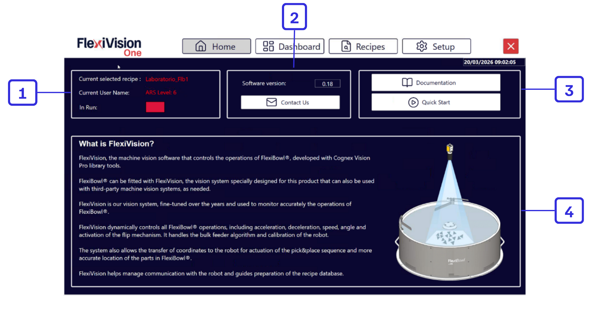
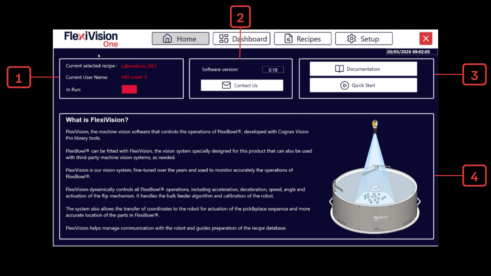

# **Startseite**
Die Benutzeroberfläche von FlexiVision One ist in Funktionsbereiche unterteilt, die den Benutzer von der Ersteinrichtung bis zur operativen Verwaltung des Systems führen.
Jede Seite liefert Echtzeitinformationen zu Maschinenstatus, Verbindungen, Leistung und Prozessparametern und bietet direkten Zugriff auf die wichtigsten Funktionen.
Die Navigation ist so konzipiert, dass sie eine einfache Bedienung, eine sofortige Kontrolle der Abläufe und eine kontinuierliche Überwachung der Leistung der Bildverarbeitung, der Zuführung und des Roboters gewährleistet.

 



```{list-table} Beschreibung der Startseite
:header-rows: 1
:widths: 10 90

* - **#**
  - **Beschreibung**

* - 1
  - **Status und Benutzerinformationen**:
    * **Current selected recipe (Aktuell ausgewähltes Rezept)**: Zeigt den Namen des aktuell geladenen und einsatzbereiten Rezepts an.
    * **Current user name (Aktueller Benutzername)**: Zeigt den Namen des angemeldeten Benutzers und dessen Zugriffsberechtigung auf das System an.
    * **In run (In Betrieb)**: Gibt den Betriebsstatus an; zeigt an, ob das System gerade läuft oder sich in einem gestoppten Zustand befindet.

* - 2
  - **Software- und Support-Informationen**:
    * **Software-Version**: Zeigt die Version der derzeit installierten FlexiVision One-Software an.
    * **Contact us (Kontakt)**: Schaltfläche für den schnellen Zugriff auf die Kontaktdaten für technischen Support und Kundendienst.

* - 3
  - **Ressourcen und Kurzanleitungen**:
    * **Documentation**: Schaltfläche, die zur vollständigen Bibliothek der technischen Dokumentation und Handbücher führt.
    * **QuickStart**: Bereich mit einem Assistenten für eine schnelle und intuitive Konfiguration des Systems.

* - 4
  - **Allgemeiner Informationsbereich**:
    * **What is FlexiVision ONE? (Was ist FlexiVision One?)**: Beschreibender Bereich, der einen Überblick über die Hauptfunktionen des Systems und dessen Integration mit dem FlexiBowl®-Gerät bietet.
```
