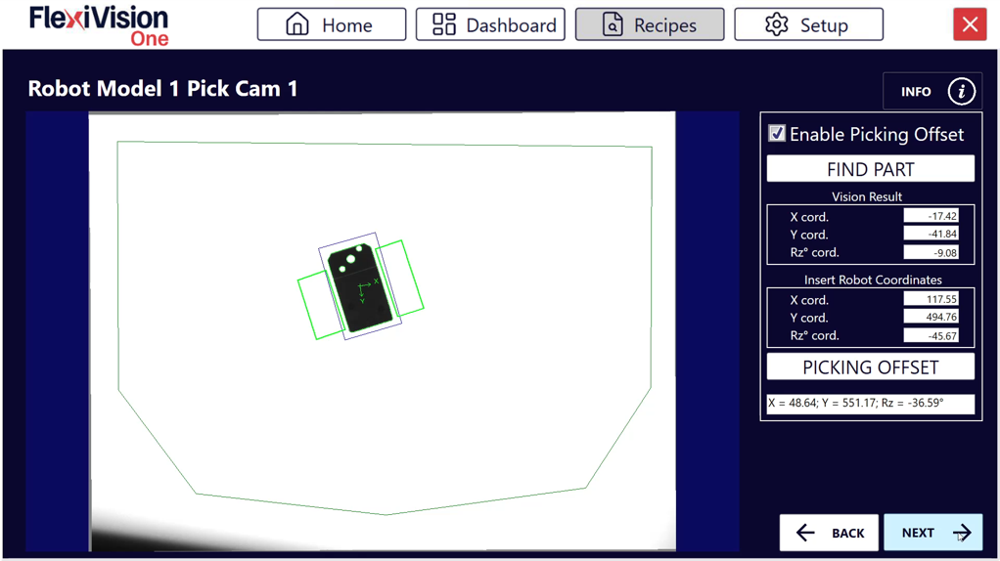
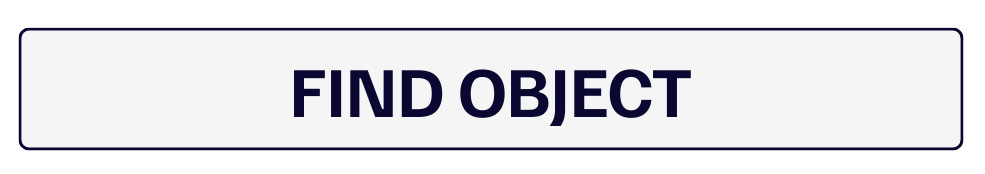
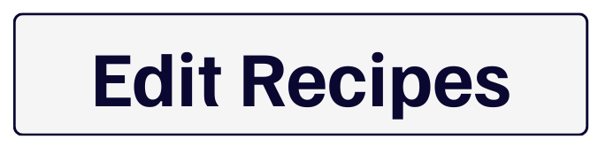

(robotpick)=
# **Robot-Pick-Kalibrierung**
Auf dieser Seite erfahren Sie, wie Sie die Koordinaten des Bildverarbeitungssystems mit denen des Roboters verknüpfen, um eine präzise Entnahme der Teile zu ermöglichen.


**Was ist Robot Pick?**
Die Funktion **Roboter-Pick** berechnet den Versatz zwischen den von FlexiVision One erfassten Koordinaten und den tatsächlichen Koordinaten des Roboters, sodass der Roboter die Teile an der richtigen Position entnehmen kann.
```{danger}
**Wichtige Roboterkoordinaten!**

Für diesen Schritt sind die X-, Y- und Rz-Koordinaten, die während der physischen Vorbereitung des Setups (Schritt 1 im Abschnitt Clearances) gespeichert wurden, **UNBEDINGT** erforderlich.

Ohne diese Koordinaten kann die Kalibrierung nicht abgeschlossen werden. Sollten diese verloren gegangen sein oder vergessen worden sein, muss die gesamte physische Vorbereitung mit dem Roboter wiederholt werden.
```
---

## Übersicht über die Benutzeroberfläche Robot Pick

Nachdem Sie auf der Seite Clearances auf Next geklickt haben, öffnet sich die Seite **Robot Model Pick**.



| Abschnitt| Parameter| Funktion
|-----------|-----------|----------|
| Enable| **Enable Robot Pick**| Aktiviert die Roboterkalibrierung
| Vision Result| **X cord**| Vom Bildverarbeitungssystem erfasste X-Koordinate
| Vision Result| **Y cord**| Vom Bildverarbeitungssystem erfasste Y-Koordinate
| Vision Result| **RZ cord**| Vom Bildverarbeitungssystem erfasste Z-Rotation
| Insert Robot Coordinate| **X cord**| X-Koordinate des Roboters (einzugeben)
| Insert Robot Coordinate| **Y cord**| Y-Koordinate des Roboters (einzugeben)
| Insert Robot Coordinate| **RZ cord**| Z-Drehung des Roboters (einzugeben)


| Funktion| Beschreibung
|----------|-------------|
| **Find Object**| Erkennt das Teil und zeigt die Bildverarbeitungskoordinaten an
| **Picking Offset**| Berechnet den Offset für die korrekte Aufnahme

---

## Schritt 1: Aktivierung und Erkennung des Bauteils

:::{video} ../../../../../_shared/media/videos/Step1_robot.mp4
    :width: 100%
    :align: center
:::
```{list-table}
* - **1**
  - Klicken Sie auf **Enable Robot Pick**
* - **2**
  - Klicken Sie auf :
      - Das System erkennt das Referenzteil
      - Die Koordinaten werden im Abschnitt **Vision Result** angezeigt

      :::{note} Vision Result:
      Dies sind die Koordinaten, die FlexiVision One im Bild „sieht“. Sie sind noch nicht mit dem Koordinatensystem des Roboters verknüpft.
      :::
```
:::{tip}
Wenn Sie während der Konfiguration Zweifel haben, konsultieren Sie bitte die **INFO-Taste** auf der aktuellen Seite.
:::

## Schritt 2: Eingabe der Roboterkoordinaten und Berechnung des Offsets

:::{video} ../../../../../_shared/media/videos/Step2_robot.mp4
    :width: 100%
    :align: center
:::
```{list-table}
* - **3**
  - Geben Sie im Feld **Insert Robot Coordinates** die Koordinaten ein, die Sie bei der Erstellung des Modells gespeichert haben:
      - **X cord** → X-Koordinate, die unter Punkt 1 der [Erstellen von Freiräumen](setupclearances) notiert wurde
      - **Y cord** → Y-Koordinate, die unter Punkt 1 der [Erstellen von Freiräumen](setupclearances) notiert wurde
      - **RZ cord** → Z-Koordinate, die unter Punkt 1 der [Erstellen von Freiräumen](setupclearances) notiert wurde

      :::{danger}
      Verwenden Sie die während der Modellkonfiguration gespeicherten Koordinaten. Ohne diese Koordinaten ist die Kalibrierung fehlerhaft!
      Die Koordinaten müssen mit **höchster Genauigkeit** eingegeben werden:
      - Übernehmen Sie die Werte genau so, wie sie notiert wurden (einschließlich Dezimalstellen)
      - **KEINE Rundungen vornehmen** (z.B: 450,23 ≠ 450,2 ≠ 450)
      - Stellen Sie sicher, dass Sie X und Y nicht vertauscht haben.
      - Überprüfen Sie das Vorzeichen ( oder -) jeder Koordinate

      **Fehler in dieser Phase führen zu völlig falschen Roboter-Offsets**, was zu Entnahmeversuchen an falschen Positionen führt (mit Abweichungen von bis zu mehreren Zentimetern). Die Nichtbeachtung dieser beiden Punkte kann zu Kollisionen des Roboters führen, mit daraus resultierenden Schäden an FlexiBowl®, den Komponenten oder dem Roboter selbst.
      :::
* - **4**
  - Klicken Sie auf 
      - Das System berechnet automatisch die Transformation zwischen Bildverarbeitungskoordinaten und Roboterkoordinaten
      - Dieser Offset wird auf alle zukünftigen Erfassungen angewendet
```
---
```{admonition} **Wie funktioniert der Gripper Offset?**
:class: info
Das System vergleicht:
- **Bildverarbeitungskoordinaten**: wo FlexiVision One den Ursprung des Teils „sieht“
- **Roboterkoordinaten**: wo der Roboter das Teil tatsächlich gegriffen hat

Es berechnet die Differenz und speichert sie als **Offset**. Dieser Offset wird auf alle künftig erfassten Teile angewendet und stellt sicher, dass der Roboter immer an der richtigen Position aufnimmt.
```
:::{tip}
Wenn Sie während der Konfiguration Zweifel haben, konsultieren Sie bitte die **INFO**-Taste auf der aktuellen Seite.
:::
---

## Schritt 3: Abschluss und Speichern
```{list-table}
* - **5**
  - Klicken Sie auf , um zur Rezeptseite zurückzukehren 
* - **6**
  - Klicken Sie auf  , um die gesamte Konfiguration zu speichern

      :::{admonition} Speichern abgeschlossen
      :class: success
      Die Speicherung umfasst:
      - ✓ Modell erstellt
      - ✓ Arbeitsbereich (ROI)
      - ✓ Toleranzen (Accept Threshold)
      - ✓ Konfigurierte Clearances
      - ✓ Roboterkalibrierung (Gripper Offset)
      :::
```

---

## Mehrere Modelle - Weitere Modelle hinzufügen

### *Schritt 4: Zusätzliche Modelle (optional)*
```{list-table}
* - **7**
  - So erstellen Sie weitere Modelle im selben Rezept:
      - Zurück nach oben 
      - Wählen Sie ein neues, noch nicht konfiguriertes Modell aus
      - Wiederholen Sie den gesamten Vorgang ab der [Modellerstellung](nuovomodello)

      :::{tip}
      Jedes Modell im Rezept kann unterschiedliche Konfigurationen (ROI, Freiraum, Versatz) aufweisen, wodurch Komponenten mit unterschiedlichen Eigenschaften in derselben Anwendung verwaltet werden können.
      :::
```

```{seealso}
Bei Problemen in den soeben abgeschlossenen Schritten konsultieren Sie bitte [Fehlerbehebung](<lock id="troubleshooting"/>)
```

---


