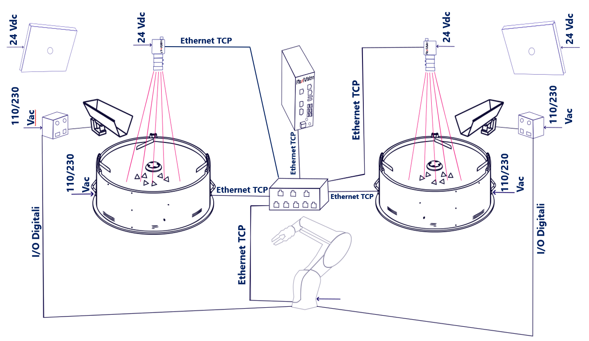
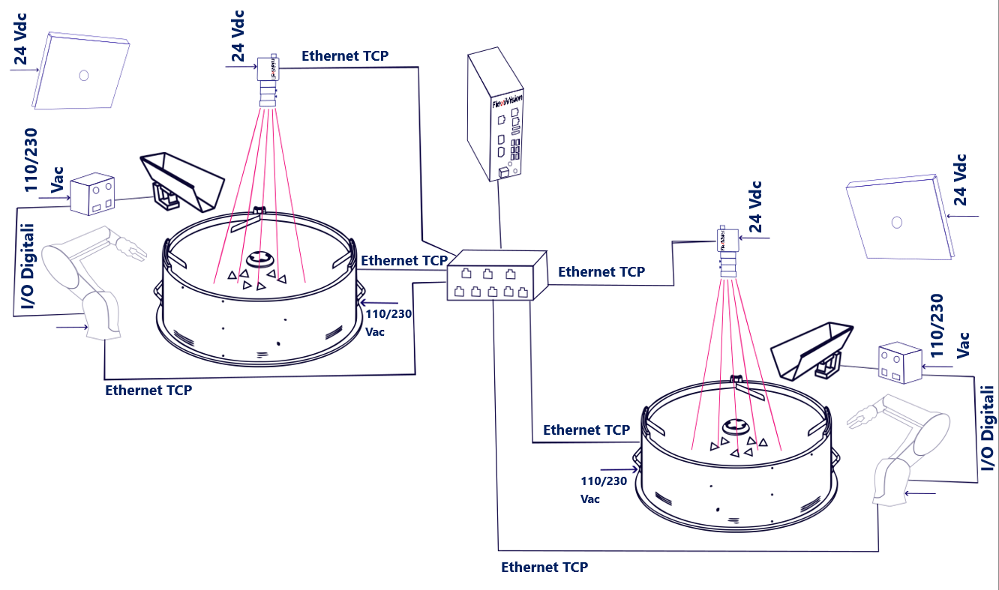

# **2 FlexiBowl® and 2 Cameras**

This section describes the available configurations when operating with **two FlexiBowl®** and **two cameras** managed by a single FlexiVision One VisionController.

---

## Configuration overview

In a **2 FlexiBowl® + 2 Cameras** configuration, the system includes two independent feeding and vision stations, both managed by the same VisionController. Each station consists of:

* 1 FlexiBowl®
* 1 Camera with dedicated optics
* 1 Hopper (optional, if present)

The two stations communicate with the VisionController through a **network Switch**.

```{important}
The **Switch** is a **mandatory** component in all multi-device configurations. Without it, it is not possible to connect multiple FlexiBowl® units and multiple cameras to the VisionController at the same time. For technical specifications and order codes, see the [Switch](../rif_tecnico_specifiche/08_Opzioni.md#switch) section.
```

This configuration supports two operating variants, based on the number of robots available in the system:
| | **Variant A** | **Variant B** |
|---|---|---|
| **Robot** | 1 | 2 |
| **FlexiBowl®** | 2 | 2 |
| **Cameras** | 2 | 2 |
| **Operating logic** | The robot reaches both stations | Each robot is dedicated to one station |
| **Switch required** | Yes | Yes |


---

## Variant A — 1 Robot, 2 FlexiBowl®



In this variant, a **single robot** operates on both stations. The robot is positioned so that it can reach the picking area of each FlexiBowl®, alternating picking between the two stations based on the received commands.

Each station manages its own independent recipe. On each station, it is possible to configure a **Standard** or **Mix** application, with models of different components within the same recipe.

| Parameter | Value |
|---|---|
| FlexiBowl® | 2 |
| Cameras | 2 |
| Robot | 1 |
| Switch required | **Yes** |

```{important}
**Base recipe and recipe management**

As with the single configuration, in a 2FB + 2CAM configuration the process also starts by creating a **single base recipe**, which contains the hardware setup and camera calibration for the entire system. This base recipe is then **duplicated** for each station: each duplicate represents the operating recipe for that station, within which the part models are created (up to 8 per station).

For this reason, it is essential that the association between devices is configured correctly from the beginning:

* **Camera 1** → FlexiBowl® 1 (+ Hopper 1, if present)
* **Camera 2** → FlexiBowl® 2 (+ Hopper 2, if present)

An incorrect association during setup would affect all derived recipes, compromising part recognition and correct operation of the entire system.
```
---

## Variant B — 2 Robots, 2 FlexiBowl®



In this variant, each robot is dedicated to a single station: **Robot 1** performs picking on FlexiBowl® 1, and **Robot 2** performs picking on FlexiBowl® 2. The two cells are independent and do not overlap.

In this variant as well, each station supports both **Standard** and **Mix** applications.

| Parameter | Value |
|---|---|
| FlexiBowl® | 2 |
| Cameras | 2 |
| Robot | 2 |
| Switch required | **Yes** |

```{tip}
This variant ensures maximum productivity, with the two cells operating in parallel and completely autonomously.
```

```{important}
**Base recipe and recipe management**

As with the single configuration, in a 2FB + 2CAM configuration the process also starts by creating a **single base recipe**, which contains the hardware setup and camera calibration for the entire system. This base recipe is then **duplicated** for each station: each duplicate represents the operating recipe for that station, within which the part models are created (up to 8 per station).

For this reason, it is essential that the association between devices is configured correctly from the beginning:

* **Camera 1** → FlexiBowl® 1 (+ Hopper 1, if present)
* **Camera 2** → FlexiBowl® 2 (+ Hopper 2, if present)

An incorrect association during setup would affect all derived recipes, compromising part recognition and correct operation of the entire system.
```

---

## Required components

### FlexiVision One base kit

The **FlexiVision One base kit** (supplied with the system) already includes everything required for the **first station** (camera, optics, cables, calibration grid). It is not necessary to purchase a second complete kit for the second station.

### Additional Camera Kit

For the second station, it is sufficient to purchase the **Additional Camera Kit**, available in a specific version for each FlexiBowl® size. The kit includes:

* 1 Camera
* 1 Optics dedicated to the FlexiBowl® size
* 1 Calibration grid
* 1 Camera power cable
* 2 Ethernet cables

Select the kit according to the size of the **second** FlexiBowl®:

| FlexiBowl® size | Additional Camera Kit Code | Included optics |
|---|---|---|
| FB 200 | GM002002 | CE000881 — FlexiVision One 35mm Optic |
| FB 350 | GM002003 | CE000881 — FlexiVision One 35mm Optic |
| FB 500 | GM002004 | CE000880 — FlexiVision One 25mm Optic |
| FB 650 | GM002005 | CE000879 — FlexiVision One 16mm Optic |
| FB 800 | GM002006 | CE000879 — FlexiVision One 16mm Optic |
| FB 1200 | GM002007 | CE000878 — FlexiVision One 12mm Optic |
```{note}
If the two stations use FlexiBowl® units of **different sizes**, the Additional Camera Kit must be selected according to the FlexiBowl® size of the second station. The first station is already covered by the base kit.
```

### Switch

The Switch is always required in multi-device configurations. For code, electrical specifications, and physical specifications, see the dedicated section:

**→ [Switch](../rif_tecnico_specifiche/08_Opzioni.md#switch)**

---

## Wiring

The wiring diagram is identical for both variants: all field devices (FlexiBowl®, cameras, robots) connect to the **Switch**, and the Switch connects to the **VisionController** through a single Ethernet port. The difference between Variant A and Variant B concerns only the number of robots connected to the Switch.
```{important}
The Switch has **8 Ethernet ports**. Verify that the total number of devices to be connected does not exceed the available capacity, taking into account all FlexiBowl® units, cameras, and robots present.
```

### Connection diagram

| Device | Connection |
|---|---|
| FlexiBowl® 1 | Ethernet port → Switch |
| FlexiBowl® 2 | Ethernet port → Switch |
| Camera 1 | Ethernet cable → Switch |
| Camera 2 | Ethernet cable → Switch |
| Robot 1 | Ethernet port → Switch |
| Robot 2 *(Variant B only)* | Ethernet port → Switch |
| **Switch** | **Ethernet port → VisionController** |
```{tip}
Verify that each device is assigned a unique IP address on the same subnet. The TCP/IP ports used by the VisionController for the two stations are configurable: by default **FB1 → 4001**, **FB2 → 4002**. See the [Robot-Vision Communication Protocol](../rif_tecnico_specifiche/04b_Protocolli_Comunicazione.md) section for details.
```

### Switch ports used by variant

| Switch Port | Variant A (1 Robot) | Variant B (2 Robots) |
|---|---|---|
| 1 | FlexiBowl® 1 | FlexiBowl® 1 |
| 2 | FlexiBowl® 2 | FlexiBowl® 2 |
| 3 | Camera 1 | Camera 1 |
| 4 | Camera 2 | Camera 2 |
| 5 | Robot 1 | Robot 1 |
| 6 | VisionController | Robot 2 |
| 7 | — | VisionController |
| 8 | — | — |

```{note}
**Wiring of individual components**

The physical connection procedures for each component (FlexiBowl®, camera, hopper, robot) are fully described in the [Wiring and Connections](../INSTALLAZIONE_SISTEMA/10_Cablaggio_Connessioni.md) section. In a 2FB + 2CAM configuration, the same operations are simply performed **twice** — once for each station — with the only difference that each device connects to the **Switch** instead of directly to the VisionController.
```
```{important}
**Device association in the software**

FlexiVision One can manage all stations simultaneously, but it is essential that the association between devices is configured correctly in the software. Make sure to associate:

* **Camera 1** → FlexiBowl® 1 (+ Hopper 1, if present)
* **Camera 2** → FlexiBowl® 2 (+ Hopper 2, if present)

An incorrect association would compromise part localization and correct operation of the entire system.
```

**→ [Initial System Configuration](../QUICKSTART/SETUP/13_setup.md)**

