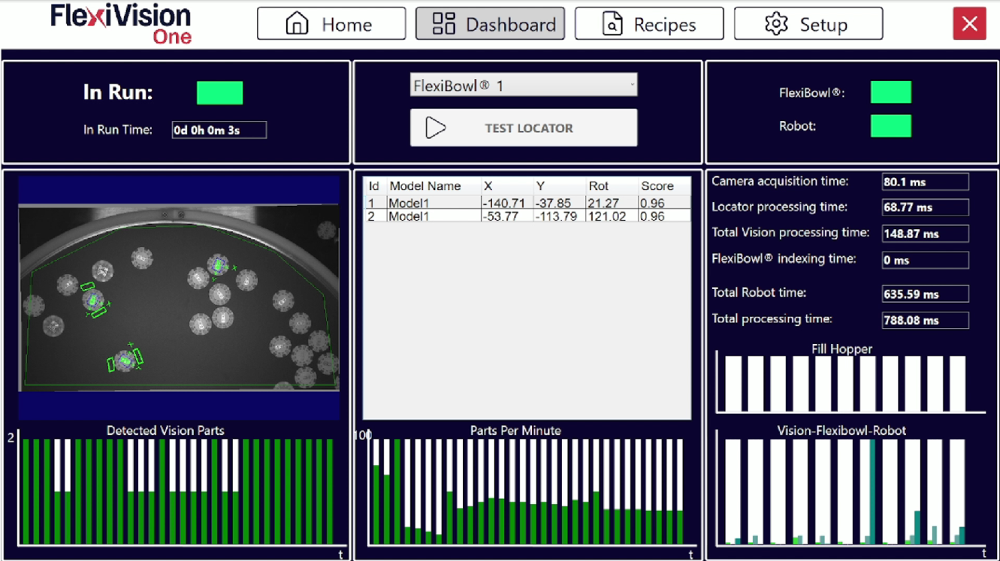

(dashboard)=
# **Application Monitoring: Dashboard**

The **Dashboard** is the main interface for real-time monitoring of the FlexiVision One system. On this page you can check process efficiency, analyse cycle times, validate component identification and identify any bottlenecks in the system.


---

## Interface Overview

The Dashboard interface is divided into four main sections:

1. [**Operational Control**](controllooperativo): Execution commands and status
2. [**Vision Analysis**](analisivisione): Display of detected parts and details
3. [**Performance Indicators**](indicatoriperformance): Connectivity and cycle times
4. [**Graphical Analysis**](analisigrafica): Productivity and time log charts

---
(controllooperativo)=
## Operational Control - Commands and execution status

```{list-table}
:header-rows: 1
:widths: 25 75

* - Element
  - Description and Function
* - **In Run**
  - Status indicator showing whether the system is currently running.  
    **Green** 🟢: System on and operational.  
    **Red** 🔴: System stopped or paused.  
* - **In Run Time**
  - This displays the total system uptime since application start-up.
* - **FlexiBowl® selection**
  - Drop-down menu to select the specific FlexiBowl® to be monitored.
* - **Test Locator**
  - It takes a picture of the vision area and starts the identification of the components present.
```

```{tip}
**Test Locator**
Useful to:
- Verify that the components are actually identified by the vision system
- If there is a collision between robot and component and I want to check the reliability of the clearances
```

---
(analisivisione)=
## Vision Analysis

The data for the components identified by the vision system are displayed in the centre of the dashboard.

### *Detected Vision Parts*

**Detected Vision Parts** shows:
- Image captured in real time by the camera
- A **log chart** of detections over the last 30 seconds showing the trend in the number of parts identified per capture.


### *Detected Models Table*

**Detail of identified components**

The table below the image lists all components in the pick area with the following parameters:

```{list-table}
:header-rows: 1
:widths: 15 20 65

* - Field
  - Data Type
  - Description
* - **Id**
  - Integer
  - Progressive unambiguous component identifier (0, 1, 2, ...).
  Id 0 = component with the highest score (best match to the model if sorted with Score Descending as recommended).
* - **X**
  - Millimetres
  - X coordinate of the component.
* - **Y**
  - Millimetres
  - Y coordinate of the component.
* - **Rot (Rotation)**
  - Degrees
  - Angle of rotation of the component.
* - **Score**
  - Percentage
  - Percentage value (0.00-1.00 or 0%-100%) expressing the degree of identification reliability. It represents closeness/fidelity to the reference model. Higher score = better match.
```

```{list-table} **Score Interpretation**

* - **Score > 0.90 (90%)**:
  - 
    - Excellent match to model
    - High confidence picking

* - **Score 0.80-0.90 (80-90%)**:
  - 
    - Good match
    - Safe picking if Accept Threshold is configured appropriately

* - **Score 0.70-0.80 (70-80%)**:
  - 
    - Acceptable match
    - Check consistency over time

* - **Score < 0.70 (< 70%)**:
  - 
    - Poor match
    - If recurring, review model or Accept Threshold.
```

---
(indicatoriperformance)=
## State and Performance Indicators

### *Connectivity*

Communication with external devices status indicators:

```{list-table}
:header-rows: 1
:widths: 25 75

* - Indicator
  - Description
* - **FlexiBowl®**
  - Status of the hardware connection between the VisionController (PC) and FlexiBowl®.  
    **Green**: Connected and communicating.  
    **Red**: Disconnected or communication error.  
* - **Robot**
  - Status of communication with the robot.  
    **Green**: TCP/IP connection established.  
    **Red**: Disconnected or communication timeout.  
```

```{warning}
**Actions in case of disconnection**

**FlexiBowl® red**:
- Check Ethernet cable FlexiBowl® → VisionController
- Check FlexiBowl® power supply
- Check FlexiBowl® IP in FlexiBowl® Setup
- Try reconnect or software reboot

**Robot red**:
- Check Ethernet cable Robot → VisionController
- Check that robot has open TCP/IP connection
- Check TCP/IP port in Robot Setup
- Check robot program (IP address of VisionController and Port inserted correctly in robot setup section )

In production, both indicators must always be green.
```

### *Time Analysis*

The system provides a detailed breakdown of cycle times to identify possible bottlenecks and optimise the process.

```{list-table}
:header-rows: 1
:widths: 35 65

* - Time Entry
  - Description
* - **Camera Processing Time**
  - Time taken to capture the image from the camera sensor. This includes exposure time and data transfer.
* - **Locator Processing Time**
  - Time required by the vision algorithm to locate and identify components in the captured image. It depends on: number of active models, complexity of models, number of clearances.
* - **Total Vision Processing**
  - Sum of Camera and Locator times. It represents the total time it takes for the vision system to process an image and send the co-ordinate(s).
* - **Total FlexiBowl® Time**
  - Time taken by the FlexiBowl® to perform a complete handling sequence.
* - **Total Robot Time**
  - Estimated or detected time for the complete Pick & Place operation of the robot. It includes: approach → pick → place → return.
* - **Total Processing Time**
  - Total time of complete cycle (Vision + FlexiBowl® + Robot). It represents the time from the start of one cycle to the start of the next one. It determines the theoretical maximum productivity (PPM).
```

```{tip}
**Time interpretation for optimisation**

The time chart allows the **bottleneck** of the system to be identified:

**If Total Vision Processing is the highest**:
- Too many active models → Disable unnecessary models
- Models too complex → Simplify with higher Score Threshold
- Too many clearances → Reduce number or size of clearances
- Camera Processing high → Reduce exposure time

**If Total FlexiBowl® Time is the highest**:
- Too many pauses → Optimise Flip/Move synchronisation and reduce stabilisation pause (Pause X ms)
- Movement sequence too slow → Increase speed in Config FlexiBowl®
- Excessive rotation angle → Reduce Move Angle
- Shake too long → Increase SHAKE speed and reduce SHAKE cycles

**If Total Robot Time is the highest**:
- Robot path not optimised → Optimise robot path planning
- Robot speed too low → Increase movement speed (if safe)
- Place distance too long → Reposition place point closer
- Pick times too long → Optimise gripper opening/closing

**Optimisation target**: Balance the three times to reduce overall Total Processing Time.
```

---
(analisigrafica)=
## Graphical Analysis

The charts at the bottom of the dashboard provide a predictive and diagnostic analysis of system performance over time.

### *1. Parts Per Minute (PPM)*

```{list-table}
* - **Productivity chart**
  - Shows the average productivity of the system expressed in **components picked per minute** (Parts Per Minute).

* - **Features**:
  - 
    - X-axis: Time
    - Y-axis: PPM (parts per minute)
    - Trend line: Mobile mean to identify trends

* - **Use**:
  - 
    - Monitor productivity stability over time
    - Identify performance degradations
    - Calculate actual vs. theoretical throughput
```

```{tip}

  :::{list-table} **PPM Interpretation**

    * - **Constant and stable PPM**:  
      - 
        ✓ System configured properly  
        ✓ Optimised parameters  
        ✓ No critical bottlenecks  

    * - **PPM progressively decreasing**:  
      - 
        ⚠️ Possible component wear (FlexiBowl® grip surface)  
        ⚠️ Hopper emptying  
        ⚠️ Dirt buildup on camera/lighting  

    * - **PPM with large fluctuations**:  
      - 
        ⚠️ Instability in the process  
        ⚠️ Intermittent identification problems  
        ⚠️ External interference (vibrations, variable light)  

    * - **Corrective actions**:
      - 
        - Analyse correlation with time charts
        - Identify which component (Vision/FlexiBowl®/Robot) causes variations
        - Intervene on specific parameters
  :::
```

### *2. Fill Hopper*

```{list-table}
* - **Hopper activation chart**
  - Represents the log of the unloading pulses sent to the hopper.

* - **Features**:
  - 
    - X-axis: Time
    - Y-axis: Hopper Activations (events)
    - Peaks: Each peak represents an unload activation

* - **Use**:
  - 
    - Check effectiveness of Hopper configuration
    - Identify anomalies in unloading behaviour
```

```{tip}
  
  :::{list-table} **Fill Hopper Pattern Analysis**

    * - **Regular and constant activations**:  
      - 
        ✓ Optimal Hopper Configuration  
        ✓ Stable and foreseeable flow of parts  
        ✓ Calculated autonomy (e.g. activation every 10 minutes)  

    * - **Ever more frequent activations**:  
      - 
        ⚠️ Hopper is emptying (fewer parts = more activations to maintain level)  
        ⚠️ Insufficient unloading time due to reduced volume  
        **Action**: Plan Hopper recharge soon  

    * - **No activation for a long time**:  
      - 
        ⚠️ Robot stopped or slowed down (parts not consumed)  
        ⚠️ Possible system problem that does not require parts  
        **Action**: Check production status  

    * - **Very close activations (bursts)**:  
      - 
        ⚠️ Hopper threshold not configured properly (too high)  
        ⚠️ Insufficient steps (parts do not arrive on time)  
        **Action**: Review Hopper Config  
  :::
```

### *3. Vision - FlexiBowl® - Robot (Comparative Chart)*

```{list-table} 
* - **Overlapping time chart**
  - A three-line comparison graph that overlaps the timing of individual processes over time.

* - **Use**:
  -
    - Instantly identify which process most affects the total cycle time and how it changes over time.
```
---

## Quality Monitoring - Critical Indicators to be monitored

```{list-table}
* - **Component Score**
  - Make sure that the **Score** of the detected components is constantly above the tolerance threshold (Accept Threshold) set during model configuration.

* - **Score Monitoring**:
  - 
    - Periodically check Detected Models table
    - Check that typical scores are 0.85-0.95
    - Investigate if scores regularly drop below 0.80

* - **Gradually decreasing scores**:  
  - 
    ⚠️ Real parts different from training (production variations)  
    ⚠️ Lighting changed (weaker backlight, dirt)  
    ⚠️ Camera no longer focused (vibration, blows)  
    ⚠️ FlexiBowl® surface dirty (interfering pattern)  

* - **Corrective Actions**:
  - 
    - Clean camera, lighting, FlexiBowl® surface
    - Check camera focus
    - Consider re-training model if parts have changed
    - Reduce Accept Threshold if scores are still reliable but lower
```
---

## Production Monitoring Best Practices

### *Daily checks*

```{list-table}
* - **At the start of production** (5 minutes):
  - 
    - Check FlexiBowl® and Robot connectivity indicators (green)
    - Check that the initial cycles show normal scores (>0.85)
    - Observe that PPM stabilises at the expected value

* - **During production** (check every 1-2 hours):
  - 
    - Take a look at PPM to check stability
    - Check Fill Hopper to predict necessary refill
    - Check the log for errors or warnings

* - **At end of shift** (2 minutes):
  - 
    - Take note of average PPM of the shift
    - Check number of times Hopper activated
    - Check for any anomalies or events
    - Compare with previous day's data
```
This minimum routine ensures quick identification of problems and maintains performance traceability.

### *Performance report*

```{tip} **Key metrics to be tracked**
To evaluate performance over time, track:

  :::{list-table} 

    * - **Daily**:
      - 
        - Average PPM of the shift
        - Total number of parts picked
        - Number of Hopper activations
        - Total downtime (and causes)

    * - **Weekly**:
      - 
        - PPM trend (increasing/decreasing?)
        - Theoretical vs. real PPM comparison
        - Average score of detected components
        - Any configuration changes and their impact

    * - **Monthly**:
      - 
        - Overall Equipment Effectiveness (OEE)
        - Analysis of main bottlenecks
        - Need for predictive maintenance
        - ROI of the system
  :::

This data enables continuous optimisation and justifies investment in improvements.
```

---

```{raw} html
<div style="border: 2px solid #0d6efd; border-radius: 12px; padding: 2rem; margin: 1.5rem 0; background-color: #f0f6ff; display: flex; align-items: flex-start; gap: 2rem;">
  <div style="flex: 1; min-width: 0;">
    <div style="font-size: 1.2rem; font-weight: 700; color: #0d6efd; margin-bottom: 0.5rem;"> The system is now operational!</div>
    <div style="font-size: 0.95rem; color: #444; line-height: 1.6;">Congratulations! The FlexiVision One system is now fully configured, optimised and validated for production.</div>
  </div>
  <div style="flex: 1.4; background: white; border-radius: 8px; padding: 1.2rem 1.5rem; border: 1px solid #d0e4ff; font-size: 0.88rem; color: #333; line-height: 1.8;">
    <div style="font-weight: 600; margin-bottom: 0.5rem;">Summary of completed process:</div>
    <div>✓ Hardware setup (FlexiBowl®, Robot, Camera)</div>
    <div>✓ Complete calibration (Camera, Robot)</div>
    <div>✓ FlexiBowl® configured for optimal handling</div>
    <div>✓ Hopper configured for automatic feeding (if present)</div>
    <div>✓ Part models created and optimised</div>
    <div>✓ Validated system with Dashboard monitoring</div>
    <div>✓ Verified and stable performance</div>
    <div style="margin-top: 0.8rem; font-style: italic; color: #555;">The system is ready to operate in production with minimal supervision.</div>
  </div>
  <div style="flex: 0.7; display: flex; flex-direction: column; gap: 0.8rem; font-size: 0.9rem;">
    <div style="color: #555; font-weight: 600;">Latest useful tools:</div>
    <a href="../TROUBLESHOOTING/26_trb_shooting_guide.html" style="display: block; padding: 0.6rem 1rem; background: #0d6efd; color: white; border-radius: 6px; text-decoration: none; font-weight: 500;"> Troubleshooting</a>
    <div style="font-size: 0.82rem; color: #555; margin-top: -0.4rem; padding-left: 0.3rem;">Troubleshooting guide for common problems</div>
    <a href="../27_Support.html" style="display: block; padding: 0.6rem 1rem; background: #0d6efd; color: white; border-radius: 6px; text-decoration: none; font-weight: 500;"> Support</a>
    <div style="font-size: 0.82rem; color: #555; margin-top: -0.4rem; padding-left: 0.3rem;">Technical support contacts</div>
  </div>
</div>
```
