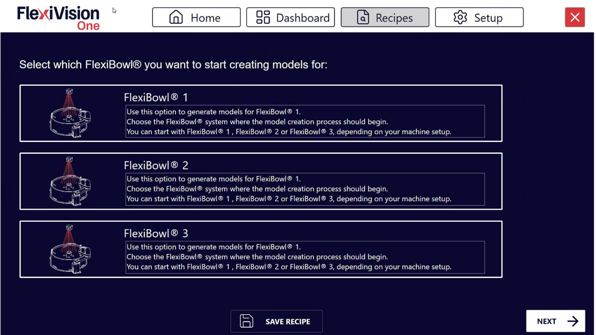
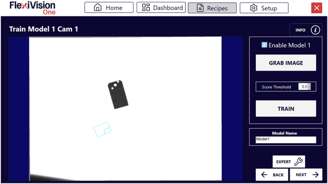
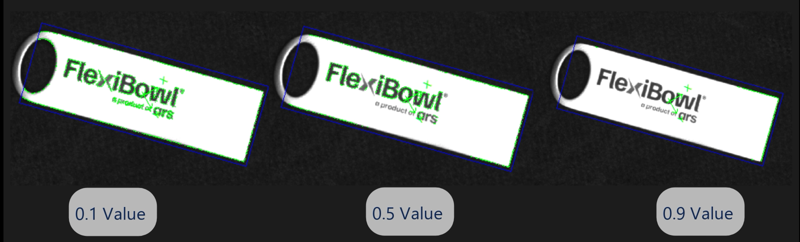
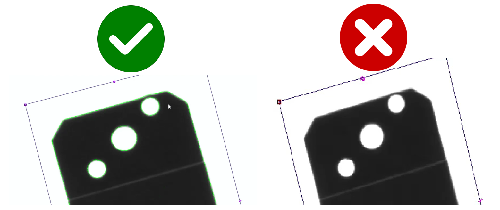

(nuovomodello)=
# **Creating a New Model**

On this page we will see how to create a reference model for component identification.


## Step 1: Preparing the Physical Setup
If not already done, follow these steps:
````{list-table}
* - **1**
  - Remove the calibration grid and restore the initial layout:
    - Reposition the surface
    - reposition the central flange
    - secure the central flange with its four screws
* - **2**
  - Place an object in the centre of the vision area
````
---

## Step 2: Access to the Model

Once the physical preparation is complete, proceed with image capture and model creation
````{list-table}
* - **3**
  - From the "Recipes" page, with the right recipe selected click 
* - **4**
  - Select the FlexiBowl® you are working with
    :::{dropdown} **FlexiBowl® Choice**
    
    :::
* - **5**
  - The available model slots will be shown (up to 8 models per recipe)
* - **6**
  - Click **Model 1** to access the "Train Model 1 Cam 1" page
````

### *Train Model interface overview*


````{list-table}
:header-rows: 1
:widths: 30 70

* - Parameter
  - Function
* - **Enable Model**
  - Activates this model slot making it usable
* - **Grab Train Image**
  - Takes a picture of the reference component for training
* - **Score Threshold**
  - Adjusts the level of detail of the model (from 0 = maximum detail to 1 = minimum detail)
* - **Train**
  - Actually generates the model by processing the captured image
* - **Model Name**
  - Text field to assign a descriptive name to the model
````
````{tip}
**Multiple model management**

In this phase only the first model is activated. After completion, you may:
- Enable additional slots (Model 2, Model 3, etc.) for different parts in the same recipe
- Modify existing models
- Disable models no longer required

For the time being, focus on completing the first model.
````
---

## Step 3: Training Procedure
````{video} ../../../../../_shared/media/videos/TastoInfo_TrainModel_1280x720.mp4
:width: 100%
:align: center 
````
````{list-table}
:widths: 5 95

* - **7**
  - Click **Enable Model** to enable this model. The model is now active and ready to be configured.

* - **8**
  - Click **Grab Train Image** to take a picture of the reference component we have placed on the FlexiBowl®
    
    :::{warning}
    The reference component must remain stationary at that point throughout the application creation process
    :::

* - **9**
  - Move the **ROI box** to fully frame the component

* - **10**
  - Move the **origin** (reference point) to the centre of the frame area
    
    :::{tip}
    **Where to position the origin?**
    
    The origin is automatically placed at the centre of the component.
    If the pick point does not coincide with the geometric centre, move the origin to the:
    - **Pick point**: For asymmetric parts, position where the gripper grasps
    
    *The origin defines the (0,0) point of the model coordinate system.*
    :::

* - **11**
  - Use the **Score Threshold** to adjust the desired level of detail
    
    ::::{note}
    **Score Threshold**
     
      
    
    **Value close to 0** → Detects MORE detail (more precise model)
    
    **Value close to 1** → Detects LESS detail (simpler model)
    ::::
    
    :::{tip}
    **How to choose the optimal Score Threshold?**
    
    **Use a LOW value (0.1-0.3) when:**
    - The part has many distinctive details (engravings, logos, texture)
    - The parts are always very similar to one another (tight tolerances)
    - Maximum precision is required even with difficult orientations
    
    **Use a HIGH value (0.4-0.6) when:**
    - The part has a distinctive but simple shape
    - A balance between precision and tolerance is desired
    - First configuration of a model (starting point)
    
    **Use a VERY HIGH value (0.7-0.9) when:**
    - There are significant variations between parts (wide tolerances)
    - The part surface is highly reflective or variable
    :::

* - **12**
  - Click **Train**
````
:::{tip}
If you have any doubts during configuration, please consult the **INFO** key on the current page.
:::
---

## Step 4: Visual inspection

After generating the model, it is essential to check its quality before proceeding.
````{list-table}

* - **13**
  - **Zoom** in on the image to inspect the details of the model created and verify that the model is correct
    
    :::{tip}
      **Valid Model Characteristics**
      ✓ Have enough lines to recognise the component
      ✓ Do not include the texture of the background surface
      ✓ Avoid light reflections
    :::

    
````
````{attention}
If the model is not satisfactory:
- Edit the **Score Threshold**
- Click again on **Train**
- Repeat until an ideal model is achieved
````
````{tip}
**Optimisation strategy**

**Problem: Model includes surface texture**
→ Solution: Increase Score Threshold or Cam Exposure value (SETUP > Camera Setup > Cam Exposure)

**Problem: Model has too few lines, not distinguishable**
→ Solution: Decrease Score Threshold

**Problem: Model includes reflections**
→ Solution: Increase Score Threshold or adjust camera exposure

Make gradual changes (steps of 0.1-0.2) and test each time.
````
---

## Step 5: Save
````{list-table}
* - **14**
  - Name the model with a descriptive name
    :::{tip}
    **Avoid generic names**

    ❌ Names to avoid:
    - `Test`, `Prova`, `Modello1`, `Nuovo_Modello`

    ✓ Recommended names:
    - `Prod_Viti_M8_Acciaio`
    - `Assembly_Connettori_2024`
    - `QC_Ingranaggi_Serie_X`

    A clear name makes it easier to manage when there are many different models.
    :::
* - **15**
  - Click  → the **Define Robot Pick Area** page will open
````
````{seealso}
Proceed to [Define ROI](roitest) to continue configuration.
````

