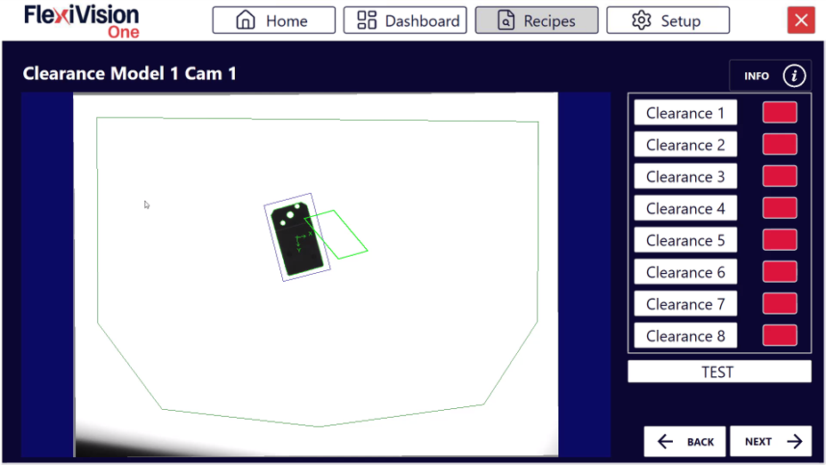
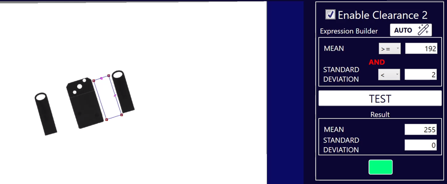
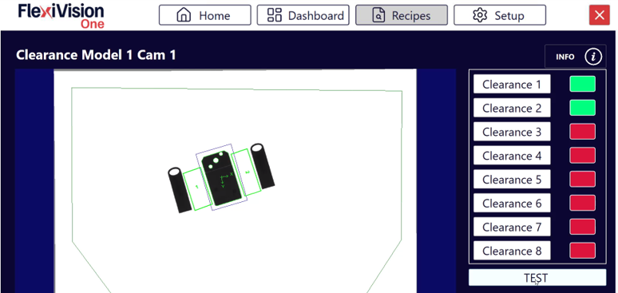
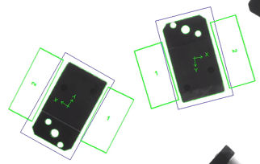
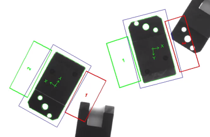

(istogrammi)=
# **Clearances**
In this page we will see how to configure Clearances to verify that critical areas are free from obstacles.

**What is a Clearance?**
A **Clearance** in FlexiVision One is a tool that monitors a specific area of the image to verify that it is clear. It is used to check, for example, that the space required for the gripper to grasp the component is not occupied by other objects.
````{note} Operating Principle.

The Clearance analyses greyscale changes in a defined area:
- 🟢 **Green** → Area clear (OK for picking)
- 🔴 **Red** → Area busy (presence of obstacles)
````
:::{attention}
The use of Clearances varies according to the part whose model is being made. This assessment is the responsibility of the person in charge of creating the application.
:::
--- 
(setupclearances)=
## Step 1: Physical Setup

:::{danger} **Caution!**
  We will show you the procedure with the Gripper Tool, as it requires the configuration of Clearances for models. Other Tools for the robot may not need the Clearances to simulate the footprint.
:::
:::{video} ../../../../../_shared/media/videos/Step1.mp4
    :width: 100%
    :align: center
:::
````{list-table}
:widths: 5 95

* - **1**
  - From the **robot pendant**:
    - Select the **frame** and **tool** calibrated on FlexiVision One
    - Bring the **last axis** of the tool to **zero rotation** (Rz = 0°)
* - **2**
  - Simulate a pick:
    - Open the gripper
    - Bring the robot tool onto the component at surface level, as if to grasp it
* - **3**
  - Place **two objects** at the sides of the gripper to have, once the robot is removed, clear areas between the reference component and the two objects.
  They will represent the robot gripper's footprint areas.
    
    :::{important}
    Leave the objects slightly farther apart than necessary to avoid errors when creating the model. (2-3 mm margin)
    :::
    
* - **4**
  - Record the coordinates:
    - Save the coordinates of the robot's last axis:
      - **X** (X coordinate)
      - **Y** (Y coordinate)
      - **Rz** (rotation around Z)
    
    :::{important}
    Record these coordinates! They will be essential during the robot calibration phase.
    :::
* - **5**
  - Move the robot away with the pendant **without moving anything** on the surface
````
:::{tip}
If you have any doubts during configuration, please consult the **INFO** key on the current page.
:::
---

## Step 2: Accessing the Clearance page
````{list-table}
:widths: 5 95

* - **6**
  - From the **Locator Model** page, after clicking **Next**, the list of available clearances (up to 8 per model) will open.
    
    :::{dropdown} **Clearances Page**
    
      
    
      | Element | Description |
      |----------|-------------|
      | **Clearance 1...8** | Slots available to create up to 8 different clearances for the same model |
      | **Test (global)** | Button to simultaneously test all enabled clearances |
      | **Next** | Advance to next step (Robot Pick) after clearance configuration |
    :::
* - **7**
  - Click **Clearance 1**, the page for configuring the first clearance "Clearance 1" will open
    
    :::{dropdown} **Clearance 1 Page**

      

      | Parameter | Function |
      |-----------|----------|
      | **Enable Clearance** | Activates this clearance and makes it operational |
      | **Expression Builder** | Tool to automatically configure detection thresholds |
      | **Mean and Standard Deviation** | Statistical values calculated on the selected area (mean and standard deviation of greyscales) |
      | **Test** | Immediate verification of clearance operation |
      | **Result** | Visual status indicator (Green = OK, Red = Triggered) |
    :::
````
---

## Step 3: Area Activation and Positioning

:::{video} ../../../../../_shared/media/videos/Step3.mp4
    :width: 100%
    :align: center
:::
````{list-table}
* - **8**
  - Click **Enable Clearance** to activate the clearance
* - **9**
  - Move the **frame** of the Clearance to the area that is to remain clear
      - Typically: gripper picking area (one clearance per gripper picking area)
      - Margins around the component
      - Robot passage zones
    :::{important}
    Always keep these two important aspects in mind:
    - Clearance ROI, when configured, must be completely clear (i.e. free of objects, shadows, artefacts)
    - Always create a clearance slightly larger than strictly necessary to avoid false errors.

    Failure to comply with these two points could lead to robot collisions resulting in damage to the FlexiBowl®, components or the robot itself.
    :::
````
:::{tip}
If you have any doubts during configuration, please consult the **INFO** key on the current page.
:::
---

## Step 4: Automatic Configuration

:::{video} ../../../../../_shared/media/videos/Step4.mp4
    :width: 100%
    :align: center
:::
````{list-table}
* - **10**
  - Click  in Expression Builder
* - **11**
  - Click 
* - **12**
  - Check that the box turns **green**
* - **13**
  - Click 
````
````{warning}
**What to do if the test fails (red box)?**

If after AUTO the box turns red:

**Possible causes:**
- There is actually something in the area (part, shadow, dirt)
- The lighting has changed between AUTO and TEST configuration
- The selected area includes edges of the FlexiBowl® or artefacts

**Solutions:**
1. Visually check that the area is completely clear
2. Repeat AUTO with stable lighting conditions
3. Repeat TEST to verify
````
:::{tip}
If you have any doubts during configuration, please consult the **INFO** key on the current page.
:::
---

## Multiple Clearances - When to Use Them

Create more clearances when:
- The robot tool is a gripper: a clearance is needed for each of the two areas engaged by the gripper on either side of the reference component
- There are several critical points to monitor
- The picking area has particular geometries

### *Step 2-3: Repetition*
Select a new clearance from the Clearance list page, such as "Clearance 2" and repeat Steps 2-3.
Repeat the procedure for each clearance required (up to 8 per model).

### *Step 4: Overall Test*

On the list page of all clearances, click **TEST** to view all clearances at once


---

## Interpreting States

### *Clearance States*

````{list-table}
:header-rows: 1
:widths: 10 15 30 45

* - Colour
  - Status
  - Meaning
  - Image
* - 🟢 Green
  - OK
  - Area clear, picking possible
  - 
* - 🔴 Red
  - Triggered
  - Area engaged, picking not possible
  - 
````

### *What does "Triggered" mean?*

A clearance turns red (triggered) when it detects inside:
- Presence of other components
- Significant shadows or reflections
- Any element that makes the area not clear

---

## Step 5: Finalisation
````{list-table}
* - **14**
  - After configuring all necessary clearances, click 
* - **15**
  - The **Robot Model Pick Cam** page will open
````
````{seealso}
Proceed to [Robot Calibration](robotpick) to complete configuration.
````

