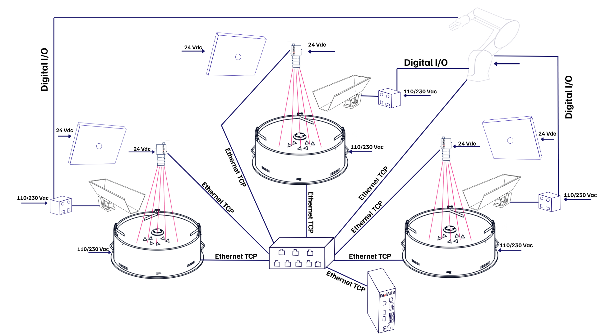
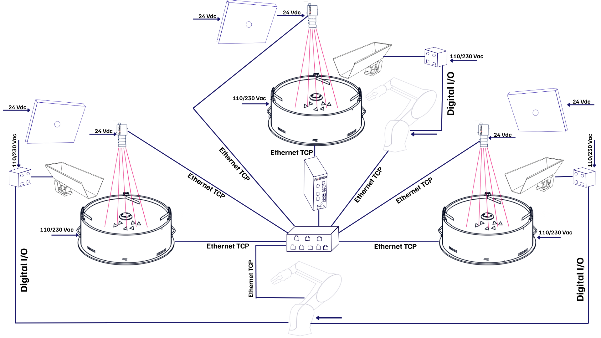
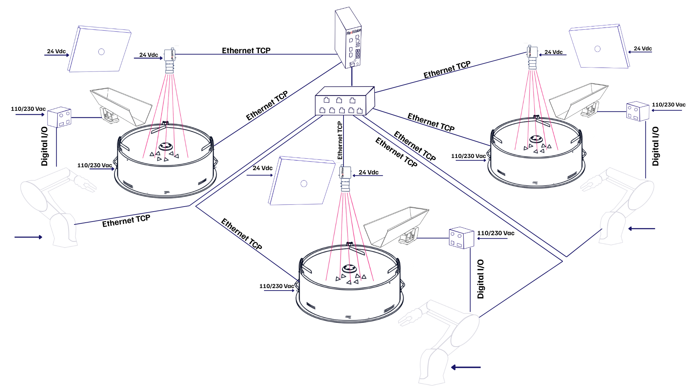

# **3 FlexiBowl® y 3 Cámaras**

Esta sección describe las configuraciones disponibles cuando se desea operar con **tres FlexiBowl®** y **tres cámaras** dentro de la misma isla de picking, gestionadas por un único VisionController FlexiVision One.

---

## Resumen de la configuración

En una configuración **3 FlexiBowl® + 3 Cámaras**, el sistema consta de tres estaciones de alimentación y visión independientes, todas controladas por el mismo VisionController. Cada estación consta de:

* 1 FlexiBowl®
* 1 Cámara con óptica dedicada
* 1 Tolva (opcional, si existe)

Las tres estaciones se comunican con el VisionController a través de un **Switch de red**.
```{important}
El **Switch** es un componente **obligatorio** en todas las configuraciones multidispositivo. Sin él, no es posible conectar simultáneamente varios FlexiBowl® y varias cámaras al VisionController. Para las especificaciones técnicas y los códigos de pedido, consulte la sección [Switch](../rif_tecnico_specifiche/08_Opzioni.md#switch).
```

Esta configuración admite tres variantes de funcionamiento, en función del número de robots disponibles en la planta:

| | **Variante A** | **Variante B** | **Variante C** |
|---|---|---|---|
| **Robot** | 1 | 2 | 3 |
| **FlexiBowl®** | 3 | 3 | 3 |
| **Cámaras** | 3 | 3 | 3 |
| **Lógica operativa** | El robot alcanza las tres estaciones | Primer robot en un FlexiBowl®, segundo robot en dos FlexiBowl® | Cada robot está dedicado a una estación |
| **Switch requerido** | Sí | Sí | Sí |
---

## Variante A - 1 Robot, 3 FlexiBowls



Un **único robot** opera en las tres estaciones. El robot debe colocarse de forma que pueda alcanzar la zona de recogida de cada FlexiBowl®. El VisionController gestiona las tres estaciones de forma independiente, cada una con su propia receta y canal de comunicación TCP/IP.

Cada estación admite aplicaciones de tipo **Standard** o **Mix**.

| Parámetro | Valor |
|---|---|
| FlexiBowl® | 3 |
| Cámaras | 3 |
| Robot | 1 |
| Switch requerido | **Sí** |


```{important}
**Receta básica y gestión de recetas**

Al igual que en la configuración individual, en una configuración 3FB + 3CAM el proceso comienza con la creación de una **única receta base**, que contiene la configuración del hardware y la calibración de la cámara para todo el sistema. A continuación, esta receta base se duplica para cada estación: cada duplicado constituye la receta de funcionamiento de dicha estación, dentro de la cual se crean los modelos de piezas (hasta 8 por estación).

Por lo tanto, es crucial que la asociación entre los dispositivos se configure correctamente desde el principio:

* **Cámara 1** → FlexiBowl® 1 (+ Tolva 1, si existe)
* **Cámara 2** → FlexiBowl® 2 (+ Tolva 2, si existe)
* **Cámara 3** → FlexiBowl® 3 (+ Tolva 3, si existe)

Una asociación incorrecta durante la configuración afectaría a todas las recetas derivadas, comprometiendo el reconocimiento de las piezas y el correcto funcionamiento de todo el sistema.
```
---

## Variante B - 2 Robots, 3 FlexiBowls



En esta variante **dos robots** comparten las tres estaciones. El primer robot recogerá en un solo FlexiBowl®, el segundo en los otros dos FlexiBowl®. La distribución de la carga entre los robots viene definida por la lógica del programa del robot y la disposición física de la planta. 

Cada estación admite aplicaciones de tipo **Standard** o **Mix**.

| Parámetro | Valor |
|---|---|
| FlexiBowl® | 3 |
| Cámaras | 3 |
| Robot | 2 |
| Switch requerido | **Sí** |

```{important}
**Receta básica y gestión de recetas**

Al igual que en la configuración individual, en una configuración 3FB + 3CAM el proceso comienza con la creación de una **única receta base**, que contiene la configuración del hardware y la calibración de la cámara para todo el sistema. A continuación, esta receta base se duplica para cada estación: cada duplicado constituye la receta de funcionamiento de dicha estación, dentro de la cual se crean los modelos de piezas (hasta 8 por estación).

Por lo tanto, es crucial que la asociación entre los dispositivos se configure correctamente desde el principio:

* **Cámara 1** → FlexiBowl® 1 (+ Tolva 1, si existe)
* **Cámara 2** → FlexiBowl® 2 (+ Tolva 2, si existe)
* **Cámara 3** → FlexiBowl® 3 (+ Tolva 3, si existe)

Una asociación incorrecta durante la configuración afectaría a todas las recetas derivadas, comprometiendo el reconocimiento de las piezas y el correcto funcionamiento de todo el sistema.
```
---

## Variante C - 3 Robots, 3 FlexiBowl®



Cada robot está dedicado a una única estación: máxima productividad con las tres células funcionando en paralelo y de forma totalmente independiente.

Cada estación admite aplicaciones de tipo **Standard** o **Mix**.

| Parámetro | Valor |
|---|---|
| FlexiBowl® | 3 |
| Cámaras | 3 |
| Robot | 3 |
| Switch requerido | **Sí** |

```{tip}
La variante C garantiza el mejor rendimiento global. Cada célula es completamente autónoma y no depende de la disponibilidad de las demás.
```
```{important}
**Receta básica y gestión de recetas**

Al igual que en la configuración individual, en una configuración 3FB + 3CAM el proceso comienza con la creación de una **única receta base**, que contiene la configuración del hardware y la calibración de la cámara para todo el sistema. A continuación, esta receta base se duplica para cada estación: cada duplicado constituye la receta de funcionamiento de dicha estación, dentro de la cual se crean los modelos de piezas (hasta 8 por estación).

Por lo tanto, es crucial que la asociación entre los dispositivos se configure correctamente desde el principio:

* **Cámara 1** → FlexiBowl® 1 (+ Tolva 1, si existe)
* **Cámara 2** → FlexiBowl® 2 (+ Tolva 2, si existe)
* **Cámara 3** → FlexiBowl® 3 (+ Tolva 3, si existe)

Una asociación incorrecta durante la configuración afectaría a todas las recetas derivadas, comprometiendo el reconocimiento de las piezas y el correcto funcionamiento de todo el sistema.
```
---

## Componentes necesarios

### *Kit base FlexiVision One*

El **kit base FlexiVision One** (suministrado con el sistema) ya incluye todo lo necesario para la **primera estación** (cámara, óptica, cables, rejilla de calibración), incluido el VisionController. No es necesario adquirir un segundo kit completo para estaciones adicionales.

### *Kit de cámara adicional (× 2)*

Para las estaciones 2 y 3 es necesario adquirir **dos Kits de cámara adicional**, uno para cada estación, seleccionando el código correspondiente al tamaño del FlexiBowl® de cada estación. El kit incluye:

* 1 Cámara
* 1 Óptica dedicada al tamaño FlexiBowl®
* 1 Rejilla de calibración
* 1 Cable de alimentación de la cámara
* 2 Cables Ethernet

Seleccione el kit en función del tamaño del FlexiBowl® de cada estación complementaria:

| Tamaño FlexiBowl® | Código Kit Cámara Adicional | Óptica incluida |
|---|---|---|
| FB 200 | GM002002 | CE000881 - Óptica FlexiVision One de 35 mm |
| FB 350 | GM002003 | CE000881 - Óptica FlexiVision One de 35 mm |
| FB 500 | GM002004 | CE000880 - Óptica FlexiVision One de 25 mm |
| FB 650 | GM002005 | CE000879 - Óptica FlexiVision One 16mm |
| FB 800 | GM002006 | CE000879 - Óptica FlexiVision One 16mm |
| FB 1200 | GM002007 | CE000878 - Óptica FlexiVision One de 12 mm |

```{note}
Si las estaciones adicionales utilizan FlexiBowl® de tamaños diferentes, adquiera un kit para cada tamaño.  
 Por ejemplo, para una configuración con FB500 + FB650 + FB800, el kit base cubre la primera estación, mientras que para la segunda y la tercera estación es necesario pedir respectivamente GM002004 y GM002006.
```

### *Switch*

El Switch siempre es necesario en las configuraciones multidispositivo. Para código, especificaciones eléctricas y físicas, consulte la sección dedicada:

**→ [Switch](../rif_tecnico_specifiche/08_Opzioni.md#switch)**

---

## Cableado

En la **Variante A** (1 robot), todos los dispositivos de campo (FlexiBowl®, cámaras, robot) se conectan al **Switch**, y el Switch se conecta al **VisionController** a través de un único puerto Ethernet. El número total de conexiones está dentro de los 8 puertos disponibles en el Switch.

A partir de la **Variante B**, el número total de dispositivos supera los puertos disponibles en el Switch.   
En estos casos, se utiliza un puerto del VisionController para conectarlo al Switch, mientras que el resto de puertos libres del VisionController alojan dispositivos que no tienen cabida en el Switch:

- En la **Variante B** (2 robot), el **FlexiBowl® 3** se conecta directamente a un puerto libre del VisionController.
- En la **Variante C** (3 robot), el **FlexiBowl® 3** y la **Cámara 3** se conectan directamente a los puertos libres del VisionController.

```{important}
El Switch dispone de **8 puertos Ethernet**. A partir de la Variante B, no es posible conectar todos los dispositivos exclusivamente a través del Switch: los dispositivos en exceso deben conectarse directamente a los puertos Ethernet libres del VisionController, como se indica en las tablas siguientes.
```
:::{note}
Se puede decidir arbitrariamente qué dispositivos conectar al VisionController. Lo importante es dejar siempre un puerto libre para conectar el VisionController al Switch
:::

### *Diagrama de conexión*

| DISPOSITIVO | Variante A (1 Robot) | Variante B (2 Robots) | Variante C (3 Robots) |
|---|---|---|---|
| FlexiBowl® 1 | → Switch | → Switch | → Switch |
| FlexiBowl® 2 | → Switch | → Switch | → Switch |
| FlexiBowl® 3 | → Switch | **→ VisionController (puerto libre)** | **→ VisionController (puerto libre)**  |
| Cámara 1 | → Switch | → Switch | → Switch |
| Cámara 2 | → Switch | → Switch | → Switch |
| Cámara 3 | → Switch | → Switch | **→ VisionController (puerto libre)**  |
| Robot 1 | → Switch | → Switch | → Switch |
| Robot 2 | — | → Switch | → Switch |
| Robot 3 | — | — | → Switch |
| **Switch** | **→ VisionController** | **→ VisionController** | **→ VisionController** |

:::{note}
Se puede decidir arbitrariamente qué dispositivos conectar al VisionController. Lo importante es dejar siempre un puerto libre para conectar el VisionController al Switch
:::

```{tip}
Verifique que a cada dispositivo se le asigne una dirección IP única en la misma subred.  
 Los puertos TCP/IP utilizados por el VisionController para las tres estaciones son configurables: por defecto **FB1 → 4001**, **FB2 → 4002**, **FB3 → 4003**.  
 Consulte la sección [Protocolo Comunicación Robot-Visione](../rif_tecnico_specifiche/04b_Protocolli_Comunicazione.md) para los detalles.
```
### *Puertos Switch ocupados por variante*

| Puerto Switch | Variante A (1 Robot) | Variante B (2 Robots) | Variante C (3 Robots) |
|---|---|---|---|
| 1 | FlexiBowl® 1 | FlexiBowl® 1 | FlexiBowl® 1 |
| 2 | FlexiBowl® 2 | FlexiBowl® 2 | FlexiBowl® 2 |
| 3 | FlexiBowl® 3 | Cámara 1 | Cámara 1 |
| 4 | Cámara 1 | Cámara 2 | Cámara 2 |
| 5 | Cámara 2 | Cámara 3 | Robot 1 |
| 6 | Cámara 3 | Robot 1 | Robot 2 |
| 7 | Robot 1 | Robot 2 | Robot 3 |
| 8 | VisionController | VisionController | VisionController |

### *Puertos VisionController ocupados por variante*

| Puerto VisionController | Variante A (1 Robot) | Variante B (2 Robots) | Variante C (3 Robots) |
|---|---|---|---|
| 1 | Switch | Switch | Switch |
| 2 | — | FlexiBowl® 3 | FlexiBowl® 3 |
| 3 | — | — | Cámara 3 |

:::{note}
Se puede decidir arbitrariamente qué dispositivos conectar al VisionController. Lo importante es dejar siempre un puerto libre para conectar el VisionController al Switch
:::

```{note}
En la **Variante B** los puertos del Switch están todos ocupados (7 dispositivos + VisionController): el FlexiBowl® 3 se conecta directamente al VisionController. En la **Variante C** también la Cámara 3 se conecta directamente al VisionController, ocupando el tercer puerto disponible.
```
```{note}
**Cableado de los componentes individuales**

Los procedimientos de conexión física de cada componente (FlexiBowl®, cámara, tolva, robot) se describen detalladamente en la sección [Cableado y conexiones](../INSTALLAZIONE_SISTEMA/10_Cablaggio_Connessioni.md).  
 En una configuración 3FB + 3CAM, simplemente hay que realizar las mismas operaciones **tres veces** —una por cada estación— con la única diferencia de que cada dispositivo se conecta al **Switch** en lugar de directamente al VisionController, con la excepción del **FlexiBowl® 3** (Variantes B y C) y de la **Cámara 3** (Variante C), que se conectan directamente a los puertos Ethernet libres del VisionController.
```
```{important}
**Asociación de dispositivos en el software**

FlexiVision One puede gestionar todas las estaciones simultáneamente, pero es esencial que la asociación entre los dispositivos esté configurada correctamente en el software. Asegúrese de asociar:

* **Cámara 1** → FlexiBowl® 1 (+ Tolva 1, si existe)
* **Cámara 2** → FlexiBowl® 2 (+ Tolva 2, si existe)
* **Cámara 3** → FlexiBowl® 3 (+ Tolva 3, si existe)

Una asociación incorrecta comprometería la localización de las piezas y el correcto funcionamiento de todo el sistema.
```

**→ [Configuración inicial del sistema](../QUICKSTART/SETUP/13_setup.md)**

