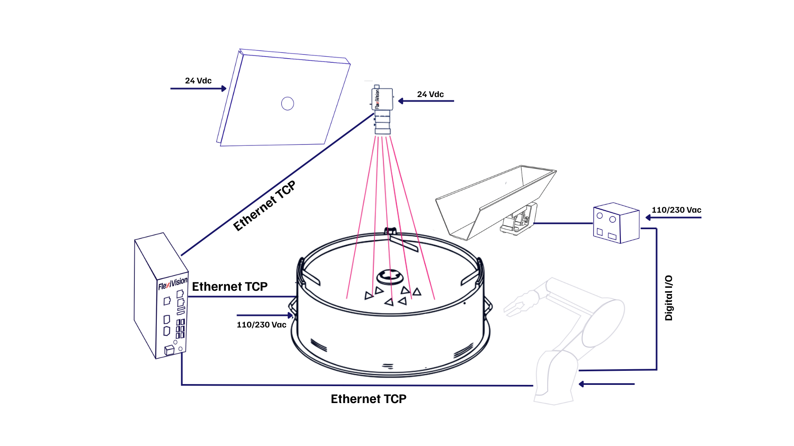
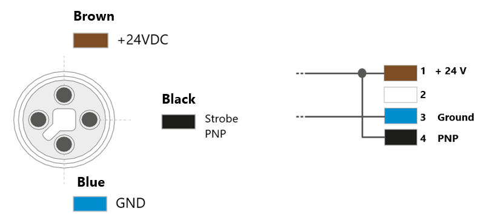

(cablaggio)=
# **Cableado y conexiones**
  

```{list-table}
:widths: 25 25 50
:header-rows: 1

* - **De**
  - **A**
  - **Enlace**

* - Red eléctrica
  - FlexiBowl®
  - Alimentación 110/220 Vdc

* - Red eléctrica
  - Robot
  - Fuente de alimentación según las especificaciones del robot que posea

* - Red eléctrica
  - Cámara
  - Alimentación 24 Vdc

* - Red eléctrica
  - Iluminador (luz)
  - Fuente de alimentación 24 Vdc

* - Red eléctrica
  - Controlador de tolva
  - Fuente de alimentación 110/220 Vdc

* - Controlador de tolva
  - Tolva
  - Alimentación y señal

* - Robot
  - Controlador de tolva
  - I/O digitales

* - VisionController
  - Cámara
  - Ethernet TCP

* - VisionController
  - FlexiBowl®
  - Ethernet TCP

* - VisionController
  - Robot
  - Ethernet TCP
```

## Asistente de cableado

```{list-table} 
:header-rows: 1

* - **Paso**
  - **Acción**
* - 1
  - Conecte la fuente de alimentación FlexiBowl®.  
    [🔗 Consulte el manual para las especificaciones de alimentación](https://www.flexibowl.com/wp-content/uploads/2026/04/Manuale-Utente-Flexibowl_IT_Rev2.9.pdf)
* - 2
  - Conecte el [cable de alimentación Hirose 24V](cavo) a la Cámara.
* - 3
  - Conecte el FlexiBowl® al VisionController con cable Ethernet.
* - 4
  - Conecte la cámara al VisionController (PC) con un cable Ethernet.
* - 5
  - Conecte el Robot al VisionController con un cable Ethernet.
* - 6
  - Conecte aire comprimido al FlexiBowl®.  
    [🔗 Consulte el manual para las especificaciones neumáticas](https://www.flexibowl.com/wp-content/uploads/2026/04/Manuale-Utente-Flexibowl_IT_Rev2.9.pdf)
* - 7
  - Si está presente, conecte la tolva a su controlador
* - 8
  - Si está presente, conecte el robot al controlador de la tolva (I/O digitales)
* - 9 
  - Si está presente, alimente el controlador de la tolva (110/220 V dependiendo de la opción elegida al comprar la base de tolva vibratoria)
* - 10
  - Encienda el interruptor de CA del FlexiBowl® (posición "I"). El LED READY está **ON**.
* - 11
  - Encienda todos los demás dispositivos
```
(cablaggio_illuminatore)=
## Cableado del iluminador



```{list-table} 
:header-rows: 1
:widths: 30 70

* - Parámetro
  - Requisito / Acción
* - **Tensión**
  - 24V DC (±10%). Tensión mínima de funcionamiento: 20V DC en la entrada de luz.
* - **Conector**
  - M12 Macho. 
    :::{note}
      Para conectar el toplight, también puede adquirir su [cable de alimentación](cavoalimtoplight). 
    :::
* - **Pinout conector**
  - Pin 1: +24V (marrón) — Pin 3: GND (azul) — Pin 4: STROBE PNP (negro)
* - **Modo STROBE (PNP)**
  - De 5V a 24V para un encendido al 100%. De 0V a 1V para una desconexión del 100%.
* - **Modo CONTINUO**
  - Pin 1 (+24V) y Pin 3 (GND) conectados; Pin 4 (PNP) conectado al Pin 1.
* - **Caída de tensión (cable M12, 10m)**
  - 1,15V @ 5A — 2,3V @ 10A — 3,5V @ 15A — 4,6V @ 20A (máx 20A)
* - **Blindaje**
  - Utilice cables blindados para reducir las interferencias electromagnéticas (EMI).
```
```{warning}
**Seguridad eléctrica**

- Observe las tensiones de alimentación y los bornes de conexión indicados.
- No modifique ni desmonte el producto.
- No conecte ni limpie el aparato cuando esté bajo tensión.
- No mire directamente a la fuente de luz.
```


