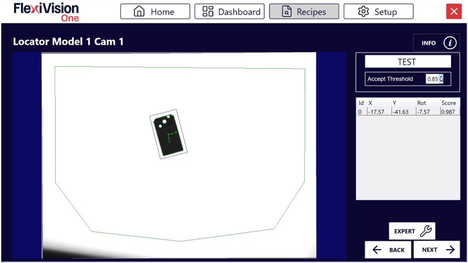
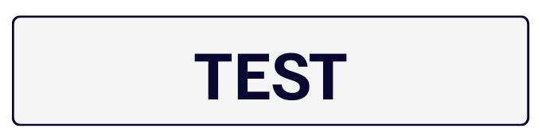

(roitest)=
# **Definición ROI y Tolerancias**

En esta sección se definen las tolerancias de búsqueda de región y de reconocimiento del modelo creado. Estos parámetros determinan dónde y con qué precisión buscará FlexiVision One los componentes durante el funcionamiento.

**¿Qué es la búsqueda regional?**
La **Region Search** es el área dentro de la cual FlexiVision One buscará y detectará los componentes a recoger.

# Procedimiento

Tras hacer clic en "Siguiente" en la página de formación, se abre automáticamente la página **Define Robot Picking Limit Area Model**.


## Paso 1: Definición del área

:::{video} ../../../../../_shared/media/videos/TastoInfo_DefineRobotArea_1280x720.mp4
    :width: 100%
    :align: center
:::
```{list-table}
* - **1**
  - En la página **Define Robot Picking Limit Area Model**, modifique el recuadro para delimitar el área de búsqueda
* - **2**
  - Una vez dimensionada correctamente la Region Search, haga clic en 
* - **3**
  - Se abrirá la página **Locator Model 1 Cam 1**
```
```{tip}
Dimensione el área en función del espacio de trabajo real del robot, evitando las zonas inalcanzables.
```
:::{tip}
Si tiene alguna duda durante la configuración, consulte el botón **INFO** de la página actual.
:::

### *Descripción general de la interfaz del modelo de localización*


```{list-table}
:header-rows: 1
:widths: 30 70

* - Parámetro
  - Descripción
* - **Test**
  - Realiza una prueba de reconocimiento en tiempo real con los parámetros actuales
* - **Accept Threshold**
  - Umbral mínimo de fidelidad (puntuación) que debe tener un componente para ser aceptado
* - **Results Panel**
  - Panel que muestra todos los componentes detectados con detalles (Id, coordenadas, puntuación)
```
### Tutorial en vídeo
Tutorial en vídeo que explica los pasos 2 y 3 posteriores:
:::{video} ../../../../../_shared/media/videos/TastiInfo_LocatorModel_1280x720.mp4
    :width: 100%
    :align: center
:::


## Paso 2: Preparación de la escena
```{list-table}
:widths: 5 95

* - **4**
  - Coloque **otros componentes** en el área de visualización de forma aleatoria alrededor del componente de referencia para no confundirlos con él.
    
    :::{warning}
    ¡No toque el componente de referencia utilizado para el training! ¡Y no lo pierda de vista!
    :::
```

## Paso 3: Ejecución de la prueba y umbral de aceptación
```{list-table}
:widths: 5 95

* - **5**
  - Haga clic en  para reconocerlo

* - **6**
  - Observe cuántos componentes se detectan y con qué puntuaciones

* - **7**
  - Modifique el **Accept Threshold** en función de las necesidades de la aplicación
    
    :::{note}
    **¿Qué es el Accept Threshold?**
    
    Es el **grado mínimo de fidelidad** (puntuación) que un componente detectado debe tener respecto al modelo de referencia para ser aceptado.
    
    - **Valor 0.95** → Acepta solo componentes con fidelidad ≥ 95%
    - **Valor 0.80** → Acepta componentes con fidelidad ≥ 80%
    - **Valor más alto** → Más restrictivo (menos falsos positivos)
    - **Valor más bajo** → Más permisivo (detecta también componentes menos similares al de referencia)
    :::
```
```{tip}

**Enfoque iterativo recomendado:**

1. Empezar con Umbral de aceptación = 0.85
2. Realizar pruebas y observar resultados
3. Si se aceptan **demasiadas piezas** (incluidos los falsos positivos) → Aumentar el umbral (p. ej.: 0.90)
4. Si se detectan **muy pocas piezas** (se descartan piezas buenas) → Disminuir el umbral (p. ej.: 0.80)
5. Repetir hasta encontrar el valor óptimo para la aplicación

**Objetivo**: Encontrar el valor más alto posible que detecte todas las piezas buenas pero descarte las peores.
```
:::{tip}
Si tiene alguna duda durante la configuración, consulte el botón **INFO** de la página actual.
:::

---

## Resultados de la interpretación

### *Visualización de los componentes detectados*

El panel Resultados muestra todos los componentes detectados que cumplen el Umbral de aceptación:
```{list-table}
:header-rows: 1
:widths: 15 25 60

* - Campo
  - Tipo
  - Descripción
* - **Id**
  - Entero
  - Identificador único progresivo (0, 1, 2, ...)
* - **X**
  - Milímetros
  - Coordenada X del componente (referencia de origen de la rejilla de calibración)
* - **Y**
  - Milímetros
  - Coordenada Y del componente (referencia de origen de la rejilla de calibración)
* - **Rotación**
  - Grados
  - Ángulo de rotación del componente (0-360°)
* - **Puntuación**
  - Porcentaje
  - Grado de fidelidad respecto al modelo de referencia (0.00-1.00)
```
```{admonition} Sistema de prioridad
:class: info
FlexiVision One por defecto ordena automáticamente todos los componentes reconocidos por **puntuación decreciente**:
- **Id 0** → Componente con mayor puntuación (más similar al modelo de referencia)
- **Id 1** → Segundo mejor componente
- **Id 2** → Tercer mejor componente
- Y así sucesivamente...
```
### *Ejemplo de interpretación*

Supongamos que estos resultados aparecen después de la Prueba:

| ID | X | Y | Rotación | Puntuación |
|----|-------|-------|----------|-------|
| 0 | 125.4 | -45.2 | 15.3° | 0.92 |
| 1 | -80.1 | 32.5 | 178.5° | 0.89 |
| 2 | 45.7 | 110.3 | 92.1° | 0.86 |
| 3 | -150.2 | -95.7 | 45.8° | 0.83 |

**Interpretación:**
- **Id 0**: La mejor coincidencia (92%), se tomará en primer lugar
- **Id 1**: Buena coincidencia (89%), segunda opción
- **Id 2**: Coincidencia justa (86%), tercera opción
- **Id 3**: Coincidencia aceptable (83%), cuarta opción

Si el umbral de aceptación fuera 0.85:
- Id 0, 1, 2 se aceptarían
- Id 3 se descartaría (puntuación 0.83 < 0.85)

---

# Finalización

## Paso 4: Limpieza y continuación
```{list-table}
* - **8**
  - Retire **todos los componentes** de la zona, **excepto el componente de referencia** y los dos objetos situados a sus lados
    :::{danger}
      **¡No mueva el componente de referencia!**
      Incluso al limpiar la escena, procure no golpear ni mover el componente de referencia. Sus coordenadas siguen siendo necesarias para la calibración del robot en la fase final.
    :::
* - **9**
  - Haga clic en  → se abrirá la página de **Clearances**
```
```{seealso}
Proceda a la [Configuración de Clearances](istogrammi) para definir las áreas libres.
```

