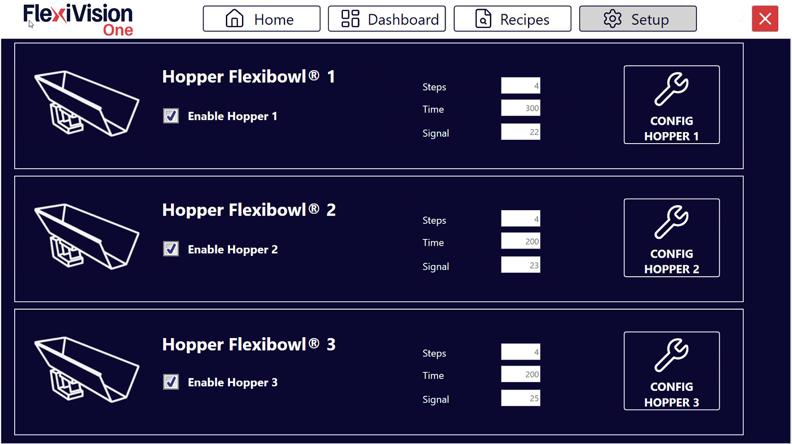
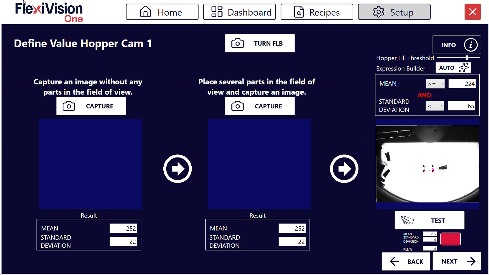
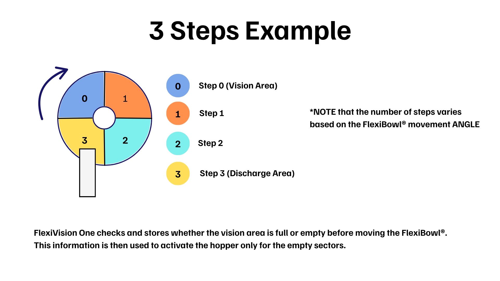
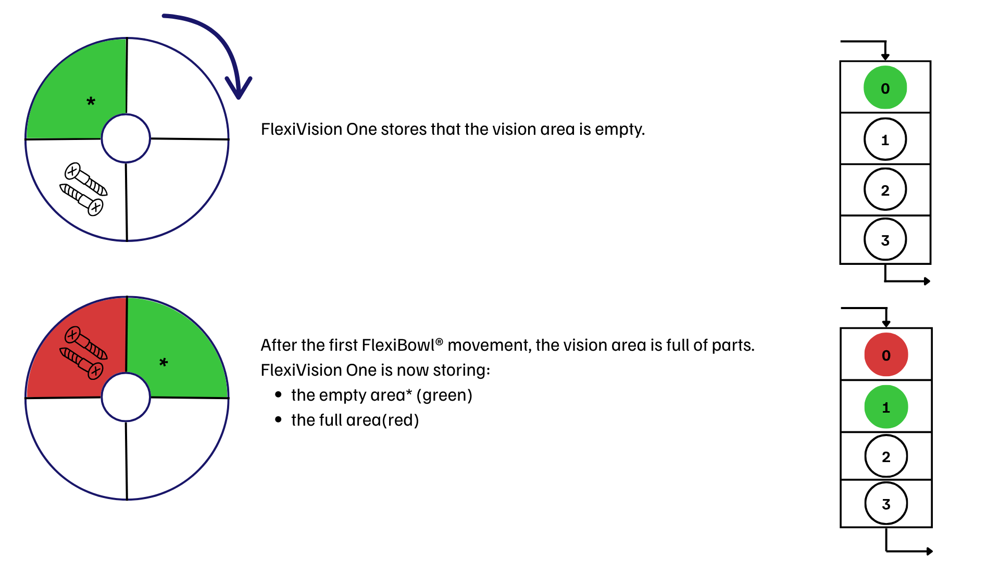
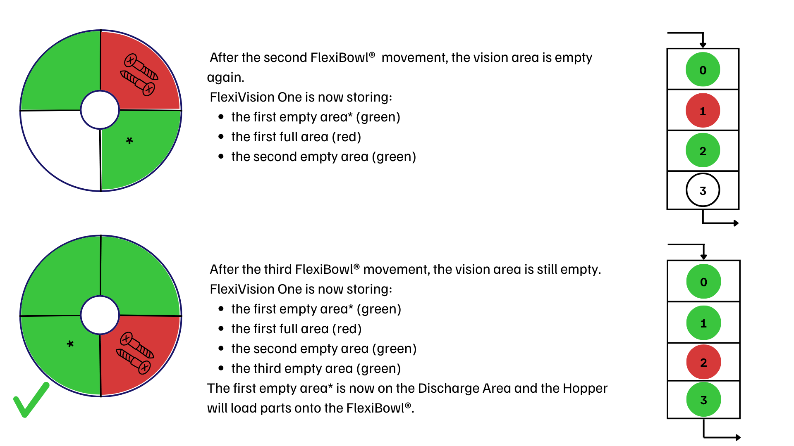
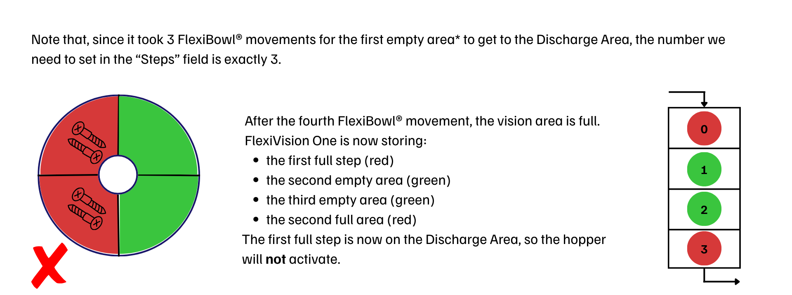

(hoppersetup)=
# **Hopper Setup**

Esta sección describe el procedimiento para configurar la tolva (Hopper). La Hopper es el componente que alimenta automáticamente piezas en el FlexiBowl® cuando el nivel desciende por debajo de un umbral mínimo.

:::{important}  **Lógica de funcionamiento**  

FlexiVision gestiona la lógica de activación de la tolva. De hecho, enviará la cadena `Hopper;signalnumber;time` cuando considere necesaria la activación. 
:::
```{note}
**Requisitos previos**

Antes de continuar, asegúrese de que:
- La Hopper se ha instalado mecánicamente 
- Se han completado las conexiones eléctricas (señales de control y alimentación)
- El FlexiBowl® ya está conectado
```
---
## Preparación de la configuración física

````{list-table}
* - **0**
  - Retire la rejilla de calibración y restablezca la disposición inicial:
    - Vuelva a colocar la superficie
    - vuelva a colocar la brida central 
    - fije la brida central con sus cuatro tornillos
````
---
## Acceso a la configuración Hopper

```{list-table}
* - **1** 
  - Desde la página principal del software, haga clic en 
* - **2**
  - En la página SETUP, identifique y haga clic en el icono **Hopper Setup**
    ```{dropdown} Página de configuración 
       
    ```
* - **3** 
  - Se abre la página de configuración de la Hopper
```

---

## Visión general de la interfaz Hopper Setup

La página Hopper Setup presenta varias secciones para configurar los parámetros de funcionamiento de las distintas tolvas:



```{list-table}
:header-rows: 1
:widths: 30 70

* - Sección
  - Descripción
* - **Enable Hopper**
  - Interruptor para habilitar/deshabilitar el uso de la Hopper en el sistema
* - **Steps**
  - Número de secuencias necesarias con las que la sección del disco que está actualmente en el área de visión llega bajo la zona de descarga de la tolva
* - **Time**
  - Duración de la activación de la tolva en milisegundos
* - **Signal**
  - Número de la señal digital utilizada para controlar la Hopper
* - **Config Hopper**
  - Botón para configurar la tolva (se utilizará más adelante)
```


---
(confighopper)=
# **Configuración de la tolva (Hopper)**

La configuración de la tolva permite la reposición automática de componentes en el disco FlexiBowl®. El sistema utiliza la visión para determinar cuándo el nivel de llenado es insuficiente y activar la tolva.

## Paso 1: Acceso a la configuración
```{list-table}
* - **1**
  - Haga clic en .   
    Desde la sección **Hopper Setup**, puede ver y gestionar las unidades de carga conectadas.
    
    :::{dropdown} Página de configuración de la tolva 
    
    :::
* - **2**
  - En el campo **Signal**, introduzca el número de la señal digital (DO - Digital Output) utilizada para controlar la Hopper
    :::{warning}
      Es esencial introducir el número de señal correcto:
      - Un número incorrecto activará la señal equivocada (potencialmente peligrosa)
      - Consulte el esquema eléctrico realizado durante la instalación
      - En caso de duda, contacte con quien efectuó el cableado
    :::
* - **3**
  - Seleccione la casilla **Enable Hopper X** para activar la tolva correspondiente.
      :::{important}
      Habilite la Hopper solo si el dispositivo está correctamente instalado
      :::
* - **4**
  - Pulse el botón **Config Hopper X** para acceder a la configuración específica 
```
## Paso 2: Definición del área de control

:::{video} ../../../../../_shared/media/videos/TastoInfo_AreaHopper_1280x720.mp4
    :width: 100%
    :align: center
:::

En esta fase se define la parte del disco que la cámara debe vigilar para la descarga.
```{list-table}
* - **5**
  - Cambie el marco azul de la pantalla para encuadrar la zona en la que se detectarán los componentes.
```
:::{tip}
Si tiene alguna duda durante la configuración, consulte el botón **INFO** de la página actual.
:::

## Paso 3: Definición de valores umbral

:::{video} ../../../../../_shared/media/videos/TastoInfo_Hopper_1280x720.mp4
:width: 100%
:align: center
:::
```{list-table}
* - **6**
  - Haga clic en  para acceder a la página **Define Value Hopper Cam**, donde se indica al sistema que distinga entre un disco vacío y uno lleno.
    :::{dropdown} Página Define Value Hopper Cam 
    
    :::
* - **7**
  - Retire todos los componentes del área de visión y haga clic en el primer botón **CAPTURE**.
* - **8**
  - Coloque el número mínimo de componentes que desee conservar en el área de visión. Si el número cae por debajo de este umbral, se activará la tolva.
* - **9**
  - Haga clic en el segundo botón **CAPTURE**.
* - **10**
  - Haciendo clic en  en Expression Builder, el sistema calcula automáticamente los valores de **Mean** (Media) y **Standard Deviation**.
* - **11**
  - Retire algunas piezas y haga clic en . 
* - **12**
  - Observe el indicador de resultados:
    - **Verde** 🟢: Nivel insuficiente, la Hopper se activa (descarga necesaria)
    - **Rojo** 🔴: Nivel suficiente, la Hopper NO se ACTIVA (OK)

      :::{warning}
      **Calibración insuficiente**

      Si el sistema no detecta el nivel correctamente:

      **Problema: Siempre verde (siempre activa la Hopper)**  
      → Umbral demasiado bajo o interferencias en la zona  
      → Solución: Aumentar el número de piezas en la segunda adquisición, comprobar la limpieza de la zona  

      **Problema: Siempre rojo (nunca activa la Hopper)**  
      → Umbral demasiado alto o área de monitorización no representativa  
      → Solución: Reducir el número de piezas en la segunda adquisición CAPTURE, repetir AUTO  

      **Problema: Comportamiento incorrecto (alternancia verde/rojo aleatoria)**  
      → Iluminación inestable o zona demasiado pequeña  
      → Solución: Comprobar la estabilidad de la retroiluminación, ampliar el área de supervisión, repetir la calibración  
      :::
```
```{note}
**Hopper Fill Threshold**

El parámetro **Hopper Fill Threshold** define el umbral porcentual de llenado del área de visión por debajo del cual la tolva se activa automáticamente.

El valor del 100% corresponde a la cantidad de piezas adquiridas durante la segunda CAPTURE (área completa). Por consiguiente, un umbral del 50% corresponde a la mitad de esa cantidad.

El sistema ajusta automáticamente el valor inicial al **70%**, lo que supone un buen equilibrio para la mayoría de las aplicaciones.

**Modificación en curso**

Es posible ajustar el umbral sin repetir el procedimiento de adquisición:

- Para descargar **menos piezas** → reduzca el porcentaje (por ejemplo, 50%) y haga clic en **AUTO**
- Para descargar **más piezas** → aumente el porcentaje (por ejemplo, 85%) y haga clic en **AUTO**

```

:::{tip}
Si tiene alguna duda durante la configuración, consulte el botón **INFO** de la página actual.
:::

## Paso 4: Parámetros operativos

Vuelva a la pantalla principal de Hopper Setup para definir el comportamiento mecánico.

```{list-table} Parámetros de funcionamiento
:widths: 20 80
:header-rows: 1

* - **Parámetro**
  - **Descripción y procedimiento**
* - **Steps**
  - Número de avances del FlexiBowl® (secuencias) necesarios para llevar las piezas del área de visión a la zona de descarga de la tolva.
* - **Time**
  - Milisegundos de activación de la tolva.   Valor recomendado: **100 – 1000 ms** (Media: **500 ms**). Ajustar en ±50 ms según el caudal deseado.
```
```{tip}
   El tiempo de activación depende no solo del valor ajustado, sino también del volumen de componentes que haya en ese momento en el depósito de la tolva. Es esencial mantener una carga constante para obtener un caudal uniforme.
```
```{tip}
El valor Time está estrechamente relacionado con el volumen de carga de la tolva: 
- Con la tolva llena habrá más piezas en la zona de descarga 
- Con la tolva medio llena habrá menos piezas en la zona de descarga 

```
:::{important}
En general, es importante no superar nunca la carga máxima de la tolva utilizada. 
:::

### *Calcular el parámetro Steps*






## Guardar configuración
```{warning}
**Guardado de receta obligatorio**

Al final de la configuración de la Hopper:

  :::{list-table}
    * - 1. 
      - Verifique que todos los parámetros estén configurados correctamente:
        - Área de monitorización posicionada
        - Umbrales calibrados (TEST funcionando)
        - Steps y Time configurados
    * - 2. 
      - Vuelva a la página principal 
    * - 3. 
      - Haga clic en 
    * - 4. 
      - Confirme el guardado
  :::
**IMPORTANTE**: Cada cambio realizado se memoriza **SOLO** si la receta se guarda correctamente antes de salir o cambiar de página.

Si no se guarda, todas las configuraciones de la Hopper se perderán al cerrar FlexiVision One.
```

---


## Próximos pasos

Una vez completada la configuración de la Hopper (o omitida si no está presente), proceda con:

- [Robot Setup](13c_Robot_Setup.md)
- [Protocol Setup](protocol_setup)
- [Guardar la receta](ricettabase)


