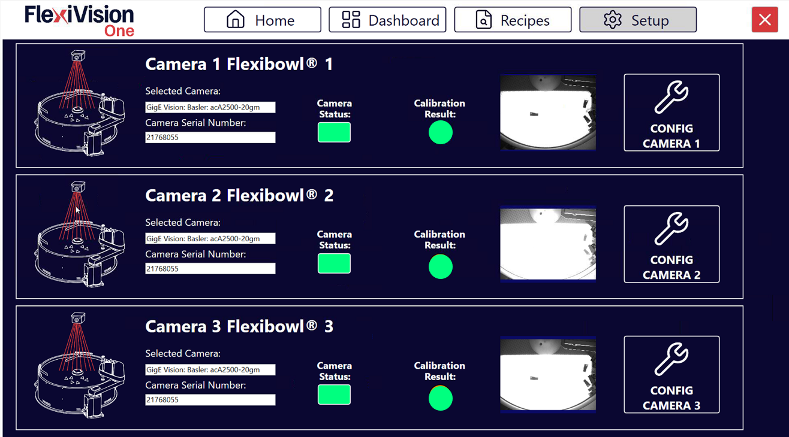

(camerasetup)=
# **Camera Setup**

Esta sección describe el procedimiento para configurar y probar la cámara industrial del sistema FlexiVision One. La configuración correcta de la cámara es fundamental para garantizar la adquisición de imágenes de calidad.

```{note}
**Requisitos previos**

Antes de continuar, asegúrese de que:
- La cámara se ha instalado mecánicamente a la distancia correcta
- El cable Ethernet de la cámara está conectado al VisionController
- La cámara está alimentada (mediante PoE o alimentación externa)
- FlexiBowl® está configurado y el backlight funciona (para pruebas de adquisición)
```

---

## Acceso a la configuración Camera

```{list-table}

* - **1** 
  - Desde la página principal del software, haga clic en 
* - **2**
  - En la página SETUP, identifique y haga clic en el icono **Camera Setup**
    ```{dropdown} Página de configuración 
       
    ```
* - **3**
  - Se abre la página de configuración de las cámaras
```

---

## Visión general de la interfaz Camera Setup

La página Camera Setup presenta tres cuadros informativos principales y un área de configuración:


```{list-table}
:header-rows: 1
:widths: 30 70

* - Sección
  - Descripción
* - **Selected Camera**
  - Muestra la identificación de la cámara actualmente seleccionada. Se muestra automáticamente al iniciar FlexiVision One. 
* - **Camera Serial Number**
  - Muestra el número de serie único de la cámara conectada
* - **Status**
  - Indica el estado de la conexión
* - **Calibration Result**
  - Muestra el resultado de la calibración de la cámara
* - **Config Camera**
  - Botón para abrir la página de configuración detallada
```

---


:::{note}
Por comodidad y coherencia, se recomienda hacer coincidir el número de la cámara con el FlexiBowl® correspondiente: 
 - ✅ Cámara instalada encima de FlexiBowl® 1: CAM-CIC-5000-20G-12345 > Seleccionar Camera 1 FlexiBowl® 1 
:::

:::{warning}
Si la cámara no es visible en la primera apertura de FlexiVision, consulte la sección [Troubleshooting para la sección Camera Setup](scelta_camera)
:::


---
## Próximos pasos

Una vez completado el Setup de la cámara, continúe con:

- [Calibración Camera](calibrazione)
- [FlexiBowl® Setup](fbsetup)
- [Hopper Setup](13b_Hopper_Setup.md)
- [Robot Setup](13c_Robot_Setup.md)
- [Protocol Setup](protocol_setup)
- [Guardar la receta](ricettabase)

