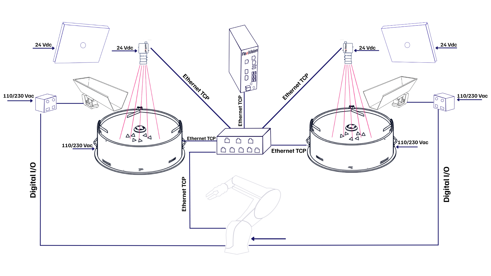
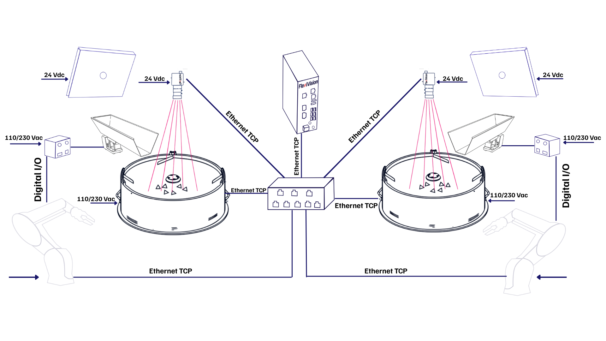

# **2 FlexiBowl® et 2 Caméras**

Cette section décrit les configurations disponibles pour le fonctionnement de **deux FlexiBowl®** et de **deux caméras** gérés par un seul VisionController FlexiVision One.

---

## Aperçu de la configuration

Dans une configuration **2 FlexiBowl® + 2 caméras**, le système comprend deux stations d'alimentation et de vision indépendantes, toutes deux contrôlées par le même VisionController. Chaque station est composée des éléments suivants&nbsp;:

* 1 FlexiBowl®
* 1 Caméra avec optique dédiée
* 1 Trémie (optionnelle, si présente)

Les deux stations communiquent avec le VisionController par l'intermédiaire d'un **commutateur de réseau**.

```{important}
Le **Switch** est un composant **obligatoire** dans toutes les configurations multi-appareils. Sans lui, il n'est pas possible de connecter simultanément plusieurs FlexiBowl® et plusieurs caméras au VisionController. Pour les spécifications techniques et les codes de commande, consultez la section [Switch](../rif_tecnico_specifiche/08_Opzioni.md#switch).
```

Cette configuration permet deux variantes de fonctionnement, en fonction du nombre de robots disponibles dans l'usine :
| | **Variante A** | **Variante B** |
|---|---|---|
| **Robot** | 1 | 2 |
| **FlexiBowl®** | 2 | 2 |
| **Caméras** | 2 | 2 |
| **Logique de fonctionnement** | Le robot atteint les deux stations | Chaque robot est dédié à une station |
| **Commutateur requis** | Oui | Oui |


---

## Variante A - 1 Robot, 2 FlexiBowl®



Dans cette variante, un **seul robot** opère sur les deux stations. Le robot est positionné de manière à pouvoir atteindre la zone de prélèvement de chaque FlexiBowl®, en alternant le prélèvement entre les deux stations en fonction des commandes reçues.

Chaque station a sa propre recette indépendante. Une application **Standard** ou **Mix** peut être configurée sur chaque station, avec différents modèles de composants au sein d'une même recette.

| Paramètre | Valeur |
|---|---|
| FlexiBowl® | 2 |
| Caméras | 2 |
| Robot | 1 |
| Commutateur requis | **Oui** |

```{important}
**Recette de base et gestion des recettes**

Comme pour la configuration simple, dans une configuration 2FB + 2CAM, le processus commence par la création d'une **recette de base unique**, qui contient la configuration matérielle et l'étalonnage de la caméra pour l'ensemble du système. Cette recette de base est ensuite **dupliquée** pour chaque station : chaque duplicata constitue la recette de fonctionnement de cette station, à l'intérieur de laquelle les modèles de pièces (jusqu'à 8 par station) sont créés.

Il est donc essentiel que l'association entre les appareils soit configurée correctement dès le départ :

* **Caméra 1** → FlexiBowl® 1 (+ Trémie 1, si présente)
* **Caméra 2** → FlexiBowl® 2 (+ Trémie 2, si présente)

Une association incorrecte lors de la configuration affecterait toutes les recettes dérivées, compromettant la reconnaissance des pièces et le bon fonctionnement de l'ensemble du système.
```
---

## Variante B - 2 Robots, 2 FlexiBowl®



Dans cette variante, chaque robot est dédié à une seule station : le **Robot 1** prélève sur FlexiBowl® 1, le **Robot 2** prélève sur FlexiBowl® 2. Les deux cellules sont indépendantes et ne se chevauchent pas.

Dans cette variante également, chaque station prend en charge les applications **Standard** et **Mix**.

| Paramètre | Valeur |
|---|---|
| FlexiBowl® | 2 |
| Caméras | 2 |
| Robot | 2 |
| Commutateur requis | **Oui** |

```{tip}
Cette variante garantit une productivité maximale, les deux cellules fonctionnant en parallèle et de manière totalement autonome.
```

```{important}
**Recette de base et gestion des recettes**

Comme pour la configuration simple, dans une configuration 2FB + 2CAM, le processus commence par la création d'une **recette de base unique**, qui contient la configuration matérielle et l'étalonnage de la caméra pour l'ensemble du système. Cette recette de base est ensuite **dupliquée** pour chaque station : chaque duplicata constitue la recette de fonctionnement de cette station, à l'intérieur de laquelle les modèles de pièces (jusqu'à 8 par station) sont créés.

Il est donc essentiel que l'association entre les appareils soit configurée correctement dès le départ :

* **Caméra 1** → FlexiBowl® 1 (+ Trémie 1, si présente)
* **Caméra 2** → FlexiBowl® 2 (+ Trémie 2, si présente)

Une association incorrecte lors de la configuration affecterait toutes les recettes dérivées, compromettant la reconnaissance des pièces et le bon fonctionnement de l'ensemble du système.
```

---

## Composants nécessaires

### *Kit de base FlexiVision One*

Le **kit de base FlexiVision One** (fourni avec le système) comprend déjà tout ce qui est nécessaire pour la **première station** (caméra, optique, câbles, grille d'étalonnage). Il n'est pas nécessaire d'acheter un deuxième kit complet pour la deuxième station.

### *Kit de caméra supplémentaire*

Pour la deuxième station, il suffit d'acheter le **kit de caméra supplémentaire**, qui est disponible dans une version spécifique pour chaque taille de FlexiBowl®. Le kit comprend :

* 1 Caméra
* 1 Optique dédiée à la taille FlexiBowl®
* 1 Grille d'étalonnage
* 1 Câble d'alimentation de la caméra
* 2 Câbles Ethernet

Sélectionner le kit en fonction de la taille du **deuxième** FlexiBowl® :

| Taille FlexiBowl® | Code Kit de caméra supplémentaire | Optique incluse |
|---|---|---|
| FB 200 | GM002002 | CE000881 - FlexiVision One 35mm Optique |
| FB 350 | GM002003 | CE000881 - FlexiVision One 35mm Optique |
| FB 500 | GM002004 | CE000880 - FlexiVision One 25mm Optique |
| FB 650 | GM002005 | CE000879 - FlexiVision One 16mm Optique |
| FB 800 | GM002006 | CE000879 - FlexiVision One 16mm Optique |
| FB 1200 | GM002007 | CE000878 - FlexiVision One 12mm Optique |
```{note}
Si les deux stations utilisent des FlexiBowl® **de tailles différentes**, le kit de caméra supplémentaire doit être sélectionné en fonction de la taille du FlexiBowl® de la deuxième station. La première station est déjà couverte par le kit de base.
```

### *Switch*

Le Switch est toujours nécessaire dans les configurations multi-appareils. Pour le code, les spécifications électriques et physiques, voir la section dédiée :

**→ [Switch](../rif_tecnico_specifiche/08_Opzioni.md#switch)**

---

## Câblage

Le schéma de câblage est identique pour les deux variantes : tous les appareils de terrain (FlexiBowl®, caméras, robots) se connectent au **Switch**, et le Switch se connecte au **VisionController** via un seul port Ethernet. La différence entre la variante A et la variante B concerne uniquement le nombre de robots connectés au Switch.
```{important}
Le Switch dispose de **8 ports Ethernet**. Vérifier que le nombre total d'appareils à connecter ne dépasse pas la capacité disponible, en tenant compte de tous les FlexiBowl®, caméras et robots présents.
```

### *Schéma de connexion*

| Appareil | Connexion |
|---|---|
| FlexiBowl® 1 | Port Ethernet → Switch |
| FlexiBowl® 2 | Port Ethernet → Switch |
| Caméra 1 | Câble Ethernet → Switch |
| Caméra 2 | Câble Ethernet → Switch |
| Robot 1 | Port Ethernet → Switch |
| Robot 2 *(Variante B uniquement)* | Port Ethernet → Switch |
| **Switch** | **Port Ethernet → VisionController** |
```{tip}
Veiller à ce qu'une adresse IP unique soit attribuée à chaque appareil dans le même sous-réseau. Les ports TCP/IP utilisés par le VisionController pour les deux stations sont configurables : par défaut **FB1 → 4001**, **FB2 → 4002**. Voir la section [Protocole de communication Robot-Vision](../rif_tecnico_specifiche/04b_Protocolli_Comunicazione.md) pour plus de détails.
```

### *Ports Switch occupés par variante*

| Port Switch | Variante A (1 Robot) | Variante B (2 Robots) |
|---|---|---|
| 1 | FlexiBowl® 1 | FlexiBowl® 1 |
| 2 | FlexiBowl® 2 | FlexiBowl® 2 |
| 3 | Caméra 1 | Caméra 1 |
| 4 | Caméra 2 | Caméra 2 |
| 5 | Robot 1 | Robot 1 |
| 6 | VisionController | Robot 2 |
| 7 | - | VisionController |
| 8 | - | - |

```{note}
**Câblage des composants individuels**

Les procédures de branchement physique de chaque composant (FlexiBowl®, caméra, trémie, robot) sont décrites en détail dans la section [Câblage et connexions](../INSTALLAZIONE_SISTEMA/10_Cablaggio_Connessioni.md). Dans une configuration 2FB + 2CAM, il suffit d'effectuer **deux fois** les mêmes opérations - une fois pour chaque station - à la seule différence que chaque appareil se connecte au **Switch** plutôt que directement au VisionController.
```
```{important}
**Association de dispositifs dans le logiciel**

FlexiVision One peut gérer toutes les stations simultanément, mais il est indispensable que l'association entre les appareils soit correctement configurée dans le logiciel. Veiller à associer :

* **Caméra 1** → FlexiBowl® 1 (+ Trémie 1, si présente)
* **Caméra 2** → FlexiBowl® 2 (+ Trémie 2, si présente)

Une association incorrecte compromettrait l'emplacement des pièces et le bon fonctionnement de l'ensemble du système.
```

**→ [Configuration initiale du système](../QUICKSTART/SETUP/13_setup.md)**

