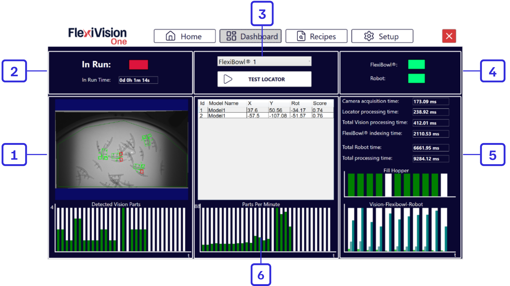
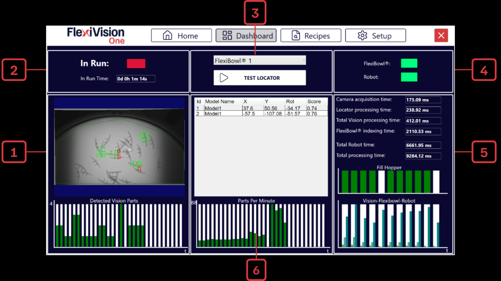
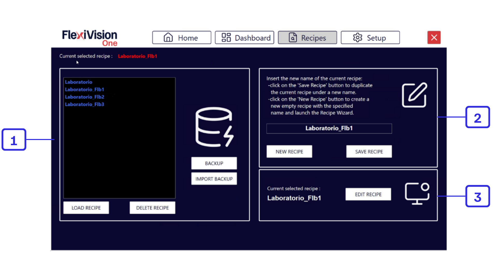
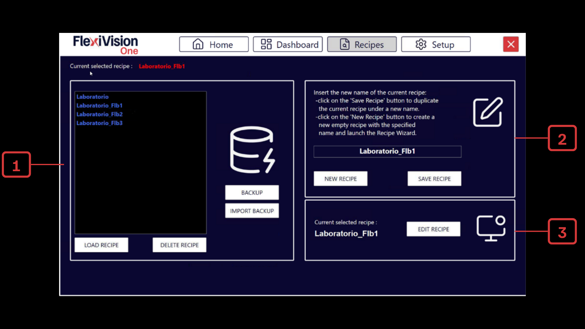
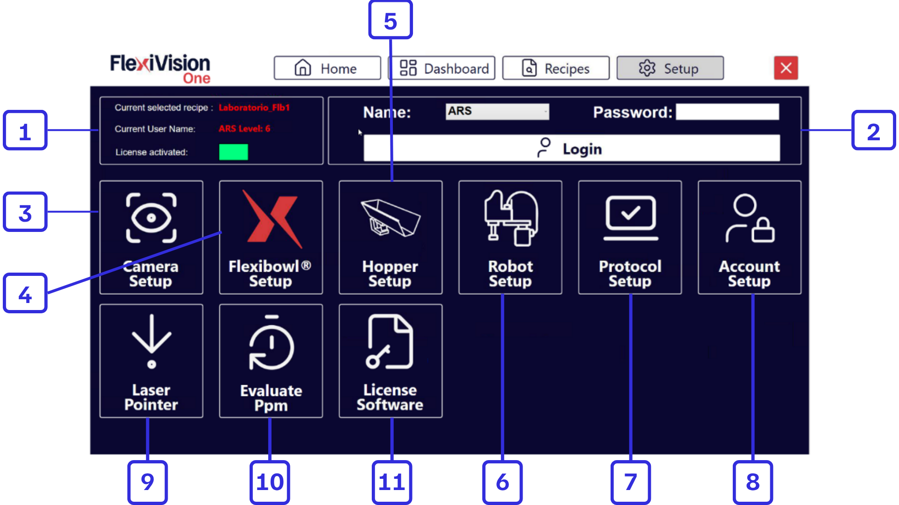
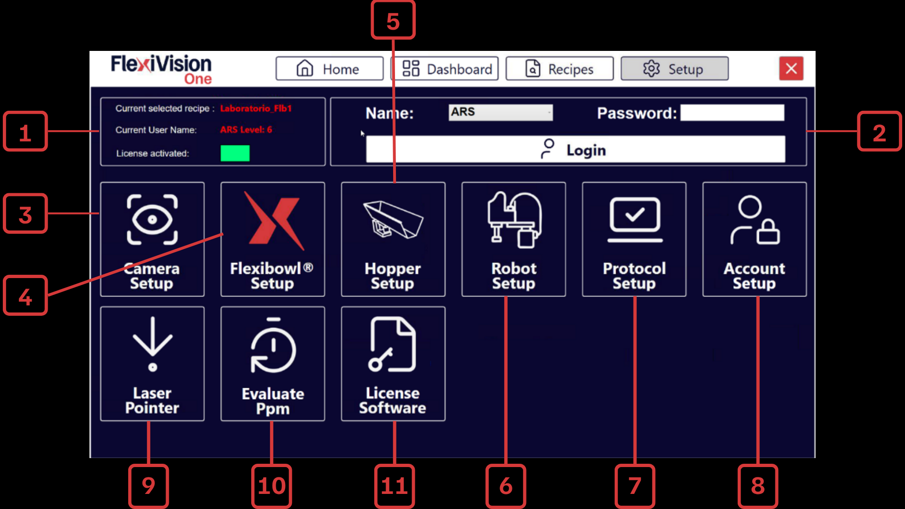

# **Page Dashboard** 



```{list-table} Description de la page du tableau de bord
:header-rows: 1
:widths: 10 90

* - **#**
  - **Description**

* - 1
  - **Zone de vision et de détection**
    * **Detected vision parts avec graphique** : nombre de composants détectés dans l'image actuelle et tendance dans le temps (30s).
    

* - 2
  - **État de fonctionnement**
    * **In run** : voyant indiquant si le système est en cours de fonctionnement ou arrêté.
    * **In run time** : chronomètre indiquant la durée totale de fonctionnement du système.

* - 3
  - **Contrôles et sélection**
    * **Menu déroulant FlexiBowl®** : permet de sélectionner le dispositif FlexiBowl® sur lequel opérer.
    * **Test Locator** : déclenche des mouvements cycliques du FlexiBowl® et de la trémie tant qu'il y a des composants dans la zone de visualisation.

* - 4
  - **État des connexions**
    * **FlexiBowl®** : indique l'état de la connexion en temps réel avec le FlexiBowl®.
    * **Robot** : indique l'état de la connexion en temps réel avec le robot.

* - 5
  - **Analyse des temps de cycle (Timings)**
    * **Camera/Locator processing time** : temps de prise de vue de chaque image et reconnaissance des composants.
    * **Total vision processing Time** : somme des temps de la caméra et du localisateur.
    * **Total FlexiBowl® / Robot time** : temps pour une séquence de mouvement FB et un seul mouvement pick & place du robot.
    * **Total processing time** : temps de traitement total (Vision + FB + Robot).
    * **Fill hopper** : historique des déchargements effectués par la trémie sur le disque du FlexiBowl®.
    * **Vision - FlexiBowl® - Robot** : graphique comparatif des trois fonctions pour comprendre l'impact de chaque processus sur le temps total.
* - 6
  - **Graphiques de performance et historique**
    * **Liste des modèles détectés** : tableau présentant les coordonnées (**X**, **Y**), la rotation (**Rot**) du composant et le **Score** (degré de similarité de l'objet détecté avec le modèle de référence).
    * **Parts per minute** : graphique des pièces moyennes prélevées par minute.
```
(recipes)=
# **Page Recipes** 



```{list-table} Description de la page Recipes
:header-rows: 1
:widths: 10 90

* - **#**
  - **Description**

* - 1
  - **Gestion de la base de données des recettes**
    * **Backup** : sauvegarde toutes les recettes dans un seul fichier .xml, qui peut être enregistré à l'endroit souhaité.
    * **Import backup** : permet d'importer toute sauvegarde effectuée précédemment avec FlexiVision One.
    * **Load recipe** : charge la recette sélectionnée dans la liste ci-dessus pour la rendre opérationnelle.
    * **Delete recipe** : supprime définitivement la recette sélectionnée de la liste.

* - 2
  - **Création et sauvegarde**
    * **New recipe** : lance la création d'une nouvelle recette. Après avoir choisi le nom et le FlexiBowl® avec lequel nous travaillons, le menu de création de modèles s'ouvre directement. 
      :::{note}
        La recette doit ensuite être sauvegardée en cliquant sur Save. 
      :::
    * **Save recipe** : sauvegarde la recette en cours en écrasant les paramètres modifiés ou crée un nouveau fichier s'il n'existe pas encore.

* - 3
  - **Modifier la recette**
    * **Edit recipe** : bouton direct qui permet d'accéder au menu de configuration et de création de modèles pour la recette sélectionnée.
```

# **Page Setup** 




```{list-table} Description de la page Setup
:header-rows: 1
:widths: 10 90

* - **#**
  - **Description**

* - 1
  - **Informations sur l'état**
     - **Current selected recipe** : indique le nom de la recette en cours d'utilisation.
     - **Current user name** : indique l'utilisateur connecté et son niveau d'accès.
     - **In Run** : indique si l'application est active.

* - 2
  - **Panneau d'accès**
     - **Name** : champ permettant de saisir le nom de l'utilisateur.
     - **Login** : bouton permettant de confirmer les identifiants et de se connecter au système.

* - 3
  - **Camera setup** : section dédiée à la configuration des paramètres de la caméra.
* - 4
  - **FlexiBowl® setup** : espace de réglage des paramètres de mouvement et de contrôle du FlexiBowl®.
     
* - 5
  - **Hopper setup** : configuration des paramètres de la trémie (vibration et déchargement).
     
* - 6
  - **Robot setup** : section permettant de configurer la communication avec le robot.

* - 7
  - **Protocol setup** : page de configuration des paramètres définissant le nombre d'objets que la vision doit ou peut renvoyer à chaque cycle, l'ordre de priorité et les valeurs statistiques à utiliser en fonction du nombre de prises du robot et de la durée maximale de manipulation de chaque composant.
     
* - 8
  - **Account setup** : permet de configurer les différents comptes utilisateurs en fonction des niveaux d'accès.

* - 9
  - **Laser pointer** : permet d'utiliser un instrument laser pour simuler un prélèvement (pick) en l'absence du robot.
* - 10
  - **Evaluate PPM** : permet d'évaluer les pièces par minute (PPM) lors de l'utilisation du pointeur laser.

* - 11
  - **Licence software** : page d'activation de la licence logicielle.
```
# **Boutons INFO**
Dans chacune des sections opérationnelles, un bouton INFO est disponible dans le coin supérieur droit.
Une explication de la procédure étape par étape est disponible dans ce bouton ; la même procédure peut être vue dans le tutoriel vidéo.
```{dropdown} Bouton Infos de la page [Camera FLB](cameraFLB)

   :::{video} ../../../../_shared/media/videos/TastoInfo_CameraFLB_1280x720.mp4
   :width: 100%
   :align: center
   :::

```

```{dropdown} Bouton Infos de la page [Calibration](calibrazione)

   :::{video} ../../../../_shared/media/videos/TastoInfo_Calibration_1280x720.mp4
   :width: 100%
   :align: center
   :::

```
```{dropdown} Bouton Infos de la page [Train Model](modello)

   :::{video} ../../../../_shared/media/videos/TastoInfo_TrainModel_1280x720.mp4
   :width: 100%
   :align: center
   :::

```
```{dropdown} Bouton Infos de la page [Define Robot Picking Area](robotarea)

   :::{video} ../../../../_shared/media/videos/TastoInfo_DefineRobotArea_1280x720.mp4
   :width: 100%
   :align: center
   :::

```
```{dropdown} Bouton Infos de la page [Locator Model](locator)

   :::{video} ../../../../_shared/media/videos/TastiInfo_LocatorModel_1280x720.mp4
   :width: 100%
   :align: center
   :::

```
```{dropdown} Bouton Infos de la page [Clearances](clearances)

   :::{video} ../../../../_shared/media/videos/TastoInfo_Clearances_1280x720.mp4
   :width: 100%
   :align: center
   :::

```
```{dropdown} Bouton Infos de la page [Clearance 1](clearance1)

   :::{video} ../../../../_shared/media/videos/TastoInfo_Clearance1_1280x720.mp4
   :width: 100%
   :align: center
   :::

```
```{dropdown} Bouton Infos de la page [Picking Offset](pickingoffset)

   :::{video} ../../../../_shared/media/videos/TastoInfo_PickingOffset_1280x720.mp4
   :width: 100%
   :align: center
   :::

```
```{dropdown} Bouton Infos de la page [Define Hopper Area](definehopperarea)

   :::{video} ../../../../_shared/media/videos/TastoInfo_AreaHopper_1280x720.mp4
   :width: 100%
   :align: center
   :::

```
```{dropdown} Bouton Infos de la page [Define Value Hopper](definevaluehopper)

   :::{video} ../../../../_shared/media/videos/TastoInfo_Hopper_1280x720.mp4
   :width: 100%
   :align: center
   :::

```
