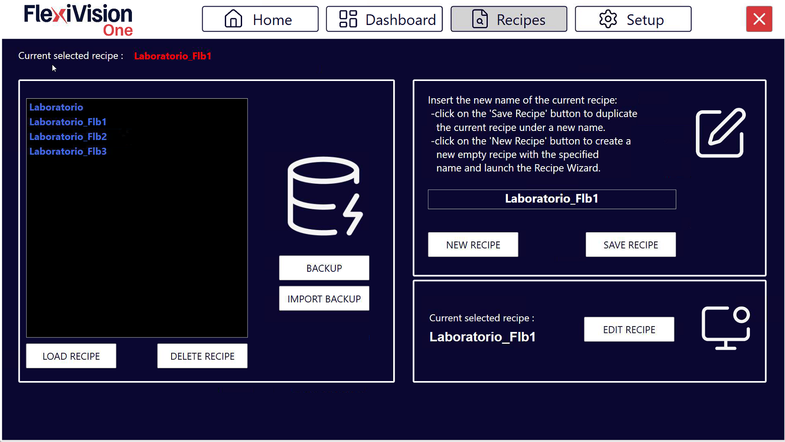

(nuovaricetta)=
# **Créer une nouvelle recette**

Cette section décrit comment créer une nouvelle recette d'application dans FlexiVision One. Une recette est le contenant principal qui comprend tous les modèles de pièces, les configurations FlexiBowl®/Hopper et les paramètres du robot requis pour une application de prélèvement complète.
```{note}
**Créer une nouvelle recette quand :**

- Vous travaillez avec un **type de pièce complètement différent**
- Vous changez d'**application**

**Il n'est pas nécessaire de créer une nouvelle recette quand :**
- Vous ajoutez une face de la même pièce (créez un nouveau modèle dans la même recette pour la même pièce dans des positions différentes)
- Vous faites de petits ajustements aux paramètres existants (exposition de la came)
- Vous ne changez que le seuil d'acceptation, le seuil de score, etc.
```

---

## Aperçu de l'interface

Avant de procéder à l'apprentissage du modèle, se familiariser avec l'interface [Recipes](recipes).



## Sauvegarde de la recette de base

Avant de poursuivre, s’assurer d'avoir sauvegardé la recette de base créée lors de la configuration initiale :
:::{list-table}
  * - **1**
    - À partir de la page d'accueil, cliquer sur 
  * - **2**
    - Vérifier que la recette en cours est la recette de base (par ex : «&nbsp;Recipe_Base&nbsp;» créée lors de la configuration)
  * - **3**
    - Cliquer sur 
  * - **4**
    - Conserver le même nom dans le champ de sauvegarde (la recette est écrasé avec les configurations mises à jour)
  * - **5**
    - Confirmer la sauvegarde
:::
```{important}

**Pourquoi sauvegarder la recette de base ?**

La recette de base contient toutes les configurations matérielles effectuées lors de l'installation :
- Connexion FlexiBowl® (IP, paramètres)
- Connexion trémie
- Connexion robot (port TCP/IP)
- Étalonnage caméra

Le fait de disposer d'une recette de base prête à l'emploi permet de réutiliser toutes ces configurations sans avoir à les répéter.
```

---
## Étape 1 : Dupliquer la recette de base

Pour commencer la création du premier modèle, et donc la configuration d'une nouvelle application, il est toujours conseillé de dupliquer la recette de base qui vient d’être sauvegardée.
Cette fonction est utile car elle permet de sauvegarder séparément toutes les nouvelles configurations. Et cela est avantageux pour deux raisons :
- Pour démarrer une nouvelle application avec le même système, il n'est pas nécessaire de répéter toutes les étapes effectuées jusqu'à présent
- Si un seul élément de la configuration est modifié, il est possible de conserver les réglages de tous les autres composants
```{list-table}
* - **6**
  - À partir de la page principale du logiciel FlexiVision One, cliquer sur 
* - **7**
  - La page de gestion des recettes s'ouvre avec la liste de toutes les recettes existantes
* - **8**
  - Sélectionner la recette de base
* - **9**
  - Dupliquer la recette de base
* - **10**
  - Cliquer sur Load Recipe
* - **11**
  - Vérifier dans la barre supérieure que le nom affiché est bien celui de la nouvelle recette
    :::{warning}
    **Toujours travailler sur la bonne recette**

    Si plusieurs recettes sont présentes, toujours vérifier que c'est la bonne qui est sélectionnée avant de commencer les modifications. Les modifications apportées à la mauvaise recette nécessitent de refaire le travail.
    :::
```
## Étape 2 : Donner un nom à la recette

Avant de cliquer sur «&nbsp;Save Recipe&nbsp;», choisir un nom descriptif.
```{list-table}
* - **12**
  - Renommer une recette en double
    **Conventions recommandées :**
    - Noms qui identifient clairement la pièce ou l'application
    - Pas d'espaces (utiliser `_` ou `-`)
    - Inclure des informations pertinentes (type de pièce, taille, application)
    
    :::{tip}
    **Éviter les noms génériques**

    ❌ Noms à éviter :
    - `Test`, `Prova`, `Ricetta1`, `Nuova_Ricetta`

    ✓ Noms recommandés :
    - `Prod_Viti_M8_Acciaio`
    - `Assembly_Connettori_2024`
    - `QC_Ingranaggi_Serie_X`

    **Format suggéré** : `[LINEA]_[PRODOTTO]_[VARIANTE]_[GG_MM_AAAA]`

    Un nom clair facilite la gestion lorsque vous avez plusieurs recettes différentes.
    :::
```
```{warning}
**Sauvegarde des recettes**

Après avoir créé et configuré une recette :
- Utiliser la fonction de sauvegarde du logiciel ([Backup Management](backup))
- Exporter périodiquement les recettes sur un support externe
- Documenter les paramètres critiques sur papier/support numérique

Une recette bien configurée représente des heures de travail. Une protection adéquate permet d'éviter la perte de données.
```

---

## Étapes suivantes

- **[Créer un modèle](18_NuovoModello.md)**
- **[Définition ROI](roitest)**
- **[Configuration des Clearances](istogrammi)**
- **[Étalonnage du robot](robotpick)**

```{tip}
**Ce dont vous avez besoin pour la prochaine étape**

- Pièces physiques à reconnaître (au moins 10-15 pièces)
- FlexiBowl® vide et propre
- Si l'outil robotique utilisé est une pince, nous aurons également besoin de deux objets autres que les pièces à modéliser, qui serviront de simulateurs pour l'empreinte de l'outil.
- Feuille pour noter les coordonnées du robot (X, Y, RZ)
```
