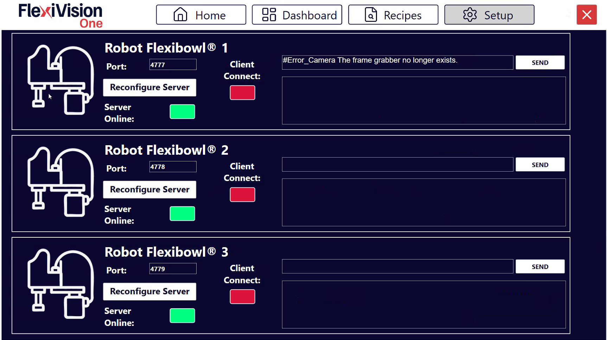

(robotsetup)=
# **Robot Setup** 

Cette section décrit la procédure de configuration de la communication TCP/IP entre le système FlexiVision One et le robot industriel. Une communication adéquate est essentielle pour permettre l'échange de coordonnées et de commandes entre les deux systèmes.

```{note}
**Pré-requis**

Avant de poursuivre, s'assurer que :
- Le robot est allumé et opérationnel
- Le câble Ethernet entre le VisionController et le robot est connecté
- Le robot est configuré pour accepter les connexions TCP/IP (voir le manuel du robot)
- Le port de communication configuré dans le code du robot est connu
```

---

## Accès à la configuration du robot

```{list-table}

* - **1** 
  - Depuis la page principale du logiciel, cliquer sur 
* - **2**
  - Sur la page SETUP, identifier et cliquer sur l'icône **Robot Setup**
    ```{dropdown} Page Setup 
       
    ```
* - **3**
  - La page de configuration de la communication avec le robot s'ouvre
```

---

## Aperçu de l'interface Robot Setup

La page Robot Setup présente plusieurs sections permettant de configurer et de tester la communication :


```{list-table}
:header-rows: 1
:widths: 30 70

* - Section
  - Description
* - **Port**
  - Port TCP/IP avec lequel le robot communique (configuré sur le contrôleur du robot)
* - **Reconfigure Server**
  - Bouton permettant de reconfigurer le serveur de communication avec de nouveaux paramètres
* - **Server Online**
  - Indicateur d'état du serveur FlexiVision One (vert = serveur actif et accessible)
* - Client **Connect**
  - Indicateur d'état du client du robot (vert = robot connecté)
* - **Messages** **Robot-Flexivision**
  - Fenêtres de logs montrant les messages échangés entre le robot et FlexiVision One (utilisées pour le débogage) :
      - la première fenêtre (la plus petite) indique les messages que FlexiVision One ou l'opérateur envoient
      - la deuxième fenêtre indique les messages que Flexvision reçoit
```

---
## Procédure de configuration

### *Étape 1 : Insertion du port de communication*

Le port TCP/IP est le paramètre critique qui doit correspondre entre le robot et le FlexiVision One :

```{list-table}
* - **4** 
  - Dans le champ **Port**, saisir le numéro du port TCP/IP avec lequel le robot va communiquer
```
```{note}
Valeur définie : (Port standard FlexiVision One)
Le numéro de port doit être&nbsp;:
   - Identique à la configuration du programme du robot
   - Entre 1024 et 65535 (ports utilisateur)
   - Pas en conflit avec les autres services du réseau
```

```{warning}

Il est **essentiel** que le numéro du port soit identique des deux côtés :
- **FlexiVision One** : Port configuré sur cette page
- **Robot** : Port configuré dans le programme du robot

Si les numéros ne correspondent pas, la connexion échouera toujours.

Exemple :
- ❌ ERRONÉ : FlexiVision One port 2000, Robot port 2001 → Aucune communication
- ✅ CORRECT : FlexiVision One port 2000, Robot port 2000 → Communication en état de fonctionnement
```

### *Étape 2 : Reconfiguration du serveur*

Après avoir défini le port correct, le serveur de communication doit être redémarré :

```{list-table}
* - **5** 
  - Cliquer sur le bouton **Reconfigure Serveur**
* - **6**
  - Veuillez patienter quelques secondes le temps que la reconfiguration se termine.
```

```{note}

Il faut cliquer sur **Reconfigure Server** à chaque fois que :
- Vous changez le numéro de port
- Vous voulez redémarrer le serveur après une erreur
- Vous avez changé la configuration réseau du VisionController
- Vous voulez forcer l'arrêt des connexions existantes.

Le serveur démarre automatiquement à l'ouverture du logiciel FlexiVision One, mais nécessite une reconfiguration manuelle après des changements.
```

### *Étape 3 : Vérification de l'état du serveur*

Après la reconfiguration, vérifier que le serveur est actif :

```{list-table}

* - **7**
  - Observer l'indicateur **Server Online :**
   - **Vert** : Serveur actif
     **Rouge** : Serveur non actif
* - **8**
  - après avoir lancé le programme à partir du robot, observer l'indicateur **Client Online :**
   - **Vert** : robot connecté
     **Rouge** : robot non connecté

```
```{note}
Si les voyants sont verts, le système est correctement connecté.

Si l'un des indicateurs est rouge, vérifier :
   - Vérifier que le programme sur le robot a été démarré
   - Vérifier que les adresses IP sont sur le même sous-réseau
   - Que le port ne soit pas déjà utilisé par un autre programme
   - Les journaux du système pour les messages d'erreur
```
### *Étape 4 : Sauvegarde et achèvement*

```{list-table}
:header-rows: 0
:widths: 10 90

* - **9**
  - Vérifier que la connexion robot → FlexiVision One est stable.

* - **10**
  - Les paramètres de communication sont automatiquement sauvegardés.

* - **11**
  - Revenir à la page principale de **SETUP**
```

---

## Prochaines étapes

Une fois la configuration du robot terminée, passer à l'étape suivante :

- [Protocol Setup](protocol_setup)
- [Sauvegarder la recette](ricettabase)


