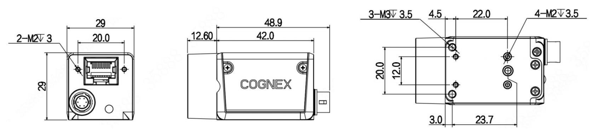

(specifiche_tecniche)=
# **Spécifications détaillées de FlexiVision One**

Cette section présente les spécifications techniques complètes du système FlexiVision One, y compris les détails de la caméra industrielle, du VisionController, de la grille d'étalonnage, des protocoles de communication et des configurations matérielles.

---
(specifiche_camera)=
## Caméra

```{figure} ../../../../_shared/media/images/camera_nuova.png
  :alt: Camera FlexiVision One CAM-CIC-5000-20G-1
  :align: center
  :width: 70%
```

Le système FlexiVision One utilise des caméras à haute résolution avec une interface Gigabit Ethernet pour assurer une acquisition rapide des images et une reconnaissance précise des composants.

### *Spécifications électriques*
```{list-table}
:header-rows: 1
:widths: 40 60

* - **Caractéristique**
  - **Spécifications**
* - Modèle
  - CAM-CIC-5000-20G-1
* - Pixels effectifs
  - 5 MP 12448 × 2048
* - SNR
  - \>38 dB
* - Gamme dynamique
  - 70 dB
* - GPIO
  - Connecteur Hirose à 6 broches : 1 entrée opto-isolée, 1 sortie opto-isolée, 1 I/O configurable sans isolation optique
* - Format d'image
  - Mono8 / 10 / 10Packed
* - Binning 
  - Support
* - Gain
  - X1 ~ X32
* - Gamme
  - De 0 à 4, support LUT
* - Temps d'exposition
  - 34.23 μS ~ 1S
* - Mode Trigger
  - Software / Hardware / Free run
* - Buffer Image
  - 256 MB
* - configurations de l'utilisateur 
  - Support two sets of user-defined configuration
* - Alimentation
  - PoE / DC via connecteur Hirose, avec tension à 12 V ou 24 V
* - Consommation d'énergie
  - 12V ≈ 3.2 W
* - Raccord d'objectif
  - C-mount
* - Température de fonctionnement
  - -30 °C ~ +50 °C
* - Température de stockage
  - -30 °C ~ +80 °C
* - Certifications
  - CE, UL, FCC, RoHS
* - Résolution
  - 2448 x 2048
* - Pixel Size
  - 3.45 × 3.45 μm
* - Capteur
  - IMX264 CMOS Global Shutter
* - Taille du capteur
  - 2/3"
* - Frame Rate
  - 24 fps
* - Bit Depth
  - 12 bit
* - Interface
  - GigE, POE
```

### *Connecteur GPIO (Hirose 6 broches)*

```{figure} ../../../../_shared/media/images/Pin_Cam.png
:alt: Connecteur GPIO Hirose 6 broches
:align: center
:width: 70%

Vue arrière de la caméra avec les connecteurs
```

```{list-table}
:header-rows: 1
:widths: 10 20 70

* - **Pin**
  - **Signal**
  - **Description**
* - 1
  - Power
  - Entrée d'alimentation DC 12V ou 24V
* - 2
  - Line1
  - Entrée opto-isolée
* - 3
  - Line2
  - GPIO 1I/O configurable sans opto-isolation par logiciel
* - 4
  - Line0
  - Sortie opto-isolée
* - 5
  - IO GND
  - Masse opto-isolée
* - 6
  - GND
  - Masse
```

```{warning}
**Prérequis obligatoires du réseau**

L'interface Gigabit Ethernet est obligatoire et nécessite une infrastructure réseau Gigabit Ethernet 1switch compatible et des câbles Ethernet de catégorie Cat6 ou Cat7 au minimum avec blindage S/STP.

Le non-respect de cette exigence perturbe complètement le fonctionnement de la caméra. Vérifier que tous les composants du réseau (câbles, commutateurs, ports) sont compatibles avec la norme GigE.
```

### *Méthodes d'alimentation*

```{list-table}
:header-rows: 1
:widths: 25 40 35

* - **Méthode**
  - **Description**
  - **Exigences**
* - **PoE**
  - Alimentation et données sur un seul câble Ethernet. Consommation électrique 3,2 W @ 12 Vdc.
  - Nécessite un injecteur PoE ou un commutateur 1IEEE 802.3af/at compatible PoE
* - **Câble de caméra externe fourni dans le kit**
  - Alimentation CC externe via un connecteur Hirose à 6 broches 112V ou 24V. Inclus dans le kit.
  - Un câble Ethernet séparé est nécessaire pour les données uniquement
```

```{tip}
**Quelle méthode choisir ?**

- **PoE** : idéal pour les installations propres à un seul câble, mais nécessite un matériel réseau spécifique
- **Alimentation externe** : solution standard plus flexible, recommandée pour la plupart des applications
```
(cavo)=
### *Câble d'alimentation* 
```{figure} ../../../../_shared/media/images/Cavo_Specfiche.png
:alt: Spécifications du câble d'alimentation de la caméra
:align: center
:width: 100%

Spécifications du câble d'alimentation de la caméra
```
```{list-table}
:widths: 30 70
:header-rows: 1

* - Paramètre
  - Valeur

* - **Description**
  - Câble E/S 10 mètres, connecteur HRS6P

* - **Compatibilité**
  - Caméras de la série CIC

* - **Longueur**
  - 10 mètres 133'

* - **Connecteur 1P1**
  - Push/Pull 6P RECP Shell SZ 7 Femelle

* - **Section des conducteurs**
  - 22 AWG

* - **Type de câble**
  - Blindé, 3 paires torsadées, flexible

* - **Couleurs des câbles**
  - Broche 1 : Marron, broche 2 : Vert, broche 3 : Rose, broche 4 : Jaune, broche 5 : Gris, broche 6 : Blanc

* - **Blindage**
  - Blindage sur tous les conducteurs

* - **Conformité**
  - UL/CSA et RoHS
```


### *Spécifications physiques et dimensions*

```{list-table}
:header-rows: 1
:widths: 40 60

* - **Caractéristique**
  - **Valeur**
* - Largeur × Hauteur 1Corps
  - 29 × 29 mm
* - Profondeur 1Corps
  - 42,0 mm
* - Profondeur totale 1y compris le connecteur arrière
  - 48,9 mm
* - Projection avant 1Montage de l'objectif
  - 12.60 mm
* - Entraxe des trous de montage latéraux 1M2
  - 20,0 × 23,7 mm
* - Trous de montage avant
  - 2× M2 profondeur 3 mm
* - Trous de montage latéraux
  - 4× M2 profondeur 3,5 mm + 3× M3 profondeur 3,5 mm
* - Poids
  - 88 g
```
---
(specifiche_obiettivo)=
## Objectif
```{figure} ../../../../_shared/media/images/Ottica_000046.png
:alt: Camera FlexiVision One CAM-CIC-5000-20G-1
:align: center
:width: 50%
```
```{dropdown} Objectif 35 mm
| Paramètre | Agrandissement de référence | M.O.D. |
|------------|-----------------------------|--------|
| **Type d'objectif** | CCTV Lens | CCTV Lens |
| **Position de mise au point** | Reference Magnification | M.O.D. |
| **Grossissement** | 0.069 | 0.167 |
| **Longueur focale (mm)** | 34.97 | 34.97 |
| **Numéro F (Fno)** | 2.00 ~ 16.00 | 2.00 ~ 16.00 |
| **Ouverture numérique (NA)** | - | - |
| **Distance de travail / objet (mm)** | 500.0 / 507.0 | 200.0 / 207.0 |
| **Distance objet-image (mm)** | 555.75 | 259.16 |
| **Longueur mécanique du tube (mm)** | 36.30 ~ 38.20 | 36.30 ~ 38.20 |
| **Lentille back focus (mm)** | 14.75 | 18.16 |
| **Profondeur de champ (mm)** | 35.476 | 6.336 |
| **Résolution @550nm (µm)** | - | - |
| **Position du plan principal avant / arrière. (mm)** | 37.60 / -22.61 | 37.60 / -22.61 |
| **Position de la pupille entrée/sortie (mm)** | 25.22 / -41.78 | 25.22 / -41.78 |
| **Diamètre de la pupille entrée/sortie (mm)** | 17.03 / 26.36 | 17.03 / 26.36 |
| **Angle de champ 1° H × V** | 13.69 × 10.34 | 12.62 × 9.76 |
| **Distorsion TV 1 %** | -0.088 | -0.142 |
| **Éclairage relatif 1 %** | 44.95 | 50.20 |
| **Poids (g)** | 50 | 50 |
| **Raccord Mount** | C-mount | C-mount |
| **Cercle d'image (mm)** | φ11 | φ11 |
| **Caméra compatible maximale** | 2/3" | 2/3" |
```
```{dropdown} Objectif 25 mm
| Paramètre | Grossissement de référence | M.O.D. |
|-----------|:----------------------------:|:------:|
| **Type d'objectif** | CCTV Lens | CCTV Lens |
| **Position de mise au point** | Reference Magnification | M.O.D. |
| **Grossissement** | 0.049 | 0.152 |
| **Longueur focale (mm)** | 25.00 | 25.00 |
| **Numéro F (Fno)** | 1.60 ~ 16.00 | 1.60 ~ 16.00 |
| **Ouverture numérique (NA)** | - | - |
| **Distance de travail / objet (mm)** | 500.0 / 510.0 | 150.0 / 160.0 |
| **Distance objet-image (mm)** | 553.34 | 205.92 |
| **Longueur mécanique du tube (mm)** | 34.60 ~ 38.50 | 34.60 ~ 38.50 |
| **Lentille back focus (mm)** | 13.75 | 16.33 |
| **Profondeur de champ @PCoC 0.04mm (mm)** | 54.223 | 5.835 |
| **Résolution @550nm (µm)** | - | - |
| **Position du plan principal avant / arrière. (mm)** | 29.42 / -12.46 | 29.42 / -12.46 |
| **Position de la pupille entrée/sortie (mm)** | 18.48 / -31.94 | 18.48 / -31.94 |
| **Diamètre de la pupille entrée/sortie (mm)** | 15.92 / 28.32 | 15.92 / 28.32 |
| **Angle de champ 1° H × V** | 19.39 × 14.64 | 18.05 × 13.89 |
| **Distorsion TV 1 %** | -0.041 | -0.271 |
| **Éclairage relatif 1 %** | 49.78 | 53.52 |
| **Poids (g)** | 50 | 50 |
| **Raccord Mount** | C-mount | C-mount |
| **Cercle d'image (mm)** | φ11 | φ11 |
| **Caméra compatible maximale** | 2/3" | 2/3" |
```
```{dropdown} Objectif 16 mm
| Paramètre | Grossissement de référence | M.O.D. |
|-----------|:----------------------------:|:------:|
| **Type d'objectif** | CCTV Lens | CCTV Lens |
| **Position de mise au point** | Reference Magnification | M.O.D. |
| **Grossissement** | 0.031 | 0.095 |
| **Longueur focale (mm)** | 16.16 | 16.16 |
| **Numéro F (Fno)** | 1.60 ~ 16.00 | 1.60 ~ 16.00 |
| **Ouverture numérique (NA)** | - | - |
| **Distance de travail / objet (mm)** | 500.0 / 507.0 | 150.0 / 157.0 |
| **Distance objet-image (mm)** | 554.26 | 205.30 |
| **Longueur mécanique du tube (mm)** | 35.50 ~ 37.00 | 35.50 ~ 37.00 |
| **Lentille back focus (mm)** | 12.16 | 13.20 |
| **Profondeur de champ @PCoC 0.04mm (mm)** | 131.893 | 14.387 |
| **Résolution @550nm (µm)** | - | - |
| **Position du plan principal avant / arrière. (mm)** | 28.44 / -4.50 | 28.44 / -4.50 |
| **Position de la pupille entrée/sortie (mm)** | 18.85 / -28.07 | 18.85 / -28.07 |
| **Diamètre de la pupille entrée/sortie (mm)** | 10.18 / 25.02 | 10.18 / 25.02 |
| **Angle de champ 1° H × V** | 30.37 × 22.92 | 29.62 × 22.39 |
| **Distorsion TV 1 %** | -0.472 | -0.674 |
| **Éclairage relatif 1 %** | 32.75 | 36.61 |
| **Poids (g)** | 50 | 50 |
| **Raccord (Mount)** | C-mount | C-mount |
| **Cercle d'image (mm)** | φ11 | φ11 |
| **Caméra compatible maximale** | 2/3" | 2/3" |
```
```{dropdown} Objectif 12 mm
| Paramètre | Grossissement de référence | M.O.D. |
|-----------|:----------------------------:|:------:|
| **Type d'objectif** | CCTV Lens | CCTV Lens |
| **Position de mise au point** | Reference Magnification | M.O.D. |
| **Grossissement** | 0.023 | 0.075 |
| **Longueur focale (mm)** | 12.00 | 12.00 |
| **Numéro F (Fno)** | 1.80 ~ 16.00 | 1.80 ~ 16.00 |
| **Ouverture numérique (NA)** | - | - |
| **Distance de travail / objet (mm)** | 500.0 / 505.6 | 150.0 / 155.0 |
| **Distance objet-image (mm)** | 559.55 | 209.55 |
| **Longueur mécanique du tube (mm)** | 39.20 ~ 40.10 | 39.20 ~ 40.10 |
| **Lentille back focus (mm)** | 12.23 | 12.84 |
| **Profondeur de champ @PCoC 0.04mm (mm)** | 277.576 | 28.121 |
| **Résolution @550nm (µm)** | - | - |
| **Position du plan principal avant / arrière. (mm)** | 17.71 / -0.05 | 17.71 / -0.05 |
| **Position de la pupille entrée/sortie (mm)** | 11.68 / -12.18 | 11.68 / -12.18 |
| **Diamètre de la pupille entrée/sortie (mm)** | 6.67 / 13.41 | 6.67 / 13.41 |
| **Angle de champ 1° H × V** | 40.54 × 30.77 | 39.40 × 30.05 |
| **Distorsion TV 1 %** | -0.983 | -0.905 |
| **Éclairage relatif 1 %** | 40.64 | 42.64 |
| **Poids (g)** | 60 | 60 |
| **Raccord Mount** | C-mount | C-mount |
| **Cercle d'image (mm)** | φ11 | φ11 |
| **Caméra compatible maximale** | 2/3" | 2/3" |
```
---
(specifiche_VC)=
## VisionController
```{figure} ../../../../_shared/media/images/VisionController.png
:alt: VisionController FlexiVision One
:align: center
:width: 80%
```

Le système FlexiVision One fonctionne sur un PC industriel (VisionController) qui sert de contrôleur principal pour le logiciel de vision. ARS fournit le VisionController déjà préconfiguré et testé avec le logiciel FlexiVision One installé.

### *Spécifications électriques*

```{list-table}
:header-rows: 1
:widths: 40 60

* - **Caractéristique**
  - **Spécifications**
* - CPU
  - Intel Core i3-1115G4 1.7 14.1 GHz
* - Mémoire (RAM)
  - 8G DDR4 3200 MHz
* - Stockage
  - 256G 
* - TPM
  - TPM 2.0
* - Système d'exploitation
  - Win11 LTSC 2024
* - Bouton d'alimentation
  - Oui (panneau avant avec voyant lumineux)
* - Ports Ethernet
  - **i3/i7:** 3× Gb LAN
* - Ports USB
  -  6× USB 3.0 TypeA
* - Sortie vidéo
  - 2× HDMI 
* - Audio
  - Line Out + MIC (Jack 2-in-1)
* - Alimentation (V DC)
  - 12 ~ 32 V DC
* - Température de fonctionnement
  - 1 °C ~ +50 °C
* - Température de stockage
  - -20 °C ~ +65 °C
* - Humidité
  - <90 % (sans condensation)
* - Matériau du boîtier
  - Alliage d'aluminium + acier
* - Degré de protection
  - IP20
* - Méthode d'installation
  - Montage mural (rail DIN en option)
* - Consommation d'énergie
  - 25 W
* - Dimensions (L × H × P)
  - 59.8 × 200 × 119,5 mm
* - Poids
  - 2 kg
* - Certifications
  - CE, UL
```

### *Ports PC*
```{figure} ../../../../_shared/media/images/Spec_Elettriche_PC.png
:alt: Schéma électrique VisionController
:align: center
:width: 50%
```


```{list-table}
:header-rows: 1
:widths: 10 25 65

* - **Réf.**
  - **Connecteur**
  - **Description**
* - A
  - Bouton d'alimentation
  - Allumage et extinction de l'appareil
* - B
  - ETH 10/100/1000 Mbit – RJ45 (LAN 1)
  - Port Gigabit Ethernet 1
* - C
  - ETH 10/100/1000 Mbit – RJ45 (LAN 2)
  - Port Gigabit Ethernet 2
* - D
  - Port série (RS232) COM1
  - Interface série RS232 COM1
* - E
  - Port série (RS232) COM2
  - Interface série RS232 COM2
* - F
  - Connecteur d'entrée d'alimentation
  - Entrée d'alimentation 12-32V DC (bloc terminal à 3 broches)
* - G
  - Sortie audio + MIC (Jack 3.5 mm)
  - 1× sortie audio ligne + entrée microphone (jack 3,5 mm)
* - H
  - 6× USB-A
  - Ports USB (USB 3.0 TypeA pour les versions i3/i7)
* - I
  - Port vidéo 2
  - **B2B12/B2B14:** HDMI 2 — **B2B15/B2B16:** DisplayPort
* - L
  - Port HDMI 1
  - Sortie vidéo HDMI 1
* - M
  - ETH 10/100/1000 Mbit – RJ45 1LAN 3
  - Port Ethernet Gigabit 3
```
### *Spécifications physiques*

```{figure} ../../../../_shared/media/images/dimensioni_VC.png
:alt: Dimensions VisionController
:align: center
:width: 80%
```

```{list-table}
:header-rows: 1
:widths: 40 60

* - **Trous des vis**
  - M5
* - **Caractéristique**
  - **Valeur**
* - Largeur (totale avec étriers)
  - 245.00 mm
* - Largeur (corps)
  - 227.00 mm
* - Largeur du panneau des connecteurs
  - 200.00 mm
* - Hauteur (totale avec étriers)
  - 123.00 mm
* - Hauteur du corps
  - 120.00 mm
* - Profondeur
  - 61.10 mm
```

---
(laser)=
## Outil Laser de calibrage 
L'outil Laser est une solution de calibrage avancée qui améliore la précision avec laquelle le point de référence du robot est sauvegardé.
Le principal avantage du laser est qu'il ne nécessite pas de contact physique avec la grille d'étalonnage. Fonctionnant comme un pointeur de haute précision, le laser permet à l'opérateur d'aligner le point cible visuellement et de manière répétée sur la grille, ce qui offre un degré de précision bien plus élevé que l'utilisation d'un point physique. 
Cette précision est essentielle pour un étalonnage réussi et complète parfaitement la répétabilité garantie par la grille d'étalonnage dédiée ARS.


 

| Caractéristique | Outil Laser 1Laser Tool | Outil de pointe (Tip Tool) standard |
|--|--|--|
| Méthode de référence | Pointeur visuel sans contact | Contact 1 pointe mécanique/physique |
| Précision de la référence | Précision maximale ; l'opérateur aligne visuellement le point avec précision. | Moyenne, subordonnée à la vue de l'opérateur |
| Facilité d'utilisation | Simplifie la procédure d'alignement visuel. | Demande davantage de prudence dans le positionnement et pour éviter l'inclinaison. |
| Avantage principal | Permet de sauvegarder le point de référence du robot avec la plus grande fidélité possible, ce qui est essentiel pour la précision du prélèvement final. | Méthode de base, mais moins précise que le laser. |


```{image} ../../../../_shared/media/images/laserscomp.png
:width: 1px
:class: hidden
```
```{raw} html
<div style="display: flex; align-items: flex-start; gap: 2rem;">
  
  <table style="border-collapse: collapse; font-size: 0.95em; align-self: center;">
    <thead>
      <tr style="background: #d0d0d0;">
        <th style="padding: 6px 16px; text-align: left;">POS.</th>
        <th style="padding: 6px 16px; text-align: left;">DESCRIPTION</th>
      </tr>
    </thead>
    <tbody>
      <tr><td style="padding: 5px 16px;">1</td><td style="padding: 5px 16px;">BOUCHON DE FERMETURE SUPÉRIEUR</td></tr>
      <tr><td style="padding: 5px 16px;">2</td><td style="padding: 5px 16px;">COMPARTIMENT PILE BOUTON CR2032 3V</td></tr>
      <tr><td style="padding: 5px 16px;">3</td><td style="padding: 5px 16px;">BRIDE D'ACCOUPLEMENT</td></tr>
      <tr><td style="padding: 5px 16px;">4</td><td style="padding: 5px 16px;">COLLIER</td></tr>
      <tr><td style="padding: 5px 16px;">5</td><td style="padding: 5px 16px;">CORPS DE L'OUTIL</td></tr>
      <tr><td style="padding: 5px 16px;">6</td><td style="padding: 5px 16px;">POINTEUR LASER</td></tr>
      <tr><td style="padding: 5px 16px;">7</td><td style="padding: 5px 16px;">AMORTISSEUR À RESSORT</td></tr>
      <tr><td style="padding: 5px 16px;">8</td><td style="padding: 5px 16px;">SUPPORT ENTRETOISE</td></tr>
    </tbody>
  </table>
</div>
```
:::{important}
Le support permettant de monter l'outil Laser à la place de l'outil du robot **N'EST PAS** fourni, car il varie pour chaque robot et doit être personnalisé.
:::

:::{admonition} Conseil 
:class: tip 
L'utilisation de l'outil laser en combinaison avec la grille d'étalonnage ARS est la méthode la plus robuste et la plus précise pour installer le système FlexiVision One.
:::
---
(specifiche_griglia)=
## Grille d'étalonnage

```{figure} ../../../../_shared/media/images/griglia800.JPG
:alt: Grille d'étalonnage
:align: center
:width: 50%
```


Un excellent étalonnage est la condition de base de la précision du système FlexiVision One. Seul un étalonnage de haute précision garantit que les coordonnées détectées par la caméra (pixels) sont converties avec exactitude en coordonnées réelles du robot (millimètres), assurant ainsi le succès de l'application de prélèvement.

### *Spécifications techniques de la grille*

```{dropdown} Grille pour FlexiBowl® 200 


```

```{dropdown} Grille pour FlexiBowl® 350 

```

```{dropdown} Grille pour FlexiBowl® 500 

```

```{dropdown} Grille pour FlexiBowl® 650 

```

```{dropdown} Grille pour FlexiBowl® 800 

```

```{dropdown} Grille pour FlexiBowl® 1200 

```


Pour des informations détaillées sur les procédures d'étalonnage, consultez la section [Étalonnage de la caméra](../QUICKSTART/SETUP/14_calibrazione_camera.md).

---
## Aperçu des branchements


*Schéma de branchement complet du système FlexiVision One avec robot et FlexiBowl®*

```{list-table}
:widths: 25 25 50
:header-rows: 1

* - **De**
  - **Vers**
  - **Branchement**

* - Réseau électrique
  - FlexiBowl®
  - Alimentation 110/230 Vac

* - Réseau électrique
  - Robot
  - Alimentation électrique selon les spécifications du robot en votre possession

* - Réseau électrique
  - Caméra
  - Alimentation 24 Vdc

* - Réseau électrique
  - Dispositif d'éclairage 1 lumière
  - Alimentation 24 Vdc

* - Réseau électrique
  - Contrôleur de trémie
  - Alimentation 110/230 Vac

* - Contrôleur de trémie
  - Trémie
  - Alimentation et signal

* - Robot
  - Contrôleur de trémie
  - E/S numériques

* - VisionController
  - Caméra
  - Ethernet TCP

* - VisionController
  - FlexiBowl®
  - Ethernet TCP

* - VisionController
  - Robot
  - Ethernet TCP
```

Pour des schémas électriques détaillés, veuillez vous référer à la section [Câblage et connexions](cablaggio).


---


## Composants en option 

Des composants supplémentaires sont disponibles séparément :


:::{card} Toplight
:link: toplight
:link-type: ref
:class-card: shadow
:::

:::{card} Câble d'alimentation Toplight
:link: cavoalimtoplight
:link-type: ref
:class-card: shadow
:::

:::{card} Backlight
:link: backlight
:link-type: ref
:class-card: shadow
:::

:::{card} Switch
:link: switch
:link-type: ref
:class-card: shadow
:::

:::{card} Display
:link: display
:link-type: ref
:class-card: shadow
:::


