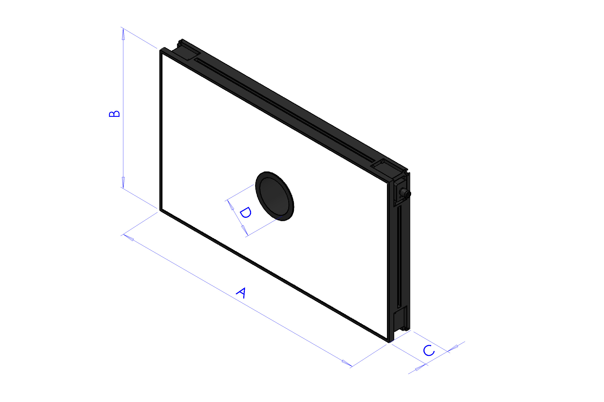
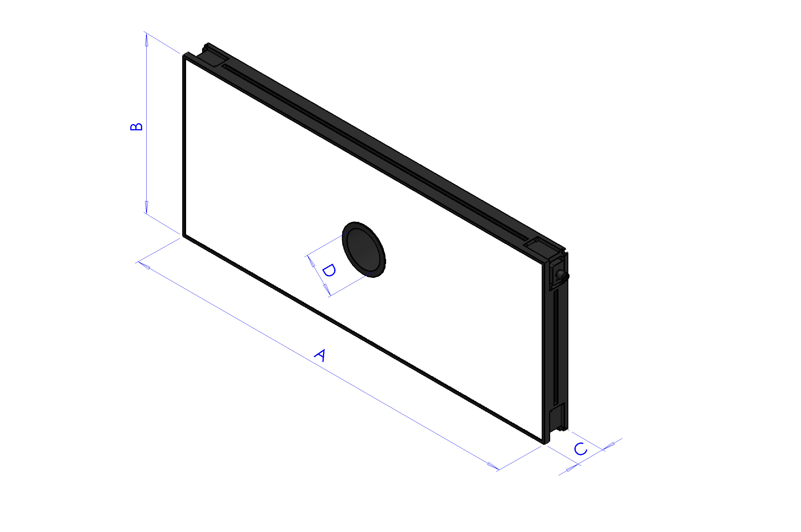
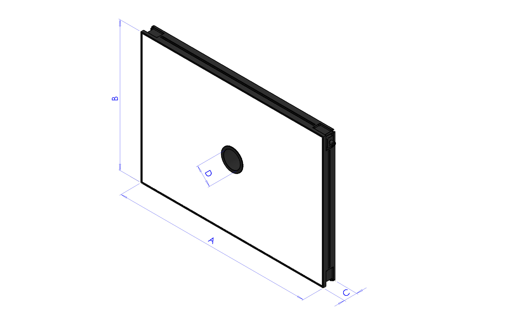
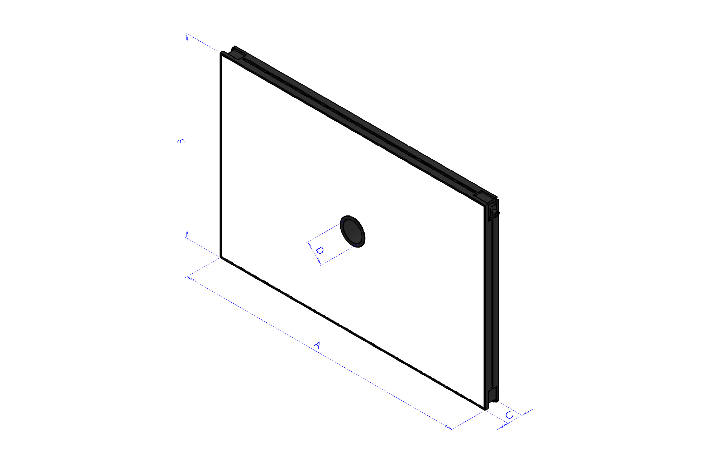
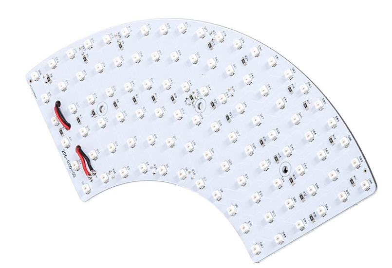
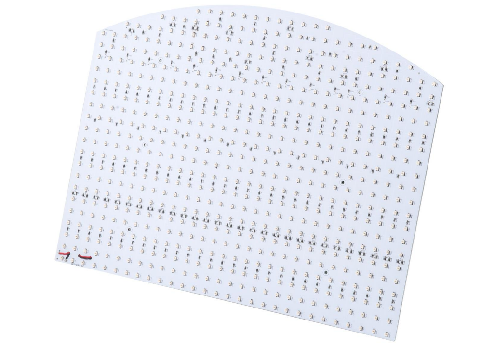
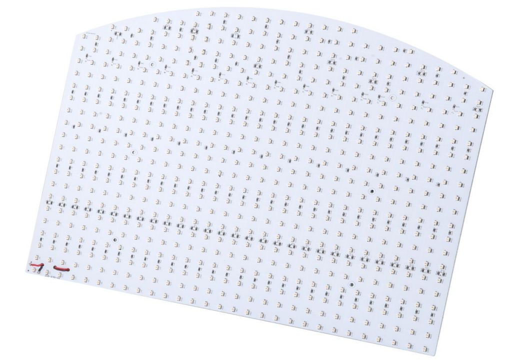
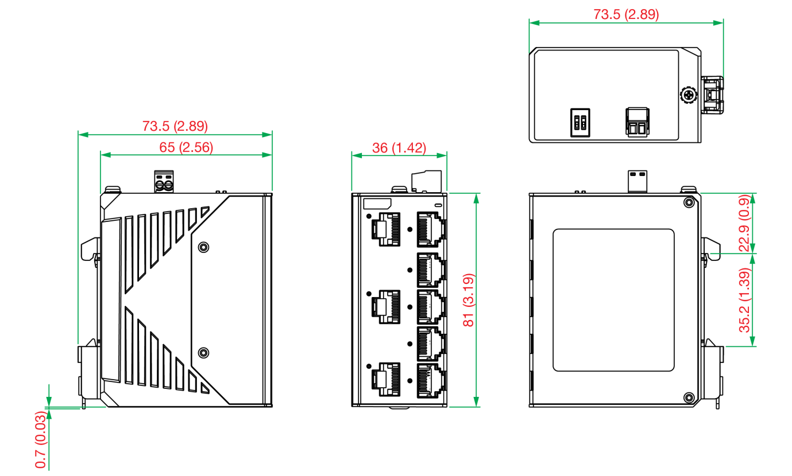
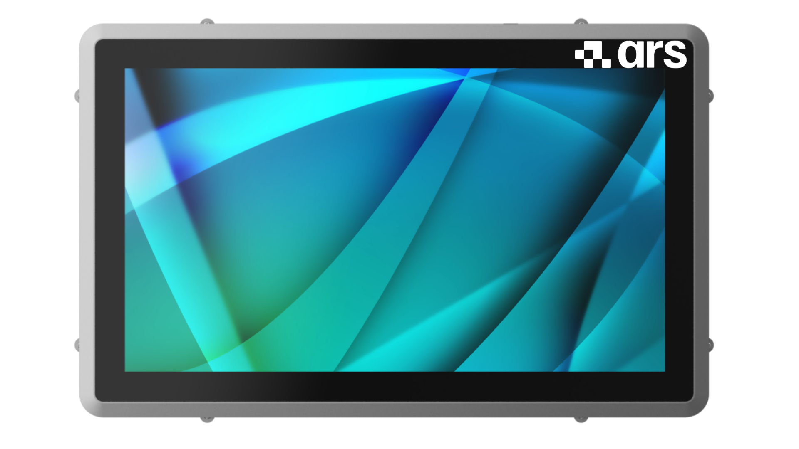

# **Options**                                                                
(toplight)=
## Toplight
Le Toplight est un système d'éclairage par le haut qui illumine la surface de la pièce directement par le haut, mettant ainsi en valeur les textures et les détails de la surface. C'est le choix idéal lorsque l'application nécessite la reconnaissance de caractéristiques visibles sur la face supérieure de la pièce.

Les Toplights disponibles sont : 

```{dropdown} TopLight 500x300 - Blanc 
Cette taille de Toplight convient aux modèles : FlexiBowl® 200, FlexiBowl® 350, FlexiBowl® 500


| Longueur | Largeur | Hauteur | Hauteur avec plaque de fixation | Diamètre du trou central | Surface utile maximale [AxB] | Périmètre utile max |
|--|--|--|--|--|--|--|
| **A** | **B** | **C** | **C + 10 mm** | **D** | - | - |
| 500 | 300 | 45 | 55 | 65 | 0.15 m^2 | 1.6 m |

:::{list-table}
:widths: 35 65
:header-rows: 0

* - **Code**
  - CM002316

* - **Électronique**
  -

* - Alimentation
  - 24 VDC ±10%

* - Modes de contrôle
  - Continu 

* - Temps de montée maximal
  - 15 µs

* - Temps de descente maximal
  - 10 µs

* - Commande
  - [Connecteur M12](cablaggio_illuminatore)

* - Configuration des broches du connecteur
  - 1: 24VDC / 3 : GND / 4 : PNP

* - Consommation
  - 96.6W

* - Tension minimale de fonctionnement
  - 20V à l'entrée de la lumière

* - Tension nominale de fonctionnement
  - 24V à l'entrée de la lumière (±10 %)

* - Tension de fonctionnement maximale
  - 30V à l'entrée de la lumière

* - Longueur d'onde
  - 

* - Classe de risque 
  - 0 (risque nul)

* - **Mécanique**
  -

* - Épaisseur
  - 45 mm + 10 mm avec plaque de fixation

* - Diamètre intérieur
  - 65mm

* - Poids
  - 23.8 Kg/m² ±15%

* - Matériaux
  - Aluminium et ABS chargé

* - Diffuseur
  - PMMA blanc

* - Fixation
  - 4 écrous M4 (fournis) à insérer dans la rainure
    ou 4 vis M4x20 (non fournies) appliquées aux angles

* - **Environnement**
  -

* - Température de fonctionnement
  - -10 °C à +40 °C / 80 % d'humidité sans condensation
    Pas de choc thermique (variation maximale : 10 °C en 24h)

* - Température de stockage
  - -20 °C à +60 °C / 80 % d'humidité sans condensation
    Pas de choc thermique (variation maximale : 10 °C en 24h)

* - Degré de protection IP
  - IP 50

* - Marquages
  - RoHS-CE-DEEE, UL
:::

```
```{dropdown} TopLight 500x300 - Rouge  
Cette taille de Toplight convient aux modèles : FlexiBowl® 200, FlexiBowl® 350, FlexiBowl® 500


| Longueur | Largeur | Hauteur | Hauteur avec plaque de fixation | Diamètre du trou central | Surface utile maximale [AxB] | Périmètre utile max |
|--|--|--|--|--|--|--|
| **A** | **B** | **C** | **C + 10 mm** | **D** | - | - |
| 500 | 300 | 45 | 55 | 65 | 0.15 m^2 | 1.6 m |

:::{list-table}
:widths: 35 65
:header-rows: 0

* - **Code**
  - CM002401

* - **Électronique**
  -

* - Alimentation
  - 24 VDC ±10%

* - Modes de contrôle
  - Continu 

* - Temps de montée maximal
  - 15 µs

* - Temps de descente maximal
  - 10 µs

* - Commande
  - [Connecteur M12](cablaggio_illuminatore)

* - Configuration des broches du connecteur
  - 1: 24VDC / 3 : GND / 4 : PNP

* - Consommation
  - 96.6W @24 Vdc

* - Tension minimale de fonctionnement
  - 20V à l'entrée de la lumière

* - Tension nominale de fonctionnement
  - 24V à l'entrée de la lumière (±10 %)

* - Tension de fonctionnement maximale
  - 30V à l'entrée de la lumière

* - Longueur d'onde
  - 630 nm 

* - Classe de risque 
  - 0 (risque nul)


* - **Mécanique**
  -

* - Épaisseur
  - 45 mm + 10 mm avec plaque de fixation

* - Diamètre intérieur
  - 65mm

* - Poids
  - 23.8 Kg/m² ±15%

* - Matériaux
  - Aluminium et ABS chargé

* - Diffuseur
  - PMMA blanc

* - Fixation
  - 4 écrous M4 (fournis) à insérer dans la rainure
    ou 4 vis M4x20 (non fournies) appliquées aux angles

* - **Environnement**
  -

* - Température de fonctionnement
  - -10 °C à +40 °C / 80 % d'humidité sans condensation
    Pas de choc thermique (variation maximale : 10 °C en 24h)

* - Température de stockage
  - -20 °C à +60 °C / 80 % d'humidité sans condensation
    Pas de choc thermique (variation maximale : 10 °C en 24h)

* - Degré de protection IP
  - IP 50

* - Marquages
  - RoHS-CE-DEEE, UL
:::

```

```{dropdown} TopLight 500x300 - Infrarouge
Cette taille de Toplight convient aux modèles : FlexiBowl® 200, FlexiBowl® 350, FlexiBowl® 500


| Longueur | Largeur | Hauteur | Hauteur avec plaque de fixation | Diamètre du trou central | Surface utile maximale [AxB] | Périmètre utile max |
|--|--|--|--|--|--|--|
| **A** | **B** | **C** | **C + 10 mm** | **D** | - | - |
| 500 | 300 | 45 | 55 | 65 | 0.15 m^2 | 1.6 m |

:::{list-table}
:widths: 35 65
:header-rows: 0

* - **Code**
  - CM002405

* - **Électronique**
  -

* - Alimentation
  - 24 VDC ±10%

* - Modes de contrôle
  - Continu 

* - Temps de montée maximal
  - 15 µs

* - Temps de descente maximal
  - 10 µs

* - Commande
  - [Connecteur M12](cablaggio_illuminatore)

* - Configuration des broches du connecteur
  - 1: 24VDC / 3 : GND / 4 : PNP

* - Consommation
  - 96.6W @24 Vdc

* - Tension minimale de fonctionnement
  - 20V à l'entrée de la lumière

* - Tension nominale de fonctionnement
  - 24V à l'entrée de la lumière (±10 %)

* - Tension de fonctionnement maximale
  - 30V à l'entrée de la lumière

* - Longueur d'onde
  - 850 nm 

* - Classe de risque 
  - 1 (faible risque)

* - **Mécanique**
  -

* - Épaisseur
  - 45 mm + 10 mm avec plaque de fixation

* - Diamètre intérieur
  - 65mm

* - Poids
  - 23.8 Kg/m² ±15%

* - Matériaux
  - Aluminium et ABS chargé

* - Diffuseur
  - PMMA blanc

* - Fixation
  - 4 écrous M4 (fournis) à insérer dans la rainure
    ou 4 vis M4x20 (non fournies) appliquées aux angles

* - **Environnement**
  -

* - Température de fonctionnement
  - -10 °C à +40 °C / 80 % d'humidité sans condensation
    Pas de choc thermique (variation maximale : 10 °C en 24h)

* - Température de stockage
  - -20 °C à +60 °C / 80 % d'humidité sans condensation
    Pas de choc thermique (variation maximale : 10 °C en 24h)

* - Degré de protection IP
  - IP 50

* - Marquages
  - RoHS-CE-DEEE, UL
:::

```

```{dropdown} TopLight 700x300 - White
Cette taille de Toplight convient aux modèles : FlexiBowl® 650, FlexiBowl® 800


| Longueur | Largeur | Hauteur | Hauteur avec plaque de fixation | Diamètre du trou central | Surface utile maximale [AxB] | Périmètre utile max |
|--|--|--|--|--|--|--|
| **A** | **B** | **C** | **C + 10 mm** | **D** | - | - |
| 700 | 300 | 45 | 55 | 65 | 0.21 m^2 | 2 m |

:::{list-table}
:widths: 35 65
:header-rows: 0

* - **Code**
  - CM002317

* - **Électronique**
  -

* - Alimentation
  - 24 VDC ±10%

* - Modes de contrôle
  - Continu 

* - Temps de montée maximal
  - 15 µs

* - Temps de descente maximal
  - 10 µs

* - Commande
  - [Connecteur M12](cablaggio_illuminatore)

* - Configuration des broches du connecteur
  - 1: 24VDC / 3 : GND / 4 : PNP

* - Consommation
  - 135.6W @24 Vdc

* - Tension minimale de fonctionnement
  - 20V à l'entrée de la lumière

* - Tension nominale de fonctionnement
  - 24V à l'entrée de la lumière (±10 %)

* - Tension de fonctionnement maximale
  - 30V à l'entrée de la lumière

* - Longueur d'onde
  - 

* - Classe de risque 
  - 0 (risque nul)

* - **Mécanique**
  -

* - Épaisseur
  - 45 mm + 10 mm avec plaque de fixation

* - Diamètre intérieur
  - 65mm

* - Poids
  - 23.8 Kg/m² ±15%

* - Matériaux
  - Aluminium et ABS chargé

* - Diffuseur
  - PMMA blanc

* - Fixation
  - 4 écrous M4 (fournis) à insérer dans la rainure
    ou 4 vis M4x20 (non fournies) appliquées aux angles

* - **Environnement**
  -

* - Température de fonctionnement
  - -10 °C à +40 °C / 80 % d'humidité sans condensation
    Pas de choc thermique (variation maximale : 10 °C en 24h)

* - Température de stockage
  - -20 °C à +60 °C / 80 % d'humidité sans condensation
    Pas de choc thermique (variation maximale : 10 °C en 24h)

* - Degré de protection IP
  - IP 50

* - Marquages
  - RoHS-CE-DEEE, UL
:::
```

```{dropdown} TopLight 700x300 - Red
Cette taille de Toplight convient aux modèles : FlexiBowl® 650, FlexiBowl® 800


| Longueur | Largeur | Hauteur | Hauteur avec plaque de fixation | Diamètre du trou central | Surface utile maximale [AxB] | Périmètre utile max |
|--|--|--|--|--|--|--|
| **A** | **B** | **C** | **C + 10 mm** | **D** | - | - |
| 700 | 300 | 45 | 55 | 65 | 0.21 m^2 | 2 m |

:::{list-table}
:widths: 35 65
:header-rows: 0
 
 * - **Code**
   - CM002402

* - **Électronique**
  -

* - Alimentation
  - 24 VDC ±10%

* - Modes de contrôle
  - Continu 

* - Temps de montée maximal
  - 15 µs

* - Temps de descente maximal
  - 10 µs

* - Commande
  - [Connecteur M12](cablaggio_illuminatore)

* - Configuration des broches du connecteur
  - 1: 24VDC / 3 : GND / 4 : PNP

* - Consommation
  - 135.6W @24 Vdc

* - Tension minimale de fonctionnement
  - 20V à l'entrée de la lumière

* - Tension nominale de fonctionnement
  - 24V à l'entrée de la lumière (±10 %)

* - Tension de fonctionnement maximale
  - 30V à l'entrée de la lumière

* - Longueur d'onde
  - 630 nm 

* - Classe de risque 
  - 0 (risque nul)

* - **Mécanique**
  -

* - Épaisseur
  - 45 mm + 10 mm avec plaque de fixation

* - Diamètre intérieur
  - 65mm

* - Poids
  - 23.8 Kg/m² ±15%

* - Matériaux
  - Aluminium et ABS chargé

* - Diffuseur
  - PMMA blanc

* - Fixation
  - 4 écrous M4 (fournis) à insérer dans la rainure
    ou 4 vis M4x20 (non fournies) appliquées aux angles

* - **Environnement**
  -

* - Température de fonctionnement
  - -10 °C à +40 °C / 80 % d'humidité sans condensation
    Pas de choc thermique (variation maximale : 10 °C en 24h)

* - Température de stockage
  - -20 °C à +60 °C / 80 % d'humidité sans condensation
    Pas de choc thermique (variation maximale : 10 °C en 24h)

* - Degré de protection IP
  - IP 50

* - Marquages
  - RoHS-CE-DEEE, UL
:::
```

```{dropdown} TopLight 700x300 - Infrared
Cette taille de Toplight convient aux modèles : FlexiBowl® 650, FlexiBowl® 800


| Longueur | Largeur | Hauteur | Hauteur avec plaque de fixation | Diamètre du trou central | Surface utile maximale [AxB] | Périmètre utile max |
|--|--|--|--|--|--|--|
| **A** | **B** | **C** | **C + 10 mm** | **D** | - | - |
| 700 | 300 | 45 | 55 | 65 | 0.21 m^2 | 2 m |

:::{list-table}
:widths: 35 65
:header-rows: 0

* - **Code** 
  - CM002406

* - **Électronique**
  -

* - Alimentation
  - 24 VDC ±10%

* - Modes de contrôle
  - Continu 

* - Temps de montée maximal
  - 15 µs

* - Temps de descente maximal
  - 10 µs

* - Commande
  - [Connecteur M12](cablaggio_illuminatore)

* - Configuration des broches du connecteur
  - 1: 24VDC / 3 : GND / 4 : PNP

* - Consommation
  - 135.6W @24 Vdc

* - Tension minimale de fonctionnement
  - 20V à l'entrée de la lumière

* - Tension nominale de fonctionnement
  - 24V à l'entrée de la lumière (±10 %)

* - Tension de fonctionnement maximale
  - 30V à l'entrée de la lumière

* - Longueur d'onde
  - 850 nm 

* - Classe de risque 
  - 1 (faible risque)

* - **Mécanique**
  -

* - Épaisseur
  - 45 mm + 10 mm avec plaque de fixation

* - Diamètre intérieur
  - 65mm

* - Poids
  - 23.8 Kg/m² ±15%

* - Matériaux
  - Aluminium et ABS chargé

* - Diffuseur
  - PMMA blanc

* - Fixation
  - 4 écrous M4 (fournis) à insérer dans la rainure
    ou 4 vis M4x20 (non fournies) appliquées aux angles

* - **Environnement**
  -

* - Température de fonctionnement
  - -10 °C à +40 °C / 80 % d'humidité sans condensation
    Pas de choc thermique (variation maximale : 10 °C en 24h)

* - Température de stockage
  - -20 °C à +60 °C / 80 % d'humidité sans condensation
    Pas de choc thermique (variation maximale : 10 °C en 24h)

* - Degré de protection IP
  - IP 50

* - Marquages
  - RoHS-CE-DEEE, UL
:::
```

```{dropdown} TopLight 700x500 - Blanc
Cette taille de Toplight convient aux modèles : FlexiBowl® 650, FlexiBowl® 800


| Longueur | Largeur | Hauteur | Hauteur avec plaque de fixation | Diamètre du trou central | Surface utile maximale [AxB] | Périmètre utile max |
|--|--|--|--|--|--|--|
| **A** | **B** | **C** | **C + 10 mm** | **D** | - | - |
| 700 | 500 | 45 | 55 | 65 | 0.35 m^2 | 2.4 m |

:::{list-table}
:widths: 35 65
:header-rows: 0

* - **Code**
  - CM002318

* - **Électronique**
  -

* - Alimentation
  - 24 VDC ±10%

* - Modes de contrôle
  - Continu 

* - Temps de montée maximal
  - 15 µs

* - Temps de descente maximal
  - 10 µs

* - Commande
  - [Connecteur M12](cablaggio_illuminatore)

* - Configuration des broches du connecteur
  - 1: 24VDC / 3 : GND / 4 : PNP

* - Consommation
  - 252.6W @24 Vdc

* - Tension minimale de fonctionnement
  - 20V à l'entrée de la lumière

* - Tension nominale de fonctionnement
  - 24V à l'entrée de la lumière (±10 %)

* - Tension de fonctionnement maximale
  - 30V à l'entrée de la lumière

* - Longueur d'onde
  - 

* - Classe de risque 
  - 0 (risque nul)

* - **Mécanique**
  -

* - Épaisseur
  - 45 mm + 10 mm avec plaque de fixation

* - Diamètre intérieur
  - 65mm

* - Poids
  - 23.8 Kg/m² ±15%

* - Matériaux
  - Aluminium et ABS chargé

* - Diffuseur
  - PMMA blanc

* - Fixation
  - 4 écrous M4 (fournis) à insérer dans la rainure
    ou 4 vis M4x20 (non fournies) appliquées aux angles

* - **Environnement**
  -

* - Température de fonctionnement
  - -10 °C à +40 °C / 80 % d'humidité sans condensation
    Pas de choc thermique (variation maximale : 10 °C en 24h)

* - Température de stockage
  - -20 °C à +60 °C / 80 % d'humidité sans condensation
    Pas de choc thermique (variation maximale : 10 °C en 24h)

* - Degré de protection IP
  - IP 50

* - Marquages
  - RoHS-CE-DEEE, UL
:::
```

```{dropdown} TopLight 700x500 - Rouge
Cette taille de Toplight convient aux modèles : FlexiBowl® 650, FlexiBowl® 800


| Longueur | Largeur | Hauteur | Hauteur avec plaque de fixation | Diamètre du trou central | Surface utile maximale [AxB] | Périmètre utile max |
|--|--|--|--|--|--|--|
| **A** | **B** | **C** | **C + 10 mm** | **D** | - | - |
| 700 | 500 | 45 | 55 | 65 | 0.35 m^2 | 2.4 m |

:::{list-table}
:widths: 35 65
:header-rows: 0

* - **Code**
  - CM002403

* - **Électronique**
  -

* - Alimentation
  - 24 VDC ±10%

* - Modes de contrôle
  - Continu 

* - Temps de montée maximal
  - 15 µs

* - Temps de descente maximal
  - 10 µs

* - Commande
  - [Connecteur M12](cablaggio_illuminatore)

* - Configuration des broches du connecteur
  - 1: 24VDC / 3 : GND / 4 : PNP

* - Consommation
  - 252.6W @24 Vdc

* - Tension minimale de fonctionnement
  - 20V à l'entrée de la lumière

* - Tension nominale de fonctionnement
  - 24V à l'entrée de la lumière (±10 %)

* - Tension de fonctionnement maximale
  - 30V à l'entrée de la lumière

* - Longueur d'onde
  - 630 nm 

* - Classe de risque 
  - 0 (risque nul)

* - **Mécanique**
  -

* - Épaisseur
  - 45 mm + 10 mm avec plaque de fixation

* - Diamètre intérieur
  - 65mm

* - Poids
  - 23.8 Kg/m² ±15%

* - Matériaux
  - Aluminium et ABS chargé

* - Diffuseur
  - PMMA blanc

* - Fixation
  - 4 écrous M4 (fournis) à insérer dans la rainure
    ou 4 vis M4x20 (non fournies) appliquées aux angles

* - **Environnement**
  -

* - Température de fonctionnement
  - -10 °C à +40 °C / 80 % d'humidité sans condensation
    Pas de choc thermique (variation maximale : 10 °C en 24h)

* - Température de stockage
  - -20 °C à +60 °C / 80 % d'humidité sans condensation
    Pas de choc thermique (variation maximale : 10 °C en 24h)

* - Degré de protection IP
  - IP 50

* - Marquages
  - RoHS-CE-DEEE, UL
:::
```

```{dropdown} TopLight 700x500 - Infrarouge
Cette taille de Toplight convient aux modèles : FlexiBowl® 650, FlexiBowl® 800


| Longueur | Largeur | Hauteur | Hauteur avec plaque de fixation | Diamètre du trou central | Surface utile maximale [AxB] | Périmètre utile max |
|--|--|--|--|--|--|--|
| **A** | **B** | **C** | **C + 10 mm** | **D** | - | - |
| 700 | 500 | 45 | 55 | 65 | 0.35 m^2 | 2.4 m |

:::{list-table}
:widths: 35 65
:header-rows: 0

* - **Code**
  - CM002407

* - **Électronique**
  -

* - Alimentation
  - 24 VDC ±10%

* - Modes de contrôle
  - Continu 

* - Temps de montée maximal
  - 15 µs

* - Temps de descente maximal
  - 10 µs

* - Commande
  - [Connecteur M12](cablaggio_illuminatore)

* - Configuration des broches du connecteur
  - 1: 24VDC / 3 : GND / 4 : PNP

* - Consommation
  - 252.6W @24 Vdc

* - Tension minimale de fonctionnement
  - 20V à l'entrée de la lumière

* - Tension nominale de fonctionnement
  - 24V à l'entrée de la lumière (±10 %)

* - Tension de fonctionnement maximale
  - 30V à l'entrée de la lumière

* - Longueur d'onde
  - 850 nm 

* - Classe de risque 
  - 1 (faible risque)

* - **Mécanique**
  -

* - Épaisseur
  - 45 mm + 10 mm avec plaque de fixation

* - Diamètre intérieur
  - 65mm

* - Poids
  - 23.8 Kg/m² ±15%

* - Matériaux
  - Aluminium et ABS chargé

* - Diffuseur
  - PMMA blanc

* - Fixation
  - 4 écrous M4 (fournis) à insérer dans la rainure
    ou 4 vis M4x20 (non fournies) appliquées aux angles

* - **Environnement**
  -

* - Température de fonctionnement
  - -10 °C à +40 °C / 80 % d'humidité sans condensation
    Pas de choc thermique (variation maximale : 10 °C en 24h)

* - Température de stockage
  - -20 °C à +60 °C / 80 % d'humidité sans condensation
    Pas de choc thermique (variation maximale : 10 °C en 24h)

* - Degré de protection IP
  - IP 50

* - Marquages
  - RoHS-CE-DEEE, UL
:::
```

```{dropdown} TopLight 900x600 - Blanc
Cette taille de Toplight convient au modèle FlexiBowl® 1200


| Longueur | Largeur | Hauteur | Hauteur avec plaque de fixation | Diamètre du trou central | Surface utile maximale [AxB] | Périmètre utile max |
|--|--|--|--|--|--|--|
| **A** | **B** | **C** | **C + 10 mm** | **D** | - | - |
| 900 | 600 | 45 | 55 | 65 | 0.54 m^2 | 3 m |

:::{list-table}
:widths: 35 65
:header-rows: 0

* - **Code**
  - CM002319

* - **Électronique**
  -

* - Alimentation
  - 24 VDC ±10%

* - Modes de contrôle
  - Continu 

* - Temps de montée maximal
  - 15 µs

* - Temps de descente maximal
  - 10 µs

* - Commande
  - [Connecteur M12](cablaggio_illuminatore)

* - Configuration des broches du connecteur
  - 1: 24VDC / 3 : GND / 4 : PNP

* - Consommation
  - 345.6W @24 Vdc

* - Tension minimale de fonctionnement
  - 20V à l'entrée de la lumière

* - Tension nominale de fonctionnement
  - 24V à l'entrée de la lumière (±10 %)

* - Tension de fonctionnement maximale
  - 30V à l'entrée de la lumière

* - Longueur d'onde
  - 

* - Classe de risque 
  - 0 (risque nul)

* - **Mécanique**
  -

* - Épaisseur
  - 45 mm + 10 mm avec plaque de fixation

* - Diamètre intérieur
  - 65mm

* - Poids
  - 23.8 Kg/m² ±15%

* - Matériaux
  - Aluminium et ABS chargé

* - Diffuseur
  - PMMA blanc

* - Fixation
  - 4 écrous M4 (fournis) à insérer dans la rainure
    ou 4 vis M4x20 (non fournies) appliquées aux angles

* - **Environnement**
  -

* - Température de fonctionnement
  - -10 °C à +40 °C / 80 % d'humidité sans condensation
    Pas de choc thermique (variation maximale : 10 °C en 24h)

* - Température de stockage
  - -20 °C à +60 °C / 80 % d'humidité sans condensation
    Pas de choc thermique (variation maximale : 10 °C en 24h)

* - Degré de protection IP
  - IP 50

* - Marquages
  - RoHS-CE-DEEE, UL
:::
```
```{dropdown} TopLight 900x600 - Rouge
Cette taille de Toplight convient au modèle FlexiBowl® 1200


| Longueur | Largeur | Hauteur | Hauteur avec plaque de fixation | Diamètre du trou central | Surface utile maximale [AxB] | Périmètre utile max |
|--|--|--|--|--|--|--|
| **A** | **B** | **C** | **C + 10 mm** | **D** | - | - |
| 900 | 600 | 45 | 55 | 65 | 0.54 m^2 | 3 m |

:::{list-table}
:widths: 35 65
:header-rows: 0

* - **Code**
  - CM002404

* - **Électronique**
  -

* - Alimentation
  - 24 VDC ±10%

* - Modes de contrôle
  - Continu 

* - Temps de montée maximal
  - 15 µs

* - Temps de descente maximal
  - 10 µs

* - Commande
  - [Connecteur M12](cablaggio_illuminatore)

* - Configuration des broches du connecteur
  - 1: 24VDC / 3 : GND / 4 : PNP

* - Consommation
  - 345.6W @24 Vdc

* - Tension minimale de fonctionnement
  - 20V à l'entrée de la lumière

* - Tension nominale de fonctionnement
  - 24V à l'entrée de la lumière (±10 %)

* - Tension de fonctionnement maximale
  - 30V à l'entrée de la lumière

* - Longueur d'onde
  - 630 nm 

* - Classe de risque 
  - 0 (risque nul)

* - **Mécanique**
  -

* - Épaisseur
  - 45 mm + 10 mm avec plaque de fixation

* - Diamètre intérieur
  - 65mm

* - Poids
  - 23.8 Kg/m² ±15%

* - Matériaux
  - Aluminium et ABS chargé

* - Diffuseur
  - PMMA blanc

* - Fixation
  - 4 écrous M4 (fournis) à insérer dans la rainure
    ou 4 vis M4x20 (non fournies) appliquées aux angles

* - **Environnement**
  -

* - Température de fonctionnement
  - -10 °C à +40 °C / 80 % d'humidité sans condensation
    Pas de choc thermique (variation maximale : 10 °C en 24h)

* - Température de stockage
  - -20 °C à +60 °C / 80 % d'humidité sans condensation
    Pas de choc thermique (variation maximale : 10 °C en 24h)

* - Degré de protection IP
  - IP 50

* - Marquages
  - RoHS-CE-DEEE, UL
:::
```

```{dropdown} TopLight 900x600 - Infrarouge
Cette taille de Toplight convient au modèle FlexiBowl® 1200


| Longueur | Largeur | Hauteur | Hauteur avec plaque de fixation | Diamètre du trou central | Surface utile maximale [AxB] | Périmètre utile max |
|--|--|--|--|--|--|--|
| **A** | **B** | **C** | **C + 10 mm** | **D** | - | - |
| 900 | 600 | 45 | 55 | 65 | 0.54 m^2 | 3 m |

:::{list-table}
:widths: 35 65
:header-rows: 0

* - **Code**
  - CM002408

* - **Électronique**
  -

* - Alimentation
  - 24 VDC ±10%

* - Modes de contrôle
  - Continu 

* - Temps de montée maximal
  - 15 µs

* - Temps de descente maximal
  - 10 µs

* - Commande
  - [Connecteur M12](cablaggio_illuminatore)

* - Configuration des broches du connecteur
  - 1: 24VDC / 3 : GND / 4 : PNP

* - Consommation
  - 345.6W @24 Vdc

* - Tension minimale de fonctionnement
  - 20V à l'entrée de la lumière

* - Tension nominale de fonctionnement
  - 24V à l'entrée de la lumière (±10 %)

* - Tension de fonctionnement maximale
  - 30V à l'entrée de la lumière

* - Longueur d'onde
  - 850 nm 

* - Classe de risque 
  - 1 (faible risque)

* - **Mécanique**
  -

* - Épaisseur
  - 45 mm + 10 mm avec plaque de fixation

* - Diamètre intérieur
  - 65mm

* - Poids
  - 23.8 Kg/m² ±15%

* - Matériaux
  - Aluminium et ABS chargé

* - Diffuseur
  - PMMA blanc

* - Fixation
  - 4 écrous M4 (fournis) à insérer dans la rainure
    ou 4 vis M4x20 (non fournies) appliquées aux angles

* - **Environnement**
  -

* - Température de fonctionnement
  - -10 °C à +40 °C / 80 % d'humidité sans condensation
    Pas de choc thermique (variation maximale : 10 °C en 24h)

* - Température de stockage
  - -20 °C à +60 °C / 80 % d'humidité sans condensation
    Pas de choc thermique (variation maximale : 10 °C en 24h)

* - Degré de protection IP
  - IP 50

* - Marquages
  - RoHS-CE-DEEE, UL
:::
```
(cavoalimtoplight)=
### *Câble d'alimentation Toplight* 

```{image} ../../../../_shared/media/images/cavoalimtoplight1.png
:align: center
:width: 60%
```

| Code   | Description              | Connecteur |
|----------|--------------------------|------------|
| CE001337 | Câble d'alimentation Toplight 2M  | M12 4 broches femelles |
| CE001338 | Câble d'alimentation Toplight power 5M | M12 4 broches femelles |
| CE001339 | Câble d'alimentation Toplight power 10M | M12 4 broches femelles |

(staffa)=
### *Support pour le montage du Toplight* 
Pour le [montage du toplight sur le côté](montaggio_staffa), un support spécial peut être acheté **séparément**. 

```{image} ../../../../_shared/media/images/staffa_montaggio.png
:align: center
:width: 80%
```

(backlight)=
## Backlight
Le Backlight est un système de rétroéclairage placé à l'intérieur du plateau du FlexiBowl® qui éclaire la pièce par le bas, créant un contraste net entre le contour de la pièce et le fond lumineux. Il est particulièrement efficace pour la reconnaissance des silhouettes, des contours et des trous, quelle que soit la couleur ou l'état de surface de la pièce.

```{dropdown} Backlight pour FB200


| Articles | CE000351 | CE000353 | CE000331 |
|--|--|--|--|
| Couleur de la LED | rouge | infrarouge | blanche |
| Longueur d'onde | 630 nm | 850 nm | N/A |
| Tension | 24VDC | 24VDC | 24VDC |
| Courant | 0.17A | 0.12A | 0.17A |
| Surface d'éclairage | 155x75 mm^2 |  |  |
| Matériau du boîtier | Alliage d'aluminium |  |  |
| Température de fonctionnement | -40 / +85 °C |  |  |
| Longueur du câble | 0,2 m |  |  |
| Méthode de refroidissement | Air naturel |  |  |
| Matériau opale | Méthacrylate opale blanc |  |  |
```
```{dropdown} Backlight pour FB350



| Articles | CE000342 | CE000275 | CE000341 |
|--|--|--|--|
| Couleur de la LED | rouge | infrarouge | blanche |
| Longueur d'onde | 630 nm | 850 nm | N/A |
| Tension | 24VDC | 24VDC | 24VDC |
| Courant | 0.18A | 0.13A | 0.18A |
| Surface d'éclairage | 220x100 mm^2 |  |  |
| Matériau du boîtier | Alliage d'aluminium |  |  |
| Température de fonctionnement | -40 / +85 °C |  |  |
| Longueur du câble | 0,2 m |  |  |
| Méthode de refroidissement | Air naturel |  |  |
| Matériau opale | Méthacrylate opale blanc |  |  |
```
```{dropdown} Backlight pour FB500


| Articles | CE000344 | CE000272 | CE000343 |
|--|--|--|--|
| Couleur de la LED | rouge | infrarouge | blanche |
| Longueur d'onde | 630 nm | 850 nm | N/A |
| Tension | 24VDC | 24VDC | 24VDC |
| Courant | 0.46A | 0.31A | 0.46A |
| Surface d'éclairage | 330x170 mm^2 |  |  |
| Matériau du boîtier | Alliage d'aluminium |  |  |
| Température de fonctionnement | -40 / +85 °C |  |  |
| Longueur du câble | 0,2 m |  |  |
| Méthode de refroidissement | Air naturel |  |  |
| Matériau opale | Méthacrylate opale blanc |  |  |
```
```{dropdown} Backlight pour FB650


| Articles | CE000306 | CE000273 | CE000305 |
|--|--|--|--|
| Articles alternatifs | GM000591 | GM000592 | GM000590 |
| Couleur de la LED | rouge | infrarouge | blanche |
| Longueur d'onde | 630 nm | 850 nm | N/A |
| Tension | 24VDC | 24VDC | 24VDC |
| Courant | 0.86A | 0.56A | 0.94A |
| Surface d'éclairage | 400x240 mm^2 |  |  |
| Matériau du boîtier | Alliage d'aluminium |  |  |
| Température de fonctionnement | -40 / +85 °C |  |  |
| Longueur du câble | 0,2 m |  |  |
| Méthode de refroidissement | Air naturel |  |  |
| Matériau opale | Méthacrylate opale blanc |  |  |
```
```{dropdown} Backlight pour FB800



| Articles | CE000345 | CE000274 | CE000346 |
|--|--|--|--|
| Couleur de la LED | rouge | infrarouge | blanche |
| Longueur d'onde | 630 nm | 850 nm | N/A |
| Tension | 24VDC | 24VDC | 24VDC |
| Courant | 1.15A | 0.76A | 1.2A |
| Surface d'éclairage | 400x315 mm^2 |  |  |
| Matériau du boîtier | Alliage d'aluminium |  |  |
| Température de fonctionnement | -40 / +85 °C |  |  |
| Longueur du câble | 0,2 m |  |  |
| Méthode de refroidissement | Air naturel |  |  |
| Matériau opale | Méthacrylate opale blanc |  |  |
```
```{dropdown} Backlight pour FB1200



| Articles | GE000051 | GE000052 | GE000050 |
|--|--|--|--|
| Couleur de la LED | rouge | infrarouge | blanche |
| Longueur d'onde | 630 nm | 850 nm | N/A |
| Tension | 24VDC | 24VDC | 24VDC |
| Courant | 4A | 2.6A | 4.2A |
| Surface d'éclairage | 917x525 mm^2 |  |  |
| Matériau du boîtier | Alliage d'aluminium |  |  |
| Température de fonctionnement | -40 / +85 °C |  |  |
| Longueur du câble | 0,2 m |  |  |
| Méthode de refroidissement | Air naturel |  |  |
| Matériau opale | Méthacrylate opale blanc |  |  |
```

## Backlight ou Toplight ?

```{warning}
**Impact sur la reconnaissance des pièces**

Le choix entre le rétro-éclairage et l'éclairage supérieur influe considérablement sur la reconnaissance :

- **Backlight** : Idéal pour les profils et les silhouettes, les pièces apparaissent comme des silhouettes sombres sur un fond clair
- **Toplight** : Nécessaire pour reconnaître les détails de la surface, les textures, les caractéristiques internes

L'étalonnage, lors de l'utilisation d'une grille d'étalonnage ARS, doit être effectué en utilisant le rétroéclairage et en éteignant l'éclairage supérieur s'il est présent.
```


### *Quand utiliser l'un ou l'autre*

```{eval-rst}
.. list-table::
   :widths: 20 50 30
   :header-rows: 1

   * - Dispositif d'éclairage
     - Quand l'utiliser
     - Exemple
   * - **Toplight**
     - Utilisé lorsque la reconnaissance du composant ne peut se faire uniquement par la forme, mais par les détails de l'objet. Il convient principalement aux surfaces lisses et non réfléchissantes, ou aux surfaces présentant des marques distinctives.
     - .. image:: ../../../../_shared/media/images/TOPLIGHT.png
          :width: 150px
   * - **Backlight**
     - Le principal cas d'utilisation du rétro-éclairage est lorsque l'objet peut être reconnu par sa silhouette/forme ou avec des parties transparentes.
     - .. image:: ../../../../_shared/media/images/BACKLIGHT.png
          :width: 150px
```
#### *Cas d'utilisation typiques*

- Vis, boulons, rondelles → **Backlight**
- Pièces avec impression sur la face supérieure, pièces mates sur des surfaces sombres → **Toplight**
- Pièces transparentes ou translucides → **Backlight**
- Pièces brillantes avec reflets → **Backlight**

---

(colore_illuminazione)=
## Couleur de l'éclairage

### *Quand utiliser chaque couleur*

```{list-table}
:widths: 30 70
:header-rows: 1

* - Couleur / Longueur d'onde
  - Utilisation recommandée
* - **Blanc**
  - Utilisé avec des composants transparents. Il est nécessaire de protéger la cellule de toute source de lumière extérieure et de la lumière du soleil.
* - **Rouge (630 nm)**
  - Utilisé pour les composants métalliques spéciaux. Longueur d'onde : 630 nm. Il est nécessaire de protéger la cellule de toute source de lumière extérieure et de la lumière du soleil.
* - **Infrarouge (850 nm)**
  - Préféré pour la plupart des types d'applications. Il n'est pas visible à l'œil nu. Longueur d'onde : 850 nm. Nous recommandons de protéger la cellule pour éviter les interférences avec la lumière du soleil.

```
Pour plus d'informations sur la protection contre la lumière ambiante, consultez la section [Blindage contre la lumière ambiante](luce_ambientale).


---

(filtroIR)=
## Filtre IR

```{image} ../../../../_shared/media/images/FiltroIR_000047.png
:align: center
:width: 60%
```

Le filtre IR est un accessoire optique à fixer sur l'objectif de la caméra qui bloque la lumière visible en ne laissant passer que le rayonnement infrarouge. Ce filtre n'est nécessaire que si un dispositif d'éclairage IR (850 nm) est utilisé : sans filtre, la caméra recevrait à la fois de la lumière visible et infrarouge, ce qui compromettrait le contraste et la qualité de la reconnaissance.


---


(switch)=
## Switch

:::{image} ../../../../_shared/media/images/switch.jpg
:align: center
:width: 30%
:::

### *Spécifications électriques*

| Paramètre | Valeur |
|-----------|--------|
| Tension d'entrée | 12/24/48 VDC |
| Tension de fonctionnement | 9.6 à 60 VDC |
| Courant d'entrée | 0.33 A (max.) |
| Raccord d’alimentation | 1 bornier amovible à 2 contacts |
| Protection contre les surintensités | Prise en charge |
| Protection contre l'inversion de polarité | Prise en charge |
| Ports 10/100/1000BaseT(X) (RJ45) | 8 |
| Mode duplex | Full/Half duplex |
| Connexion | Auto MDI/MDI-X |
| Négociation de la vitesse | Automatique |
| Normes prises en charge | IEEE 802.3, IEEE 802.3u, IEEE 802.3ab, IEEE 802.1p, IEEE 802.3x |
| Type de traitement | Store and Forward |
| Taille du tableau MAC | 4 K |
| Taille de la mémoire tampon des paquets | 1.5 Mbit |
| Configuration des interrupteurs DIP | QoS, Protection broadcast storm (BSP) |
| Certifications | UL 61010-2-201, EN 62368-1, EN 55032/35, EN 61000-6-2/-6-4, CISPR 32, FCC Part 15B Class A, CE, FCC |




### *Spécifications physiques*

| Paramètre | Valeur |
|-----------|--------|
| Dimensions | 36 x 81 x 65 mm (1.42 x 3.19 x 2.56 in) |
| Poids | 180 g (0,4 lb) |
| Logement | Métal |
| Degré de protection | IP40 |
| Installation | Rail DIN, support mural (kit en option) |
| Température de fonctionnement (standard) | -10 à 60 °C (14 à 140 °F) |
| Température de fonctionnement (modèle -T) | -40 à 75 °C (-40 à 167 °F) |
| Humidité relative | 5 à 95 % (sans condensation) |
| Température de stockage | -40 à 85 °C (-40 à 185 °F) |
| MTBF | 3.404 784 heures |
| Garantie | 5 ans |

(display)=
## Écran tactile



| Entrée                  | Spécifications                                      |
|-----------------------|-------------------------------------------------|
| Écran tactile         | Capacitif                                     |
| Entrée vidéo        | 1x VGA<br>1x DP<br>1x DVI-D                     |
| Alimentation électrique         | 12~32 Vdc (consommation d'énergie 30W)                    |
| Montage             | Montage sur panneau                           |
| Dimensions extérieures    | (L) 560 mm x (P) 350 mm x (H) 60 mm            |
| Poids                  | 7 kg                                           |
| Protection            | IP66 (avant)                          |
| Température de fonctionnement | 0 ~ 50 °C                                       |
| Température de stockage| -20 ~ +65 °C                                    |
| Humidité               | < 90 % sans condensation                           |
| Certifications        | CE                                             |


