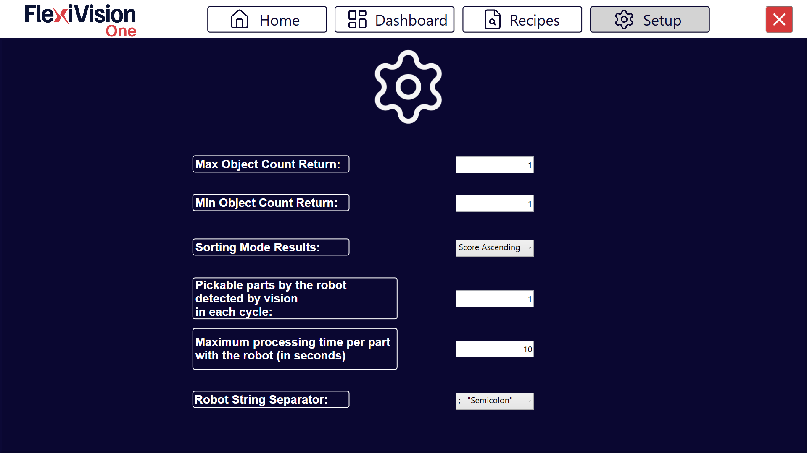
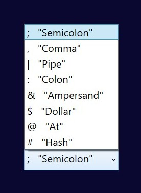

(protocol_setup)=
# **Protocol Setup**

The **Protocol Setup** page allows you to configure the parameters governing the communication flow and data exchange between the FlexiVision One system and the robot. These parameters determine how many objects are sent, how they are sorted, and how the system manages statistics and operational states.

---

## Access Protocol Setup

1. From the main menu, access the communication protocol section
2. Select **Protocol Setup**
3. The interface opens with configurable parameters


---

## Configurable Parameters



```{list-table}
:header-rows: 1
:widths: 35 65

* - **Parameter**
  - **Description and Function**
* - [**Max Object Count Return**](maxobject)
  - This indicates the **maximum** number of objects (i.e. their triad of coordinates) that the vision system can return to the robot in a single run. If the vision detects more objects than this limit, a maximum of this number are sent, selected according to the configured sorting criterion (Sorting Mode).
* - [**Min Object Count Return**](minobject)
  - This indicates the **minimum** number of objects that must be returned in a run for the result to be considered valid. If the number is below this threshold, the run is considered invalid.
* - [**Sorting Mode Results**](sortingmode)
  - This defines the **sorting criterion** by which the list of objects returned by the vision is sorted. This parameter determines the picking priority and determines which objects are included in the Max Object Count Return.
    
    *Typical option:* for decreasing score.
* - [**Pickable parts by the robot detected by vision in each cycle**](pickableparts)
  - This indicates the number of picks the robot makes per vision run. For example, a double pick corresponds to value 2. It does not represent the number of objects detected by the vision, but the number of robot picks per cycle. Parameter used for the calculation of statistics.

* - **Maximum processing time per part with the robot (in seconds)**
  - This defines the maximum time after which the system considers the management/sending of coordinates for a run to be complete and typically switches from the RUN status to the IDLE status. Parameter used for **statistics and workflow management**.

    :::{attention}
    **It is not a robot error timeout**, but a time reference for cycle calculation and productivity metrics.
    :::

* - **Robot String Separator**
  - Specifies the string separator used by the selected robot and allows you to choose from all other available separators.       
    
```

---

## Detailed Parameters Configuration

(maxobject)=
### *Max Object Count Return*

```{list-table}
 :class: align-top

* - **Function**:
  - Limits the maximum number of coordinates that are sent to the robot per vision cycle.

* - **Typical values:**
  - 
    - **1** : Most common configuration for robots with single picking
    - **2** : Configuration for robots with double picking
    - **3** : Configuration for robots with triple picking
    - **4-8 objects**: For systems with circular tracking
    - **>8 objects**: Rarely necessary, it may saturate communication

    :::{tip}
    **How to choose the value:**
    1. Consider the speed of the robot (pick & place time per part)
    2. Consider the vision + FlexiBowl® cycle time
    3. Approximate formula: `Max Count = (Vision+FlexiBowl® cycle time) / (Robot pick time)`

    **Practical example:**
    - Vision+FlexiBowl® cycle: 3 seconds
    - Robot pick time: 2 seconds/piece
    - Optimum Max Count: 3/2 = 1.5 → Round off to 2 objects
    :::
```

(minobject)=
### *Min Object Count Return*

```{list-table}
* - **Function**:
  - Limits the minimum number of coordinates that are sent to the robot per vision cycle.

* - **Typical values:**
  - 
    - **1**: Most common configuration - even a single identified piece is acceptable
    - **>2**: Only for special applications with mandatory multi-pick

* - **System behaviour:**
  - 
    - **Detected objects ≥ Min Count**: coordinate(s) sent to robot
    - **Detected objects < Min Count**: coordinates not sent and execution of the FlexiBowl® sequence


* - **Impact on productivity**
  - 
    **Min Count = 1** (more permissive):
    - ✓ Maximum flexibility, robot works even if there is only one piece
    - ✗ Possible cycles with low efficiency (1 piece every N seconds)

    **Min Count = 3** (most restrictive):
    - ✓ Guarantees minimum efficiency per cycle
    - ✗ Can cause waiting if filling is variable
```

(sortingmode)=
### *Sorting Mode Results*


```{list-table}
:header-rows: 1
:widths: 30 70

* - Sorting Mode
  - Description and When to Use
* - **By Score (Descending)**
  - Sort by score from highest to lowest. Objects that better match the model are sent first.
    **More common and recommended**: It always guarantees parts picking with more reliable identification.
* - **By Score (Ascending)**
  - Sorts by score from lowest to highest. Objects that worst match the model are sent first.
    **NOT RECOMMENDED**: It does NOT always guarantee parts picking with more reliable identification.
* - **By X Coordinate (Ascending)**
  - Sort by ascending X coordinate. Useful if robot has sequential picking preference along one axis.
* - **By X Coordinate (Descending)**
  - Sorts by descending X coordinate.
* - **By Y Coordinate (Ascending)**
  - Sorts by ascending Y coordinate.
* - **By Y Coordinate (Descending)**
  - Sorts by descending Y coordinate.
* - **X Alternating**
  - The system alternates the selection of the component between the first and the last one detected on the X-axis. Since the two selected components are far apart, there is less risk that a previous pick has moved parts nearby, ensuring a safer and more reliable pick.
* - **Y Alternating**
  - The system alternates component selection between the first and last detected on the Y axis. Same principle as X Alternating: the distance between the two picking points minimises interference caused by accidental movement of adjacent parts.
```

```{tip}
**Choosing the optimal Sorting Mode**

**Recommended in most cases: By Score (Descending)**

**Advantages**:
- Maximum reliability: robot always picks the best identified parts
- Reduces risk of incorrect picking
- Independent of physical position
```

```{note}
Sorting mode interacts with Max Object Count. The first N objects (according to the criteria) are sent.
```
(pickableparts)=
### *Pickable parts by the robot*

**Function**

Statistical parameter indicating how many parts are **actually picked up** by the robot per vision cycle.

**Typical values**

- **1**: robot with single gripper, picks up 1 piece at a time
- **2**: robot with double gripper or double suction cup
- **>2**: robot with multi-pick gripper or suction cup

```{important}
This value represents the **physical picks**, not the objects detected by vision.
```

**Explanatory example**

Scenario: double gripper, vision detects 5 objects.

- If I want to send the robot a maximum of 2 objects, I set `Max Object Count = 2`.
- If I want the robot to pick at least 2 objects at a time, I set `Min Object Count = 2`.
- In this case I set `Pickable Parts by the robot = 2`.
- If, on the other hand, I also want to allow the pick-up of only one object, I set `Max Object Count = 2`, `Min Object Count = 1` and `Pickable Parts by the robot = 2`.

**Impact on Dashboard statistics**

This parameter is crucial for the accurate calculation of **Parts Per Minute (PPM)**.

- Formula: `PPM = (Pickable parts x 60) / Total cycle time in seconds`
- If set incorrectly, the PPM displayed will not match reality


---

## Save Configuration

```{warning}
**Saving mandatory**

After configuring the Protocol Setup parameters:

1. Check that all values are set correctly
2. Click Recipes > Save Recipe
3. The parameters are saved in the system configuration
```

---

## Next Steps

Once Protocol Setup is completed, the system is fully configured for operation:

- [Save Recipe](ricettabase)


