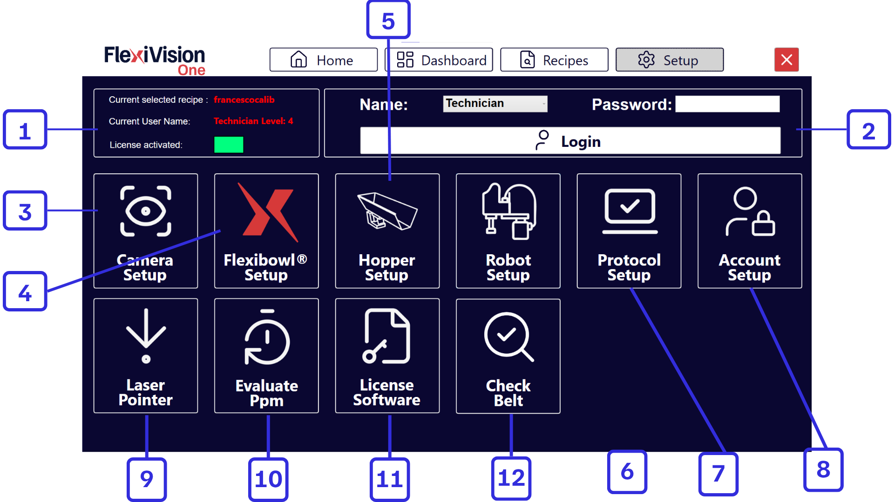
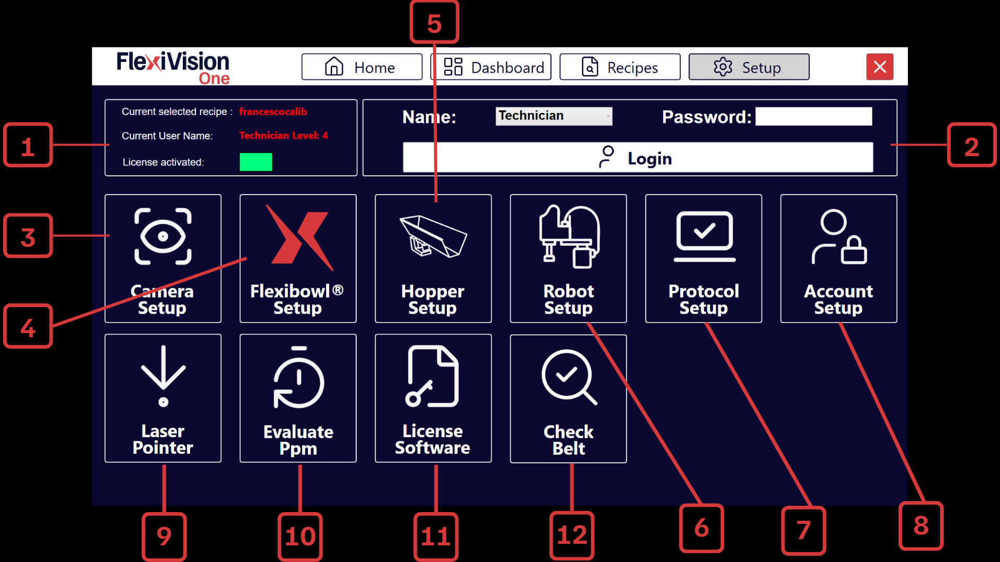

# **Página Setup**
La interfaz de FlexiVision One está estructurada en secciones funcionales que guían al usuario desde la configuración inicial hasta la gestión operativa del sistema.
Cada página proporciona información en tiempo real sobre el estado de la máquina, las conexiones, el rendimiento y los parámetros del proceso, con acceso directo a las funciones clave.
La navegación está diseñada para facilitar el uso, el control inmediato de las operaciones y la supervisión continua de la visión, la alimentación y el rendimiento del robot.





```{list-table} Descripción Página Setup
:header-rows: 1
:widths: 10 90

* - **#**
  - **Descripción**

* - 1
  - **Información de estado**
     - **Current selected recipe**: indica el nombre de la receta actualmente en uso.
     - **Current user name**: muestra el usuario conectado y el nivel de acceso correspondiente.
     - **In Run**: indica si la aplicación está activa.

* - 2
  - **Panel de acceso**
     - **Name**: campo para introducir el nombre de usuario.
     - **Login**: botón para confirmar las credenciales e iniciar sesión en el sistema.

* - 3
  - **Camera setup**: sección dedicada a la configuración de los parámetros de la cámara.
* - 4
  - **FlexiBowl® setup**: área para configurar los parámetros de movimiento y control del FlexiBowl®.
     
* - 5
  - **Hopper setup**: configuración de los parámetros de la tolva (vibración y descarga).
     
* - 6
  - **Robot setup**: sección para configurar la comunicación con el robot.

* - 7
  - **Protocol setup**: página de configuración de parámetros que define cuántos objetos debe o puede devolver la visión en cada ciclo, en qué orden se priorizan y qué valores estadísticos utilizar en función del número de tomas del robot y del tiempo máximo de manipulación de cada componente.
     
* - 8
  - **Account setup**: permite configurar las distintas cuentas de usuario en función de los niveles de acceso.

* - 9
  - **Laser pointer**: permite utilizar un puntero láser para simular un pick en ausencia del robot.
* - 10
  - **Evaluate PPM**: permite estimar las piezas por minuto (PPM) al utilizar el puntero láser.

* - 11
  - **Licence software**: página para la activación de la licencia de software.
```
