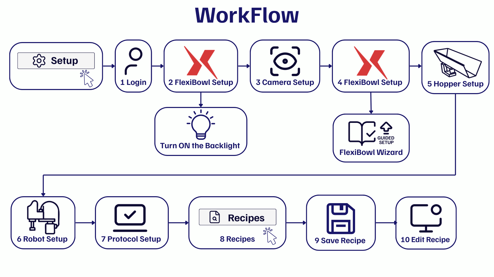
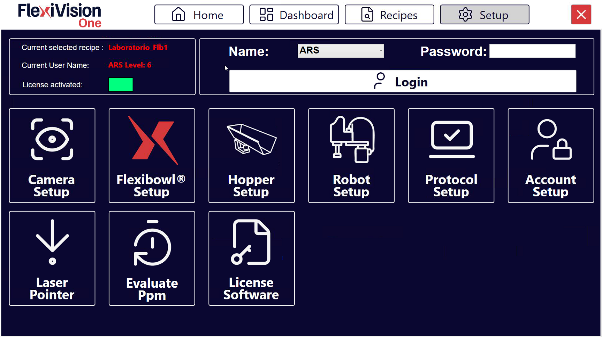

(setupcomponenti)=
# **Configuración Inicial del Sistema**

Esta sección guía al usuario a través de la configuración completa de los componentes de hardware y software del sistema FlexiVision One. Es imprescindible seguir los pasos en el orden indicado para garantizar el correcto funcionamiento del sistema.

```{note}
**Requisitos previos**

Antes de iniciar la configuración del software, asegúrese de que:
- Se ha completado la instalación mecánica de todos los componentes ([Instalación Mecánica](Installazione_Meccanica))
- Todos los cables están correctamente conectados ([Cableado y conexiones](cablaggio)) 
```

---

## Resumen del proceso de configuración

El proceso de configuración inicial consta de siete pasos principales:

0. **Introducción de la clave de licencia** suministrada en el kit
1. **Login** - Acceso al software con credenciales de usuario
2. si está presente el iluminador de fondo: **Configuración de la dirección IP FlexiBowl®** y **Encendido de retroiluminación** 
3. **Camera Setup** - Configuración de la cámara
4. **FlexiBowl Setup** - Conexión y configuración del FlexiBowl®
5. **Hopper Setup**  - Configuración de la tolva 
6. **Robot Setup** - Configuración de la comunicación con el robot
7. **Protocol Setup** - Configuración de los parámetros del protocolo
8. **Renombrar y guardar la receta básica** - Configuración del perfil de aplicación


```{warning}
**Orden de los pasos**

¡El orden de la configuración es importante! No se salte los pasos ni cambie la secuencia, ya que algunas configuraciones dependen de las anteriores.
```

---

## Operaciones preliminares

:::{important}
El primer paso antes de iniciar el software FlexiVision One es introducir la clave de licencia suministrada con el kit. 
:::

### *Iniciar sesión en el sistema*

Al iniciar el software FlexiVision One, se presenta la página de inicio. 
```{list-table} 
   :widths: 10 90
   :header-rows: 0
   * - **0**
     - Haga clic en Setup 
   * - **1**
     - **Seleccione el usuario ENGINEER** en el menú desplegable de la parte superior derecha.
   * - **2**
     - **Introduzca la contraseña** '3'.
   * - **3**
     - Haga clic en el botón **LOGIN** para acceder a la interfaz.
```

```{tip}
**Gestión de usuarios**

FlexiVision One admite varios perfiles de usuario con distintos niveles de permiso:
- **ARS**
- **Engineer**
- **Technician**
- **Operator**
```
:::{important}
Se l'utente corrente non dispone del livello di accesso necessario per una funzione, il sistema mostra una message box che ne segnala l'impossibilità di esecuzione.
:::
---

### *Encender la retroiluminación si está presente*

Después del primer inicio de sesión, si es necesario activar la licencia FlexiVision One, siga estos pasos: 

```{list-table}
* - **4** 
  - Desde la página principal del software, hacer clic en 
* - **5**
  - En la página SETUP, identificar y hacer clic en el icono **FlexiBowl® Setup**
    ```{dropdown} Página de configuración 
       
    ```
* - **6**
  - Se abre la pantalla de configuración de los FlexiBowl®
* - **7**
  - Introducir la dirección IP del FlexiBowl® (predeterminado: `192.168.1.10` )
* - **8**
  - Después de introducir la IP, hacer clic en el botón **Connection Test**
* - **9**
  - El sistema realiza una prueba de comunicación (ping) hacia el FlexiBowl®
* - **10**
  - Observar el indicador de **Status**:
    - 🟢 **Verde**: Conexión establecida correctamente
    - 🔴 **Rojo**: Conexión fallida (verificar dirección IP y cableado)
* - **11** 
  - Hacer clic en el botón 
* - **12**
  - Se abre una ventana con los parámetros configurables del FlexiBowl®
* - **13**
  - Encender la retroiluminación marcando la casilla "Light ON"
```

---

## Configuración de componentes hardware

Una vez completados los pasos preliminares, proceda a configurar los componentes hardware en el siguiente orden.

Todas las configuraciones de hardware son accesibles desde la página central **SETUP** del software.


```{list-table} 
* - **14** 
  - Desde el menú principal, hacer clic en 
* - **15** 
  - Se muestran los iconos de los distintos componentes que se deben configurar
* - **16**
  - Hacer clic en el icono del componente deseado para acceder a su configuración específica
```

---

```{toctree}
:hidden:
13d_Camera_Setup.md
14_calibrazione_camera.md
13a_FB_Setup.md
13b_Hopper_Setup.md
13c_Robot_Setup.md
15_Protocol_Setup.md
15b_SaveRecipe.md
```

