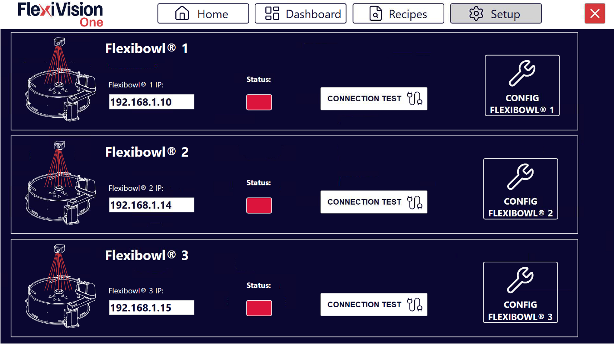
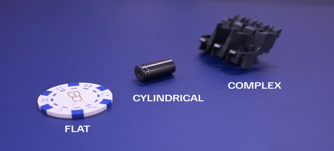
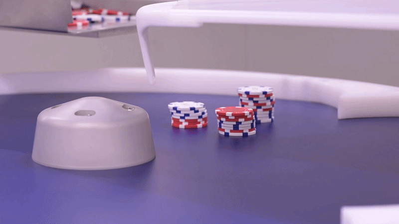
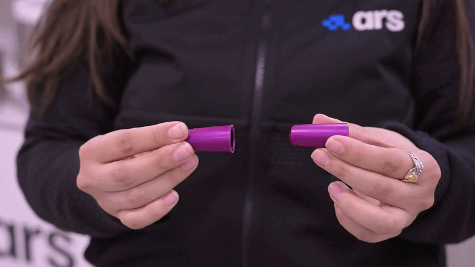
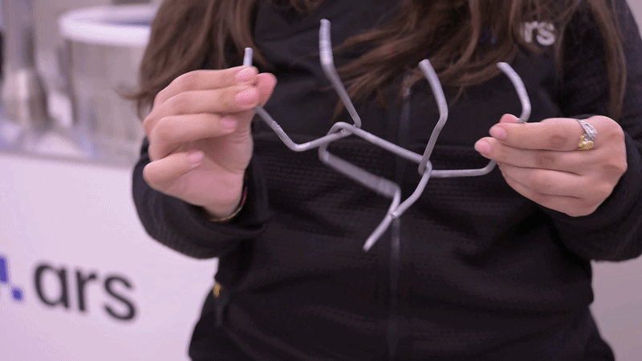

(fbsetup)=
# **FlexiBowl® Setup**

Esta sección describe el procedimiento para conectar y configurar el FlexiBowl® con el sistema FlexiVision One. 

```{note}
**Requisitos previos**

Asegúrese de que:
- La instalación mecánica de todos los componentes esté completada ([Instalación mecánica](Installazione_Meccanica))
- Todos los cables estén correctamente conectados ([Cableado y conexiones](cablaggio)) 
```

---

## Acceso a la configuración FlexiBowl®
```{list-table}
* - **1** 
  - Desde la página principal del software, haga clic en 
* - **2**
  - En la página SETUP, identifique y haga clic en el icono **FlexiBowl® Setup**
    ```{dropdown} Página de configuración 
       
    ```
* - **3**
  - Se abre la pantalla de configuración de los FlexiBowl®
```

---

## Procedimiento de conexión

### *Paso 1: Configuración de la dirección de red*

```{list-table}
* - **4**
  - Verifique que la dirección esté en la misma subred del VisionController
  
* - **5**
  - En el campo **FlexiBowl® IP**, introduzca la dirección IP del FlexiBowl®
      - Formato: `192.168.1.XXX` (o según la configuración de su red)
```
:::{tip}
Por comodidad y coherencia, empiece por el primer FlexiBowl® disponible 
:::
:::{note}
El FlexiBowl® se envía con la dirección IP predeterminada `192.168.1.10`
:::
:::{important}
Para instrucciones sobre cómo modificar la dirección IP del FlexiBowl®, consulte el manual disponible en la sección [Download](https://www.flexibowl.it/downloads).
:::

### *Paso 2: Prueba de conexión*

```{list-table}
:widths: 5 95

* - **6**
  - Después de introducir la IP, haga clic en el botón **Connection Test**

* - **7**
  - El sistema realiza una prueba de comunicación (ping) al FlexiBowl®

* - **8**
  - Observe el indicador de **Status**:
    - 🟢 **Verde**: Conexión establecida con éxito
    - 🔴 **Rojo**: Fallo de conexión (compruebe la dirección IP y el cableado)
```

```{warning}
**Conexión fallida**

Si el indicador permanece rojo o aparece un mensaje de error:

0. Compruebe que ha encendido el FlexiBowl®
1. Compruebe que la dirección IP introducida es correcta
2. Compruebe físicamente el cable Ethernet (debe estar completamente insertado)
3. Si está presente, compruebe que el Switch de red/enrutador está encendido
4. Asegúrese de que FlexiBowl® y VisionController están en la misma subred
5. Pruebe a hacer ping al FlexiBowl® desde un terminal Windows:
   - Abra el símbolo del sistema
   - Escriba: `ping 192.168.1.XXX` (sustituya por la IP real)
   - Si el ping falla, es un problema de red

Si el problema persiste, consulte [Troubleshooting](troubleshooting).
```

---

## Configuración de parámetros FlexiBowl®

Una vez establecida la conexión, proceda a configurar los parámetros de funcionamiento.

### *Paso 3: Acceso a la configuración*

```{list-table}
* - **9** 
  - Haga clic en el botón 
* - **10**
  - Se abre una ventana con los parámetros configurables del FlexiBowl®
```


### *Paso 4: Sincronización de parámetros*

```{list-table}

* - **12**
  - Haga clic en **Synchronize Parameters**
* - **13**
  - Vuelva a la página SETUP principal para continuar con la siguiente configuración 
```
:::{important}
I parametri possono essere regolati tramite slider oppure inseriti manualmente da tastiera nel relativo campo numerico.
:::

```{warning}
**No omitir la sincronización**

Es imprescindible hacer clic en **Synchronize Parameters** después de cada modificación. Sin este paso:
- Los cambios no se aplican al FlexiBowl® 
- El sistema puede comportarse de forma incoherente
- Los ajustes no se guardan 
```
---
(configfb)=
# **Configuración guiada: Asistente FlexiBowl**


La interfaz **Asistente FlexiBowl** es una herramienta interactiva diseñada para guiar al usuario en la configuración de los parámetros de alimentación en función de la familia de productos específica que se vaya a gestionar.

## Paso 1: Acceso al Wizard

Para iniciar el procedimiento:
```{list-table}
:widths: 5 95

* - **1**
  - Vaya a la sección  del software FlexiVision One

* - **2**
  - Haga clic en el botón **FlexiBowl® Setup**; se abrirá una página con todos los FlexiBowl® que pueden gestionarse con FlexiVision One

    :::{dropdown} Página de configuración de FlexiBowl  
    
    :::

* - **3**
  - Haga clic en el botón ; se abrirá una página con todos los movimientos disponibles para el FlexiBowl seleccionado

    :::{dropdown} Página de configuración de FlexiBowl®  
    
    :::

* - **4**
  - Haga clic en el botón **FlexiBowl® X Wizard**; se abrirá una página de bienvenida al Wizard

* - **5**
  - Haga clic en 
    
    :::{note}
    Haga clic en  en cada página del wizard para avanzar en la configuración guiada
    :::
```

## Paso 2: Selección de modelo y rotación

En esta fase se definen las características hardware del sistema:
```{list-table}
* - **6**
  - Seleccione el tamaño del dispositivo (por ejemplo, 200, 350, 500, etc.).
* - **7**
  - Defina el sentido de rotación del disco (**Clockwise** o **CounterClockwise**).
```
## Paso 3: Caracterización del componente

El sistema necesita información sobre la morfología de las piezas para optimizar la separación.
````{list-table}
* - **8**
  - Seleccione el tamaño del componente:**

    **Para modelos FlexiBowl 200, 350, 500, 650:**

    :::{card}
    <= 150mm
    :::

    :::{card}
    &gt; 150mm
    :::

    **Para modelos FlexiBowl 800 y 1200:**

    :::{card}
    <= 250mm
    :::

    :::{card}
    &gt; 250mm
    :::

* - **9**
  - Seleccione la geometría que mejor describa el componente:
      * **FLAT**: Componentes planos.
      * **CYLINDRICAL**: Componentes cilíndricos.
      * **COMPLEX**: Geometrías articuladas o irregulares

      

      *Ejemplos de geometrías: Flat, Cylindrical y Complex.*

* - **10**
  - Defina cómo interactúan los componentes entre sí en la superficie:
      * **Solapamiento**: Las piezas tienden a solaparse.
      * **No se solapan**: Las piezas no se superponen.
      * **Enredar / Apilar**: Las piezas tienden a engancharse o apilarse.
      * **No se enreda / No se apila**: Las piezas permanecen separadas y no encajan.

      

      *Sin solapamiento: las piezas no se solapan en la superficie.*

      ::::{grid} 2
      :::{grid-item}
      

      *Apilamiento: las piezas se apilan.*
      :::
      :::{grid-item}
      

      *Enredos: las piezas se enganchan entre sí.*
      :::
      ::::
````
## Paso 4: Prueba de accesorios
```{list-table}
* - **11**
  - Seleccione en el menú desplegable si el FlexiBowl® está equipado con el módulo **Air-blow**.
* - **12**
  - Haga clic en **TEST Air-blow** para comprobar el funcionamiento.
* - **13**
  - Seleccione **USE** para habilitarlo en la aplicación actual; de lo contrario, haga clic en **DON'T USE**.
* - **14**
  - Haga clic en **TEST FLIP** para comprobar la activación real del Flip.
      El "Flip" es la unidad que genera el impulso mecánico para voltear las piezas; es esencial para separar, desenredar o voltear componentes durante el ciclo de alimentación.
 
      :::{important}
      Si el impulso no es perceptible, verifique que el aire comprimido esté conectado y actúe sobre el regulador de presión mecánico situado en el panel de control.
      :::
* - **15**
  - Al finalizar el Wizard, al hacer clic en **FINISH**, el sistema calculará automáticamente los parámetros: 
    - Parámetros de movimiento (velocidad, aceleración, ángulo)
    - Parámetros de agitación (shake)
    - Temporizaciones de accesorios (flip, blow)
* - **16**
  - Será posible afinarlos en el panel resumen.
```
```{list-table} Descripción de parámetros
   :widths: 20 30 50
   :header-rows: 1

   * - Grupo
     - Parámetro
     - Descripción
   * - **Move**
     - Accel, Decel, Speed, Angle
     - Parámetros del movimiento principal del disco.
   * - **Option**
     - Flip Count, Flip Delay, Blow Time
     - Gestión de los tiempos de activación de los accesorios.
   * - **Shake**
     - Accel, Speed, Angle CW/CCW
     - Parámetros de vibración de la agitación (separación).
```

## Paso 5: Validación de la secuencia

Utilice la función **Test Sequence** para comprobar que el ciclo cumple los siguientes criterios de eficiencia:
```{list-table}
:widths: 5 95
:header-rows: 0

* - **Sincronización**
  - El impulso de Flip debe terminar exactamente al mismo tiempo que termina el movimiento (*Move*). Ajuste los valores de *Flip Count* y *Delay* para alinearlos.

* - **Estabilidad de la imagen**
  - Los componentes deben estar quietos cuando se dispara la cámara.
    - Si las piezas están en movimiento, disminuya la velocidad/aceleración o introduzca una pausa (por ejemplo, `pause 200ms`).

* - **Posicionamiento de las piezas durante la secuencia**
  - Durante el movimiento, las piezas deben transportarse hacia el centro del radio del FlexiBowl® para maximizar la eficacia del Flip. Al final de la secuencia, las piezas deben colocarse aproximadamente en el centro del área de visión.
```

:::{warning}
Haga clic siempre en **Synchronize Parameters** después de cada modificación manual para activar los cambios en el controlador.
:::
:::{important}
Nel caso in cui i parametri venissero modificati ma non sincronizzati, apparirà un messaggio di avviso. 
:::

## Descripción Parámetros FlexiBowl
```{list-table}
:header-rows: 1
:widths: 5 25 70

* - ID
  - Elemento
  - Descripción
* - 1
  - MOVE – Aceleración
  - Valor de aceleración utilizado en cada comando MOVE
* - 2
  - MOVE – Desaceleración
  - Valor de desaceleración utilizado en cada comando MOVE
* - 3
  - MOVE – Velocidad
  - Valor de velocidad (rpm) utilizado en cada comando MOVE
* - 4
  - MOVE – Ángulo
  - Ángulo al que se mueve el FlexiBowl® con cada comando MOVE
* - 5
  - SHAKE – Aceleración
  - Valor de aceleración utilizado en cada comando SHAKE
* - 6
  - SHAKE – Desaceleración
  - Valor de desaceleración utilizado en cada comando SHAKE
* - 7
  - MOVE – Velocidad
  - Valor de velocidad (rpm) utilizado en cada comando SHAKE
* - 8
  - MOVE – Ángulo CW
  - Ángulo en el sentido horario con el que se mueve FlexiBowl® en cada comando SHAKE
* - 9
  - MOVE – Ángulo CCW
  - Ángulo en el sentido antihorario con el que se mueve FlexiBowl® en cada comando SHAKE
* - 10
  - OPTION – Flip Count
  - Número de activaciones del Flip que se realizarán
* - 11
  - OPTION – Flip Delay
  - Tiempo (en milisegundos) entre una activación y una desactivación del Flip
* - 12
  - OPTION – Blow Time
  - Tiempo (en milisegundos) de activación del blow
* - 13
  - OPTION – Luz encendida
  - Pulse para activar/desactivar la retroiluminación
```

```{tip}
**Prueba de producción**

Antes de utilizarlo en producción:
1. Ejecute 50-100 ciclos de prueba para comprobar la consistencia
2. Supervise la tasa de llenado del disco (debe ser constante)
3. Compruebe que no haya acumulaciones anormales ni zonas vacías persistentes
4. Incremente gradualmente hacia la velocidad de producción

La configuración óptima puede requerir 2-3 sesiones de puesta a punto con la pieza real en cantidades significativas.
```

## Próximos pasos

Una vez finalizada la configuración del FlexiBowl®, continúe con:

- [Hopper Setup](13b_Hopper_Setup.md)
- [Robot Setup](13c_Robot_Setup.md)
- [Protocol Setup](protocol_setup)
- [Guardar la receta](ricettabase)


