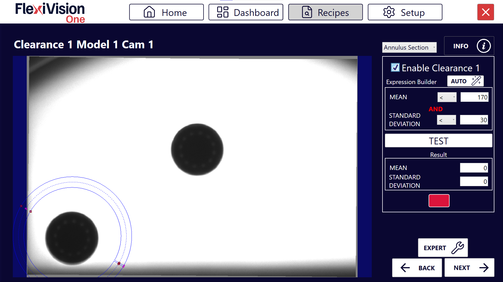

(histogrammes)=
# **Les Clearances** 
 Sur cette page, nous verrons comment configurer les Clearances pour vérifier que les zones critiques sont exemptes d'obstacles.

 **Qu'est-ce qu'une Clearance ?**  
Une **Clearance** dans FlexiVision One est un outil qui contrôle une zone spécifique de l'image pour vérifier qu'elle est libre. Il permet de vérifier, par exemple, que l'espace nécessaire à la pince pour saisir le composant n'est pas occupé par d'autres objets.
````{note} Principe de fonctionnement.

La clearance analyse les variations des niveaux de gris dans une zone définie :
- 🟢 **Vert** → Zone libre (OK pour le prélèvement)
- 🔴 **Rouge** → Zone occupée (présence d'obstacles)
````
:::{attention}
L'utilisation des Clearances varie en fonction de la pièce à modéliser. Il s'agit d'une évaluation à effectuer par la personne chargée de créer l'application. 
:::
--- 
(setupclearances)=
## Étape 1 : Configuration physique

:::{danger} **Attention !**
  Nous allons vous montrer la procédure avec l'outil Pince car il nécessite obligatoirement la configuration de Clearances pour les modèles. D'autres outils pour le robot peuvent ne pas avoir besoin de ces Clearances pour simuler l'empreinte. 
:::
:::{video} ../../../../../_shared/media/videos/Step1.mp4
    :width: 100%
    :align: center
:::
````{list-table}
:widths: 5 95

* - **1**
  - Sur le **pupitre d'apprentissage du robot** :
    - Sélectionner le **cadre** et l'**outil** calibré sur FlexiVision One
    - Amener le **dernier axe** de l'outil à une **rotation nulle** (Rz = 0°)
* - **2**
  - Simuler une prise :
    - Ouvrir la pince
    - Amener l'outil du robot sur le composant au niveau de la surface, comme pour le saisir
* - **3**
  - Placer **deux objets** sur les côtés de la pince pour disposer, une fois le robot retiré, des zones libres entre le composant de référence et les deux objets.  
  Elles représentent les zones d'empreinte de la pince du robot. 
    
    :::{important}
    Laisser les objets légèrement plus espacés que nécessaire pour éviter les erreurs lors de la création du modèle. (marge de 2-3 mm)
    :::
    
* - **4**
  - Noter les coordonnées :
    - Enregistrer les coordonnées du dernier axe du robot :
      - **X** (coordonnée X)
      - **Y** (coordonnée Y)
      - **Rz** (rotation autour de Z)
    
    :::{important}
    Noter ces coordonnées ! Elles seront indispensables lors de l'étalonnage du robot.
    :::
* - **5**
  - Éloigner le robot avec le pupitre **sans déplacer quoi que ce soit** sur la surface
````
:::{tip}
En cas de doutes lors de la configuration, veuillez consulter le bouton **INFO** sur la page en cours.
:::
---

## Étape 2 : Accès à la page Clearance
````{list-table}
:widths: 5 95

* - **6**
  - Sur la page **Locator Model**, après avoir cliqué sur **Next**, s'ouvre la liste des clearances disponibles (jusqu'à 8 par modèle).
    
    :::{dropdown} **Page Clearances**
    
      
    
      | Élément | Description |
      |----------|-------------|
      | **Clearance 1...8** | Emplacements disponibles pour créer jusqu'à 8 clearances différents pour le même modèle |
      | **Test (global)** | Bouton pour tester simultanément toutes les clearances activées |
      | **Next** | Passage à l'étape suivante (Robot Pick) après la configuration de la clearance |
    :::
* - **7**
  - Cliquer sur **Clearance 1**, la page de configuration de la première clearance « Clearance 1 » s'ouvre.
    
    :::{dropdown} **Page Clearance 1**

      

      | Paramètre | Fonction |
      |-----------|----------|
      | **Enable Clearance** | Active cette clearance pour la rendre opérationnelle |
      | **Expression Builder** | Outil de configuration automatique des seuils de détection |
      | **Mean and Standard Deviation** | Valeurs statistiques calculées sur la zone sélectionnée (moyenne et écart-type des niveaux de gris) |
      | **Test** | Vérification immédiate du fonctionnement de la clearance |
      | **Result** | Indicateur visuel de l'état (Vert = OK, Rouge = Déclenché) |
    :::
````
---

## Étape 3 : Activation et positionnement de zone

:::{video} ../../../../../_shared/media/videos/Step3.mp4
    :width: 100%
    :align: center
:::

:::{tip}
La nouvelle version permet également de choisir le type de région (Rectangle, Annulus Section, Circle).  

:::

````{list-table}
* - **8**
  - Choisissez le type de clearance à attribuer, puis cliquez sur **Enable Clearance** pour l'activer. 
    :::{image} ../../../../../_shared/media/images/shapes.png
    :width: 30%
    :::
    
* - **9**
  - Déplacer le **cadre** de la Clearance sur la zone qui doit rester dégagée
      - Typiquement : zone de préhension de la pince (une clearance par zone de préhension de la pince)
      - Marges autour du composant
      - Zones de passage du robot
    :::{important}
    Toujours garder ces deux aspects importants à l'esprit :
    - La ROI de la Clearance, lorsqu'elle est configurée, doit être complètement libre (c'est-à-dire sans objets, ombres, artefacts)
    - Toujours créer une clearance légèrement plus grande que ce qui est strictement nécessaire afin d'éviter les fausses erreurs.

    Le non-respect de ces deux points peut entraîner des collisions avec le robot et endommager le FlexiBowl®, les composants ou le robot lui-même. 
    :::
````
:::{tip}
En cas de doutes lors de la configuration, veuillez consulter le bouton **INFO** sur la page en cours.
:::
---

## Étape 4 : Configuration automatique

:::{video} ../../../../../_shared/media/videos/Step4.mp4
    :width: 100%
    :align: center
:::
````{list-table}
* - **10**
  - Cliquer sur  dans Expression Builder
* - **11**
  - Cliquer sur 
* - **12**
  - Vérifier que l'encadré devient **vert** 
* - **13**
  - Cliquer sur 
````
````{warning}
**Que faire si le test échoue (encadré rouge) ?**

Si, après AUTO, l'encadré devient rouge :

**Causes possibles :**
- Il y a effectivement quelque chose dans la zone (pièce, ombre, saleté)
- L'éclairage a changé entre la configuration AUTO et la configuration TEST
- La zone sélectionnée comprend des bords du FlexiBowl® ou des artefacts

**Solutions :**
1. Vérifier visuellement que la zone est complètement libre
2. Répéter AUTO avec des conditions d'éclairage stables
3. Répéter TEST pour vérifier
````
:::{tip}
En cas de doutes lors de la configuration, veuillez consulter le bouton **INFO** sur la page en cours.
:::
---

## Clearance Multiples - Quand les utiliser

Il crée plus de clearances lorsque :
- L'outil du robot est une pince : une clearance est nécessaire pour chacune des deux zones occupées par la pince de part et d'autre du composant de référence 
- Il y a plusieurs points critiques à surveiller
- La zone de la pince a des géométries particulières

### *Étape 2-3 : Répétition*
Sélectionner une nouvelle clearance dans la page Liste des clearances, par exemple « Clearance 2 » et répéter les étapes 2-3.
Répéter la procédure pour chaque clearance nécessaire (jusqu'à 8 par modèle). 

### *Étape 4 : Test complet* 

Sur la page de liste de toutes les clearances, cliquer sur **TEST** pour voir toutes les clearances en même temps  


---

## Interprétation des états

### *États des Clearances*

````{list-table}
:header-rows: 1
:widths: 10 15 30 45

* - Couleur
  - État
  - Signification
  - Image
* - 🟢 Vert
  - OK
  - Zone libre, prélèvement possible
  - 
* - 🔴 Rouge
  - Triggered
  - Zone occupée, prélèvement impossible
  - 
````
:::{note}
Les dimensions des Clearances, exprimées en mm, sont indiquées dans les encadrés correspondants.
:::


### *Que signifie « Triggered » ?*

Une clearance devient rouge (triggered) lorsqu'elle détecte à l'intérieur :
- Présence d'autres composants
- Ombres ou reflets importants
- Tout élément rendant la zone non libre

---

## Étape 5 : Finalisation
````{list-table}
* - **14**
  - Après avoir configuré toutes les clearances nécessaires, cliquer sur 
* - **15**
  - La page **Robot Model Pick Cam** s'ouvre
````
````{seealso}
Passer à l'[Étalonnage du Robot](robotpick) pour terminer la configuration.
````

