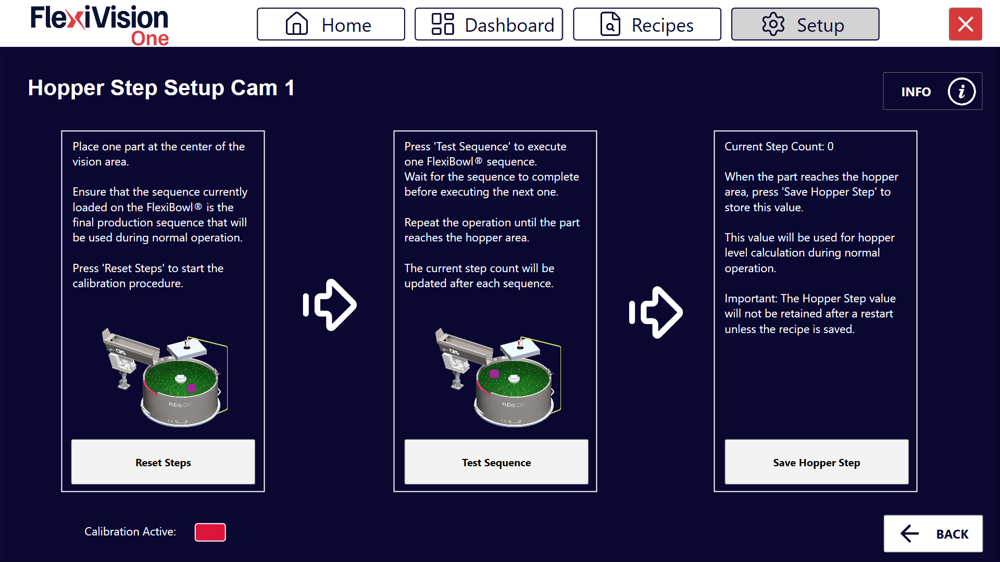
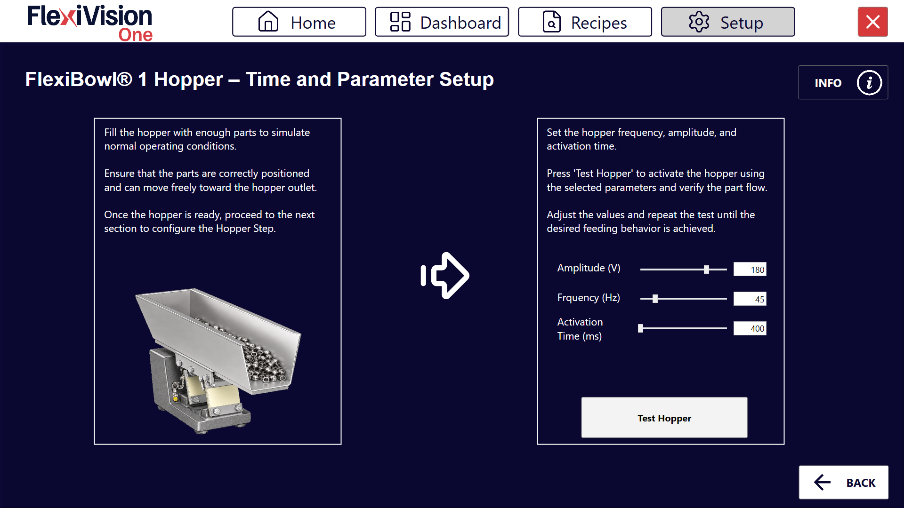

(hoppersetup)=
# **Hopper Setup**
 
Cette section décrit la procédure de configuration de la trémie (Hopper). Le Hopper est le composant qui alimente automatiquement des pièces sur le FlexiBowl® lorsque le niveau descend en dessous d'un seuil minimal.
 
:::{important}  **Logique de fonctionnement**  
 
FlexiVision gère la logique d'activation de la trémie. Il enverra la chaîne `Hopper;signalnumber;time` lorsqu'il jugera l'activation nécessaire. 
:::
````{note}
**Prérequis**
 
Avant de procéder, s'assurer que :
- Le Hopper a été installé mécaniquement 
- Les branchements électriques ont été effectués (signaux de commande et alimentation)
- Le FlexiBowl® est déjà connecté
````
---
## Préparation de la configuration physique
 
````{list-table}
* - **0**
  - Démonter la grille de calibrage et rétablir la disposition initiale :
    - Repositionner la surface
    - repositionner la bride centrale 
    - fixer la bride centrale avec ses quatre vis
````
---
## Accès à la configuration du Hopper
 
````{list-table}
* - **1** 
  - Depuis la page principale du logiciel, cliquer sur 
* - **2**
  - Sur la page SETUP, repérer et cliquer sur l'icône **Hopper Setup**
```{dropdown} Page Setup 
       
```
* - **3** 
  - La page de configuration du Hopper s'ouvre
````
 
---
 
## Présentation de l'interface Hopper Setup
 
La page Hopper Setup présente plusieurs sections pour la configuration des paramètres opérationnels des différentes trémies :
 

 
````{list-table}
:header-rows: 1
:widths: 30 70
 
* - Section
  - Description
* - **Enable Hopper**
  - Interrupteur permettant d'activer/désactiver l'utilisation du Hopper dans le système
* - **Steps**
  - Nombre de séquences nécessaires pour que la section du disque actuellement dans la zone de vision arrive sous la zone de déchargement de la trémie
* - **Wizard Steps**
  - Lance la procédure guidée pour le calcul automatique du paramètre Steps (voir [Wizard Steps](wizardsteps))
* - **Time**
  - Durée d'activation de la trémie en millisecondes
* - **Wizard Time**
  - Lance la procédure guidée pour le calcul automatique des paramètres d'activation de la trémie (voir [Wizard Time](wizardtime))
* - **Signal**
  - Numéro du signal numérique utilisé pour commander le Hopper
* - **Config Hopper**
  - Bouton pour configurer la trémie (à utiliser ensuite)
````
 
---
(confighopper)=
# **Configuration de la Trémie (Hopper)**
 
La configuration de la trémie permet de gérer le réapprovisionnement automatique des composants sur le disque du FlexiBowl®. Le système utilise la vision pour déterminer quand le niveau de remplissage est insuffisant et activer la trémie.
 
## Étape 1 : Accès à la Configuration
````{list-table}
* - **1**
  - Cliquer sur .   
    Depuis la section **Hopper Setup**, il est possible d'afficher et de gérer les unités de charge connectées.
    
    :::{dropdown} Page Hopper Setup 
    
    :::
* - **2**
  - Dans le champ **Signal**, saisir le numéro du signal numérique (DO - Digital Output) utilisé pour commander le Hopper
    :::{warning}
      Il est essentiel de saisir le numéro de signal correct :
      - Un numéro erroné activera le mauvais signal (potentiellement dangereux)
      - Consulter le schéma électrique réalisé lors de l'installation
      - En cas de doute, contacter la personne ayant effectué le câblage
    :::
* - **3**
  - Cocher la case **Enable Hopper X** pour activer la trémie correspondante.
      :::{important}
      N'activer le Hopper que si l'appareil est correctement installé
      :::
* - **4**
  - Cliquer sur le bouton **Config Hopper X** pour accéder à la configuration spécifique 
````
## Étape 2 : Définition de la Zone de Contrôle
 
:::{video} ../../../../../_shared/media/videos/TastoInfo_AreaHopper_1280x720.mp4
    :width: 100%
    :align: center
:::
 
Cette phase permet de définir la portion du disque que la caméra doit surveiller pour le déchargement.
````{list-table}
* - **5**
  - Modifier le cadre bleu à l'écran pour délimiter la zone dans laquelle les composants seront détectés.
````
:::{tip}
En cas de doute pendant la configuration, consulter le bouton **INFO** présent sur la page actuelle.
:::
 
## Étape 3 : Définition des Valeurs de Seuil
 
:::{video} ../../../../../_shared/media/videos/TastoInfo_Hopper_1280x720.mp4
:width: 100%
:align: center
:::
````{list-table}
* - **6**
  - Cliquer sur  pour accéder à la page **Define Value Hopper Cam**, où le système est instruit à distinguer un disque vide d'un disque plein.
    :::{dropdown} Page Define Value Hopper Cam 
    
    :::
* - **7**
  - Retirer tous les composants de la zone de vision et cliquer sur le premier bouton **CAPTURE**.
* - **8**
  - Positionner le nombre minimal de composants que l'on souhaite conserver dans la zone de vision. Si le nombre passe sous ce seuil, la trémie s'activera.
* - **9**
  - Cliquer sur le second bouton **CAPTURE**.
* - **10**
  - En cliquant sur  dans l'Expression Builder, le système calcule automatiquement les valeurs de **Mean** (Moyenne) et **Standard Deviation** (Écart type).
* - **11**
  - Retirer quelques pièces et cliquer sur . 
* - **12**
  - Observer l'indicateur de résultat :
    - **Vert** 🟢 : Niveau insuffisant, le Hopper s'active (déchargement nécessaire)
    - **Rouge** 🔴 : Niveau suffisant, le Hopper NE s'active PAS (OK)
 
      :::{warning}
      **Calibrage insuffisant**
 
      Si le système ne détecte pas correctement le niveau :
 
      **Problème : Toujours vert (active toujours le Hopper)**  
      → Seuil trop bas ou interférences dans la zone  
      → Solution : Augmenter le nombre de pièces lors de la deuxième acquisition, vérifier la propreté de la zone  
 
      **Problème : Toujours rouge (n'active jamais le Hopper)**  
      → Seuil trop élevé ou zone de surveillance non représentative  
      → Solution : Réduire le nombre de pièces lors de la deuxième acquisition CAPTURE, répéter AUTO  
 
      **Problème : Comportement erratique (alterne vert/rouge de façon aléatoire)**  
      → Éclairage instable ou zone trop petite  
      → Solution : Vérifier que le rétroéclairage est stable, agrandir la zone de surveillance, répéter le calibrage  
      :::
````
````{note}
**Hopper Fill Threshold**
 
Le paramètre **Hopper Fill Threshold** définit le seuil de remplissage en pourcentage de la zone de vision en dessous duquel la trémie s'active automatiquement.
 
La valeur de 100 % correspond à la quantité de pièces acquise lors de la deuxième CAPTURE (zone pleine). Par conséquent, un seuil de 50 % correspond à la moitié de cette quantité.
 
Le système règle automatiquement la valeur initiale sur **70 %**, ce qui représente un bon équilibre pour la plupart des applications.
 
**Modification en cours d'utilisation**
 
Il est possible d'ajuster le seuil sans répéter la procédure d'acquisition :
 
- Pour décharger **moins de pièces** → réduire le pourcentage (ex. 50 %) et cliquer sur **AUTO**
- Pour décharger **plus de pièces** → augmenter le pourcentage (ex. 85 %) et cliquer sur **AUTO**
 
````
 
:::{tip}
En cas de doute pendant la configuration, consulter le bouton **INFO** présent sur la page actuelle.
:::
 
## Étape 4 : Paramètres Opérationnels
 
Revenir à l'écran principal de Hopper Setup pour définir le comportement mécanique.

 
````{list-table} Paramètres de Fonctionnement
:widths: 20 80
:header-rows: 1
 
* - **Paramètre**
  - **Description et Procédure**
* - **Steps**
  - Nombre d'avancements du FlexiBowl® (séquences) nécessaires pour amener les pièces de la zone de vision à la zone de déchargement de la trémie. Peut être défini manuellement ou calculé via le [Wizard Steps](wizardsteps).
* - **Time**
  - Millisecondes d'activation de la trémie. Valeur conseillée : **100 – 1000 ms** (Moyenne : **500 ms**). Ajuster de ±50 ms en fonction du flux souhaité. Peut être défini manuellement ou calculé via le [Wizard Time](wizardtime).
````
````{tip}
   Le temps d'activation dépend non seulement de la valeur définie, mais aussi du volume de composants actuellement présents dans la cuve de la trémie. Il est essentiel de maintenir une charge constante pour un flux uniforme.
````
````{tip}
La valeur Time est étroitement liée au volume de charge de la trémie : 
- Avec une trémie pleine, on aura un nombre plus élevé de pièces dans la zone de déchargement 
- Avec une trémie à moitié pleine, on aura un nombre plus faible de pièces dans la zone de déchargement 
 
````
:::{important}
De manière générale, il est important de ne jamais dépasser la charge maximale de la trémie utilisée. 
:::
 
---
 
(wizardsteps)=
### *Wizard Steps : Calcul Guidé du Paramètre Steps*
 
Le **Wizard Steps** guide l'opérateur dans le calcul du nombre de séquences nécessaires pour qu'une pièce, positionnée au centre de la zone de vision, atteigne la zone de déchargement de la trémie.
 
:::{dropdown} Hopper Step Setup Cam X

:::
 
````{list-table}
* - **1**
  - Positionner une seule pièce au centre de la zone de vision.
    :::{important}
    S'assurer que la séquence actuellement chargée sur le FlexiBowl® est bien la définitive, c'est-à-dire celle qui sera utilisée en production. Un changement de séquence ultérieur invaliderait la valeur calculée.
    :::
* - **2**
  - Cliquer sur **Reset Steps** pour remettre le compteur à zéro et lancer la procédure de calibrage.
* - **3**
  - Cliquer sur **Test Sequence** pour exécuter une seule séquence du FlexiBowl®.
    :::{tip}
    Attendre la fin de la séquence avant d'en exécuter une autre.
    :::
* - **4**
  - Répéter le clic sur **Test Sequence** jusqu'à ce que la pièce atteigne la zone de la trémie. Le **Current Step Count** se met à jour automatiquement après chaque séquence exécutée.
* - **5**
  - Lorsque la pièce atteint la zone de la trémie, cliquer sur **Save Hopper Step** pour enregistrer la valeur actuelle en tant que paramètre Steps.
````
 
:::{warning}
La valeur calculée avec le Wizard Steps **n'est pas conservée après un redémarrage** du logiciel si la recette n'est pas enregistrée. Penser à enregistrer la recette à la fin de la procédure (voir [Enregistrement de la Configuration](#salvataggio-configurazione)).
:::
 
L'indicateur **Calibration Active** affiche l'état du calibrage en cours :
 
| Couleur | État |
| --- | --- |
| 🔴 Rouge | Calibrage non actif / pas encore démarré |
| 🟢 Vert | Calibrage en cours / terminé |
 
 
### *Calculer le Paramètre Steps*
 


 
---
 
(wizardtime)=
### *Wizard Time : Calcul Guidé des Paramètres d'Activation*
 
Le **Wizard Time** guide l'opérateur dans le réglage des paramètres d'activation de la trémie (amplitude, fréquence et temps d'activation), en vérifiant leur effet au moyen d'un test direct sur le flux des pièces.
 
:::{dropdown} FlexiBowl® X Hopper – Time and Parameter Setup

:::
 
````{list-table}
* - **1**
  - Remplir la trémie avec une quantité de pièces suffisante pour simuler les conditions normales de fonctionnement.
* - **2**
  - Vérifier que les pièces sont correctement positionnées et peuvent se déplacer librement vers la sortie de la trémie.
* - **3**
  - Régler les valeurs de **Amplitude (V)**, **Frequency (Hz)** et **Activation Time (ms)** à l'aide des curseurs prévus à cet effet ou en saisissant directement la valeur dans le champ numérique.
* - **4**
  - Cliquer sur **Test Hopper** pour activer la trémie avec les paramètres définis et vérifier le flux des pièces.
* - **5**
  - Ajuster les valeurs et répéter le test jusqu'à obtenir le comportement d'alimentation souhaité.
````
 
:::{tip}
Ne procéder à la configuration de la section suivante (Hopper Step) qu'une fois que le flux des pièces est satisfaisant.
:::
 
## Enregistrement de la Configuration
````{warning}
**Enregistrement de la recette obligatoire**
 
À la fin de la configuration du Hopper :
 
  :::{list-table}
    * - 1. 
      - Vérifier que tous les paramètres sont correctement configurés :
        - Zone de surveillance positionnée
        - Seuils calibrés (TEST fonctionnel)
        - Steps et Time définis
    * - 2. 
      - Revenir à la page principale 
    * - 3. 
      - Cliquer sur 
    * - 4. 
      - Confirmer l'enregistrement
  :::
**IMPORTANT** : Toute modification apportée n'est mémorisée **QUE** si la recette est enregistrée correctement avant de quitter ou de changer de page.
 
Sans enregistrement, toutes les configurations du Hopper seront perdues à la fermeture de FlexiVision One !
````
 
---
 
 
## Étapes suivantes
 
Une fois la configuration du Hopper terminée (ou ignorée si non présente), poursuivre avec :
 
- [Robot Setup](13c_Robot_Setup.md)
- [Protocol Setup](protocol_setup)
- [Enregistrer la Recette](ricettabase)
 